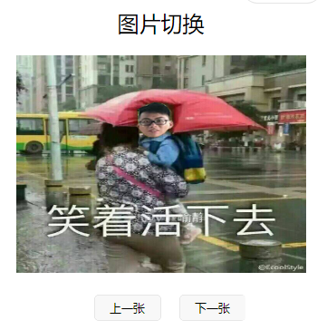

# 微信小程序学习第1天

## 自我介绍

1. 姓名: 王侨文
2. 工作经验：2java+7移动前端开发，授课经验1年
   1. 汇丰银行+360+乐信（分期乐）


## 课程介绍

**小程序重要吗？**

1. 课程调整
   1. 小程序的课程在38期前，是放在react的前面
   2. 38-43期，小程序课程摆在最后
   3. 44~ 小程序课程在react前面
2. 语法跟vue很像，学起来挺快，比较容易掌握

3. 前端开发从端上来说
   1. pc端
      1. 后台管理（需求量比较大，主要的就业方向）
         1. 客户关系管理，OA, 黑马面面就是一个很典型的后台管理
      2. 官网，倾向于简单化
   2. 移动端
      1. app开发，混合模式的App
      2. h5网页
         1. 黑马头条
         2. 还是之前的html+css+js的技术，只不过网页是运行是手机浏览器里面
         3. 微信公众平台就是做h5网页
      3. 微信小程序
         1. 常见的就是”更多功能请打开App“, 引流到App

#### 课程介绍

1. 大概2天的基础
2. 4天的写蘑菇在线（在线教育），用原生小程序语法
3. 7天的时间写优购商城，用uniapp(小程序框架)
   1. 商城业务是小程序里面最多的业务类型
   2. 会用hbuilder开发工具
4. 2天时间学习mpvue(小程序框架)
   1. eslint
   2. webpack
   3. 熟悉vue脚手架2.x的项目结构
5. git使用会贯穿我们的学习


## 基本介绍

1. 基本概念（是什么）
   1. **运行在微信中的mini的App**
2. 使用
   1. 只要有微信都可以运行
   2. ios，安卓, pc电脑微信都可以打开微信小程序
3. 有什么用
   1. 电商购物
   2. 引流到App
   3. 工具效率类
   4. 。。。
4. 众多小程序中，微信小程序最有名
   1. 支付宝小程序，百度智能小程序，美团小程序，头条小程序


##  如何开发微信小程序

[传送门](https://mp.weixin.qq.com/cgi-bin/wx)

微信小程序的发布就是把小程序代码放到微信服务器

1. 注册
2. 小程序信息完善
3. 开发小程序
   1. [开发文档](https://developers.weixin.qq.com/miniprogram/dev/framework/)
   2. [微信开发者工具](https://developers.weixin.qq.com/miniprogram/dev/devtools/devtools.html)
4. 提交审核和发布

#### 提示：

1. 如果想让自己的网页让别的地方的朋友访问，必须放在服务器+域名

   

## 注册账号&小程序信息完善-练习

[微信公众平台](https://mp.weixin.qq.com/)

1. 填写邮箱、密码，注册
   1. 邮箱不能是已经注册过服务和订阅号的
2. 而且也不能是个人微信绑定
      1. 解绑方式：微信->我的->设置->帐号与安全->更多安全设置->邮件地址->解绑
   3. 如果真的没有邮箱，注册就是，可以用163邮箱
2. 邮箱激活
   1. 登录邮箱，在收件箱找到对应的邮件，打开链接，激活
3. 信息登记，包括姓名身份证等
   1. 地区：中国大陆
   2. 主体类型：个人
      1. 学习阶段可以使用个个类型
      2. 其他类型都需要认证资料
   3. 需要输入姓名，身份证号码，手机号，短信验证码，微信扫码
      1. **微信扫码这个账号就是当前注册的这个小程序的管理员**
4. 填写小程序信息
   1. 名字
      1. 好的名字都被取完了
      2. **学习阶段我们就取一些冷门的菜名，西兰花炒蛋**
      3. 不要取"商城"，否则是需要营业执照
      4. 也不要取心灵鸡汤，影响上线
   2. 简称
      1. 忽略
   3. 头像
      1. 取积极向上的
   4. 服务类目
      1. **建议取“工具-信息查询”，最容易上线成功的**
      2. 不要选小游戏，否则这个账号只能用来开发小游戏
5. 获取APPID
   1. **开发->开发设置，可以获取到appid**

#### 注意点

1. 取名字取冷门的，不然可能需要手持身份证照片
2. 我们只是完成微信开发流程前面两个步骤，为了拿到appid，接下来开发
3. 检查自己的服务类目，不要选择“小游戏”，建议“工具-信息查询”


## 微信开发者工具安装及使用-练习

[微信开发者工具](https://developers.weixin.qq.com/miniprogram/dev/devtools/devtools.html)

1. 安装

   1. 下载稳定版本的
   2. 建议保存这个.exe文件，微信开发者工具可能会崩，需要重装

2. 新建项目

   1. appid和扫码登陆的微信账号是需要匹配
   2. **目录一定要选择一个空的目录**，微信开发者工具并不会根据我们的项目名称去生成目录

   

3. 点预览出现二维码，手机扫码看运行效果

#### 注意点：

1. 新建界面拖动，拖最左边的部分
2. 开发相关的工具，按默认安装路径，装在其他盘，可能会权限不足
3. 微信开发者工具对电脑配置稍有要求
4. 只能用微信开发者工具开发微信小程序
5. 如果确实微信小程序账号没有申请到话，创建项目的时候，可以点击测试号，生成测试账号，也可以新建项目


## 认识微信开发者工具

[传送门](https://developers.weixin.qq.com/miniprogram/dev/devtools/page.html#%E5%90%AF%E5%8A%A8%E9%A1%B5)

**微信开发者工具是内嵌了一下chrome内核**


1. 菜单栏
   1. 新建项目
   2. 导入项目
      1. 已经生成过的项目，打开
      2. 不支持拖入文件夹
   3. 打开最近的项目
      1. 最近已经打开的项目，点击可以直接打开
   4. 设置里可以改成大家喜欢的深色模式
2. 工具栏
   1. 模拟器，编辑器，调试器，可以选择显示/隐藏，但是必须得有一个显示
   2. 预览出现一个二维码，微信扫码，可看到项目在微信中运行效果
   3. 详情：可以查看项目详细信息
3. 编辑器
   1. 左边是目录结构，右边是编辑的
   2. 可以理解成vscode，没有上手难度，快捷键和vscode是相同
      1. 不要改vscode的快捷键，因为它的快捷键基本上是行业的标准
4. 模拟器
   1. 查看运行效果
   2. 可以切换设备尺寸和缩放比例
5. 调试器
   1. console查看打印信息，方便调试
   2. sources查看文件，打断点，调试
   3. network查看请求
   4. wxml查看页面结构


## 小程序文档介绍

[传送门](https://developers.weixin.qq.com/miniprogram/dev/framework/)

**从哪里找到文档？**

1. 微信开发者工具，帮助->开发者文档
2. 开发者社区：微信小程序开发者论坛

**怎么看文档？**

1. 如果想找框架原理相关的，看`指南`和`框架`
2. 如果想使用标签或者组件，去找`组件`
3. 如果想使用某些js方法的话，那么找`API`

> 熟悉文档，不要吐糟。
>
> 保证将来你去到公司写的文档，你的小弟和你离职后你的同事不要吐糟


## 小程序开发原理

微信小程序是运行在微信提供的**手机浏览器内核里面**

**小程序的项目结构类似于基于vue脚手架的创建项目**，小程序管理着多个页面，每个页面有自己结构样式和逻辑


#### 结构说明：

1. app.js是小程序的全局逻辑, 先忽略
 	2. app.json是小程序全局配置
      	1. 在pages目录里面所有页面，必须在app.json的`pages`，这里是这个数组，配置了小程序所有的页面路径
           	1. pages数组的第一个路径就是模拟器的首页
      	2. window里面配置的是小程序的全局窗口样式
3. app.wxss声明全局样式
4. 具体的页面，**结构样式逻辑配置是由4个文件组件，而且它们的文件名一样**
      1. js是逻辑，类vue语法
     2. json配置文件
     3. wxml类似于html, 标签必须是小程序的组件名
     4. wxss类似于css，在这里css语法都可以使用
           1. float(x)
           2. flex兼容性完成没问题，建议使用

#### 注意点：

1. json文件是比较严格
   1. 不能有注释
   2. 键值对，键必须是双引号
   3. 最后一个键值对，逗号必须去掉

>  腾讯的微创新能力


## 基本标签的使用

[组件](https://developers.weixin.qq.com/miniprogram/dev/component/)

组件名当标签使用

1. text是用来渲染文本的，相当于html span，行内元素
2. view相当于html div，包裹作用，块级元素
3. image用来显示图片的，行内块级元素，有默认宽度，
   1. **需要重置图片宽度**
4. button就是按钮，size=mini小的按钮
   1. button默认的样式

#### 注意点：

1. 如果想新增一个页面话，最好的方法就是在app.json里面键"pages"里面添加一个路径，它帮会我们生成具体的页面。
2. 如果小程序不认识的标签，就会被忽略掉，只显示其中的文案
   1. **不建议写非小程序组件的标签**


## 图文混排案例-练习


1. flex布局子元素垂直方向上排列

   ```css
   display:flex;
   flex-direction:coloumn;
   ```

2. 同时如果想让子元素水平居中，这两个方向是交叉的，就使用align-items

   ```
   align-items:center;
   ```

3. flex布局时面，父元素规定了子元素按什么方式对齐，在子元素可以通过align-self调整 

   ```css
   align-self:flex-start;
   ```

4. flex:1是在flex布局中，元素占满剩下的空间

#### 注意点:

1. page标签是小程序自动生成的，无须在结构里面声明
2. 小程序和html一样，默认字体大小都是16px
3. 调样式和chrome里面一样，如果样式不对


## 数据绑定

[传送门](https://developers.weixin.qq.com/miniprogram/dev/reference/wxml/data.html)

数据绑定使用 Mustache 语法（双大括号）将变量包起来

​	1. 一切data的属性，如果想在结构里面进行渲染的话，都用{{}}

1. 文本

   ```html
   <!-- 使用{{data属性}}渲染内容 -->
   <text>袁爷你说:{{msg}}</text>
   ```

2. 标签属性

   ```html
   <!-- 标签属性也是{{}} -->
   <image src="{{imgUrl}}"></image>
   ```

3. 条件渲染 wx:if

   ```html
   <!-- wx:if，如果条件满足的话，也渲染当前dom -->
   <view wx:if="{{isHandsome}}">很帅</view>
   <view wx:else>丑拒</view>
   ```

4. 遍历wx:for

   ```html
   <!-- wx:for遍历，默认的元素别名是item，索引别名是index -->
   <view wx:for="{{movieList}}">{{item}}--{{index}}</view>
   ```

#### 注意点：

1. 在调试器的AppData这个tab里面可以看到当前页面data的属性，可以看也可以改动。很类似于Chrome vue devTools

   


## 注册事件及内置弹框

[事件绑定](https://developers.weixin.qq.com/miniprogram/dev/framework/view/wxml/event.html)

[内置弹框](https://developers.weixin.qq.com/miniprogram/dev/api/ui/interaction/wx.showToast.html)

1. 注册事件

   1. 在结构里面声明事件

      ```html
      <view bind事件名="事件处理方法"></view>
      ```

   2. 在js里面

      ```js
      Page({
      	data:{},
      	// 事件处理方法声明和data是平级的，没有methods
      	事件处理方法(){
      	
      	}
      })
      ```

   3. tap是手指触摸后马上离开事件，也是用得最多的事件

2. wx.showToast的使用

   ```js
    wx.showToast({
        title: '成功',//提示的内容
        icon: 'loading',//图标
        duration: 4000, //提示显示的时间
        //显示蒙层，提示的底下无法点击;默认为false
        mask:true
    })
   ```

#### 注意点：

1. 在开发时，模拟器里面鼠标点击可以触发tap事件
2. 项目在微信中运行时，手指点击可以触发tap事件
3. **在微信小程序里面, 很多的方法都是通过`wx`对象来提供的**


## 方法中的this

[传送门](https://developers.weixin.qq.com/miniprogram/dev/reference/api/Page.html)

写一小案例：页面有一个红色的块，点击切换显示背景红色/白色

1. 方法中的this，访问data属性`this.data.属性名`

2. 方法中的this，访问方法的话，`this.方法名`

3. 如果想改变data的属性，不能直接赋值，只能通过setData

   ```js
   this.setData({
      属性名：属性的新值
   })
   ```


## 图片切换-练习



1. 结构与样式先写好

2. 显示图片

   1. 有一个数组存放多张图片imgList:[图片1，图片2，图片3，图片4]
   2. 当我们点击上一张下一张时，本质上改变数组的下标，记住下标，index属性
   3. 在结构中显示图片{{imgList[index]}}

3. 当点击上一张时，显示上一张; 点击下一张时，显示下一张

   1. 上一张按钮bindtap: prev

   2. 下一张按钮bindtap:next 

      ```js
      //上一张
      this.setData({
          index:this.data.index-1
      })
      //下一张
      this.setData({
          index:this.data.index+1
      })
      ```

4. 点击上一张时，如果当前是第一张的话，就直接去到最后一张;如果点击下一张，到最后一张了，那么就去到第一张

   1. 在点击下一张的逻辑里面判断，如果是最后一张，就直接让index为第一张
      1. next方法，判断index===length-1，index=0
   2. 点击上一张的逻辑里面判断，如果是第一张的话，直接让index=最后一张的下标
   3. 直接的意思，return，无须执行下标+1或者-1

#### 提示

1. 在微信开发者工具里面没有路径提示
2. 在项目里面，写路径的时候,`/`代码项目的根目录，也就是说如当前项目名"helloword"，那么`/`就代表helloworld这个目录
3. 自增和自减容易出问题，尽量直接用+1或-1更好一些
4. vscode的快捷键，首选项-->键盘快方式，然后随便找


## 总结

1. 心态上要接受小程序语法，才能学得更好


## 作业

1. 完成图片切换案例
2. 完成git克隆learnmp，并切换mp46