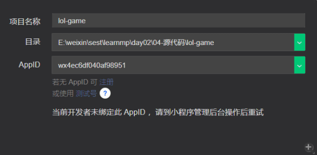
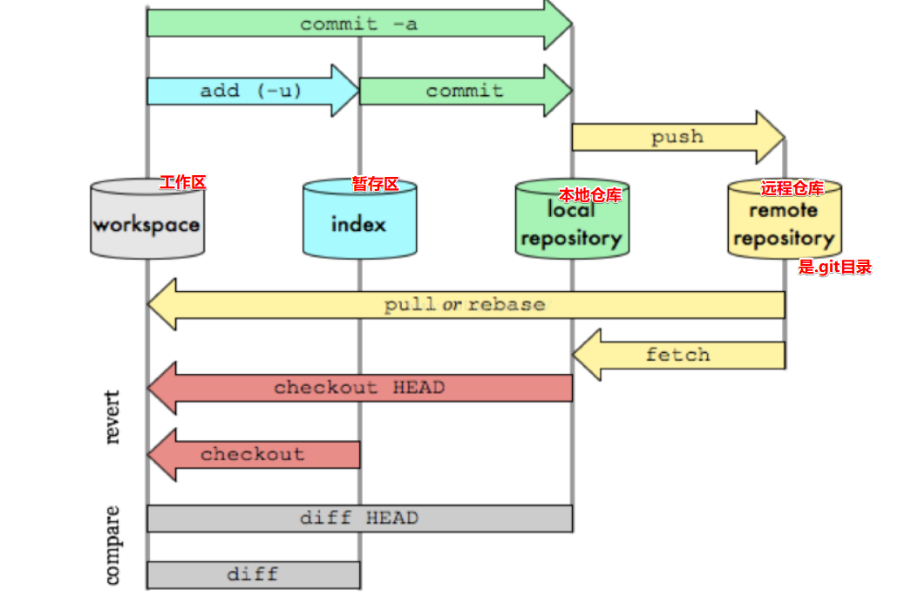
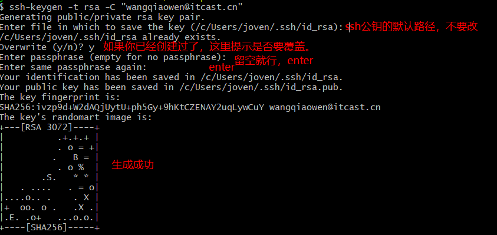
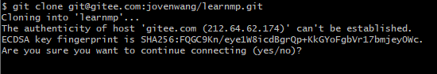
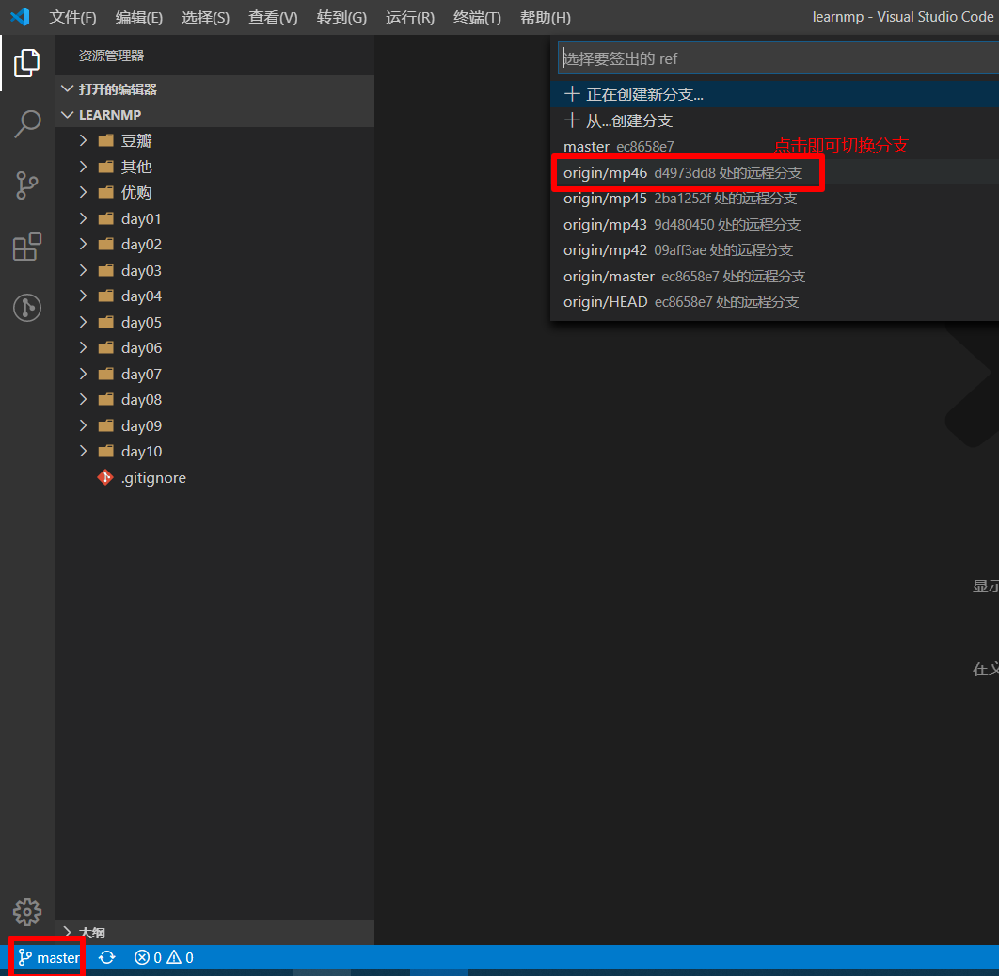
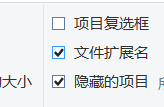

# 微信小程序学习第2天

## 每日反馈

1. 想问一下老师，分期乐是不是真的骗钱的，看到负面消息好多，在学校的时候还帮学长注册过

   1. 我只是一个程序员
   2. 不是很喜欢做重复性的东西

2. vscode的快捷键，首选项-->键盘快捷方式，然后随便找

3. 同学们打开我的课上小程序项目，开发者工具报错

   1. 你当前登陆微信开发者工具的账号不是appid的管理员

   

   


## 作业检查

1. https://heima-mp.coding.net/p/homework/d/homework/git/blob/master/day01-szj/day01/pages/triggleimg/index.js
   1.  尽量格式化
2. https://heima-mp.coding.net/p/homework/d/homework/git/blob/master/learningproject_dk/learningproject/pages/togglePic/index.js
   1. 写url时，尽量带上协议,https还是http
   2. 尽量用===，可以保证总是在确定类型的情况下进行对比，代码可预测，更加健壮
   3. 变量的声明尽是放到函数最顶端
3. https://heima-mp.coding.net/p/homework/d/homework/git/blob/master/helloword-tpp/helloword/pages/switch_images/index.js
4. https://heima-mp.coding.net/p/homework/d/homework/git/blob/master/helloword-zgc/helloword/pages/switch_inage/index.js
5. https://heima-mp.coding.net/p/homework/d/homework/git/blob/master/helloword_frh/helloword/pages/image_demo/index.js
6. https://heima-mp.coding.net/p/homework/d/homework/git/blob/master/mini1-smy/mini1/pages/demo2/index.js
   1. 习惯判断用===?
   2. 注释有些少？


## 回顾

目前来说，个人感觉小程序还好，只要能记住特定的语法，那就和以前学Vue一样

1. 会注册微信小程序
2. 了解微信小程序的开发步骤
   1. 注册
   2. 信息完善
   3. 开始写代码
   4. 发布
3. 新建项目
   1. 选择小程序
   2. 目录选择：一个空的目录
   3. appid
      1. 填写自己的appid
      2. 测试号
      3. 下拉找到历史填过的
   4. 不要使用云服务
4. 了解小程序中的数据绑定的写法
5. 会小程序中条件渲染的写法
6. 会小程序中列表渲染的写法
   1. wx:key的值是item里面唯一的属性的名字，并不是要给一个值 
   2. 如果遍历的数组本身就是一维的，而且每个元素是不相同的，那么wx:key可以设置为*this
7. 事件注册
   1. 结构声明 bind事件名=“事件处理方法"
   2. 在js里面声明事件处理方法，事件处理方法和data是平级
8. 方法中的this
   1. 访问方法 this.方法名
   2. 访问属性 this.data.属性名
   3. 改变属性 this.setData({属性名:新的值})

#### 注意点

1. 如果微信开发者工具点击没反应，在任务管理器中杀死对应的进程， 再次打开

2. 微信开发者工具刚打开时，需要等模拟器页面完全展示，再操作，否则闪退

3. 如果用微信开发者工具创建过某个项目，然后删除项目，再创建同名的项目，那么打开时就是一个空的项目。

   1. 尽量避免同名
   2. 重装微信开发者工具也行

   

## Git项目克隆

微信小程序课程地址：  https://gitee.com/jovenwang/learnmp  分支：mp46

问题：如何克隆项目到本地，需要先git init吗？无须



#### **git克隆支持两种协议，https和ssh**

	1. https克隆，推送时，需要输入用户名和密码（不推荐用这个种方式）
 	2. ssh无须输入用户名和密码，但是需要SSH公钥
      	1. ssh公钥就是把电脑唯一标识交给远端，然后远端就可以认识我们电脑，后续克隆或者推送都无须验证了。
      	2. 需要在远端添加ssh公钥

#### 项目克隆流程

1. 添加公钥

   1. 根据码云，用户头像->设置->ssh公钥->有说明如何生成公钥，[传送门](https://gitee.com/help/articles/4181#article-header0)

   2. 执行生成ssh 公钥的命令

      ```bash
      ssh-keygen -t rsa -C "填写有意义的邮箱"
      ```

      

2. 复制公钥，**一定需要复制以下命令显示内容的全部，包括邮箱**

   ```bash
   cat ~/.ssh/id_rsa.pub
   ```

   1. cat查看文件
   2. ~代码home目录，c/uses/某个用户

3. 在码云添加ssh公钥，用户头像->设置->ssh公钥->输入框

   1. 这里的标题，方便我们自己记记忆

4. 选择一个合适的目录，来克隆learnmp

   1. 首次克隆会提示是否用ssh公钥来验证，**一定要敲yes**

      

   ```bash
   git clone git@gitee.com:jovenwang/learnmp.git
   ```

5. 用vscode打开learnmp目录，切换分支mp46

   


#### 课程资料简介

1. 蘑菇在线里面有笔记.md
2. 优购商城有笔记.md，包括项目所需要的资料

#### 注意点：

1. git init本质上就初始化本地仓库

   1. 在windows系统文件，某个设置里面，打开“隐藏文件”

      

2. 在命令行里面粘贴的话，鼠标右键paste

3. 在命令行里面想复制的话，鼠标左键选中，然后右键复制

4. 在码云上切换到mp46，克隆到本地时，默认分支是mp46吗？

   1. 不行
   2. 克隆到本地默认就是mp46分支

5. learnmp能否推送成功吗？能1，否2

   1. 不能
   2. learnmp之所以可以克隆，是因为这个项目公开的，能读。但是不一定能写

6. 为什么要使用ssh协议，而不用https?

   1. https协议push才需要用户名和密码？
   2. 可以选https

7. 换电脑后，是否需要重新添加ssh公钥呢？

   1. 要，ssh公钥是电脑的唯一凭证

8. 企业是如何使用git

   1. 一般公司内部搭建gitlab
      1. 代码存放在公司的服务器上面
   2. 新入职员工会被分配gitlab账号
   3. 项目权限分几种
      1. 能看到，有克隆权限
      2. 主程序员角色，可以写代码推送
      3. 所有者，一般master分支是受保护，普通开发者不能直接推送master
         1. master和线上一致
         2. 可能是组长来负责合并代码到master
   4. 大家一般用sourcetree或者乌龟git
      1. 我更习惯用命令+vscode


## 轮播图组件

[传送门](https://developers.weixin.qq.com/miniprogram/dev/component/swiper.html)

微信小程序内置了很多的组件，无须引入可以使用，包括轮播图，横向滚动，下拉框等

1. swiper组件有很多的可选属必，用到的时候去查就行

   ```html
   <swiper indicator-dots autoplay interval="3000" duration="200" circular>
     <block wx:for="{{goodsList}}" wx:key="goodsId">
       <swiper-item>
         <image src=""></image>
       </swiper-item>
     </block>
   </swiper>
   ```

   

2. block标签类似于vue template标签，并不会渲染，可以放wx:for和wx:if

3. wx:for里面的wx:key 

   1. 如果不给，会有警告

   2. wx:key不应该给它一个值，同vue v-for是不一样的

   3. wx:key**应该是wx:for所遍历的数组里面的对象的某个属性的键，这个属性是唯一的**

   4. 如果wx：for所遍历的数组是一维，且每个元素是不相同的，那么可以设置wx:key为

      ```html
      <block wx:for="{{goodsList}}" wx:key="*this">
      ```

#### 注意点：

1. w3c规范，html标签属性，如果是boolean类型，如果只给属性没有值的话，就是true


## 模块化

[传送门](http://es6.ruanyifeng.com/#docs/module)

```js
//在需要暴露方法的.js文件里面
export default sayHello
//引入某方法 
import sayHello from './hello.js'
```

#### 注意点

1. import一个文件时，只支持相对路径


## navigator组件

[传送门](https://developers.weixin.qq.com/miniprogram/dev/component/navigator.html)

概念：跳转某个页面，类似于html a href

使用方法：

1. url就是跳转的链接，路径就是app.json pages数组里面的路径，**只不过必须/打头**

   1. 如果想传参的话，那么就需要`？键=值`

   ```html
   <navigator url="/pages/index/index?title=joven">去首页</navigator>
   ```

2. 在跳转过去的页面上获取参数

   ```
   Page({
   	onLoad(options){
   	//options就是传参的对象，options.键
   	}
   })
   ```

   

#### 注意点：

1. A页面跳转B页面，如果带参数的话，那么在模拟器的页面参数这个地方可以看到传参


## 克鲁赛德战记案例-练习


#### 01.案例分析

	1. 展示英雄列表，一行展示三个,每个英雄包括图像还有英雄名字
 	2. 数据来自`learnmp\day02\02-其他资料\heroList.js`

#### 02.静态页面

1. 新建一个项目，名为`kl-game`
2. 新建一个页面home
3. 数据引入，新建data目录，和pages平级
4. 先写结构，后写样式
   1. 如果想让子元素三个一行，可以设置子元素的宽度33.33%

#### 03.获取数据&渲染列表

1. 首先在data/heroList.js export
2. 在home.js引入heroList
3. 设置给data
4. 在结构里面wx:for渲染
   1. wx:key应该设置为遍历的数组里面的对象的某个属性，这个属性得是唯 


## 编程式导航

## 事件传参

### 事件对象的target与currentTarget

## 编译模式的设置

## lol英雄案例-英雄列表页


#### 01.页面分析

#### 02.静态页面

#### 03.导入数据&列表渲染

#### 04.导航区设置


## lol英雄案例-英雄详情页


#### 01.页面分析

#### 02.跳转到详情页

#### 03.静态页面

#### 04-静态页面-进度条progress组件

[progress](https://developers.weixin.qq.com/miniprogram/dev/component/progress.html)

#### 05-渲染数据


#### 06-导航区设置


## 总结