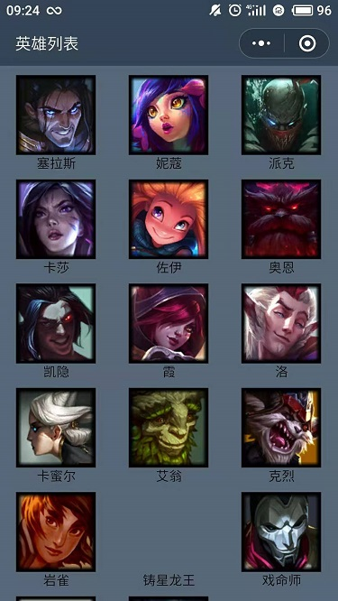

# 微信小程序学习第2天

## 每日反馈


## 回顾

1. 新建项目

2. 数据渲染

   1. wx:for里面最好给wx:key，wx:key是元素里面的某一个属性

3. 事件注册

   1. 事件处理方法都应该声明为方法

4. 方法中的this

   

## 轮播图组件

[传送门](https://developers.weixin.qq.com/miniprogram/dev/component/swiper.html)

1. 小程序里边除了基本的标签外，还为我们提供好了一些高级组件

2. block标签：包裹标签，最终不解析，类似于Vue template标签

3. 组件的使用，随用随查，尽量先用小程序提供的

   ```html
   <swiper indicator-dots indicator-color="#fff" indicator-active-color="#666" autoplay interval="2000" duration="500" circular>
     <block wx:for="{{imgList}}" wx:key="*this">
       <swiper-item>
         <image src="{{item}}"></image>
       </swiper-item>
     </block>
   </swiper>
   ```

#### 注意点：

1. wx:for尽量给key值，*this就是item


## 模块化

[传送门](https://developers.weixin.qq.com/miniprogram/dev/framework/app-service/module.html)

单独的js文件作为一个模块，用`module.exports`暴露接口，在需要模块的文件中用`require`引入

```js
module.exports.sayHello = sayHello
var sayHello = require('hello.js')

//ES6语法
export default
import x from ''
```

> require和import的路径不能'/'开头


## navigator组件

[传送门](https://developers.weixin.qq.com/miniprogram/dev/component/navigator.html)

概念：跳转到其他页面

使用:

```html
<navigator url="/pages/navigator_demo2/index?title=Joven">跳转到新页面</navigator>
```

```js
onLoad: function(options) {
  console.log(options.title)
}
```

#### 注意点：

1. navigator的url属性必须是/打头

2. 模拟器的页面参数这里可以看到传过来的参数


## 克鲁赛德战记案例-练习


#### 01.案例分析

1. 英雄列表页，展示所有英雄的头像和名字
2. 英雄列表的数据来自静态js文件
3. 点击某一个英雄跳转英雄详情页，显示该英雄的技能

#### 02.静态页面

1. 创建项目game
2. 新建页面 home和detail，删除掉index和log
3. home页面结构与样式

#### 03.获取数据&渲染列表

1. 引入heroList.js，渲染列表
2. 点击英雄跳转到详情页面，详情页面上展示英雄技能
   1. navigator跳转和传参


## 编程式导航

1. 声明式导航

   1. vue-router

      ```html
      <router-link path="/sing"></router-link>
      ```

   2. 微信小程序

      ```html
      <navigator url="/pages/index/index"></navigator>
      ```

2. 编程式导航

   1. vue-router

      ```js
      router.push('/sing')
      ```

   2. 微信小程序

      ```js
      wx.navigateTo({url:'/pages/index/index'})
      ```

> 微信小程序里面很多方法是由wx对象提供的
>
> 导航的url是以/开头


## 事件传参

注册事件：

```html
<view bindtap="toIndex" data-参数名="参数值">
```

事件处理方法：

```js
toIndex(event){
  event.currentTarget.dataset.参数名
}
```


### 事件对象的target与currentTarget

currentTarget是指bind事件所在的DOM，取方法的传参都在这里取了。

target是指事件源DOM

> 微信小程序里面，事件冒泡也是有的。


## 编译模式的设置

作用： 设置模拟器的默认首页，方便调试

操作： 工具栏中的普通编译下拉->添加编译模式

1. 模式名字
2. 路径
   1. 下拉选择有bug，需要点到向下箭头，才能展示所有的路径
3. 启动参数，设置页面参数


## lol英雄案例




## lol英雄案例-英雄列表页

#### 01.页面分析

1.  展示英雄列表
2.  数据来自文件lol_duowan.js，iconUrl和name分别显示的图片和名字

#### 02.静态页面

1. 新建项目`lol-game`
2. 添加一个英雄列表页`list`, 删除掉index和log页
3. 列表展示
   1. flex布局

#### 03.导入数据&列表渲染

1. require导入数据
2. wx:for渲染数据，展示列表

#### 04.导航区设置

[传送门](https://developers.weixin.qq.com/miniprogram/dev/reference/configuration/page.html)

pages/list/index.json设置

1. 背景颜色
2. 文本
3. 文本颜色
   1.  `black` / `white` 

```json
{
  "navigationBarBackgroundColor": "#354459",
  "navigationBarTitleText": "英雄列表",
  "navigationBarTextStyle": "white"
}
```

>1. 注意.json文件的格式
>2. Vue和小程序的指令，都是html标签的属性


## lol英雄案例-英雄详情页

#### 01.页面分析

      	1. 英雄列表点击某一个英雄，去到英雄详情页，展示对应的英雄的详情，
      	2. 页面标题展示`昵称-名字`，页面内容展示英雄图片，名字，昵称，标签和能力，传说

#### 02.跳转到详情页

1. 新建英雄详情页`detail`
2. 点击英雄跳转到英雄详情页
   1. 点击英雄bindtap:toDetail
   2. 编程式导航wx.navigateTo()
3. 传递英雄id
   1. list/index.wxml 设置data-id
   2. list/index.js,导航url传递参数`?id=params.currentTarget.dataset.id`
   3. detail/index.js, onLoad获取到id
4. 设置编译模式
   1. 设置启动参数`id=rakan`

#### 03.静态页面

1. 轮播图
   1. 标签属性如果写了但是不给值，就是true
2. 英雄名字，昵称，标签和能力，说明

#### 04-静态页面-进度条progress组件

[progress](https://developers.weixin.qq.com/miniprogram/dev/component/progress.html)

概念：进度条组件

1. percent：进度条百分比
2. stroke-width：进度条的高度
3. activeColor：进度条颜色
4. backgroundColor：进度条背景色
5. active: 进度条动画
6. duration进度条速度

```html
<progress percent="10" activeColor="#f2c40c" stroke-width="12" backgroundColor="#363636" active></progress>
```

#### 05-渲染数据

1. 引入lol_details_duowan.js

2. 根据id获取当前英雄的数据

3. 英雄的数据渲染到页面上

   ```js
   arr.find(v=>{return true or false})
   ```

   

#### 06-导航区设置

1. 动态设置导航 wx.setNavigationBarTitle
2. 设置全局navigationBarTitleText为空，避免一闪而过
3. 导航背景和字体颜色设置到app.json


## 小程序上线

1. 小程序的体验版本，是上线前，让产品经理、项目经理、客户、测试进行体验的。成员管理里面添加体验成员即可。
2. 线上版本，就是所有人都可以访问到的版本，无须添加成员。
3. 上线步骤：
   1. 如果是测试账号，需要改成开发者的AppID
      1. 详情->基本信息->APPID修改
   2. 开发者工具上传
      1. 代码从本地上传到微信的服务器
   3. 小程序后台管理
      1. 开发版本可以选为体验版本或者提交审核
      2. 体验版本立马生效
      3. 审核通过后
      4. 提交发布，就上线成功

注意点：

​	1. 小程序类型设置为：**工具-信息查询**


## 总结