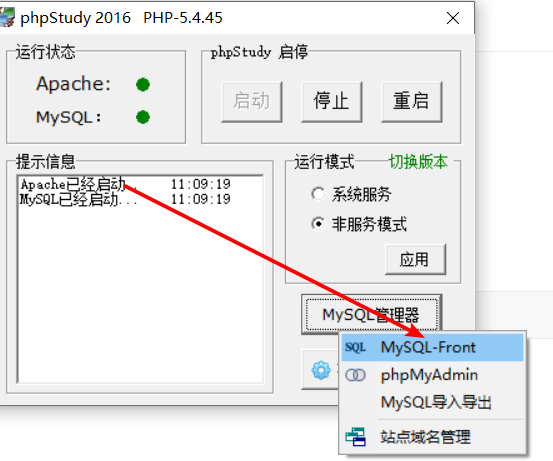
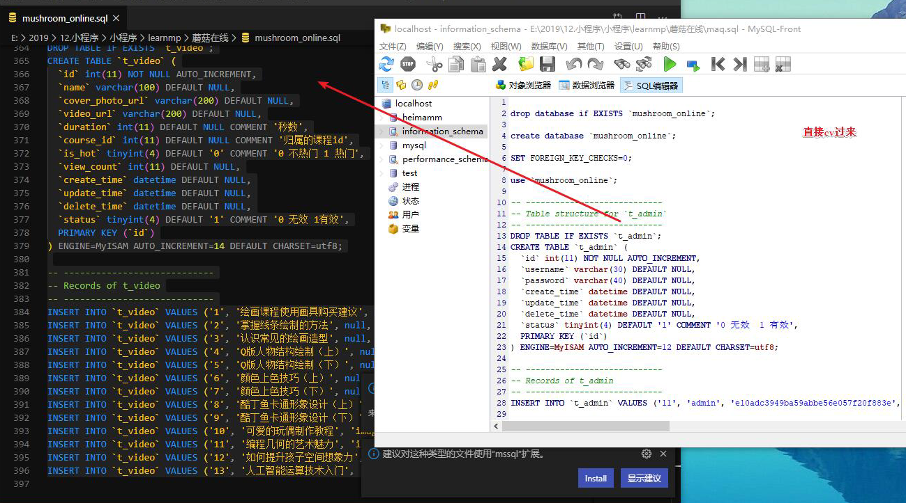
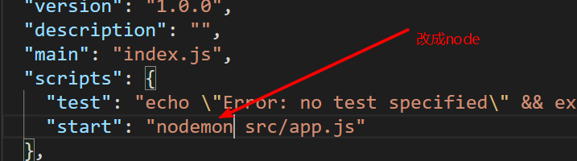

# 微信小程序学习第3天

## 每日反馈

1. 不知道有没有机会在教室见到老师,害ε=(´ο｀*)))

   1. 没有机会, 过来不深圳

2. swiper属性api的局限性

   ```html
   <swiper vertical="{{true}}" autoplay="{{false}}">
   ```

3. css问题的定位

4. 小程序中使用less（了解即可）

   [传送门](https://developers.weixin.qq.com/community/develop/doc/00086c05ce0b780c3d072925955c06)

5. [小程序后台](https://mp.weixin.qq.com/)

   1. 邮箱密码登陆即可


## 回顾

1. 编程式导航

   ```js
   wx.navigateTo({url:'/pages/detail/detail?id=2'})
   ```

2. 事件传参

   ```
   <view bindtap="tapHandler" data-参数名="参数值">
   tapHandler(event){
   	event.currentTarget.dataset.参数名
   }
   ```

   

3. 事件对象的target和currentTarget

   1. target是事件源
   2. currentTarget是注册事件所在的dom

4. 编译模式的设置

   1. 设置模拟器的默认首页

5. 页面配置

   1. page{background-color}


## lol英雄案例-英雄详情页

#### 05-渲染数据

1. 引入lol_details_duowan.js

2. 根据id获取当前英雄的数据

   1. for item of arr, 循环可以中断

   2. arr.find，遍历数组每一项，每一项执行一个函数，如果函数返回true，返回那一项，结束遍历

      ```
      arr.find(v=>{return true or false})
      ```

   3. 数组方法filter: 创建一个新的数组，包含原数组中符合条件的所有项。

3. 英雄的数据渲染到页面上


#### 06-导航区设置

1. 动态设置导航 wx.setNavigationBarTitle({title:''})
2. 设置全局navigationBarTitleText为空，避免wechat一闪而过
3. 导航背景和字体颜色设置到app.json


## 小程序上线

#### 小程序版本

1. 开发版本：开发成员可以预览扫码测试的

2. 小程序的体验版本，是上线前，让产品经理、项目经理、客户、测试进行体验的。成员管理里面添加体验成员即可。

3. 线上版本，就是所有人都可以访问到的版本，无须添加成员。

   > 三个版本在微信小程序列表那里可以同时存在

   #### 上线步骤：

   1. 如果是测试账号，需要改成开发者的AppID
      1. 详情->基本信息->APPID修改
   2. 开发者工具上传
      1. 代码从本地上传到微信的服务器
   3. 小程序后台管理，[地址](https://mp.weixin.qq.com/)
      1. 开发版本可以选为体验版本或者提交审核
      2. 体验版本立马生效
      3. 审核通过后
         1. 会有通知到你的管理员微信账号
      4. 提交发布，就上线成功
      5. 微信搜索小程序名字，打开小程序，分享到微信群

注意点：

	1. 小程序类型设置为：**工具-信息查询**
 	2. 审核时长不好说，有遇到过审核4天才通过的
 	3. 小程序代码最大为2M


## 蘑菇在线项目演示

项目目的

1. 巩固原生小程序语法
2. 标准设计稿，体验企业级前端开发


1. 登录页：微信授权登录
2. 手机登录页：手机号登录
3. 首页：展示推荐轮播图、推荐课程及热门视频
4. 课程：展示课程列表
5. 学习: 展示学习记录
6. 我的：展示用户信息

## 项目说明

1. 后面node.js项目地址 https://gitee.com/jovenwang/mushroom-online-server
2. 微信小程序前端完成项目地址 https://gitee.com/jovenwang/mp-mushroom-online
   1. 完整项目在分支 master
   2. 静态页面在分支 Fea_static_pages
3. 接口API https://gitee.com/jovenwang/mushroom-online-server/blob/master/api.md
4. 设计稿 https://lanhuapp.com/url/8NzGu-m2LY3


## 项目准备

1. 打开设计稿链接，注册蓝湖账号，查看

2. 后台准备
   1. 数据库初始化
   
      1. 安装phpStudy
   
      2. 找到mysql-front打开
   
         
   
      3. 复制`mushroom_online.sql`到sql编辑器，点上边绿色按钮执行。
   
      4. 如果在左侧看到`mushroom_online`说明数据库初始化完成
   
      5. 不要导入！！！
   
         
   
   2. mushroom-online-server配置后台
   
      1. 路径 src\config\wxconfig.js
      2. appid换成我们自己申请的
      3. appsecret也是
         1. 重置。。。。
   
   3. server启动
   
      1. package.json start命令`nodemon`换node
   
      2. npm intstall
   
      3. npm run start
   
      4. 测试后端接口能否调用
         1. http://localhost:3000/api/user/vcode?phone=15361819220
   
            
3. 新建微信小程序项目
   1. 项目名`mp-mushroom-online`
   2. 新建login页面，删除多余页面
   3. app.js和app.wxss内容重置


## 项目git管理

1. 码云新建仓库名`mp-mushroom-online`

2. 按提示推送代码

   ```bash
   git add README.md
   git commit -m "first commit"
   git remote add origin git@gitee.com:jovenwang/mp-mushroom-online.git
   git push -u origin master
   ```

3. 新建开发分支`Fea_joven_20200224`


## 登录页-页面分析


1. 小程序的入口
2. 微信授权登录
3. 手机号码登录跳转到手机登录页面


## 自适应单位rpx 

[传送门](https://developers.weixin.qq.com/miniprogram/dev/framework/view/wxss.html#%E5%B0%BA%E5%AF%B8%E5%8D%95%E4%BD%8D)

1. 所有设备的宽度都是750rpx。相当于所有设备的宽度750等分，每一份是1rpx

2. 开发微信小程序时设计师用 iPhone6 作为视觉稿的标准，宽度是750px

   1. **代码里面的元素rpx值=设计稿对应元素的像素值**
   2. 设计的宽度就是750px,iphone6的2倍图

3. 需要随屏幕尺寸变化的元素用rpx, 否则用px

   1. 实际项目里面，哪些元素是固定尺寸的，看实际情况

4. 实际开发中，一般只需要用rpx适配好iphone6就行。

5. 哪些css属性需要自适应

   1. margin
   2. padding
   3. border
   4. font-size
   5. width,height


## 登录页-静态页面

1. logo展示
2. 文案展示
3. 微信授权按钮展示
4. 手机号码登录和商标展示
5. 点手机号码登录，跳转到手机登录页面
   1. 声明式navigator组件

#### 蓝湖使用经验：

1. 选择开发开台---web

2. 可以使用部分代码

   

## 小程序授权

[授权](https://developers.weixin.qq.com/miniprogram/dev/framework/open-ability/authorize.html)

是什么？部分接口需要经过用户授权才能调用，比如说获取用户信息、通讯地址、微信运动步数等等

有什么用？获取用户在微信里面的信息

### 如何使用？

1. [wx.authorize](https://developers.weixin.qq.com/miniprogram/dev/api/open-api/authorize/wx.authorize.html) 发起授权请求`scope.address`
2. 调用授权API `wx.chooseAddress`

#### 授权行为：

1. 第一次发起授权某权限，会弹窗请求权限，用户同意后会调用接口
2. 如果用户已经授权，直接调用
3. 如果用户已经拒绝，直接进入失败。

#### 注意点：

1. 用户信息的授权用`<button open-type="getUserInfo">用户信息</button>`即使用户拒绝也会弹出授权。

6. 学会了基本的授权使用，其他接口随用随查，不需要立马掌握


## 登录页-用户信息授权

1. 点击`微信授权登录`按钮，弹出授权窗口，获取授权信息
   1. 获取用户信息必须用声明式，不破坏之前的样式
      1. 样式绝对定位
      2. 透明
   2. 设置button属性
      1. open-type="getUserInfo"
      2. bindgetuserinfo="wxLogin"
      3. wxLogin里面获取到用户信息
   3. 弹窗用户拒绝处理，提示`登录失败，请授权`


## 小程序登录

[传送门](https://developers.weixin.qq.com/miniprogram/dev/framework/open-ability/login.html)

第三方登录：第三方网站授权登录

其实就是用微信账号登陆小程序

步骤：

1. 获取用户信息, 如果没有授权过，会在底部弹出授权窗口的

   ```html
   <button open-type="getUserInfo"
               bindgetuserinfo="getuserinfo">点我登录</button>
   ```

2. wx.login()获取到code

3. 调后端接口获取token

   1. /user/wxlogin


## 总结