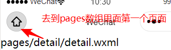

# 微信小程序学习第3天

## 每日反馈

1. 圆圆还在不断继续努力~奥力给~~

   1. 加油

2. 事件对象的target与currentTarget有点懵

3. 3.15

4. 有人说typeScript会取代javaScript老师你怎么看？

   1. ts是js的超集

   2. 在js变量的类型可以改动

   3. ts优势在于接口传参的类型是确定

   4. javasript可能会来一下es11规范，直接把ts借鉴

      ```js
      var goodsList:{}
      goodsList:[]
      
      //判断两个日期的间隔时间
      diffDate(d1,d2){
      	如果d1是string类型 2019/9/9，用Date.parse()转成Date类型
      	如果d1是Number类型的话，new Date()转成Date
      }
      ```

      

5. 老师有什么工作经验可以分享吗？老师之前的公司都是大公司吧，进大公司技术要求很高吧。像我们这些培训班出来的，第一份工作找什么类型的公司比较适合我们没做过几个项目的呢？

   1. 一般大公司需要学历，专升本可能是通行证
   2. 大公司一般更卡学历
   3. 如果学历不怎么样的话，可以花两年时间的努力，再找下一家公司做正式员工。
   4. 在外包公司也可以做到管理层
   5. 在大公司，福利比较全面，比较稳定。技术比较保守，一个萝卜一个坑，技术视野会窄。
   6. 在外包公司里面，你不是正式员工，就是打酱油，充分利用时间去学习。

6. 还好

   1. ~_~

7. q'q'q'q'qqqqqq


## 回顾

1. 编程式导航

   1. 在模拟器有一个页面参数可以看到传参

   ```js
   wx.navigateTo('/pages/detail/detail?参数名=值&参数2=值')
   ```

2. 事件对象的target和currentTarget

   1. target就是指我们点击的那个dom(了解)

   2. currentTarget是注册事件所在的dom

   3. 一般来说，我们想给注册事件的事件处理方法传参的话，传参就放在dom上，获取参数就是currentTarget里面

      ```
      <view bind事件名="事件处理方法" data-属性名="属性值"></view>
      事件处理方法(event){
       event.currrentTarget.dataset.属性值
      }
      ```

3. 事件传参

   1. 不能在事件处理方法里面传实参 ，需要data-属性名=“属性值”

4. 编译模式的设置

   1. 设置模拟器的默认首页
   2. 编译模式的编辑和删除

5. 页面配置

   1. app.json是全局配置
   2. 页面配置index.json文件，可以配置导航栏，文字，前景色和背景色
   3. 页面配置优先级大于全局配置


## 作业检查

1. https://gitee.com/jovenwang/homework/blob/master/lol-dome/pages/lol/index.wxml
   1. 页面设置没写
   2. class的命名，推荐"user-name"，也就是说单词与单词之间用中划线分隔
2. https://gitee.com/jovenwang/homework/blob/master/lol-heros/pages/list/list.wxss
   1. 很好
3. https://gitee.com/jovenwang/homework/blob/master/xbc/pages/lol-home/lol-home.wxml
   1. js变量，单词与单词之间用驼峰
   2. 背景色没设置
4. [https://gitee.com/jovenwang/homework/tree/master/%E6%9F%90%E5%A7%93%E5%90%8D/pages/home](https://gitee.com/jovenwang/homework/tree/master/某姓名/pages/home)
   1. 一切跟代码相关的目录不要有中文，也不要有空格
5. https://gitee.com/jovenwang/homework/tree/master/pages/home
   1. 页面设置没写


## ES6的模块化

在微信小程序可以直接使用ES6的模块化

export导出模块的功能

```js
// 推荐用这种导出，很清楚知道导出哪些功能
export { sayHello, sayGoodBye}
```

import 导入其他模块的功能

```js
import { sayHello, sayGoodBye} from '../../utils/hello.js'
```

export default导出一个默认模块

	1. export default function 名字也是可以的
 	2. export default const a =10

```js
export default 值
import 别名 from '模块'
```


## lol英雄案例-英雄详情页


#### 01.页面分析

	1. 入口：列表页点击某一个英雄，跳转到英雄详情
 	2. 在英雄详情页面，展示标题(昵称-名字), 轮播图，英雄故事，英雄昵称，名字，英雄定位，英雄能力

#### 02.跳转到详情页

 1. 列表页点击某一个英雄，跳转到英雄详情

     	1. bindtap=“toDetail‘
     	2. 在toDetail，用编译式导航，跳转detail页面

 2. 跳转英雄详情页面，传递id

     	1. 因为id是唯一
     	2. 事件传参，就在注册toDetail的dom上，data-属性名=值; 事件处理方法里面event.currentTarget.dataset.属性名
     	3. 确定一下有没有传递过去，模拟器的页面传参里面确认

 3. 添加编译模式

     	1. 启动页面设置为detail
     	2. 模式名称 “英雄详情”
     	3. 从列表跳转过来，复制模拟器页面传参，然后设置编译模式的启动参数

 4. 在英雄详情页面获取参数

    ```
    onLoad(options){
    options.id
    }
    ```

    

#### 03.静态页面

1. 轮播图
2. 一左一右的布局，用flex
3. 左侧展示昵称，姓名，定位，能力
4. 有一个进度条的组件

#### 注意点：

1. 写静态页面，一定要把模拟器切到iphone6
2. 行内元素设置宽度是没有作用的，它的宽度是由里面元素撑起来
3. flex典型的左右布局里面，如果左侧宽度是固定的话，右侧需要flex:1用来占满剩下的宽度。

#### 04-静态页面-进度条progress组件

[progress](https://developers.weixin.qq.com/miniprogram/dev/component/progress.html)

进度条

1. percent百分比
2. storke-width是宽度，也可以理解成'高度'
3. activeColor前景色
4. backgroundColor背景色
5. active开启动画

```html
  <progress percent="80" stroke-width="12" activeColor="#f2c40c"
        backgroundColor="#363636" active></progress>
```

#### 05-渲染数据

1. 引入detail数组
   1. export
   2. import
   3. 确认是否导入成功
2. 在detail数组里面找一个id为传参的对象
   1. 用数组方法find，找到id为传参的对象hero
   2. data里面声明hero空对象
   3. 设置data属性setData

3. 渲染

#### 06-导航区设置

1. 导航区的前景色和背景色两个页面是相同的，所以需要设置到全局app.json的window属性
2. 不同英雄点击到英雄详情页展示的导航栏的文案是不一样的，需要动态设置
   1. wx.setNavigationBarTitle({title:''})动态设置标题
3. 页面切换，有“wechat”一闪而过，在app.json去掉默认的导航栏文案，设置为空就行


#### 提示



1. 数组方法find: 原数组遍历，执行指定的函数，如果返回true，就返回那一个元素，遍历中断
2. 数组方法filter: 返回一个新的数组，遍历原数组，取出数组里面每一项，执行指定的函数，如果返回是true的话，就在新的数组里面加入这一项
3. 注意判断是全等,不是赋值


## 小程序上线

#### 小程序版本

#### 上线步骤：

#### 注意点：


## 蘑菇在线项目演示

#### **有哪些功能**？

#### **项目目的**


## 项目说明

1. 服务器代码：项目需要自己部署后台
2. 设计稿地址 https://lanhuapp.com/url/8NzGu-jnAKr
3. 接口API 
4. 静态页面可参考这个`静态页面`目录
5. 完整项目参考


## 自适应单位rpx 

[传送门](https://developers.weixin.qq.com/miniprogram/dev/framework/view/wxss.html#%E5%B0%BA%E5%AF%B8%E5%8D%95%E4%BD%8D)


## 项目准备

1. 打开蓝湖链接，注册账号。确定可以使用设计稿
2. 新建微信小程序项目


## 项目git管理

#### 注意点：


## 首页-页面分析


## 首页-静态页面

#### 提示：

#### 步骤：


## 服务器启动

1. 数据库初始化

2. server启动

   3. 测试后端接口能否调用 http://localhost:3000/api/user/vcode?phone=15361819220


## 总结


## 作业：

1. lol英雄案例上线，并转到46期微信群
2. 把项目放在码云上管理，以后检查作业提供git地址
3. 完成蘑菇在线的首页静态页面
4. 全部同学务必完成服务器启动！！！