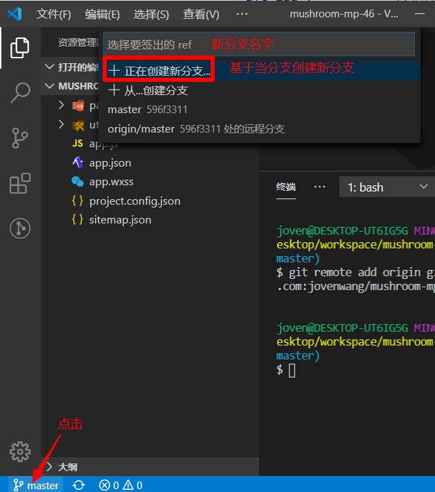

# 微信小程序学习第3天

## 每日反馈

1. 圆圆还在不断继续努力~奥力给~~

   1. 加油

2. 事件对象的target与currentTarget有点懵

3. 3.15

4. 有人说typeScript会取代javaScript老师你怎么看？

   1. ts是js的超集

   2. 在js变量的类型可以改动

   3. ts优势在于接口传参的类型是确定

   4. javasript可能会来一下es11规范，直接把ts借鉴

      ```js
      var goodsList:{}
      goodsList:[]
      
      //判断两个日期的间隔时间
      diffDate(d1,d2){
      	如果d1是string类型 2019/9/9，用Date.parse()转成Date类型
      	如果d1是Number类型的话，new Date()转成Date
      }
      ```

      

5. 老师有什么工作经验可以分享吗？老师之前的公司都是大公司吧，进大公司技术要求很高吧。像我们这些培训班出来的，第一份工作找什么类型的公司比较适合我们没做过几个项目的呢？

   1. 一般大公司需要学历，专升本可能是通行证
   2. 大公司一般更卡学历
   3. 如果学历不怎么样的话，可以花两年时间的努力，再找下一家公司做正式员工。
   4. 在外包公司也可以做到管理层
   5. 在大公司，福利比较全面，比较稳定。技术比较保守，一个萝卜一个坑，技术视野会窄。
   6. 在外包公司里面，你不是正式员工，就是打酱油，充分利用时间去学习。

6. 还好

   1. ~_~

7. q'q'q'q'qqqqqq


## 回顾

1. 编程式导航

   1. 在模拟器有一个页面参数可以看到传参

   ```js
   wx.navigateTo('/pages/detail/detail?参数名=值&参数2=值')
   ```

2. 事件对象的target和currentTarget

   1. target就是指我们点击的那个dom(了解)

   2. currentTarget是注册事件所在的dom

   3. 一般来说，我们想给注册事件的事件处理方法传参的话，传参就放在dom上，获取参数就是currentTarget里面

      ```
      <view bind事件名="事件处理方法" data-属性名="属性值"></view>
      事件处理方法(event){
       event.currrentTarget.dataset.属性值
      }
      ```

3. 事件传参

   1. 不能在事件处理方法里面传实参 ，需要data-属性名=“属性值”

4. 编译模式的设置

   1. 设置模拟器的默认首页
   2. 编译模式的编辑和删除

5. 页面配置

   1. app.json是全局配置
   2. 页面配置index.json文件，可以配置导航栏，文字，前景色和背景色
   3. 页面配置优先级大于全局配置


## 作业检查

1. https://gitee.com/jovenwang/homework/blob/master/lol-dome/pages/lol/index.wxml
   1. 页面设置没写
   2. class的命名，推荐"user-name"，也就是说单词与单词之间用中划线分隔
2. https://gitee.com/jovenwang/homework/blob/master/lol-heros/pages/list/list.wxss
   1. 很好
3. https://gitee.com/jovenwang/homework/blob/master/xbc/pages/lol-home/lol-home.wxml
   1. js变量，单词与单词之间用驼峰
   2. 背景色没设置
4. [https://gitee.com/jovenwang/homework/tree/master/%E6%9F%90%E5%A7%93%E5%90%8D/pages/home](https://gitee.com/jovenwang/homework/tree/master/某姓名/pages/home)
   1. 一切跟代码相关的目录不要有中文，也不要有空格
5. https://gitee.com/jovenwang/homework/tree/master/pages/home
   1. 页面设置没写


## ES6的模块化

在微信小程序可以直接使用ES6的模块化

export导出模块的功能

```js
// 推荐用这种导出，很清楚知道导出哪些功能
export { sayHello, sayGoodBye}
```

import 导入其他模块的功能

```js
import { sayHello, sayGoodBye} from '../../utils/hello.js'
```

export default导出一个默认模块

	1. export default function 名字也是可以的
 	2. export default const a =10

```js
export default 值
import 别名 from '模块'
```


## lol英雄案例-英雄详情页


#### 01.页面分析

	1. 入口：列表页点击某一个英雄，跳转到英雄详情
 	2. 在英雄详情页面，展示标题(昵称-名字), 轮播图，英雄故事，英雄昵称，名字，英雄定位，英雄能力

#### 02.跳转到详情页

 1. 列表页点击某一个英雄，跳转到英雄详情

     	1. bindtap=“toDetail‘
     	2. 在toDetail，用编译式导航，跳转detail页面

 2. 跳转英雄详情页面，传递id

     	1. 因为id是唯一
     	2. 事件传参，就在注册toDetail的dom上，data-属性名=值; 事件处理方法里面event.currentTarget.dataset.属性名
     	3. 确定一下有没有传递过去，模拟器的页面传参里面确认

 3. 添加编译模式

     	1. 启动页面设置为detail
     	2. 模式名称 “英雄详情”
     	3. 从列表跳转过来，复制模拟器页面传参，然后设置编译模式的启动参数

 4. 在英雄详情页面获取参数

    ```
    onLoad(options){
    options.id
    }
    ```

    

#### 03.静态页面

1. 轮播图
2. 一左一右的布局，用flex
3. 左侧展示昵称，姓名，定位，能力
4. 有一个进度条的组件

#### 注意点：

1. 写静态页面，一定要把模拟器切到iphone6
2. 行内元素设置宽度是没有作用的，它的宽度是由里面元素撑起来
3. flex典型的左右布局里面，如果左侧宽度是固定的话，右侧需要flex:1用来占满剩下的宽度。

#### 04-静态页面-进度条progress组件

[progress](https://developers.weixin.qq.com/miniprogram/dev/component/progress.html)

进度条

1. percent百分比
2. storke-width是宽度，也可以理解成'高度'
3. activeColor前景色
4. backgroundColor背景色
5. active开启动画

```html
  <progress percent="80" stroke-width="12" activeColor="#f2c40c"
        backgroundColor="#363636" active></progress>
```

#### 05-渲染数据

1. 引入detail数组
   1. export
   2. import
   3. 确认是否导入成功
2. 在detail数组里面找一个id为传参的对象
   1. 用数组方法find，找到id为传参的对象hero
   2. data里面声明hero空对象
   3. 设置data属性setData

3. 渲染

#### 06-导航区设置

1. 导航区的前景色和背景色两个页面是相同的，所以需要设置到全局app.json的window属性
2. 不同英雄点击到英雄详情页展示的导航栏的文案是不一样的，需要动态设置
   1. wx.setNavigationBarTitle({title:''})动态设置标题
3. 页面切换，有“wechat”一闪而过，在app.json去掉默认的导航栏文案，设置为空就行


#### 提示


1. 数组方法find: 原数组遍历，执行指定的函数，如果返回true，就返回那一个元素，遍历中断
2. 数组方法filter: 返回一个新的数组，遍历原数组，取出数组里面每一项，执行指定的函数，如果返回是true的话，就在新的数组里面加入这一项
3. 注意判断是全等,不是赋值


## 小程序上线

#### 小程序版本

1. 开发版本：微信开发者工具里面预览扫码。能预览扫码的人，需要是项目成员权限（是可以开发的意思）
2. 体验版本：一般来说上线前让产品，客户去体验的版本，它需要体验成员的权限
3. 上线版本：无须权限，所有人都可以访问到
4. 以上三个版本在微信小程序的记录里面可以同时存在

#### 上线步骤：

1. 确定一下微信开发者工具里面设置了自己的appid
   1. 如果是测试号的话，那么没有"上传"按钮
      1. 在详情->基本信息->APPID->修改，输入自己的appid
2. 点击上传按钮
   1. 版本号
   2. 项目备注
3. 在小程序后台，版本管理里面
   1. 提交审核，下一步就是发布上线
      1. 同意协议
      2. 有 一些备注信息，填写有助手审核通过
      3. 提供测试账号
         1. 如果你的项目很多模块需要登陆的话，那么账号就是提供给审核的客服去体验需要登陆的页面的
      4. 然后就是等待审核
   2. 选取为体验版本，体验成员就可以体验了
4. 等待审核
   1. 一般来说20分，但也有4天的
   2. 如果审核通过的话，那么管理员微信就会有通知的
      1. 审核版本里面会有一个"提交发布"，点提交发布就会上线。所有 人都可以访问到
   3. 提交发布的一，就可以在微信搜索**小程序名字**，找到你的小程序，然后分享到46期微信群

#### 注意点：

1. 如果小程序的名字是ok，但是内容不符合个人账号，会被拒绝
   1. 商城只能由企业开发者账号来运营
2. 服务类目，改为“工具 > 信息查询”
3. 小程序名字如果心灵鸡汤，可能会被拒。


## 定位问题


1. 这个代码的意思是"undefined.title", title前面这个对象是undefined，并不是说title是undefined
2. 遇到这种错误栈，找到里面你认识的那个文件，点击超链接进去，就可以看到哪一行出错。具体分析这个错误
3. 编译模式的启动参数是key=value，如果value是字符串，也没有必要给引号，而且注意空格。


## 蘑菇在线项目演示

#### **有哪些功能**？

1. 首页展示一些轮播图，推荐课程和热门视频
2. 课程：展示所有课程
3. 我的：我的信息
4. 登录页：微信授权登录
5. 手机号登录

#### **项目目的**

1. 设计不错，可以体验企业静态页面开发
   1. 有部分企业后台管理系统没有设计稿，产品直接用画板
2. 复习一下原生小程序的语法


## 项目说明

1. 服务器代码：项目需要自己部署后台
2. 设计稿地址 https://lanhuapp.com/url/8NzGu-jnAKr
3. 接口API 
4. 静态页面可参考这个`静态页面`目录
5. 完整项目参考


## 自适应单位rpx 

[传送门](https://developers.weixin.qq.com/miniprogram/dev/framework/view/wxss.html#%E5%B0%BA%E5%AF%B8%E5%8D%95%E4%BD%8D)

黑马头条的页面在不同设备上是否展示良好？不能

黑马头条是基于vant, vant是可以自适应的。只不过没有用好，所以适配不怎么样


自适应，也可以称为响应式布局，就是我们页面需要在不同设备上显示OK

rpx:规定屏幕宽为750rpx, 所有的设备都是750rpx, 相当于是把所有设备宽度750等分。

1. boostrap是把屏幕12等分

#### **实际开发中使用：**

1. 设计稿是以iphone6，前端程序员写静态页面只要适应的iphone6，基本上其他设备的适配就微调
2. iphone6尺寸
   1. 物理 分辨率为750*1334像素
   2. css像素  375*667 DPR:2
   3. 问题：在iphone6，如果写css单位，375px能占满整个宽度吗？还是说是750px？375px
3. 设计师提供的设计稿一般是iphone6为标准，而且是2倍图的。所以宽度750
4. 所以结论是：750宽度的设计稿，在写静态页面时，**量的px值===代码里面写的rpx值**

#### 适应场景

1. rpx能随设备宽度自适应
2. px是固定的单位
3. 对于字体大小，是px还是rpx是有争论，我们倾向于rpx。因为我们自适应大部分时候还是指手机，稍大一点的设备，用户还是希望这个字体更大一些
4. 结论：基本上所有的width,height,padding,margin,border都应该使用rpx单位


## 项目准备

1. 打开蓝湖链接，注册账号。确定可以使用设计稿
2. 新建微信小程序项目
   1. 微信开发者工具新建项目"mushroom-mp-46"
   2. 新建一个home页面，删除无用的代码
      1. 删除index和log
      2. utils里面删除
      3. app.wxss，清空
      4. app.js清空，然后敲App，自动生成基本的结构


## 项目git管理

希望大家都用码云，因为github慢，而且github没有英文，会阻塞你的学习。

1. 在码云创建仓库

   1. 是否开源这个选**公开**，不然老师看不到
   2. 其他什么都不要做

   

2. 如何初始化仓库？

   1. HTTPS和SSH的协议，强烈建议使用SSH

   2. Git 全局设置, 如果经常使用git, 那么你很有可能已经设置。如果提示没设置，按提示设置就行

   3. 命令行初始化仓库（了解）

      ```bash
      cd mushroom-mp-46  //去到mushroom-mp-46文件夹
      git init            //初始化本地仓库
      git add .           //把目录下所有的文件都加到暂存区里面
      git commit -m "first commit"  //提交
      git remote add origin git@gitee.com:jovenwang/mushroom-mp-46.git  //添加远端仓库地址
      git push -u origin master //在远端创建master分支，并推送
      ```

   4. 建议使用vscode初始化仓库并推送

      1. 切到源代码管理，初始化存储库

      2. 点击对号图标，提示给提交的描述，输入相关信息，回车提交成功

      3. 打开vscode的终端，执行添加远端仓库地址，成功了，也没啥提示

         ```bash
         git remote add origin 你自己仓库的git仓库地址
         ```

      4. 点'...'，在下拉菜单里面点击推送，会提示远端没有master，确定，推送成功

   5. 再回到我们的码云这个网页，刷新就可以看到推送的代码

   6. 新建分支

      1. master分支的代码一般来和线上运行的页面背后的源码是一致。

      2. 如果做新的需求，一般拉一个开发分支

         1. 开发分支命令规则`Fea_joven_201200402`
         2. 开发完，而且测试完成后。上线前的那一刻把开发分支合并到主分支上

      3. 具体的操作

         1. 命令行（了解）

            ```bash
            git checkout -b dev316 #基于当前分支创建dev316,并切换到dev316分支
            ```

         2. 点击状态的master分支，然后下拉菜单里面"正在创建新分支"，输入框内填写新分支的名字‘`Fea_joven_201200402`

            1. 正在创建新分支，是基于当前master分支创建新分支

               

         3. 在vscode里面切到源代码管理，...推送

         

#### 注意点：

1. 在微信开发者工具里面也有一个版本管理，是图形化工具。没啥用，忽略。
2. 希望大家以后提交作业的时候，给开发分支的链接


## 首页-页面分析


## 首页-静态页面

#### 提示：

1. 在蓝湖设计稿里面找到首页，自定宽度750px，那么量的是多少，代码里面就写多少rpx值
2. 微信开发者工具里面模拟器要选择iphone6
3. 在蓝湖里面有部分代码我们是可以参考的

#### 步骤：


## 服务器启动

1. 数据库初始化

   1. 打开并启动phpStudy，找到`MySQL-Front`,打开

      1. 无论你的phpstudy是什么版本的，都可以找到

   2. 在打开的mysql-front里面，切到sql编辑器，**清空里面内容**

   3. 复制全部数据库文件里面内容，粘贴到sql编辑器中，点上边绿色启动键执行

   4. 出现如何界面，表示数据库初始化正确了

      

2. server启动

   1. learnmp项目重新拉取
   2. 去到`learnmp\蘑菇在线\服务器代码\mushroom-online-server`目录下执行**npm install**
   3. 再启动server，执行**npm run start,** 成功的话，会提示服务器在3000端口运行着
   4. 测试后端接口能否调用 http://localhost:3000/api/user/vcode?phone=15361819220
      1. 如果获取验证码成功就行了


## 总结


## 作业：

1. lol英雄案例上线，并转到46期微信群

2. 把项目放在码云上管理，以后检查作业提供git地址，并且最好是开发分支的地址

3. 完成蘑菇在线的首页静态页面（可选）

4. 全部同学务必完成服务器启动！！！

5. vant是可以自适应的, 去了解一下原理？？？

   

