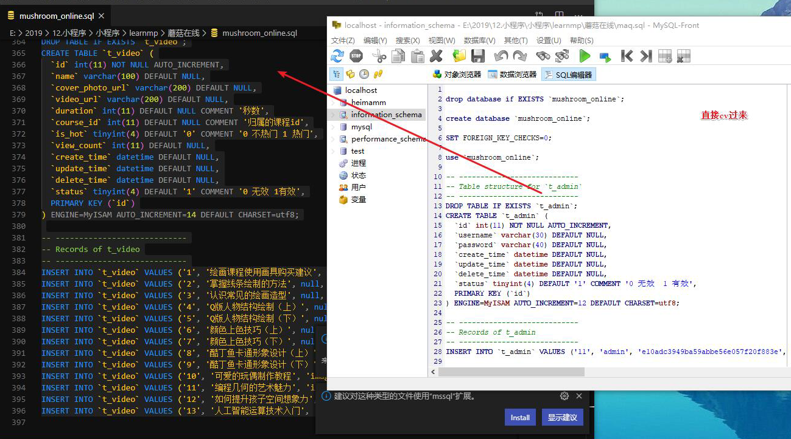
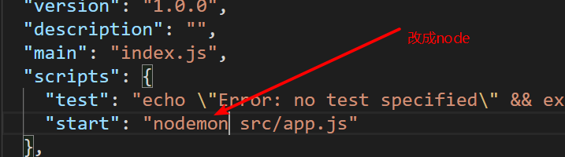

# 微信小程序学习第3天

## 每日反馈

1. 编译模式的编辑和删除


## 回顾

1. 编程式导航

   ```js
   wx.navigateTo({url:'/pages/detail/detail?id=2'})
   ```

2. 事件传参

   ```html
   <view bindtap="tapHandler" data-参数名="参数值">
   tapHandler(event){
   	event.currentTarget.dataset.参数名
   }
   ```

   

3. 事件对象的target和currentTarget

   1. target是事件源
   2. currentTarget是注册事件所在的dom

4. 编译模式的设置

   1. 设置模拟器的默认首页

5. 页面配置


## ES6的模块化

export导出当前模块的功能

```js
export {实参1，实参2}
```

 import导入其他模块的功能

```
import {形参1，形参2} from '某模块'
```

export default默认出当前模块某一个功能

```
export default 值
import 别名 from '某模块'
```


## lol英雄案例-英雄详情页


#### 01.页面分析

1. 英雄列表点击某一个英雄，去到英雄详情页，展示对应的英雄的详情，
2. 页面标题展示`昵称-名字`，页面内容展示英雄图片，名字，昵称，标签和能力，传说

#### 02.跳转到详情页

1. 新建英雄详情页`detail`
2. 点击英雄跳转到英雄详情页
   1. 点击英雄bindtap:toDetail
   2. 编程式导航wx.navigateTo()
3. 传递英雄id
   1. list/index.wxml 设置data-id
   2. list/index.js,导航url传递参数`?id=params.currentTarget.dataset.id`
4. 设置编译模式
   1. 设置启动参数`id=rakan`
   2. detail/index.js, onLoad获取到id

#### 03.静态页面

1. 轮播图
   1. 标签属性如果写了但是不给值，就是true
2. 英雄名字，昵称，标签和能力，说明

#### 04-静态页面-进度条progress组件

[progress](https://developers.weixin.qq.com/miniprogram/dev/component/progress.html)

概念：进度条组件

1. percent：进度条百分比
2. stroke-width：进度条的宽度
3. activeColor：进度条颜色
4. backgroundColor：进度条背景色
5. active: 进度条动画
6. duration进度条速度

```html
<progress percent="10" activeColor="#f2c40c" stroke-width="12" backgroundColor="#363636" active></progress>
```

#### 05-渲染数据

1. 引入lol_details_duowan.js

2. 根据id获取当前英雄的数据

   1. for item of arr, 循环可以中断

   2. 数组的find方法，遍历数组每一项，每一项执行一个函数，如果函数返回true，返回那一项，结束遍历

      ```
      arr.find(v=>{return true or false})
      ```

   3. 数组方法filter: 创建一个新的数组，包含原数组中符合条件的所有项。

3. 英雄的数据渲染到页面上


#### 06-导航区设置

1. 动态设置导航 wx.setNavigationBarTitle({title:''})
2. 设置全局navigationBarTitleText为空，避免wechat一闪而过
3. 导航背景和字体颜色设置到app.json


## 小程序上线

#### 小程序版本

1. 开发版本：开发成员可以预览扫码测试的

2. 体验版本，是上线前，让产品经理、项目经理、客户、测试进行体验的。成员管理里面添加体验成员即可。

3. 线上版本，就是所有人都可以访问到的版本，无须添加成员。

#### 上线步骤：

1. 确定设置了自己的appid
   1. 如果是测试账号，没有上传按钮
   2. 详情->基本信息->APPID修改
2. 开发者工具上传
   1. 代码从本地上传到微信的服务器
3. 小程序后台管理，[地址](https://mp.weixin.qq.com/)
   1. 开发版本可以选为体验版本或者提交审核
   2. 体验版本立马生效
   3. 审核通过后
      1. 会有通知到你的管理员微信账号
   4. 提交发布，就上线成功
   5. 微信搜索小程序名字，打开小程序，分享到微信群

注意点：

	1. 小程序类型设置为：**工具-信息查询**
 	2. 审核时长不好说，有遇到过审核4天才通过的
 	3. 小程序代码最大为2M


## 蘑菇在线项目演示

项目目的

1. 巩固原生小程序语法
2. 标准设计稿，体验企业级前端开发


1. 登录页：微信授权登录
2. 手机登录页：手机号登录
3. 首页：展示推荐轮播图、推荐课程及热门视频
4. 课程：展示课程列表
6. 我的：展示用户信息

## 项目说明

1. 服务器代码：项目需要自己部署后台
2. 设计稿地址 https://lanhuapp.com/url/8NzGu-m2LY3
3. 接口API https://gitee.com/jovenwang/mushroom-online-server/blob/master/api.md
4. 静态页面可参考这个`静态页面`目录
5. 完整项目参考地址：https://gitee.com/jovenwang/mp-mushroom-online-45


## 项目准备

1. 打开设计稿链接，注册蓝湖账号，查看

2. 后台准备
   1. 数据库初始化
   
      1. 安装phpStudy
   
      2. 找到mysql-front打开
   
         
   
      3. 复制`mushroom_online.sql`到sql编辑器，点上边绿色按钮执行。
   
      4. 如果在左侧看到`mushroom_online`说明数据库初始化完成
   
      5. 不要导入！！！
   
         
   
   3. server启动
   
      1. package.json start命令`nodemon`换node
   
      2. npm intstall
   
      3. npm run start
   
      4. 测试后端接口能否调用
         1. http://localhost:3000/api/user/vcode?phone=15361819220
   
            
3. 新建微信小程序项目
   1. 项目名`mp-mushroom-online`
   2. 新建login页面，删除多余页面
   3. app.js和app.wxss内容重置


## 项目git管理

1. 码云新建仓库名`mp-mushroom-online-46`, 

   1. 公开
   2. 不要勾选readme

2. 按提示推送代码, 选择SSH协议

   1. 在微信开发者工具里面的“版本管理”, 就是git图形化工具，不建议使用

   ```bash
   git init
   git add .
   git commit -m "first commit"
   git remote add origin git@gitee.com:jovenwang/mp-mushroom-online-45.git
   git push -u origin master
   ```

3. 新建开发分支`Fea_joven_20200225`

   ```
   git checkout -b Fea_joven_20200225
   //远程创建分支Fea_joven_20200225并push
   git push --set-upstream origin Fea_joven_20200225
   ```

#### 注意点：

1. 需要推送的**微信小程序项目**，并不是mushroom_online_server，后面蘑菇在线，基于这个项目来开发

2. 密钥的位置 ~/.ssh/id_rsa.pub

3. 用户名和密码不对

   

   

## 登录页-页面分析


1. 小程序的未登录跳转到登录
2. 微信授权登录
3. 手机号码登录跳转到手机登录页面


## 自适应单位rpx 

[传送门](https://developers.weixin.qq.com/miniprogram/dev/framework/view/wxss.html#%E5%B0%BA%E5%AF%B8%E5%8D%95%E4%BD%8D)

1. 所有设备的宽度都是750rpx。相当于所有设备的宽度750等分，每一份是1rpx

2. 开发微信小程序时设计师用 iPhone6 作为视觉稿的标准，宽度是750px

   1. **代码里面的元素rpx值=设计稿对应元素的像素值**
   2. 设计的宽度就是750px,iphone6的2倍图

3. 需要随屏幕尺寸变化的元素用rpx, 否则用px

   1. 实际项目里面，哪些元素是固定尺寸的，看实际情况

4. 实际开发中，一般只需要用rpx适配好iphone6就行。

5. 哪些css属性需要自适应

   1. margin
   2. padding
   3. border
   4. font-size
   5. width,height

> iphone6分辨率为1334*750像素, 物理像素/css像素=2(DPR)


## 登录页-静态页面

1. logo展示
2. 文案展示
3. 微信授权按钮展示
4. 手机号码登录和商标展示
5. 点手机号码登录，跳转到手机登录页面
   1. 声明式navigator组件

#### 注意点：

1. **微信开发者工具模拟器切换成iphone6**

2. 蓝湖选择自定义宽度750px

3. 可以使用部分蓝湖代码

   

## 小程序授权

[授权](https://developers.weixin.qq.com/miniprogram/dev/framework/open-ability/authorize.html)

是什么？部分接口需要经过用户授权才能调用，比如说获取用户信息、通讯地址、微信运动步数等等

有什么用？获取用户在微信里面的信息

### 如何使用？

1. [wx.authorize](https://developers.weixin.qq.com/miniprogram/dev/api/open-api/authorize/wx.authorize.html) 发起授权请求`scope.address`
2. 调用授权API `wx.chooseAddress`

#### 授权行为：

1. 第一次发起授权某权限，会弹窗请求权限，用户同意后会调用接口
2. 如果用户已经授权，直接调用
3. 如果用户已经拒绝，直接进入失败。

#### 注意点：

1. 用户信息的授权用`<button open-type="getUserInfo">用户信息</button>`即使用户拒绝也会弹出授权。

6. 学会了基本的授权使用，其他接口随用随查，不需要立马掌握


## 作业：

1. lol英雄案例上线，并转到46期微信群
2. 蘑菇在线的登录页静态页面，提供码云git地址给我
3. 练习小程序授权的基本使用

## 总结