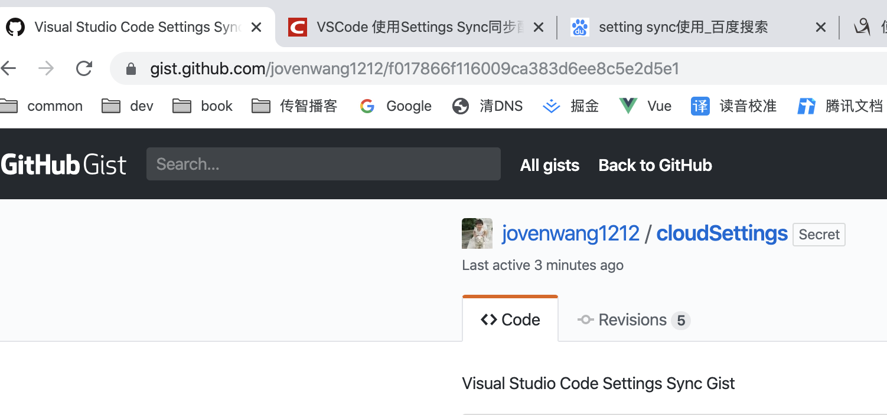

# 微信小程序学习第4天

## 每日反馈

1. 老师讲一下vue里的this.$set和Vue.set的用法和区别呗

   1. 没有区别

   2. ```js
       Vue.set(this.person,'sex','男')
       this.$set(this.person,'sex','男')
      ```

      

## VsCode的Setting Sync插件的使用

回想一下，新iphone从备份中恢复的功能。

同步vscode配置，包括主题、插件、自定义代码片段等

1. 方便换电脑时同步vscode配置
2. 上班第一天装环境就需要配置vscode

#### 使用步骤:

[传送门](https://www.cnblogs.com/WattWang/archive/2019/08/25/11382022.html)

1.  在VS Code中安装Settings sync插件 
2.  新建github token
   1. 点击自己github的头像，选择Settings 
   2.  进入Develper Setting的 Personal access tokens ，生成一个新的token 
   3.  勾选gists 
3.  在VS Code中进行设置 
   1.  同时按下shift+alt+u，显示设置界面
   2.  点击LOGIN WITH GITHUB，授权登录github,并关闭页面
   3. 选择已经存在的gist，下载配置或者创建一个新的gist上传
4. 在其他电脑上同步这个配置
   1. 从自己的github上同步配置
   2. 按下Ctrl+Shift+P，输入sync，选择下载配置
   3. 登录后，然后选择自己github中已经存在的配置。

#### 注意点：

1. 上传的位置是，github, your gists, 找到其中一条cloudSettings，url就是gist id


## git撤销

1. 工作区撤销(本地改动，就是工作区)
   1. git restore .
   2. git checkout -- .
   3. vscode 放弃所有更改
2. 暂存区撤销（git add .）
   1. git restore --staged .
   2. git reset HEAD .
   3. vscode取消暂存所有更改，或者暂存-
3. 本地仓库撤销 (git commit)
   1. git  reset --hard  commit_id
4. 远程仓库撤销 (git push)
   1. 本地仓库撤销
   2. git push -f


## 移动端自适应方案-rem+flexible.js

[flexible.js](https://github.com/amfe/lib-flexible)

同一个页面在不同尺寸的设备上，能显示正确，适配。有时候也说响应式布局。

#### rem的概念

1. 当使用 rem 单位，他们转化为像素大小取决于页根元素（html标签）的字体大小，即 html 元素的字体大小。 根元素字体大小乘以你 rem 值
2. 根元素的字体大小 16px，10rem 将等同于 160px，即 10 x 16 = 160

#### 原理

1. flexible.js根据不同屏幕宽度和dpr给html标签设置一个合适的font-size
2. 样式里面我们使用rem，就可以根据不同的font-size得到对应高度,,宽度,margin,padding的值，于是就自适应了。

#### 计算过程

iphone6，font-size:37.5px, 1rem=37.5px, 100px=100/37.5=2.67rem

建议用css预处理器

1. 200/2/37.5rem=200*@p, @p=1/75rem

   ```less
   @p:1/75rem;
   img{
    width:200*@p;
    height:284*@p;
   }
   ```


flexible.js和media query的对比

1. flexible.js是连续的

> html里面默认字体大小是16px,小程序里面也是16px;


## scroll-view组件启用flex布局

1. 添加`enable-flex`属性
2. css声明display:flex， white-space: nowrap;（文本不换行）


### 豆瓣电影-首页-练习

#### 06.评分

1. 完成星星的静态结构
   1. 规则
      1. 分数0             暂无评分
      2. 分数0~2    	1星 + 4灰星
      3. 分数:2~4        2星 + 3灰星
      4. 分数:4~6       3星 + 2灰星
      5. 分数:6~8        4星 + 1灰星
      6. 分数:>8          5星 + 0灰星
2. 根据rating.average,也就是评分来展示星星

> mpvue的结构里面不能使用方法。不能使用过滤器
>

#### 07.top250电影数据渲染

2. copy结构
2. copy数据请求与渲染

#### 08.影院热映和top250逻辑优化

1. 声明categoryList

   ```js
   categoryList: [
       {
           name: '影院热映',
           param: 'in_theaters',
           list: []
       },
       {
           name: 'top250',
           param: 'top250',
           list: []
       }
   ]
   ```

2. 重构公共请求函数getMovieList

3. 渲染影院热映和top250列表


#### 09.豆瓣电影-更多页面


#### 01.基本逻辑&请求数据

1. 添加新的更多页面
   1. pages下copy一份改名more，删掉无用部分
   2. app.json添加页面路径`pages/more/main`
2. 首页`更多`添加点击事件，跳转更多页面
   1. @click:toMore(param)
   2. 跳转wx.navigateTo()
3. more页面onLoad获取参数，根据type发请求
   1. copy首页`getMovieList`
   2. onLoad里面，发请求

#### 02.静态页面

1. copy首页的结构和样式，改改。

2. 跳转到更多页面


#### 03.更多页面标题设置

2. 在more/index.vue里面onLoad钩子函数里里获取参数，设置标题
3. app.json里面的标题设置空


## mpvue坑点

1. 新增页面需要重新npm run start
2. 多层嵌套v-for需要取不同索引别名
4. 过滤器无法使用
5. 指令不支持方法，常见的{{}}里面不支持方法
6. 指令里面不支持字符串的模板语法


## 豆瓣电影-详情页面

1. 添加detail页面

   1. app.json添加`pages/detail/main`
   2. pages copy文件夹，重命名为detail
2. 首页和更多页面，点击其中一个电影，跳转到详情

   1. @click:toDetail使用wx.navigateTo
3. 默认展示前面部分文案，末尾显示"展开"; 点击"展开"显示完整文案，末尾显示“收起”，点击收起显示前面部分文案。

   1. 添加detail页面，和入口

      1. app.json添加`pages/detail/main`
      2. pages copy文件夹，重命名为detail

   2. more页面，点击电影跳转到详情页面

      1. @click:toDetail使用wx.navigateTo

   3. 详情页面上展示默认文案和收起，点收起显示部分文案和展开

      1. 收起和展开的点击事件@click:isFold=isFold
      2. isFold控制方案长短和收起与展开的显示
      3. 默认文案是收起的
      4. 优化：部分文案可以在created方法里面初始化好，不必每次在事件处理方法里面截取。


## *Tab栏配置

[传送门](https://developers.weixin.qq.com/miniprogram/dev/reference/configuration/app.html#tabBar)

app.json的tabBar属性配置Tab栏，点击不同tab显示对应的页面

使用方法：在app.json里面配置

```js
 "tabBar": {
     // tab未选中时的文字颜色
     "color": "#0000ff",
      // tab选中时的文字颜色
      "selectedColor":"#eb4450",
      "list": [
        {
          // tab选中时显示的页面路径
          "pagePath": "pages/index/index",
          // tab的文案
          "text": "首页"，
            iconPath  ，
            selectedIconPath
            
        }
     }
}
```


## 优购Tab栏-练习


1. 新建四个页面home,category,cart,me
2. copy文档tabBar配置，修改四个tab的文案
3. 设置selectedColor:  tab 上的文字选中时的颜色 
4. 设置iconPath  没选中时图片路径 
5. 设置selectedIconPath 选中时图片路径


## Tab栏切换

1. 只有配置在tabBar中的页面才有tab栏
2. 页面跳转
   1. 跳转到tab页面用`switchTab`
   2. 跳转到非tab页面用`navigateTo`

​	

## 组件Input

[传送门](https://developers.weixin.qq.com/miniprogram/dev/component/input.html)

基本概念：输入框

用法基本和html input标签一样

特点：

1. 默认没有边框
2. type键盘类型
   1. 默认类型是text
   2. number数字键盘
   3. idcard有一个X键
3. confirm-type 键盘右下角按钮的文案
   1. search 搜索

如何获取输入框中的内容

1. 添加input事件 bindinput
2. 事件处理方法里面，**event.detail.value**即是用户的输入
3. 小程序没有v-model

确认事件 bindconfirm

> 微信开发者工具不稳定，无法触发bindinput，只是调试基础库2.9.3


## 优购案例

#### 01-案例分析&项目资料

1. 案例分析
   1. 优购小程序是商城，购物的逻辑可以参考京东App和小米lite小程序
   2. 基本流程是这样的，点商品去到商品详情，添加购物车，结算付款，查看订单
2. 项目资料
   1. 设计稿
   2. 图标文件
   3. 接口文档

#### 02-准备mpvue项目

1. 创建mpvue项目`mpvue-yougou42`，运行项目

2. 微信开发者工具导入项目

3. 安装less

   ```bash
   npm install --save-dev less less-loader
   ```

3. 项目结构改造
   1. App.vue保留基本结构，并去掉<template>
   2. pages文件夹copy一份命令为home,修改index.vue为基本结构
   3. app.json删掉tabBar的配置，pages属性添加home页面路径，删掉其它
   4. static目录下清空

#### 03-提交github

1. github上新建仓库
2. git add
3. git push

#### 04- tarBar设置

1. 创建四个页面home,cart,category,me
2. copy tabBar配置

#### 注意点

tabbar里面iconpath和selectedIconPath图片建议写绝对路径 ，如果是相对的路径的，按源码目录来，图片会显示错误，只能按dist/wx目录来写，但是对阅读者来说难以理解。所以建议写绝对路径


## Loading效果

[showLoading](https://developers.weixin.qq.com/miniprogram/dev/api/ui/interaction/wx.showLoading.html)

1. wx.showLoading与wx.hideLoading是显示与隐藏loading提示框
   1. title提示的内容
   2. mask loading中是否能操作mask以下
2. wx.showNavigationBarLoading与wx.hideNavigationBarLoading  在当前页面显示导航条加载动画 


## 优购案例-首页


#### 01.页面分析

1. 入口页面，默认显示首页
2. 展示轮播图，分类及楼层。功能上简化了，点击图片均不会有跳转。
3. 点击搜索去到搜索页面

#### 02.静态页面

1. 设置标题

```json
{
  "navigationBarTitleText": "优购",
  "navigationBarBackgroundColor": "#eb4450",
  "navigationBarTextStyle": "white"
}
```

2. 头部搜索

   ​	1. icon

3. 轮播图
   1. swiper组件
   2. circular="true"无限轮播

4. 分类导航区域
   
1. display:flex展示四张图片
   
5. 楼层区域


## 优购商城码云代码

项目：git@gitee.com:jovenwang/mpvue-yougou42.git

分支：Fea_joven_20200202

