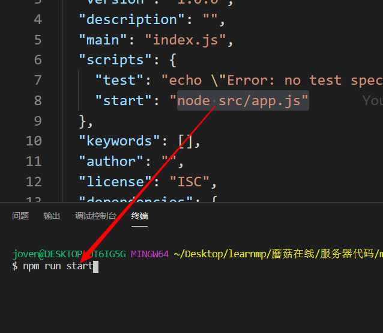
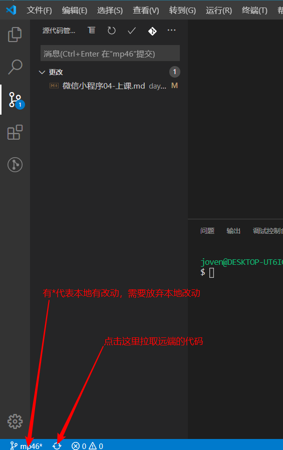
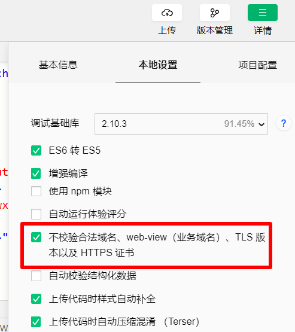
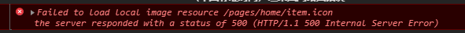
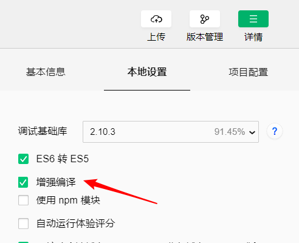
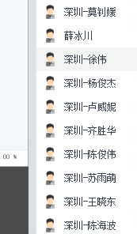

# 微信小程序学习第4天

## 每日反馈

1. 还可以, 今天填反馈了
2. 老师做的笔记看的时候有点不清楚
   1. 私聊我具体是哪里
   2. 对照着视频看看
   3. 可以主动问我哪里不懂？
   4. 大家给我截图的时候，尽量截大点哈。
3. 希望wuli涛不要再秀我了,教教我学习吧
   1. 黄涛挺积极的，赞


## 回顾

1. 自适应单位rpx

   1. 我们之前用px在不同尺寸的设备上，不能适应。但是rpx能让页面自适应
   2. rpx其实就是把所有设备宽度750等分，每一份就是1rpx。
   3. 工作中，设计稿是iphone6的2倍图，宽度就是750px.
   4. 代码里面写的rpx值就是===设计稿量的值

2. 项目git管理

   1. 在码云上新建一下仓库
   2. 照着它的初始化仓库的提示，然后把我们本地项目推到远端
      1. git init  初始化本地仓库
      2. git add . 把所有文件加到暂存区
      3. git commit -m 'xx' 提交
      4. git add remote ... 添加远端仓库地址
      5. git push -u origin master 在远端创建master分支，并推送本地代码去到远端master分支

3. 服务器启动

   1. 数据库的初始化，需要打开phpStudy，同时确保mysql是启动

   2. sql文件全部copy到sql编辑器，然后执行

   3. 拉取learnmp项目

   4. `learnmp\蘑菇在线\服务器代码\mushroom-online-server` 执行npm install, 然后执行npm run start

   5. 在node.js项目下，package.json里面scripts属性里面key值，就是命令，可以在项目目录下执行npm run key值

      1. 在一个node.js项目中，具体npm run xx，xx是什么去package.json里面找一下就行。

      

   

##  作业

1. https://gitee.com/zheshiyigejimodetian/lol.git
2. https://gitee.com/jovenwang/homework/tree/master/lol-dome/pages/detail
   1. 结构中用到的变量需要在data属性中声明，**没有用到的，不必声明！！！**
      1. 如果想声明全局变量，可以放到文件的头部去声明
   2. 不要改变变量的类型
3. https://gitee.com/jovenwang/homework/blob/master/xbc/pages/lol-home/lol-home.wxml
   1. 好！
4. https://gitee.com/nwy666/mushroom/tree/mushroom-dev1/
5. https://gitee.com/szj111/mushroom/tree/fea-szj-4.2
6. https://gitee.com/qishenghua/moguzaixain/tree/fea_qi_20200402/
7. https://gitee.com/xueBingChuan/mogu.git
8. https://gitee.com/lv17786346888/mushroom-lf/tree/dev_lf/
   1. 首页搜索区域是点击跳转的，底部是tab栏
   2. 页面很多区域是图片，这个可以由后端接口看得出来
   3. scroll-view的横向滚动问题
   4. **代码相关的目录不要使用中文**


## 小程序发布

1. 如果审核通过，需要点击提交发布，然后微信里面搜索你的小程序名字，就可以找到并打开的你的小程序

2. 如果审核被拒绝，看一下它的拒绝理由


## 拉取learnmp



## 首页-页面分析


1. 入口：小程序打开时展示的第一个页面; 底部tab栏点击首页，展示首页页面
2. 页面展示，搜索区域，轮播图，推荐课程，热门视频
   1. 搜索区域不可以输入，点击跳转
   2. 推荐课程横向滚动的


## 首页-静态页面

#### 提示：

1. 在蓝湖设计稿里面找到首页，自定宽度750px，那么量的是多少，代码里面就写多少rpx值
2. 微信开发者工具里面模拟器要选择iphone6
3. 在蓝湖里面有部分代码我们是可以参考的

#### 步骤：

1. 搜索区域

   1. 下载二倍图
   2. 对于文字可以双击复制
   3. font-family不需要，安卓和ios上的默认字体是不一样的。即使同时有设计个性化字体也是全局的。
   4. 如果能page设置padding或者margin的话，就会让页面宽度超出屏幕外，不能用。方案用一个container包裹页面内容

2. 轮播图

3. 推荐课程

   1. 在蓝湖上有图片，如果点击没有下载当前切图的按钮，说明设计师没有做切图处理。得找设计师

   2.  在蓝湖里面有一个切图资源的。

   3. 直接导入了整个assets目录

   4. 横向滚动

      ```css
      .scroll-view_H{
        white-space: nowrap;
      }
      .scroll-view-item_H{
        display: inline-block;
      }
      
      /* 另外一种方式*/
      flex布局需要enable-flex属性，需要限制scroll-view的高度，不然就会超出图片的高度
      ```

4. 热门视频

#### 注意点：

1. page如果想设置margin,padding都不行。会导致页面宽度超出
   1. 解决方案总是在页面上添加根标签，然后根标签上设置样式。
2. scroll-view横向滚动，参看小程序文档里面wxss


## 异步请求wx.request

[传送门](https://developers.weixin.qq.com/miniprogram/dev/api/network/request/wx.request.html)

> ajax是规范，axios是实现, jQuery.ajax也是ajax的实现。都是基于`XMLHttpRequest`的封装

wx.request概念就是，在微信小程序发ajax请求的

原理：也是基于小黄人对象的封装

使用方法：和jQuery.ajax API差不多

1. header的content-type默认值是application/json，视具体接口可能需要调整
 	2. wx.request并不返回Promise对象，如果希望返回Promise对象的话，需要自己封装

> 豆瓣API :   https://api.douban.com/v2/movie/in_theaters?apikey=0df993c66c0c636e29ecbb5344252a4a

```js
wx.request({
      url: 'https://api.douban.com/v2/movie/in_theaters?apikey=0df993c66c0c636e29ecbb5344252a4a',
    data:{},//get或者post请求的传参
      header:{
        'content-type': 'application/x-www-form-urlencoded'
      },
    method:'GET', //get或者post
    dataType:'json', //尝试把后端的返回的数据转成JSON
    // 成功的回调
      success(res){
        console.log(res.data.subjects)
      }
    })
```


#### 提示：

1. 在微信小序里面只能由wx.request使用小黄人，其他axios框架无法使用小黄人，也就是说微信小程序里面无法使用axios
2. 请求的参数，尽量少设置，如果报错了，再添加
3. 工作中，涉及到联调，如果项目从0到1，可能就比较需要时间，你需要和后端一起联调。如果项目不是从0到1的话，看其他页面怎么调，copy就行。


## 设置合法域名

[传送门](https://developers.weixin.qq.com/miniprogram/dev/framework/ability/network.html)

在微信小程序里面，请求后端的域名需要在小程序后台配置

#### 解决方案：

1. 配置方法：服务器域名请在 「小程序后台-开发-开发设置-服务器域名」 中进行配置，需要在微信开发者工具里面切到详情，项目配置，以更新服务器域名

2. 临时方案：微信开发者工具，详情->本地设置->不检验合法域名; 手机上可以打开调试

   

#### 注意点：

1. 实际工作中，应该总是直接去小程序后台添加合法域名


## 首页-渲染页面-轮播图

1. 轮播图请求和渲染
   1. 接口
      1. url http://localhost:3000/api/home/swipers
      2. 方法是get
   2. 尽量发请求 onLoad
      1. 请求方法 getSwiperList
   3. 在getSwiperList里面，当status===0时，设置swiperList = message
      1. 注意this绑定的问题
      2. 微信小程序设置data属性的语法
   4. 渲染 wx:for

#### 注意点

1. 保证phpstudy启动的，并且启动了mysql，mysql是绿色的

2. 也需要确认后台服务，npm run start

   1. 如果server启动中，你关掉了命令行的话，那么启动的server并不会关闭。
      1. 如果你你再次npm run start，就会报端口3000被占用，表示启动中

3. 在wx.request的回调函数里面，建议总是使用箭头函数。使用function改变this绑定

4. **本地server localhost是无法添加为服务器域名，所以只能在微信开发者工具中打开”不检查合法域名“**

5. 我们这个项目的服务器是本地的，phpstudy我们只是用了数据库而已，还是需要启动server

   1. learnmp\蘑菇在线\服务器代码\mushroom-online-server` 执行npm install, 然后执行npm run start

6. 数据库的问题

   1. npm run start这个命令行窗口上可以看到一些错误，如果有mysql的话，就应该怀疑是数据库的问题（了解）
   2. 最终定位到数据库的表少了，重新copy所有数据库的内容，重新执行

7. 图片路径的问题

   

   1. 如果图片找不到，会报500的错误
   2. 比如这里，就是没有给{{item.icon}}

8. this绑定的问题

   1. success()和success:function前者是后者的简写，都会改变this绑定
   2. 遇到回调函数，直接使用箭头函数

9. 当你检查你的请求逻辑是OK，**但是在代码拿不到相应的数据，就应该习惯地看network，找一下你的请求，看一下，看请求URL, 方法，传参，返回的数据**

   1. learnmp不是最新的代码的话，首页的请求是需要登录态的

#### 要求

1. 各组长检查一下，确保http://localhost:3000/api/home/swipers都可以调通


## 首页-渲染页面-课程和视频

1. 发请求，渲染数据
   1. http://localhost:3000/api/home/course
   2. http://localhost:3000/api/home/video


## 复习Promise

概念：管理异步操作的

**作用呢？**

1. 管理异步操作

   1. Promise.all 里面的异步操作都完成后，执行
   2. Promise.race 有一个异步操作先完后，就执行

   ```js
   // 使用promise的场景
   // A,B两个异步操作完成后，执行C。如果写回调就很难处理
   
   //默认情况下，A,B都没有完成
   let isADone = false
   let isBDone = false
   
   A({
       success(){
           isAdone = true
           if(isBdone){
               doC()
           }
           
       }
   })
   
   B({
       success(){
           //B请求返回时，无法确定A也完成
           isBdone = true
           if(isAdone){
               doC()
           }
       }
   })
   
   ```

2. 回调地狱

**使用**

```js
// promise的使用
let p = new Promise((resolve,reject)=>{
  setTimeout(()=>{
    // console.log('这是一个寂寞的天')
    // 成功时做的事情
    resolve('这是一个寂寞的天')
  },1000)
})

//这里才开始执行
// then里面res就是resolve传的实参
p.then(res=>{
  console.log(res)
})
```


## 首页-wx.request的封装

1. 在utils/request.js封装wx.request，对外暴露request方法

2. 直接把home.js里面的某不个请求逻辑直接放在方法体里面

3. 创建一个Promise对象，**并且返回**，构造函数里面放请求的逻辑，当status===0, resolve(message)

   1. 不要直接resolve(res)，不然在页面处理返回数据时，需要res.data.message

4. 在home.js引入request.js, 然后用request方法代替之前的逻辑

5. 提取基地址

6. async和await

   1. await修饰一个promise对象，可以获取promise对象的.then里面数据

   2. 使用await的function，必须有async修饰

   3. 需要增强编译的

      

   

#### 提示

1. 如果想在手机上运行蘑菇在线的话，可能不行。
   1. 因为手机上无法访问http://localhost:3000
   2. 解决方案(了解)
      1. 让手机和电脑处于同一局域网
      2. 然后把地址改为http://你电脑的ip:3000
      3. 图片显示还是有问题

## 总结


## 作业

1. 各组长检查一下，确保http://localhost:3000/api/home/swipers都可以调通

2. 小程序发布成功，分享到微信群

3. 需要完成首页+包括wx.request封装

   

