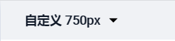

# 微信小程序学习第4天

## 每日反馈&作业

1. 冲冲冲, 加油

2. images文件夹不要放在pages里面

   1. [传送门](https://gitee.com/blurboy/mp-mushroom-online-45/tree/wx_mushroom/pages/login)

3. button有一些样式需要重置

   1. [传送门](https://gitee.com/blurboy/mp-mushroom-online-45/blob/wx_mushroom/pages/login/login.wxss)

   2. 以下代码可以解决问题

      ```
      .wx-login-btn:not([size='mini']) {
        width: 568rpx;
      }
      ```

4. 写less注册嵌套层级不要超过4层

   1. [传送门](https://gitee.com/chenzhipeng2131/zp-mushroom-online/blob/zp_mushroom_20200225/pages/login/login.less)

5. 注释精简，好的命名胜过注释。
   1. 其中一种规范
      1. id用驼峰`userName`，class用中划线 `user-name`
      2. id给js用, class给css用
   2. 作业链接
      1. [传送门](https://gitee.com/blurboy/mp-mushroom-online-45/blob/wx_mushroom/pages/login/login.wxml)
      2. [传送门](https://gitee.com/yang_chun_he/mushroom/blob/chun_he_0225/pages/login/login.wxml)
      3. [传送门](https://gitee.com/liaojolun/my-mp-mushroom-online/blob/Fea_liaojolun_20200225/pages/login/login.wxml)
      4. [传送门](https://gitee.com/qingyo/mushroom-online-server/blob/login/pages/login/login.wxml)
      5. [传送门](https://gitee.com/qingyo/mushroom-online-server/blob/login/pages/login/login.wxml)

6. 接下来每天都会抽查作业的


## 蘑菇在线项目地址：

https://gitee.com/jovenwang/mp-mushroom-online-45  分支:Fea_joven_20200225


## 回顾

1. 自适应单位rpx，**所有设备**的宽度都是750rpx.

   1. 设计稿以iphone6为标准，宽度是750rpx

   2. 代码里面的元素rpx值就是设计稿量得的元素像素值

   3. 在蓝湖里面需要设置，自定义宽度750px

      
   
2. 登录页的按钮之所以不用button，是因为button组件上有很多样式需要重置

   1. 或者
   
      ```
      .wx-login-btn:not([size='mini']) {
        width: 568rpx;
      }
      ```
   
      


## image组件的mode属性

 图片裁剪、缩放的模式 ,类似于background-size:cover，contain

​	[传送门](https://developers.weixin.qq.com/miniprogram/dev/component/image.html)

1. 默认是scaleToFill:短边拉伸
2. aspectFit：保持宽高比，长边显示出来
3. aspectFill:保持宽高比，短边显示，长边截取
4. widthFix:保持宽高比，宽度不变，高度自动变化

lol-game案例图片显示适合用什么?

> 如果需要显示的图片和image的宽度和高度比例是一致的话，无论什么模式效果是一样的。


## 小程序授权

[授权](https://developers.weixin.qq.com/miniprogram/dev/framework/open-ability/authorize.html)

是什么？部分接口需要经过用户授权才能调用，比如说获取用户信息、通讯地址、微信运动步数等等

有什么用？获取用户在微信里面的信息

### 如何使用？

1. [wx.authorize](https://developers.weixin.qq.com/miniprogram/dev/api/open-api/authorize/wx.authorize.html) 发起授权请求`scope.address`
2. 调用授权API `wx.chooseAddress`

#### 授权行为：

1. 第一次发起授权某权限，会弹窗请求权限，用户同意后会调用接口
2. 如果用户已经授权，直接调用
3. 如果用户已经拒绝，直接进入失败，如何处理？

#### 注意点：

1. 用户信息的授权用`<button open-type="getUserInfo">用户信息</button>`即使用户拒绝也会弹出授权。
2. 学会了基本的授权使用，其他接口随用随查，不需要立马掌握
3. 在微信开发者工具的模拟器，可以清除授权状态
4. 在微信里面，删除小程序可以清除授权状态
5. 在微信里面，点...，然后设置，可以查看授权的状态


## 登录页-用户信息授权

1. 点击`微信授权登录`按钮，弹出授权窗口，获取授权信息
   1. 把wx-login-btn的view改成button
      1. 修改样式
      
         ```
         .wx-login-btn:not([size='mini']) {
           width: 568rpx;
         }
         ```
   2. 设置button属性
      1. open-type="getUserInfo"
      2. bindgetuserinfo="wxLogin"
      3. wxLogin里面获取到用户信息
   3. 弹窗用户拒绝处理，提示`登录失败，请授权`


## 小程序登录

[传送门](https://developers.weixin.qq.com/miniprogram/dev/framework/open-ability/login.html)

第三方登录：第三方网站授权登录

其实就是用微信账号登陆小程序

步骤：

1. 获取用户信息, 如果没有授权过，会在底部弹出授权窗口的

   ```html
   <button open-type="getUserInfo"
               bindgetuserinfo="getuserinfo">点我登录</button>
   ```

2. wx.login()获取到code

3. 调后端接口获取token

   1. /user/wxlogin


## Git使用复习

#### 基本使用

1. git克隆

   1. 配合ssh key效果更好

   ```
   git clone git远端仓库地址
   ```

2. git初始化远端仓库
   1. 新建远程仓库
   2. 参考提示推送到远端
      1. git add . 添加所有改动到本地暂存区
      2. git commit -m 'xx' 提交到本地仓库
      3. git remote... 添加远程仓库Url
      4. git push -u origin master 在远程仓库master分支，并推送本地仓库master到远程master分支
         1. 如果不记得这个，直接敲git push，它会提示你
3. 日常开发，一般一个需求拉一个分支。没有冲突时的操作一般是：
   1. git add .
   2. git commit -m 'xx'
   3. git push


#### git储藏

相当于是游戏存档

注意：git当前分支有改动时，尽量不要切分支，可能会丢失代码

```
git stash -u
git stash pop
```

#### git冲突的解决

1. 看提示

#### git的后悔药

1. 工作区撤销(本地改动，就是工作区)
   1. git restore .
   2. git checkout -- .
2. 暂存区撤销（git add .）
   1. git restore --staged .
   2. git reset HEAD .
3. 本地仓库撤销 (git commit)
   1. git  reset --hard  commit_id
4. 远程仓库撤销 (git push)
   1. 本地仓库撤销
   2. git push -f

## vscode与git

1. 加到暂存区
2. 提交
3. 推送
4. 撤消
5. 文件修改对比
6. 好用的插件
   1. gitLens 查看某一行代码是谁写的
   2. git history，查看分支或者某个文件的历史改动


## 异步请求wx.request

[传送门](https://developers.weixin.qq.com/miniprogram/dev/api/network/request/wx.request.html)

基本XMLHttpRequest封装的

> 豆瓣API :   https://api.douban.com/v2/movie/in_theaters?apikey=0df993c66c0c636e29ecbb5344252a4a

使用方法基本和$.ajax一样

```js
wx.request({
    url: 'https://api.douban.com/v2/movie/in_theaters',
    method: 'GET',
    data: {
        apikey: '0df993c66c0c636e29ecbb5344252a4a'
    },
    // 看实际情况是否需要写content-type
    header: {
        'Content-Type': 'application/x-www-form-urlencoded'
    },
    dataType: 'json',
    success: res => {
        console.log(res)
    }
})
```


看实际情况是否需要写content-type

```js
header: {
  'Content-Type': 'application/x-www-form-urlencoded' // 默认值
}
```


## 设置合法域名

[传送门](https://developers.weixin.qq.com/miniprogram/dev/framework/ability/network.html)

小程序里面请求的后端服务器，需要在小程序后台注册域名

服务器域名请在 「小程序后台-开发-开发设置-服务器域名」 中进行配置


#### 注意点

1. 手机扫码默认也会检查安全域名，...->开发调试->打开调试，就不会检查安全域名了
2. 微信小程序在开发的时候，可以通过勾选不检验合法域名来解决域名安全的问题，但是上线前一定需要配置合法域名。


## 登录页-用户登录

1. 点击`微信授权登录`按钮，弹出授权窗口，用户点确定，登录后提示`登录成功`
   1. wxLogin获取用户信息，再获取用户登录凭证，调接口登录
      1. 用户登录凭证 wx.login()
      2. 登录接口
         1. url :/user/wxlogin
         2. 方法 POST
         3. data:{code,nickname,avatar}
      3. 登录成功
         1. 提示微信登录成功
         2. 跳转到首页

## 总结


## 作业