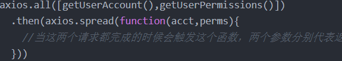
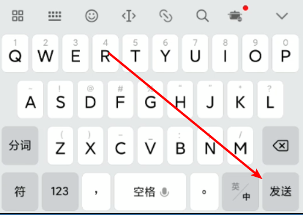
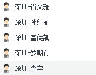
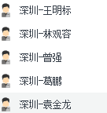

# 微信小程序学习第5天

## 每日反馈

1. 小程序发送请求基本不会,但是我会认真看视频的
2. Hi, 王老师. 你好. 我的疑问是: 小程序的 wx.login 为什么要在获得用户授权的情况下才能登录, 是因为登录接口要使用到授权返回的数据吗? 那可以单纯给一个按钮然后注册事件直接调用 wx.login 吗? 有一个好消息是, 我慢慢看得懂官方文档了.
   1. 这个具体看登录接口是否需要用户信息
3. 获取用户信息bindgetuserinfo的事件处理方法直接可获取到用户信息，不必用wx.getUserInfo
   1. [传送门](https://gitee.com/whitey/mushroom/blob/login/pages/login/login.js)

4. 抽取了单独的请求接口request文件

   1. [传送门](https://gitee.com/jiaowoxiaobala/mushroom_online/blob/master/pages/login/login.js)

5. 完成git冲突解决

   1. [传送门](https://gitee.com/whitey/mushroom/commit/77fb6b0bc119bf6a0c01c0410d0f5cc2e79dd402)
   2. [传送门](https://gitee.com/yueyue0422/gitpractic/commit/5f6de16933848aedcd3bf7f6c7c7e36e88bf6d9f)

6. 都没有建开发分支

   1. [传送门](https://gitee.com/mygoes/wechat_app__mushroom_street/blob/master/pages/login/login.js)

7. 以后提交作业时，直接发带分支的路径哈

8. git stash在暂存区和工作区生效

9. 先配置，再启动服务器

10. 手机预览扫码访问，需要和电脑在同一局域网，localhost改成ip。这个不作要求。

    

## 回顾

1. 小程序授权

   1. 基本使用

      1. [wx.authorize](https://developers.weixin.qq.com/miniprogram/dev/api/open-api/authorize/wx.authorize.html) 发起授权，会出授权弹窗
      2. 调用对应的API

   2. 用户信息

      1. getUserInfo里面可以直接获取到用户信息，无须用wx.getUserInfo

      ```html
      <button open-type="getUserInfo" bindgetuserinfo="getUserInfo"/>
      ```

2. 小程序登录，即小程序用微信账号登陆

   1. wx.login获取微信账号的唯一标识
   2. 可能需要获取用户授权信息(实际情况，都是需要的)
   3. 调接口登陆

3. wx.request基于xhr的封装，可理解成jQuery.ajax

   ```
   wx.request({
   	url,
   	method,
   	data
   	success(){
   	
   	}
   })
   ```

   


## 数据存储

[传送门](https://developers.weixin.qq.com/miniprogram/dev/api/storage/wx.setStorageSync.html)

1. 浏览器的本地存储

   1. localStorage（关闭浏览器后还存在）
   2. sessionStorage(关闭浏览器后不存在)
   3. 区别，使用，大小限制，存储类型？？？
      1. setItem(key,string),removeItem,getItem,clear
      2. 存储类型只能是字符串
      3. 5M

2. 小程序

   1. wx.setStorage,wx.getStorage....

   #### 01.存数据

   建议用setStorageSync

   本质是存数据是异步的，API上有同步和异步之分

   ```js
   // 异步存储
   wx.setStorage({
      key: 'name',
      data: 'Joven',
     success:function(){
       // 这里存储成功
     }
   })
   // 建议用同步存储
    wx.setStorageSync('age', 28)
   ```

> AJAX的A是Async
>
> fs.readFileSync


#### 02.取数据

建议用getStorageSync

```js
// 异步取数据
wx.getStorage({
  key: 'name',
  success: function(res) {
    console.log(res)
  }
})
// 建议用：同步取数据
console.log(wx.getStorageSync('age'))
```

> getStorageInfo是用来获取storage所有的信息的

#### 03.清除数据

1. clearStorageSync 清除所有数据

2. 删除指定项数据

   ```js
   // 异步删除指定key的数据
   wx.removeStorage({
     key: 'name',
     success: function(res) {
       console.log(res)
     },
   })
   // 同步删除指定key的数据
   wx.removeStorageSync('name')
   ```


#### 04.总结

1. 小程序的storage其实是对手机存储系统的文件读取，所以是异步的

2. 小程序的存储可以是复杂类型，JSON.parse能够解析的

3. 单个 key 允许存储的最大数据长度为 1MB，所有数据存储上限为 10MB 

   >内存，速度快，断电会丢失存储，价格贵，容量偏小
   >
   >硬盘，速度偏慢，断电不会丢失，价格相对便宜，容量大。
   >
   >SSD在内存和硬盘之间
   >
   >电脑真正执行程序是CPU
   >
   >打开视频时，把视频数据从硬盘传给内存，由内存和CPU通信
   >
   >一般我们认为内存和CPU通信是同步的


## 登录页-存储token

1. 登录成功，存储token

2. 存储方法setStorageSync
3. key值 token


## 复习Promise

1. 回顾promise的学习

   1. 是什么？ 

      1. 表示一个异步操作，一个数组存了一些异步操作

   2. 有什么用

      1. 管理异步操作
      2. 解决回调地狱问题，让代码更优雅。不用写回调函数，.then

   3. 如何使用

      1. 创建对象

         ```js
         var p = new Promise((resolve,reject)=>{
           // 逻辑代码
           if(){
              resolve(data)
           }else{
             reject(err)
           }
         })
         ```

      2. 使用promise对象

         ```js
         p.then(res=>{
           console.log(res)
         }).catch(res=>{
           console.log(res)
         })
         ```


####  Promise主要用管理异步对象的

1. Promise.all 所有的异步操作都完成，才成功
2. Promise.race 他们执行顺序是按照谁快 谁先输出

```js
//A和B两个异步操作完后，做C

let isA = false
let isB = false

a({
  success(){
    isA = true;
    if(isA &&isB){
      doC()
    }
  }
})

b({
  success(){
    isB = true;
    if(isA &&isB){
      doC()
    }
  }
})

//Promise.all([A,B]).then(A和B都完成)
```




## 登录页-wx.request的封装

1. 初步封装
   1. 新建utils/request.js文件
   2. request.js中声明并exports request方法
   3. request方法逻辑和登录页wx.reqest逻辑一致
   4. login/index.js中引入request.js并使用
3. 请求前开启loading，请求后关闭loading
3. 提取基地址
4. request方法中使用解构并赋默认值
5. 成功返回的数据，判断status===0, 再resolve数据
6. 使用async和await

   1. await作用是返回promise对象then里面的数据
   2. async作用有await的代码的function必须用async修饰
   3. **需要微信开发者工具里面`增强编译`**

7. 把request注册为全局(可选)

   1. app.js引入request.js，然后赋值给globalData

   2. 在页面里面

      ```js
      var appInstance = getApp()
      let request = appInstance.globalData.request
      ```

      

#### 练习说明：

1. 项目地址不包括在每天的资料里面
   1. https://gitee.com/jovenwang/mp-mushroom-online-45/tree/Fea_joven_20200225/

1. 无法登陆
    1. console里面有报错，红色错误
        1. 按错误定位到哪一行，解决相关问题
    2. 界面无任何反应
        1. 检查network, 找到你的请求，比如'wxlogin',点击
            1. header里面检查request参数，重点检查url, method, request payload，header里面的token等
                1. 如果传参有问题，检查代码修正
                2. 常见的url不对,nickname传的是空的
            2. preview里面再检查response
               1. 后台服务的问题
                  1. 服务器没启动1
                  2. mysql没启动
                  3. appid的配置？
                  4. timeout检查一个服务器后台打印，可能是数据库没初始好
               2. 如果response没问题的话
                  1. response回来后处理逻辑的问题
                     1. 可以结合debugger


## 手机号登录页-页面分析


1. 从登录页，点击`手机号码登录`跳转到当前页面
2. 用户输入手机号，点击`获取验证码`按钮，按钮倒计时从60开始，请求获取验证码后toast出来
3. 输入toast出来的验证码，点击立即验证，完成手机号码登录


## 组件Input

[传送门](https://developers.weixin.qq.com/miniprogram/dev/component/input.html)

基本概念：输入框

用法基本和html input标签一样

特点：

1. 默认没有边框
2. type键盘类型
   1. 默认类型是text
   2. number数字键盘
   3. idcard有一个X键
3. confirm-type 键盘右下角按钮的文案
   
   1. search 搜索
   
      

如何获取输入框中的内容

1. 添加input事件 bindinput
2. 事件处理方法里面，**event.detail.value**即是用户的输入
3. 小程序没有v-model

确认事件 bindconfirm

1. 在模拟器里面keyup.enter可以触发


## 手机号登录页-获取验证码

1. 复制assets目录过来，可能login页面有图片路径需要调整
2. 登录页`手机号码登录`跳转到手机号登录页
   1. navigator url
3. 获取用户输入的手机号码
   1. input框架设置 maxlength="11"
   2. data声明phoneNumber
   3. input框`bindinput`事件:getPhoneNumber
   4. 事件处理方法中event.detail.value, setData设置
4. 点击`获取验证码`按钮，并开始倒计时
   1. 按钮注册事件bindtap="queryVcode"
   2. 正则表达式判断`/^1[3456789][0-9]{9}$/`,如果手机号不合法，toast提示，并返回
   3. 添加data属性isCountdown
      1. 开始倒计时，设置isCountdown:true
      2. 根据isCountdown设置按钮文案
         1. wxml不支持模板字符串
   4. 开启倒计时，添加count属性
      1. 设置定时器count--, 并设置count
      2. count小于0
         1. 结束timer，定时器设置为全局变量
         2. count:10, isCountdown:false
   5. 倒计时中，返回
5. 点击`获取验证码`按钮，发请求，获取验证码,并toast
   1. 接口
      1. url:/user/vcode
      2. data:{phone}
   2. toast


#### 练习说明：

1. 真机调试，可以看到手机上运行的小程序的调试器
   1. 方便调试手机上的小程序


## 总结


## 作业

1. 蘑菇在线项目，登录和手机号码登录页面



