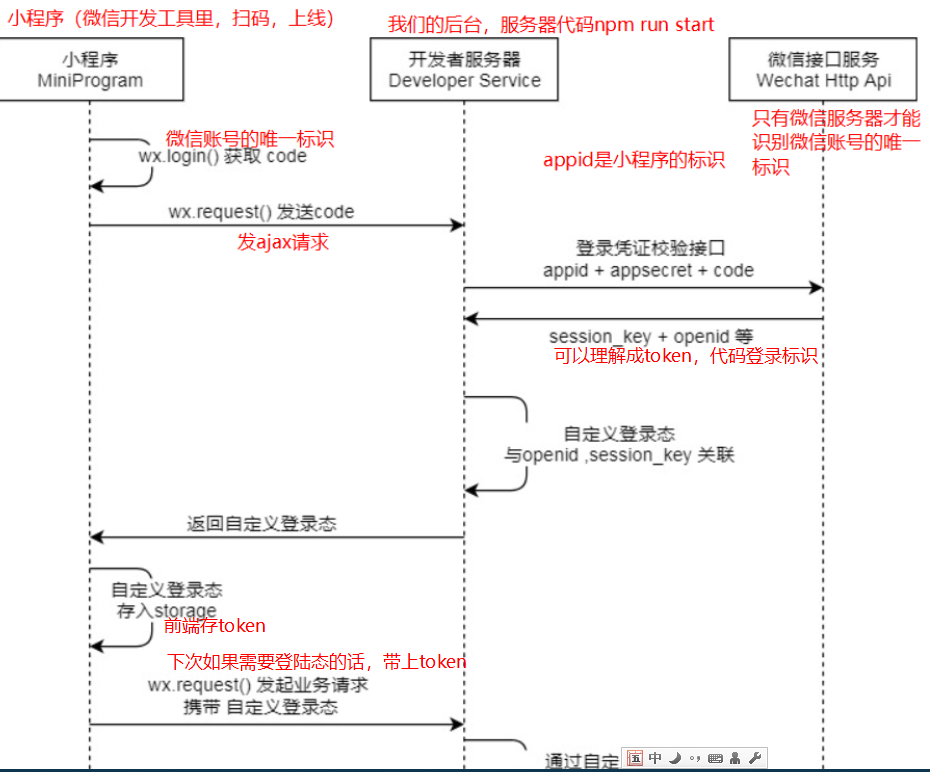
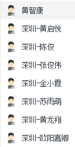

# 微信小程序学习第5天

## 每日反馈

1. 我婊哥咕咕觉得太容易了.毫无挑战性~老师能不能讲快点~我都快写完了...
   1. 会稍微快一点。
   2. 大家也先预习，先写着，我讲的时候，可以对比一下思路
2. 做一个app或者脚本的步骤是什么？一般免费的接口都是去哪找的呢？
   1. 做面试里面的项目
   2. 企业里面大的项目
      1. 产品找方向同时UI设计，反复确认这个产品方向是否OK，最终确认设计稿。比如我做的乐卡App,一个月
      2. 细分每个页面的需求，开始开发。一个月上线，发布第一个版本1.0.0。这个时间段前端还是特别忙
      3. 老板觉得效果不错。迭代了。长出很多需求，都在探索，需要改动频繁。这个时间就比较忙
   3. 小的项目
      1. 设计稿定了，静态页面写了
      2. 每天自己敲，然后汇报进度，联调还是有后端
      3. 两个月完成，自测
   4. 脚本
      1. 按键精灵，反复测试反复写，写了两个月
   5. [免费接口](https://www.zhihu.com/question/32225726)
   6. 可以参考vue开源项目，[管理后台可参考这个](https://github.com/PanJiaChen/vue-element-admin)


## 回顾

1. wx.request异步请求

   1. 发ajax请求
   2. 基本上和jQuery.ajax用法一致

   ```js
   wx.request({
     url: '', //服务地址，必选
     data:{},//get或者post请求，给服务器的传参
     header: { //请求头
         'content-type':'application/json' //默认让服务器按json格式解析，要不要修改，看服务器
     },
     method: 'GET',//请求方法
     dataType: 'json',//后端返回给前端的数据，尝试使用JSON.parse去解析
     success: function(res) {}, //成功回调
     fail: function(res) {},
     complete: function(res) {},
   })
   ```

2. 首页

   1. 静态页面

      1. page不能设置padding或者margin, 否则页面宽度会超过

      2. scroll-view横向滚条

         ```css
         .scroll-view_H{
           white-space: nowrap;
         }
         .scroll-view-item_H{
           display: inline-block;
         }
         ```

   2. 发请求，渲染页面

   3. 对wx.request封装

      1. 新建一个request.js，对外导出request方法，request返回promise，把其中一个异步请求直接放进去。有home.js调用
      2. 抽取基地址
      3. async ,await
         1. 微信开发者工具，详情->本地设置->打开增强编译

   

## 作业检查

1. 各位组长确认一下组员的蘑菇在线服务器都启动了？
2. https://gitee.com/wwinnie/mushroom/tree/index/
   1. git提交的注释不错
   2. async和await的使用
   3. 参考[腾讯前端代码规范](http://alloyteam.github.io/CodeGuide/#css-naming-rule)
      1. id以驼峰命名
      2. class以中划线分隔
   4. export语法
3. https://gitee.com/chen_yi12345/mushroom46/blob/Fea_joven_201200402/utils/request.js
   1. 没毛病
4. https://gitee.com/manutreemin/mushroom/blob/develop/pages/index/index.js
   1. 抽取api层
   2. 引入iconfont
5. https://gitee.com/xueBingChuan/mogu.git
   1. 命名
   2. 试试使用await
6. https://gitee.com/kingiewux/wxxcx-a/blob/frist/pages/home/home.wxml
   1. 注意变量的声明的类型
7. https://gitee.com/qishenghua/moguzaixain/blob/fea_qi_20200402/pages/home/index.js
   1. wxss里面，page上给padding会不会有bug？显示ok？
8. https://gitee.com/mozhaoyuan/mushroom/blob/master/mushroom-mp-46/pages/home/home.wxml
   1. 单词拼写


## Loading效果

[showLoading](https://developers.weixin.qq.com/miniprogram/dev/api/ui/interaction/wx.showLoading.html)

1. loading 提示框

   ```js
   //开启loading
   wx.showLoading({
   	title:'加载中...'
   })
   
   wx.hideLoading()//关闭
   ```

2. 导航栏loading

   ```js
   wx.showNavigationBarLoading()  //开启
   wx.hideNavigationBarLoading()  //关闭
   ```

具体使用场景：视公司的交互规范


## request.js添加loading效果

1. 请求前开启loading，
2. 请求完成后关闭loading
   1. complete回调函数


## Tab栏配置

[传送门](https://developers.weixin.qq.com/miniprogram/dev/reference/configuration/app.html#tabBar)

tab栏作用就是增加给App(小程序,h5,app)多入口

tab栏是什么？

 	1. 在底部展示几个菜单，点击某一个显示对应的页面

使用方法：只需要配置就行

1. 一个小程序只有一个tab栏，是属性于全局的配置app.json
2. **selelectedColor和color是公共的属性**，所以是tabBar的属性，并不是tabBar.list的属性
3. tab栏有多少个菜单，那么list数组就有多个对象

```json
"tabBar": {
    "color": "#ff0000",//未选的文字颜色
    "selectedColor": "#009900",//选中时的文字颜色
    "list": [
      {
          // 点击text，展示对应的pagePath页面
        "pagePath": "pages/index/index",
        "text": "首页",
          "iconPath" //未选中时的图标
          selectedIconPath //选中时的图标
      },
      {
        "pagePath": "pages/logs/logs",
        "text": "日志"
      }
    ]
  },
```

#### 注意点：

1. .json文件对格式要求比较高

   1. 不能有注释

   2. 键和字符串必须是双引号，还不能是单号

   3. 如果某一个属性在最后，逗号必须去掉

      

## Tabbar栏配置

1. 新建另外三个页面，course,study,my
2. 先显示首页+课程
3. 配置color和selectedColor
4. 配置tab栏图标
5. 再配置剩余的两个页面


## 课程-页面分析


1. 点击课程tab，显示课程页面
2. 课程页面展示课程列表


## 课程-静态页面

1. 一个列表，包括很多课程，每个课程里面有图片，课程名字，两个一行

2. 设置导航栏标题

3. 设置编译模式，方便写静态页面

   

## 课程-渲染页面

1. 发请求，拿到数据，渲染页面

   1. 接口

      1. url :course/list

   2. 引入request

   3. 发请求设置courseList属性

   4. 渲染

   5. level的渲染技巧

      1. 设置一个level的数据, 接口返回的item.level作为下标，也就不用wx:elif（相同的dom更多）

      ```js
      levelArr:['','初级','中级','高级']
      ```

      

## 登录页-页面分析


1. 入口：需要登陆态的页面，如果没有登陆就会跳转到登录页，比如我的页面
2. 登录页，有微信授权登录和手机号登录
3. 微信授权登录：小程序授权和小程序登录
4. 手机号码登录跳转到手机号码登录页面

## 登录页-静态页面

1. 
   1. 可以用伪元素完成
      1. ::before和::after本质没有区别，只不过是语义的区别。定位是靠left,right,top,bottom
2. 小程序里面的button有很多我们不需要的样式，如果想定制，需要一些样式去重置。就换成view
3. 手机号码登录，用navigator跳转


## 小程序授权

[传送门](https://developers.weixin.qq.com/miniprogram/dev/framework/open-ability/authorize.html)

概念：在小程序里面有一些权限需要小程序(微信)给予。比如用户基本信息，运动步数，摄像头，通讯地址

有什么用？获取微信里面的一些信息，用户基本信息，运动步数。。。

**除了用户信息获取之外的所有授权都用这种方法**

1. 发起授权 
   1. wx.authorize, 找到对应scope
2. 调用授权接口
   1. 查文档里，这个scope对应的接口方法获取授权信息

**用户信息授权**

1. 用户信息授权只能使用以下声明式的方式，不能使用js方法来获取
2. 如果授权弹窗被拒绝，再次点击也会弹
3. bindgetuserinfo对应的事件处理方法里面直接可以获到用户信息，不必使用wx.getUserInfo

```html
<button open-type="getUserInfo" bindgetuserinfo="getInfo">获取用户信息</button>
```

#### 注意点：

1. 模拟器里面授权弹窗它在模拟器中央，但是手机上是在底部
2. 如果授权通过了，下一次不会再弹授权窗口。但是如果你想让它再弹，需要清除授权数据
   1. 模拟器，清缓存->清除授权数据
   2. 如果是手机，找到最近使用的小程序列表，删除小程序，再预览扫码
3. 在微信开发者工具里面，获取通讯地址，这个广州地址，是假数据
4. 如果小程序在手机微信运行时，获取的通讯地址就是真实的，来自哪里呢？
   1. 微信->我的->头像->我的地址

#### 练习：

1. 获取用户**通讯地址**
2. 获取用户信息
3. 用手机预览扫码


## 小程序登录

[传送门](https://developers.weixin.qq.com/miniprogram/dev/framework/open-ability/login.html)

概念：用微信账号登录小程序

原理上：第三方登录

​	1. 举例说明：在掘金网站我们使用微信账号进行登陆，对于掘金来说，微信就是第三方



#### 提示：

1. wx.login获取到的code, 我们的后台服务器是不认识，只有微信的服务器才认识，所以才需要发送到微信服务器。


## 登录页-用户登录

1. 分析登录接口
   1. url: /user/wxlogin
   2. 方法 post
   3. 参数
      1. code微信登陆的唯一标识
      2. 部分用户信息，通过用户信息授权获取
2. 需要在服务器代码里面配置appid和小程序的密钥
   1. `learnmp\蘑菇在线\服务器代码\mushroom-online-server\src\config\wxconfig.js`在这个文件里面配置
   2. appid和小程序密钥在哪里
      1. 小程序后台->开发->开发设置
      2. 小程序密钥，每次重置都会重新生成一个。如果重置生成了就需要再次配置
   3. 如果配置完了，服务器需要重新启动
      1. 如果你找不到你的npm run start那个命令行窗口，**那就重启电脑**，然后再找到服务器npm run start
      2. 如果能找到的话，ctrl+c停止服务，然后再次执行npm run start
3. 先获取用户信息，然后获取code，最后调接口
   1. 获取用户信息
      1. button有自定义样式，所以微信登陆的按钮没有用button。所以我们用view，然后内部放一个透明button
         1. button不仅透明，而是绝对定位，占满整个view
         2. 调整样式时，需要`button:not([size='mini'])`覆盖它的样式
      2. button上声明open-type="getUserInfo"
      3. bindgetuserinfo对应的方法里面获取到用户信息
   2. wx.login方法，获取到微信登录的唯一标识
   3. 调登陆接口
      1. 确认request.js要有处理options.method和options.data的逻辑

#### 注意点

1. 建议总是箭头函数
2. wx.login里面返回的是一个对象，如果想取code的话，需要res.code
3. **如果请求返回的数据不对，但是你初步确认你的代码没问题，立马应该想到检查network**
   1. **打开network，点击你的请求**
   2. **检查url，方法，data(请求体)**
4. 对于promise对象如果没有加await修饰的话，那么返回的数据就是promise
5. 登陆的请求信息里面如果提示appsecret, 那么得确认一下服务器代码有没有配置小程序密钥
   1. 不仅需要配置，而且需要重启server


## 总结


## 作业

1. 课程页面
2. tab栏配置
3. 登陆页面完成
4. 我的页面的静态页面(选做)



