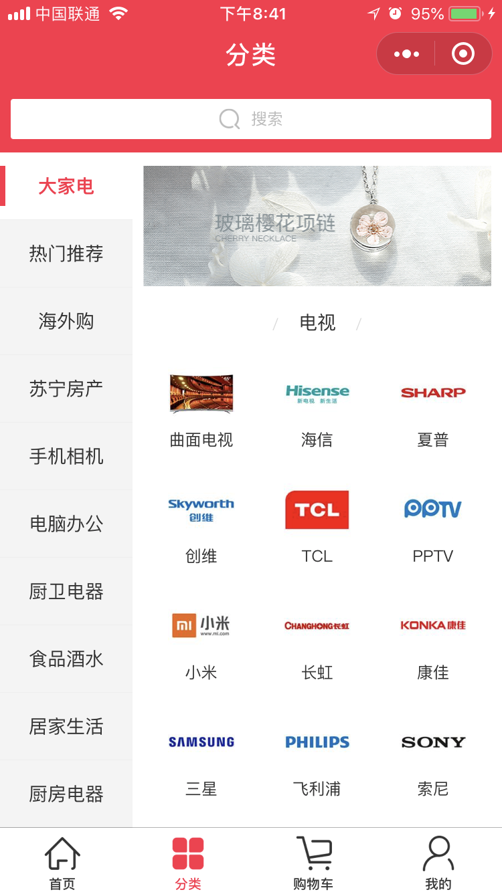
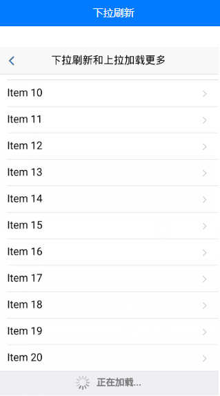
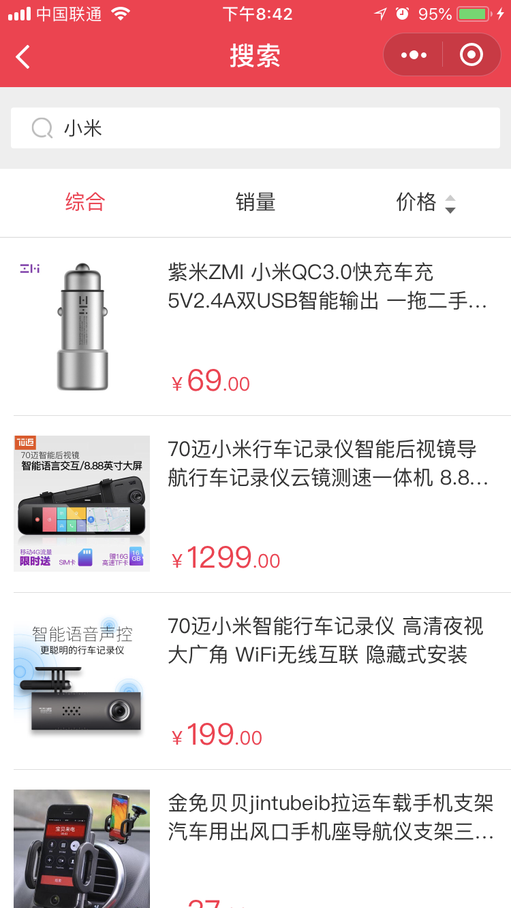

# 微信小程序学习第5天

## 每日反馈

1. 老师，可以讲下微信小程序支付api接口怎么使用吗？可以从申请接口=》开发过程=》上线大概讲一下，当然能实践是最好的
   1. 第8时，会讲到微信支付
   2. [wx.requestPayment](https://developers.weixin.qq.com/miniprogram/dev/api/open-api/payment/wx.requestPayment.html)
   3. TODO, 微信支付申请接口，开发过程
2. 商品后台管理系统
   1. 参考 [传送门](https://github.com/macrozheng/mall-admin-web)
   2. 账号和密码 admin,macro123
   3. 基本模块，商品，订单和活动
   4. vue管理后端参考`vue-element-admin`


## image组件的mode属性

 图片裁剪、缩放的模式 

​	[传送门](https://developers.weixin.qq.com/miniprogram/dev/component/image.html)

1. 默认是scaleToFill:拉伸
2. aspectFit：保持宽高比，长边显示出来
3. aspectFill:保持宽高比，短边显示，长边截取
4. widthFix:保持宽高比，宽度不变，高度自动变化

如果需要显示的图片和image的宽度和高度比例是一致的话，无论什么模式效果是一样的。


## 优购案例-首页

#### 03.请求数据&渲染数据

1. 渲染轮播图部分
   
1. 接口：/api/public/v1/home/swiperdata
   
2. 渲染分类导航部分
   
   1. 接口：/api/public/v1/home/catitems
3. 渲染楼层部分
   
   1. 接口：/api/public/v1/home/floordata
   
   > content-type: application/json这种设置和后端有关
   >
   > v-for和v-if避免放在一个标签上。
   

#### 04.优化

2. request设置到Vue原型上，Vue实例上都可以访问到$request

   1. 在main.js里设置

      ```js
      import request from '@/utils/request'
      Vue.prototype.$request = request
      ```

 3. 提取BASE_URL

 3. async和await优化

      1. await作用是返回promise对象then里面的数据
      2. async作用有await的代码的function必须用async修饰

 4. 封装wx.request部分，添加loading

      1. 默认不传参且有loading，变量名为`noLoading`
      2. loading mask设置为true

 5. 导航栏背景色和颜色的全局设置


## 优购案例-分类



#### 01.页面分析

1. 点击分类Tab显示这个分类页面

 2. 点击搜索去到搜索页面
  3. 选中左侧其中一个一级分类，右侧显示对应的二级和三级分类

#### 02.静态页面

1. 将头部搜索区域封装为组件

   1. 组件的style需要加scoped，否则会影响到引入组件的页面

2. 主体部分需要占满剩下屏幕

   >内容滚动的条件是
   >
   >1. 父元素高度小于内容高度，父元素高度确定
   >2. 父元素overflow:auto或者scroll

   ```css
     position: absolute;
     top: 100rpx;
     left: 0;
     right: 0;
     bottom: 0;
   ```

3. 左侧的结构

   1. 基本结构
   2. 选中的样式
   3. 点击切换选中元素

4. 右侧的结构

   1. 顶部图片展示

   2. 二级分类和三级分类结构


#### 03.获取数据&渲染数据

接口：/api/public/v1/categories

1. 获取数据
2. 渲染左侧
3. 渲染右侧二级
4. 渲染右侧三级

> 1. 写小程序或者App时，尽量减少标签层级。因为对应一个原生组件，比较消耗资源的
> 2. v-if用在请求没回来之前，不渲染数据的逻辑，这里不能用v-show来替代
> 3. 右侧二级三级分类的渲染categories[activeIndex]


## 练习-完成优购项目分类页面功能


## 下拉刷新

[传送门](https://developers.weixin.qq.com/miniprogram/dev/reference/configuration/page.html)

小程序为页面增加下拉组件，**下拉时触发方法**，在方法里面我们可以自定义逻辑，通常用来重新加载第一页数据

1. 在页面设置index.json

```json
"enablePullDownRefresh":true,
"backgroundTextStyle": "dark"
"backgroundColor":"#ccc"
```

2. 下拉会触发onPullDownRefresh，一般在这个方法里面处理加载第一页的逻辑

3. backgroundColor 窗口的背景色

4. backgroundTextStyle 下拉 loading 的样式 `dark` / `light`，默认是light


## 练习-下拉刷新-计数器案例

1. 新建一个页面`pages/pulldown_counter/index`

2. 显示数字，点击按钮+，自增

3. index.json增加"enablePullDownRefresh":true

4. backgroundColor:"#ccc"及backgroundTextStyle :"dark"

   

需求：页面上显示一个数字，点击+数字自增，下拉刷新时，数字重置为0

> 手动停止下拉loading动画 wx.stopPulldownRefresh


## 上拉加载更多

[传送门](https://developers.weixin.qq.com/miniprogram/dev/reference/configuration/page.html)

小程序为页面增加上拉组件，**上拉到底前**触发方法，在方法里面我们可以自定义逻辑，通常应用在分页的场景中，加载下一页

1. 在页面设置index.json

```json
"onReachBottomDistance":50
```

2. 下拉到底前会触发[onReachBottom](https://developers.weixin.qq.com/miniprogram/dev/reference/api/Page.html#onreachbottom)

3. 注意点，只有有滚动条的时候，上拉才会被触发

4. 在onReachBottom方法里面，一般处理加载下一页的逻辑

   

## 练习-下拉上拉-综合案例

参考<https://dev.dcloud.net.cn/mui/>



1. 新建一个页面，展示列表。

2. index.json配置开启上拉加载和下拉刷新

3. 在上拉加载里面，添加数据。下拉刷新里面加载第一页。

   ```js
    setTimeout(() => {
        this.setData({
            list: numArr
        })
        //主动结束下拉刷新
        wx.stopPullDownRefresh();
    }, 500)
   ```
   
   


## 优购案例-搜索列表



#### 01.页面分析


1. 点击三级分类，去到搜索列表页面
2. 获取列表数据的接口是查询关键字，支持分页
  3. 下拉刷新，上拉加载更多
  4. 输入框输入关键字，搜索
  5. 点击其中一个商品跳转商品详情

#### 02.静态页面

2. 新建页面search_list
3. 标题设置为`搜索结果`
4. 头部搜索功能
5. 过滤栏综合销量及价格展示
6. 过滤栏点击选中功能
7. 商品列表展示

#### 03.基本逻辑

1. 点击三级分类，去到搜索结果页面
2. 在onLoad方法里面 参数
   1. cat_name

#### 04.请求数据&渲染数据

1. onLoad设置keyword, 请求数据queryGoods
   2. 接口 /api/public/v1/goods/search
   3. 参数
      1. query关键字
      2. pagesize每页多少条
      3. pagenum 页码
2. 渲染数据
3. 输入框输入关键字，确定的时候触发搜索商品
   1. 获取输入框的输入keyword
   2. 点击确定触发搜索@confirm:queryGoods
   

#### 04.下拉刷新

1. 配置开启下拉刷新, 并配置样式

   ```
     "enablePullDownRefresh": true,
     "backgroundColor": "#eee",
     "backgroundTextStyle": "dark"
   ```

2. 触发下拉刷新事件重新请求数据

   ```js
   onPullDownRefresh(){}
   ```

#### 05.上拉加载更多

1. 配置开启上拉 "onReachBottomDistance":50
2. 上拉触底后给当前页+1，再请求
   1. onReachBottom方法里页码+1, 再请求
   2. 商品列表应该是追加，而不是覆盖

#### 06.优化

1. 输入框确定、下拉刷新，搜索结果为第一页
   1. 搜索结果为首页，单独抽取一个方法reload
   2. reload重置页码为1，重置goodsList

2. 当请求中，不再发请求
   1. 设置请求中状态isRequest
3. 如果当前是最后一页，不再发请求
   1. 是否为最后一页的状态isLastPage
   2. 如果是最后一页，不再发请求
4. 添加一个有加载完成的提示
   1. isLastPage为true时显示


## Fiddler使用


1. 基本使用，选择请求，查看请求详细信息（抓包）
2. fiddler配置抓包chrome(包括http和https请求)
1. 官网下载fiddler
   2. fiddlercertmaker.exe用来生成证书

   3. fiddler https和connections配置
   
4. 导出证书到桌面
   
5. chrome导入证书
3. fiddler抓包手机端

   1. 安卓  https://www.jianshu.com/p/724097741bdf 
   2. ios  https://www.jianshu.com/p/724097741bdf 
   3. 大致的步骤
      1. filddler所在的电脑和手机在同一个局域网内
      2. 在手机上访问 `电脑ip:8888`可以下载证书
      3. 手机上安装证书
      4. 手机wifi设置代理为电脑ip：8888


