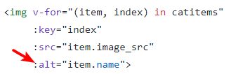

# 微信小程序学习第6天

## 每日反馈


## 作业问题：

1. img的alt属性：图片无法显示时的替代文本

   

2. 开发需求不要直接提交代码到master分支，一般新建开发分支

3. js变量名驼峰，开启eslint, 返回数据meta.status===200时，才是正确的数据

   1. [传送门](https://gitee.com/lee_dragon/heimayougou43/blob/master/src/utils/http.js)
   2. https://gitee.com/lee_dragon/heimayougou43/blob/master/src/pages/category/index.vue

4. 开启eslint,content-type有默认值，不必要写; res.data解构; 注意一下onLoad和methods的顺序;vue指令使用简写

   1. [传送门](https://gitee.com/leishiming/mpvue-yougou/blob/leishiming_20200206/src/utils/request.js)


## 练习-下拉上拉-综合案例

参考<https://dev.dcloud.net.cn/mui/>


1. 新建一个页面，展示列表。

2. index.json配置开启上拉加载和下拉刷新

3. 在上拉加载里面，添加数据。下拉刷新里面加载第一页。

   ```js
    setTimeout(() => {
        this.setData({
            list: numArr
        })
        //主动结束下拉刷新
        wx.stopPullDownRefresh();
    }, 500)
   ```

注意点：

1. **所谓节流，就是指连续触发事件但是在 n 秒中只执行一次函数**
2. **所谓防抖，就是指触发事件后在 n 秒内函数只能执行一次，如果在 n 秒内又触发了事件，则会重新计算函数执行时间。**


## 优购案例-搜索列表


#### 01.页面分析


1. 点击三级分类，去到搜索列表页面，传递cat_name
2. 获取列表数据的接口是查询关键字，支持分页
  3. 下拉刷新，上拉加载更多
  4. 输入框输入关键字，搜索
  5. 点击其中一个商品跳转商品详情

#### 02.静态页面

2. 新建页面search_list
3. 标题设置为`搜索结果`
4. 头部搜索功能
5. 过滤栏综合销量及价格展示
6. 过滤栏点击选中功能
7. 商品列表展示

#### 03.基本逻辑

1. 点击三级分类，去到搜索列表页面
   1. 点击跳转 @click="toSearchList"
      1. wx.navigatorTo()
      2. 传递cat_name
   2. 在搜索列表页面上获取参数
      1. 在onLoad方法里面 参数

#### 04.请求数据&渲染数据

1. onLoad设置keyword, 请求数据queryGoods
   2. 接口 /api/public/v1/goods/search
   3. 参数
      1. query关键字
      2. pagesize每页多少条
      3. pagenum 页码(从1开始)
2. 渲染数据
3. 输入框输入关键字，确定的时候触发搜索商品
   1. 获取输入框的输入keyword
   2. 点击确定触发搜索@confirm:queryGoods

#### 05.下拉刷新

1. 配置开启下拉刷新, 并配置样式

   ```
     "enablePullDownRefresh": true,
     "backgroundColor": "#eee",
     "backgroundTextStyle": "dark"
   ```

2. 触发下拉刷新事件重新请求数据

   1. 重置goodsList
   2. pageNum:1
   
   ```js
   onPullDownRefresh(){}
   ```

#### 06.上拉加载更多

1. 配置开启上拉 "onReachBottomDistance":50
2. 上拉触底后给当前页+1，再请求
   1. onReachBottom方法里页码+1, 再请求
   2. 商品列表应该是追加，而不是覆盖

#### 07.优化

1. 输入框确定、下拉刷新，搜索结果为第一页
   1. 搜索结果为首页，单独抽取一个方法reload
   2. reload重置页码为1，重置goodsList

2. 当请求中，不再发请求
   1. 设置请求中状态isRequest
   2. 请求前，为true
   3. 请求后为false
   4. 如果为true时，return
3. 如果当前是最后一页，不再发请求
   1. 是否为最后一页的状态isLastPage
   2. 如果是最后一页，不再发请求
4. 添加一个有加载完成的提示
   1. isLastPage为true时显示


## 小程序生命周期钩子

#### 01.App生命周期

[传送门](https://developers.weixin.qq.com/miniprogram/dev/reference/api/App.html)

1. App在初始化，切前台后台时会以回调函数的形式通知我们

   | 钩子函数 | 说明                             |
   | -------- | -------------------------------- |
   | onLaunch | 小程序初始化时触发（只触发一次） |
   | onShow   | 从后台进入前台                   |
   | onHide   | 从前台进入后台                   |


#### 02.Page生命周期

[Page生命周期](https://developers.weixin.qq.com/miniprogram/dev/framework/app-service/page-life-cycle.html)

Page在加载、显示、渲染完成、隐藏和销毁时会以回调函数的形式通知我们

| 钩子函数 | 说明             | 备注 |
| -------- | ---------------- | ---- |
| onLoad   | 页面加载         |      |
| onShow   | 页面显示         |      |
| onReady  | 页面初次渲染完成 |      |
| onHide   | 页面隐藏         |      |
| onUnload | 页面销毁         |      |

> window.onload
>
> document.onDomContentLoaded


#### 03.页面栈的概念

[传送门](https://developers.weixin.qq.com/miniprogram/dev/framework/app-service/route.html)

在调试器的`AppData`查看当前活动页面，

使用 `getCurrentPages()` 函数获取当前页面栈 

| 路由方式   | 页面栈表现                      | 方法                        | 当前页面 | 后页面        |
| ---------- | ------------------------------- | --------------------------- | -------- | ------------- |
| 打开新页面 | 新页面入栈                      | wx.navigateTo               | onHide   | onLoad,onShow |
| 页面返回   | 页面不断出栈，直到目标返回页    | 左上角返回，wx.navigateBack | onUnload | onShow        |
| Tab切换    | 页面全部出栈，只留下新的Tab页面 | wx.switchTab                |          |               |

1. Tab栏只会初始化第一个页面，第一次切换到某tab时才会初始化该Tab; 后续切换tab只会显示/隐藏

2. 只有一个tab栏会入栈

3. tab栏只要初始化了并不会销毁

   

#### 04.小程序和mpvue生命周期图

[小程序的生命周期](https://developers.weixin.qq.com/miniprogram/dev/framework/app-service/page-life-cycle.html)

[mpvue生命周期图示](http://mpvue.com/mpvue/#%E7%94%9F%E5%91%BD%E5%91%A8%E6%9C%9F%E5%9B%BE%E7%A4%BA)

1. 在小程序的第一页出现前，已经创建出了所有页面对应的Vue实例,并不会执行小程序页面的onLoad
2. `mpVue`中，一个`page`就是一个`Vue`实例，关闭页面会执行小程序页面的onUnload钩子，但是不会执行Vue实例的destoryed。
3. 再次进入page，vue实例的属性需要重置（bug）

#### 05.场景值

[传送门](https://developers.weixin.qq.com/miniprogram/dev/reference/scene-list.html)

概念：小程序的入口，不同入口都有的标识，这个就是场景值

一般用作**事件上报**

1. 页面被访问的次数PV
2. 页面被不同用户访问的次数UV
3. 事件上报针对某一按钮

获取场景值：app.js onShow(){options. scene }


## 优购案例-搜索列表

#### 07. 搜索和过滤栏固定定位，不随着商品列表滚动

[onPageScroll](https://developers.weixin.qq.com/miniprogram/dev/reference/api/Page.html#onPageScroll-Object-object)

1. 上滑时，搜索和过滤栏不随商品列表滚动
   1. onPageScroll：isFixed=true
2. 下拉刷新顶部loading
   1. onPullDownRefresh：isFixed:false
