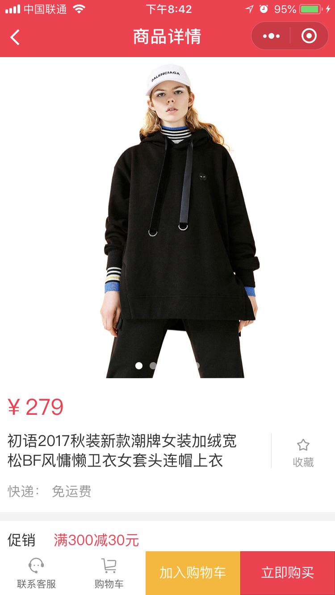

# 微信小程序学习第6天

## 每日反馈


## 前端性能优化

1. 适当减少HTTP请求
   1. css/js合并打包
   2. HTTP请求合并
   3. 小图标用iconfont或者base64
   4. 雪碧图可维护性不好
2. 减少静态资源的体积
   1. js,css,图片压缩，图片压缩用tinypng.com
   2. 先经过tinypng压缩
3. 服务器端开启gzip
   1. 后端或者运维做的
4. 预加载
   1. 利用浏览器空闲时间加载资源
5. 静态资源放CDN
6. 请求缓存，查询缓存
7. 设置合适的HTTP缓存
   1. 请求带宽
   2. 请求速度
   3. 运维或者后端
8. 其他
   1. 减少dom数量（小程序，weex, RN）
   2. css预处理器，减少层级,小于3~4层
   3. 图片懒加载，Vue-lazyload
   4. 图片设置宽高，
      1. 重排
   5. 默认图片设置
   6. 接口请求的容错

面试要举实际的例子

1. [路由懒加载](https://router.vuejs.org/zh/guide/advanced/lazy-loading.html#%E6%8A%8A%E7%BB%84%E4%BB%B6%E6%8C%89%E7%BB%84%E5%88%86%E5%9D%97)
   1. 首屏加载速度增快


## 小程序生命周期钩子

#### 01.App生命周期

[传送门](https://developers.weixin.qq.com/miniprogram/dev/reference/api/App.html)

1. App在初始化，切前台后台时会以回调函数的形式通知我们

   | 钩子函数 | 说明                             |
   | -------- | -------------------------------- |
   | onLaunch | 小程序初始化时触发（只触发一次） |
   | onShow   | 从后台进入前台                   |
   | onHide   | 从前台进入后台                   |


#### 02.Page生命周期

[Page生命周期](https://developers.weixin.qq.com/miniprogram/dev/framework/app-service/page-life-cycle.html)

Page在加载、显示、渲染完成、隐藏和销毁时会以回调函数的形式通知我们

| 钩子函数 | 说明             | 备注 |
| -------- | ---------------- | ---- |
| onLoad   | 页面加载         |      |
| onShow   | 页面显示         |      |
| onReady  | 页面初次渲染完成 |      |
| onHide   | 页面隐藏         |      |
| onUnload | 页面销毁         |      |

> window.onload
>
> document.onDomContentLoaded


#### 03.页面栈的概念

[传送门](https://developers.weixin.qq.com/miniprogram/dev/framework/app-service/route.html)

在调试器的`AppData`查看当前活动页面，

使用 `getCurrentPages()` 函数获取当前页面栈 

| 路由方式   | 页面栈表现                      | 方法                        | 当前页面 | 后页面        |
| ---------- | ------------------------------- | --------------------------- | -------- | ------------- |
| 打开新页面 | 新页面入栈                      | wx.navigateTo               | onHide   | onLoad,onShow |
| 页面返回   | 页面不断出栈，直到目标返回页    | 左上角返回，wx.navigateBack | onUnload | onShow        |
| Tab切换    | 页面全部出栈，只留下新的Tab页面 | wx.switchTab                |          |               |

1. Tab栏只会初始化第一个页面，第一次切换到某tab时才会初始化该Tab; 后续切换tab只会显示/隐藏

2. 只有一个tab栏会入栈

3. tab栏只要初始化了并不会销毁

   

#### 04.小程序和mpvue生命周期图

[小程序的生命周期](https://developers.weixin.qq.com/miniprogram/dev/framework/app-service/page-life-cycle.html)

[mpvue生命周期图示](http://mpvue.com/mpvue/#%E7%94%9F%E5%91%BD%E5%91%A8%E6%9C%9F%E5%9B%BE%E7%A4%BA)

1. 在小程序的第一页出现前，已经创建出了所有页面对应的Vue实例,并不是执行小程序页面的onLoad
2. `mpVue`中，一个`page`就是一个`Vue`实例，关闭页面会执行小程序页面的onUnload钩子，但是不会执行Vue实例的destoryed。
3. 再次进入page，vue实例的属性需要重置（bug）

#### 05.场景值

[传送门](https://developers.weixin.qq.com/miniprogram/dev/reference/scene-list.html)

概念：小程序的入口，不同入口都有的标识，这个就是场景值

一般用作**事件上报**

1. 页面被访问的次数PV
2. 页面被不同用户访问的次数UV
3. 事件上报针对某一按钮

获取场景值：app.js onShow(){options. scene }


## 优购案例-搜索列表

#### 07. 搜索和过滤栏固定定位，不随着商品列表滚动

[onPageScroll](https://developers.weixin.qq.com/miniprogram/dev/reference/api/Page.html#onPageScroll-Object-object)

1. 上滑时，搜索和过滤栏不随商品列表滚动
   1. onPageScroll：isFixed=true
2. 下拉刷新顶部loading
   1. onPullDownRefresh：isFixed:false

#### 08.无须在结构渲染的变量不要声明在data里面

1. pageNum
2. isRequest

#### 09.自测

1. 输入框输入关键字，商品列表展示第一页搜索商品
2. 下拉刷新，商品列表展示第一页搜索商品
3. 上拉加载，加载下一页商品
4. 分类页点击三级分类，输入框显示对应的三级分类的名称，商品列表展示第一页搜索数据
   1.  vue实例并不会销毁,goodsList需要重置

#### 10.提取公共样式

1. 一般公共样式直接放在App.vue
2. 如果声明less变量的话
   1. less变量的作用域是单文件内的
   2.  一般提取全局less文件，哪个文件需要用，就引入全局的less


## git stash使用

保存当前的工作进度，暂存区和工作区的改动保存起来

```bash
git stash -u  //有新文件加-u
git stash pop //恢复工作区
```

> 如果当前分支有改动，尽量不要切到另外的分支上


### 字体图标

[阿里矢量图标库](https://www.iconfont.cn/)

使用方法：

1. 搜索图标
2. 添加图标到购物车
3. 购物车里面添加进项目
4. 项目里生成在线代码

注意点

1. mpvue里面不支持网络路径样式引入


## 分享功能

[传送门](https://developers.weixin.qq.com/miniprogram/dev/framework/open-ability/share.html)

[onShareAppMessage](https://developers.weixin.qq.com/miniprogram/dev/reference/api/Page.html#onShareAppMessage-Object-object)

分享当前页面

1. 添加一个组件button，设置属性open-type="share"
2. 用户点击按钮后触发 `Page.onShareAppMessage` 事件
3. onShareAppMessage的参数可以定制分享的弹窗内容
   1. title 标题，默认为当前小程序的名称
   2. imageUrl 图片，默认是一张随机图片
   3. path 转发路径（别人点你的分享链接，跳转的页面路径），默认当前页面路径


## 联系客服

[传送门](https://developers.weixin.qq.com/miniprogram/dev/framework/open-ability/customer-message/customer-message.html)

1. 添加一个组件button，设置属性open-type="contact"

   

## 优购案例-商品详情页



#### 01.案例分析

1. 搜索列表的商品，点击可进入商品详情
2. 商品详情展示轮播图，可点击放大查看
3. 商品详情展示商品价格，名称，规格，送货地址及图文说明
4. 联系客服，加入购物车，或者直接购买。

#### 02.静态页面

1. 新建页面item
2. 商品详情页&搜索页跳转商品详情
3. 轮播图
4. 商品信息
5. 使用字体图标
6. 促销区域
7. 图文介绍与商品参数头部
8. 图文介绍与商品参数头部切换逻辑
9. 固定底部

#### 03.获取数据&渲染数据

1. 获取数据

   1. 搜索列表页点击商品跳转商品详情，传入id
   2. 根据接口请求商品详情
      1. 接口 `/api/public/v1/goods/detail?goods_id=${id}`

2. 渲染数据

   1. 轮播图

   2. 预览图片

      点击轮播图其中一张图片，会打开页面预览被点击图片，左右滑动可以预览其他图片

      1. 给轮播图片设置点击事件
      2. 调用wx.previewImage在新页面中全屏预览图片
         1. current当前显示图片的链接
         2. urls需要预览的图片链接列表
      3. 传入相应的参数

   3. 动态渲染商品价格和名称

   4. 渲染商品详情图文说明

      1. v-html支持只包含img标签html str

   5. 分享功能

      1. 添加一个组件button，设置属性open-type="share"
      2. onShareAppMessage方法中设置标题
      3. 解决样式问题
         1. 定位
         2. 隐藏

   6. 联系客服功能

      1. 添加一个组件button，设置属性open-type="contact"
      2. 解决样式问题
         1. 定位
         2. 隐藏

      
   

## 计算属性setter

[传送门](https://cn.vuejs.org/v2/guide/computed.html#%E8%AE%A1%E7%AE%97%E5%B1%9E%E6%80%A7%E7%9A%84-setter)

1. 计算属性默认的用法其实是计算属性的getter方法

2. 计算属性的setter方法里面可以获取到值变化

3. 如果不设置firstNamea或lastName，不会改变fullName的

4. 典型的应用场景是checkbox全选/全不选

   


#### 练习总结

1. 计算属性的set方法触发的条件是，计算属性的key有变化的时候


## 数据存储

[传送门](https://developers.weixin.qq.com/miniprogram/dev/api/storage/wx.setStorageSync.html)

1. 浏览器的本地存储

   1. localStorage（关闭浏览器后还存在）
   2. sessionStorage(关闭浏览器后不存在)
   3. 区别，使用，大小限制，存储类型？？？
      1. setItem(key,string),removeItem,getItem,clear
      2. 存储类型只能是字符串
      3. 5M

2. 小程序

   1. wx.setStorage,wx.getStorage....

   #### 01.存数据

   建议用setStorageSync

   本质是存数据是异步的，API上有同步和异步之分

   ```js
   // 异步存储
   wx.setStorage({
      key: 'name',
      data: 'Joven',
     success:function(){
       // 这里存储成功
     }
   })
   // 建议用同步存储
    wx.setStorageSync('age', 28)
   ```

> AJAX的A是Async
>
> fs.readFileSync


#### 02.取数据

建议用getStorageSync

```js
// 异步取数据
wx.getStorage({
  key: 'name',
  success: function(res) {
    console.log(res)
  }
})
// 建议用：同步取数据
console.log(wx.getStorageSync('age'))
```

> getStorageInfo是用来获取storage所有的信息的

#### 03.清除数据

1. clearStorageSync 清除所有数据

2. 删除指定项数据

   ```js
   // 异步删除指定key的数据
   wx.removeStorage({
     key: 'name',
     success: function(res) {
       console.log(res)
     },
   })
   // 同步删除指定key的数据
   wx.removeStorageSync('name')
   ```


#### 04.总结

1. 小程序的storage其实是对手机存储系统的文件读取，所以是异步的

2. 小程序的存储可以是复杂类型，JSON.parse能够解析的

3. 单个 key 允许存储的最大数据长度为 1MB，所有数据存储上限为 10MB 

   >内存，速度快，断电会丢失存储，价格贵，容量偏小
   >
   >硬盘SSD，速度偏慢，断电不会丢失，价格相对便宜，容量大。

#### 05.存一个复杂类型数据，然后取出来

1. setStorageSync只是写法上同步，本质存储依然是异步的。（fs.readFileSync）