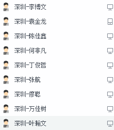

# 微信小程序学习第6天

## 每日反馈

1. 估计毕业了我都还去不了深圳，头发都盖住眼睛了，要扎辫子了，太难了......

2. Promise:表示一个异步操作,一个数组存了一些异步操作. 既然看不到这个数组,怎么知道是一个数组,数组的有序性吗?
   1. ES6里面的promise是原生实现的，也就是浏览器实现的
   2. 做一个简单的promise实现，更了解promise。之前大家也有学过bind的实现？
   3. 数组是有序的
   
3. Hi, 王老师. 你好, 是我. 很抱歉昨天把你的姓搞错了, 我太专注学习了, 总是会搞混其他的事情. 我对今天的基本逻辑掌握得还不错. 比如 Login JS 逻辑的封装 以及 返回一个promise. 我觉得我目前的学习难点是: 小程序的语法, 而不是JS逻辑. 小程序的语法(wxml&js)有他的特点, 希望老师多带我们看看官方文档, 这样也方便我们更好地熟悉一些, 因为你比我们熟悉得多. 过去的几天, 我们花费了太多的时间在git上了, 希望接下来我们能有更多的在业务上, 你看这样可以吗? 我感觉这几天除了git, 我都没学到多少新知识. 以上仅是个人观点, 仅供参考. [匿名用户: 邓*晖]
   1. 小程序语法最多4天完全可以讲完。重点还是在js逻辑
   2. 同学们自己有没有查阅文档的习惯
   3. 那你觉得学好git值得吗
   4. 优购商城，商城的业务逻辑
   
4. 老师,感觉都能写出来,基本也没报错.但总感觉不看笔记就写不出来,老师的思路流程一般是什么样的呢
   
1. 遇到没啥思路，先把最主要的思路写出来。修改错误，优化。
   2. 微信登陆
      1. 获取用户信息button
      2. 获取code
      3. 调接口
         1. wx.request
      4. 提示，跳转，存token
   3. 对wx.request
      1. promise封装，不要想着一次性封装好，反login.js里面请求copy过去，传参
      2. loading移到request.js
      3. base_url
      4. await async
      5. 传参的解构
   4. 根据手机号码获取验证码
      1. 获取手机号码，input获取值
      2. 点击button，发请求
         1. button开始倒计时
            1. 有一个倒计时和非倒计时的状态，根据状态改变文案
         2. 倒计时功能
            1. num--
            2. 越界的问题
               1. 倒计时的状态改
               2. num重置
               3. 清除定时器
   
5. 希望老师可以在笔记中的知识点添加一些方法的备注, 课后去做练习的时候会更容易理解些

   1. 好的。接受建议
   2. 最好具体说一下哪个地方，私聊我

6. 会在小程序中把网络请求封装成Promise

     ```js
     var p = new Promise((resolve,reject)=>{
       // 逻辑代码
       if(){
          resolve(data)
       }else{
         reject(err)
       }
     })
     
     p.then(res=>{
       console.log(res)
     }).catch(res=>{
       console.log(res)
     })
     ```


7. 会完成微信登录的功能

## 作业检查

1. 文件名错误，格化式
   1. [传送门](https://gitee.com/sunhongligitee/mp-mushroom_online/blob/sun_2020225/utils/ruquest.js)
2. git仓库私有
   1. [传送门](https://gitee.com/zdkkkk/kkkkk.git)
3. 完成良好
   1. [传送门](https://gitee.com/white_luo/mushroom_online_luo/blob/my_work/pages/phoneLogin/phoneLogin.js)
   2. [传送门](https://gitee.com/mygoes/wechat_app__mushroom_street/blob/try1/pages/loginByPhone/loginByPhone.js)
   3. [传送门](https://gitee.com/cisiter/mp-mushroom-online/blob/login/pages/login-phone/login-phone.js)
      1. if{return},else(不需要else)
4.  网络差,git推送不了
   1. 如果是码云的话，对网络要求不高
5. 不必要设置在data属性里面
   1. [传送门](https://gitee.com/tongmian/mall_applet/blob/Fea_tongmian/pages/login/index.js)

## 回顾

1. 数据缓存
   1. 本质是读文件，是异步的
   2. api和localStorage很像，setStorageSync,getStorageSync, remove,clear
2. input组件
   1. 没有边框
   2. type键盘类型
   3. confirm-type键盘右下角的按钮文案
   4. bindinput="事件处理方法",事件处理方法event.detail.value
   5. bindconfirm键盘右下角的按钮的点击


## 手机号登录页-获取验证码

5. 点击`获取验证码`按钮，发请求，获取验证码,并toast
   1. 接口
      1. url:/user/vcode
      2. data:{phone}
   2. toast提示验证码


## 手机号登录页-点立即验证完成登录

1. 获取用户输入的验证码
   1. data声明vcode
   2. input框`bindinput`事件:getVcode
   3. 事件处理方法中event.detail.value, setData设置
2. 击`立即验证`按钮，请求接口，完成登录
   1. 按钮注册事件bindtap="phoneLogin"
   2. 正则表达式检验手机号码`/^1[3456789][0-9]{9}$/`
   3. 正则表达式检验vcode `/^[0-9]{4}$/`
   4. 请求接口
      1. url:/user/login
      2. method:post
      3. data:{phone,vcode}
   5. toast提示，存储token，跳转首页


#### 练习说明：

1. 手机号码登陆成功后，验证码就会失效
2. 命名，不要把英文拼写错误


## 首页-页面分析


1. 首页是小程序的入口，如果末登录，就跳转登录;完成登录后，用户跳转到首页
2. tab栏由4个页面组成: 首页，课程，学习，我的，点击首页tab去到首页
4. 首页由搜索区域+轮播图+推荐课程+热门视频组成

## Tab栏配置

[传送门](https://developers.weixin.qq.com/miniprogram/dev/reference/configuration/app.html#tabBar)

概念：点击不同tab显示对应的页面

app.json的tabBar属性配置Tab栏，

使用方法：在app.json里面配置

```js
 "tabBar": {
     // tab未选中时的文字颜色
     "color": "#0000ff",
      // tab选中时的文字颜色
      "selectedColor":"#eb4450",
      "list": [
        {
          // tab选中时显示的页面路径
          "pagePath": "pages/index/index",
          // tab的文案
          "text": "首页"，
            // 未选中时的icon
            iconPath  ，
            //选中时的icon
            selectedIconPath
            
        }
     }
}
```

练习：

1. 新建一个小程序项目，把文档里面的配置copy到app.json

注意点：

1. 所有tab文字颜色，因为这个颜色是统一的，所以是配置和list是平级
2. json格式里面不能写注释


## 首页-Tabbar栏配置


1. copy静态页面里面的四个页面home,course,study,my到项目里
2. 在app.json里面配置对应的路径
3. copy文档tabBar配置，修改前面两个tab的文案和路径
5. 设置iconPath  没选中时图片路径 
6. 设置selectedIconPath 选中时图片路径
6. 再设置课程的tab
7. 最后再设置另外两个的tab配置


## 首页-渲染页面轮播图

1. 尽早发请求获取轮播图数据
   1. onLoad生命周期钩子函数
      1. 声明方法名`getSwipers`
   2. 轮播图接口
      1. url:'/home/swipers'
      2. 需要设置header `Authorization`为token
   3. 修改request.js接受传参header
   4. 获取返回数据，wx:for渲染轮播图


## 首页-渲染课程和视频

1. 参考轮播图的渲染
   1. 调接口，获取数据，设置data属性
   2. 在wxml里面渲染


## 课程-页面分析


1. 展示课程列表

## 课程-渲染页面

1. 调接口，获取数据，设置data属性

2. 在wxml里面渲染

3. 初级，中级，高级的展示优化

   1. 设置数组

      ```js
      levelArr:['','初级','中级','高级']
      ```


## 我的-页面分析 


1. 展示用户信息，打电话

## 我的页面-渲染页面

1. 调接口，获取数据，设置data属性
2. 在wxml里面渲染
3. 打电话
   1. wx.makePhoneCall({phoneNumber:**string**})
4. switchTab跳转到tab页面

#### 练习说明：

1. 实际的项目里面，静态资料都会放CDN
2. token过期的话，需要后端判断。一般返回的数据里面判断状态，跳转登陆
3. 那这样我没登录你就不要我浏览一下吗?
   1. 是的。
   2. 接口要求除了登陆之外的接口，都需要登陆态


## 首页-渲染页面轮播图-优化

在request.js默认传递token

1. 首先把传递token的逻辑放到request.js中
   1. 去掉传参header
   2. 从storage中获取token，传递token
2. 比如微信登录，不需要传递token
   1. 不需要传递token，传递了，也可以通过请求
3. 如果需要传token，但是token为空，就跳转登录
   1. 需要区分是否需要传递token，isAuth=true, 默认传
   2. 如果isAuth为true
      1. token不存在，跳转登录
      2. token存在，设置header
   3. 默认header为空，即不需要传递token时，传header空对象
4. 两个登录页接口需要设置请求参数isAuth:false
5. 注意展示loading应该放在判断isAuth之后，否则跳转登录会一直展示loading
6. 两个登录页面跳转首页逻辑都换成wx.relaunch
   1. wx.relauch关闭所有页面，打开新页面

## 总结


## 作业

完成蘑菇在线首页、我的、课程页面

