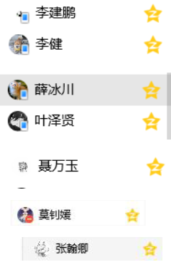

# 微信小程序学习第6天

## 每日反馈

1. 我陈俊伟还能学...感觉太简单了.都迫不及待想出去找工作了~奈何疫情影响~只能在家里接私单~
   1. 开玩笑
2. 每天反馈 很开心😀
3. 我以为我会了，其实啥都没会
   1. 听懂了，但是不知道怎么敲
4. 感谢老师的细心指导！
5. 梦雨，重点放在静态页面？？？
   1. js逻辑会css重要得多
   2. 如果静态页面卡住，先放弃，重点去理解js逻辑。
   3. 写完逻辑后，有时间再写写静态页面也行。


## 回顾

1. tabBar的配置

   1. 就是在app.json里面的配置

      ```json
       "tabBar": {
           color,
           selectedColor //选中和未选中时文案颜色
          "list": [
            {
               //点text文案时，展示对应的pathPath的页面
              "pagePath": "pages/index/index",
              "text": "首页",
           iconPath,
           selectedIconPath //选中和未选中的icon
            },
            {
              "pagePath": "pages/logs/logs",
              "text": "日志"
            }
          ]
        },
      ```

2. 课程页面

   1. 静态页面就是一个列表
   2. 发请求，拿到数据，渲染

3. 登录页

   1. 弄一个透明button盖住view按钮

      1. opacity:0
      2. 绝对定位

   2. 获取用户信息+微信账户的唯一标识+调接口

      1. 获取用户信息 

         ```html
         <button open-type="getUserInfo" bindgetuserinfo="getuf"/>
         ```

         ```js
         function getuf(res){
         	//这里的res是形参，想声明什么字母都可以的。
         }
         ```

      2. 微信账号的唯一标识wx.login(success(res){res.code})

      3. 调接口


## 作业检查

1. https://gitee.com/huanglongxixang/mushroom/tree/dev/code
   1. 把request方法设置给wx对象，可以令到其他页面不用引入公共的请求模块
   2. 并不是一定要抽取API层
      1. 即便要抽取，也得保证url的命令和api方法的命名，还有我们调用方法命名一致。
2. https://gitee.com/z1_j2_w3/mushrooom-mp-46/tree/Fea-molly/
   1. 很好


## 数据缓存

[传送门](https://developers.weixin.qq.com/miniprogram/dev/api/storage/wx.setStorageSync.html)

回顾localStorage与sessionStorage

1. 区别是localStorage关闭页存储还存在，sesssionStorage就没有

2. 使用

   ```js
   localStorage.setItem('key',5555) 设置
   localStorage.getItem('key') 获取
   localStorage.removeItem('key') 清除某一个key值存储
   localStorage.clear()//清除所有
   ```

3. 大小是5M，这个就是缺点

结论：小程序里面不能使用localStorage，提供一个更好的API是storage. storage的API基本上有localStorage差不多

**建议使用同步的API**

```js
 //设置缓存
 wx.setStorageSync('age', 18)
 //获取某个key的缓存
 let age = wx.getStorageSync('age')
 console.log(age)
 //清除某个key值的缓存
 wx.removeStorageSync('age')
 // 清除所有缓存
 wx.clearStorageSync()
```

**问题: 为什么setStorage有回调函数？为什么还有对应的Sync的方法？**

1. 本质上是读文件系统，所以setStorage才会有回调函数
   1. 微信开辟一片存储空间给到小程序去使用
2. sync这个api只是看上是同步，可以理解成异步的api上加了一个'await'

**使用场景：**

1. 如果不想等存储成功才执行某代码的，那么就用异步的api
2. 基本上还是建议使用同步的api，因为存是很快

#### 提示

1. 在调试器的storage tab里面可以查看当前小程序的数据缓存
2. getStorageInfo 获取当前storage的相关信息, 不要混淆
3. 单个 key 允许存储的最大数据长度为 1MB，所有数据存储上限为 10MB
4. storage可以存和取对象
   1. 就是用JSON.stringify(), JSON.parse()


## 登录页-存储token

1. 在request.js, 获取到成功的数据，resovle(res.data.message)，让login.js无法获取到token
   1. **解决方案 resovle(res.data)**
   2. home.js和course.js里面需要修改
2. 在登录页，需要把token存起来，那么其他页面可以获取token来发请求
   1. 存和取在数据缓存，key值`token`
3. 登录成功了，提示 toast


## Tab栏切换

1. 没有配置在tabBar里面的页面，显示的时候就没有tab栏
2. 跳转到非tabbar页，使用`wx.navigateTo`
3. 跳转到tabbar页，使用`wx.switchTab`


## 我的-页面分析 


1. 点我的这个tab页，显示我的页面
2. 我的页面包括我的信息，学习情况，设置
3. 需要登陆态，如果没有登陆，跳转登陆页

## 我的-静态页面

1. 导航栏
   1. 导航栏设置颜色和下边一样，看起来无缝
2. 我的信息
   1. 头像上有一个圆圈，可以通过设置border
3. 学习情况
   1. 主体部分可以想盖上边，需要margin-top为负
   2. 看板部分，想设置竖线的话，伪元素
4. 设置
   1. 需要设置border, 还是用伪元素来作

#### 注意点

1. 模拟器切换设备为iphone6, 显示比例85%, 导航栏位置上有白色的线，这个忽略掉。它只是模拟器的问题，手机预览扫码没有问题。

   

## 我的-渲染页面

1. 如果判断没有token，直接跳转登录页
   1. 取token wx.getStorageSync
2. 在我登陆页，如果登录成功，跳转到我的页面
   1. 跳转到我的页面，目标页面是tab页，所以需要用`wx.switchTab`
3. 发请求，拿数据
   1. 接口
      1. url my/info
      2. header需要传 Authorization：token
   2. 确认request.js是否传递了header
   3. 渲染
4. 优化
   1. 我的页面如果没有登录态，不应该请求
      1. 原因，**wx.navigateTo跳转页面，当前页面的逻辑依然执行**
      2. 解决方案: 跳转并return 
   2. 从登录页返回时，我的页面没有刷新
      1. 原因：从登录页返回我的，不会执行onLoad，会执行onShow(后面再详解)
      2. 解决方法：把判断和请求的逻辑放在onShow里面。并且需要重新获取token

#### 练习说明

1. token没存？
2. 克隆项目，切换分支，同步代码
   1. 克隆了git项目，用vscode打开git项目
   2. 找到状态栏左侧，master点击，在展示的下拉里面选择你想切换分支，然后点击
   3. 点击同步的圆圈，拉取代码


## 组件Input

[传送门](https://developers.weixin.qq.com/miniprogram/dev/component/input.html)

概念就是: 输入框

特点：

1. 没有边框
2. 键盘类型type
   1. text,默认是文本类型的键盘
   2. number，数字键盘
   3. idcard，身份证键盘
3. 键盘右下角按键的文案confirm-type
   1. search，搜索
   2. send 发送
4. bindconfirm事件是点击键盘右下角按键触发的事件
   1. 可以和vue里面@keyup.enter对比记忆
   2. 在微信开发者工具里面，是点enter键时触发

**如何获取输入的值**

1. 小程序里面的input没有双向数据绑定v-model
2. bindinput事件，event.detail.value值
3. 或者bindblur


## 手机号登录页-页面分析


1. 入口是在登陆页上点击“手机号码登录”跳转到登录页
2. 页面上两个输入框，输入手机号，另外一个输入验证码
3. 点击获取验证码按钮，开始倒计时，同时发请求拿到验证码，toast验证码
4. 点击立即验证按钮，带上手机号码和验证码，请求登陆


## 手机号登录页-获取验证码

1. 给两个输入框设置最大长度，maxlength

2. 点击获取验证码按钮，获取验证码文案变成60s, 开启倒计时，获取手机号码，发请求拿到验证码，提示

   1. 获取手机号码 bindblur
      1. 设置data属性phoneNubmer,设置phoneNumber:event.detail.value
   2. 点击获取验证码 bindtap:queryVcode
   3. 按钮的文案需要变成60s
      1. 需要一个状态，是否开启了倒计时isCountDown
      2. 在结构根据isCountDown来设置按钮的文案就行
   4. 开启倒计时
      1. 设置一个countNum属性，然后每一秒-1
      2. countNum不能减到0以下，需要判断countNum>=0, 就显示
      3. 如果countNum<0，按钮的文案变成获取验证码
      4. 再点击获取验证码按钮时，倒计时数字是从0开始的，所以也需要重置countNum:60
      5. 再点击获取验证码按钮时，倒计时比较快，清除定时器。
      6. 如果正在倒计时中，不响应。在queryVode最前面判断

   5. 发请求，获取验证码，提示
      1. 接口
         1. url: '/user/vcode',
         2. data:{phone}
      2. 提示wx.showToast
         1. title必须传字符串
         2. 不希望有icon，icon:none
         3. 如果希望弹toast的时间更长一些 duration:3000

#### 练习说明：

1. {{}}不能嵌套，计算的逻辑都放在一个{{}}里面

   1. 以下可以理解{{}}里面就是一个三元运算

   ```js
   {{isCountDown?(countNum+'s'):'获取验证码'}}
   ```

2. 如果正在倒计时中，就不响应的逻辑为什么在置顶？
3. 倒计时数字需要重置
4. 一般来说，boolean类型的变量声明is开头


## 手机号登录页-点立即验证完成登录

1. 点击立即验证，手机号码登录
   1. bindtap: phoneLogin
2. 在phoneLogin中发请求
   1. 接口：
      1. url user/login
      2. method:post
      3. dataa:{phone,vcode}
   2. 在输入验证码输入框通过bindblur事件获取用户输入的验证码
3. 请求成功后，提示，存token, 跳转到我的页面
4. 如果验证不对的，提示
   1. request.js，如果status!==0，reject出来
   2. 然后在phoneLogin方法里面try{}catch(err){}处理错误信息，提示


## 总结


## 作业

1. 我的页面
2. 手机号登录页
3. 有兴趣可以把token的判断放在request.js里面


