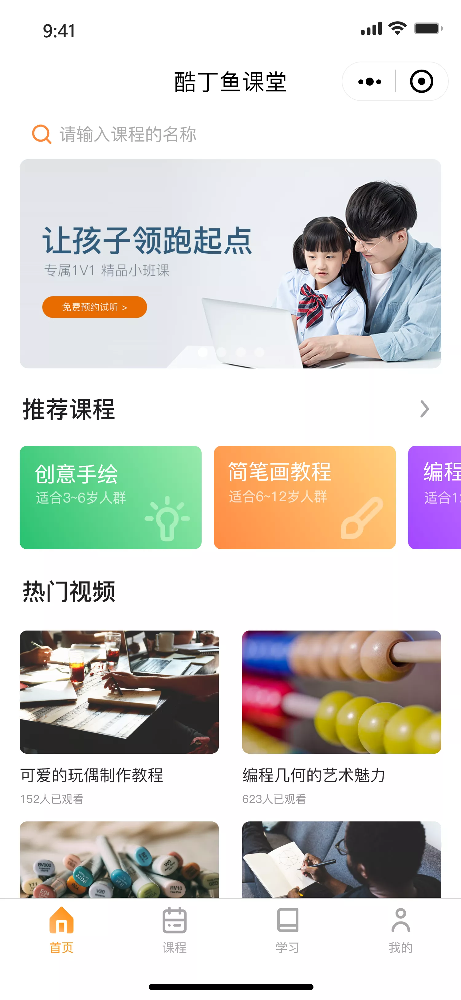

# 微信小程序学习第6天

## 每日反馈


## 回顾

## 手机号登录页-获取验证码

5. 点击`获取验证码`按钮，发请求，获取验证码,并toast
   1. 接口
      1. url:/user/vcode
      2. data:{phone}
   2. toast提示验证码

## 手机号登录页-点立即验证完成登录

1. 获取用户输入的验证码
   1. data声明vcode
   2. input框`bindinput`事件:getInputVcode
   3. 事件处理方法中event.detail.value, setData设置
2. 击`立即验证`按钮，请求接口，完成登录
   1. 按钮注册事件bindtap="phoneLogin"
   2. 正则表达式检验手机号码
   3. 正则表达式检验vcode `/^[0-9]{4}$/`
   4. 请求接口
      1. url:/user/login
      2. method:post
      3. data:{phone,vcode}
   5. toast提示，存储token，跳转首页


## 首页-页面分析


1. 完成登录后，用户跳转的页面; 已登录用户启动小程序，打开的第一个页面
2. tab栏由4个页面组成: 首页，课程，学习，我的，点击首页tab去到首页
3. 首页顶部`搜索区域`不可以输入，点击跳转到搜索页面
4. 首页由搜索区域+轮播图+推荐课程+热门视频组成

## Tab栏配置

[传送门](https://developers.weixin.qq.com/miniprogram/dev/reference/configuration/app.html#tabBar)

app.json的tabBar属性配置Tab栏，点击不同tab显示对应的页面

使用方法：在app.json里面配置

```js
 "tabBar": {
     // tab未选中时的文字颜色
     "color": "#0000ff",
      // tab选中时的文字颜色
      "selectedColor":"#eb4450",
      "list": [
        {
          // tab选中时显示的页面路径
          "pagePath": "pages/index/index",
          // tab的文案
          "text": "首页"，
            iconPath  ，
            selectedIconPath
            
        }
     }
}
```


## 首页-Tabbar栏配置



1. copy静态页面里面的四个页面home,course,study,my到项目里
2. 在app.json里面配置对应的路径
3. copy文档tabBar配置，修改四个tab的文案
4. 设置selectedColor:  tab 上的文字选中时的颜色 
5. 设置iconPath  没选中时图片路径 
6. 设置selectedIconPath 选中时图片路径


## 首页-渲染页面轮播图

1. 尽早发请求获取轮播图数据
   1. onLoad生命周期钩子函数
      1. 声明方法名`getSwipers`
   2. 轮播图接口
      1. url:'/home/swipers'
      2. 需要设置header `Authorization`为token
   3. 修改request.js接受传参header
   4. 获取返回数据，wx:for渲染轮播图


## 首页-渲染页面轮播图-优化

在request.js默认传递token

1. 首先把传递token的逻辑放到request.js中
   1. 去掉传参header
   2. 从storage中获取token，传递token
2. 比如微信登录，不需要传递token
   1. 不需要传递token，传递了，也可以通过请求
3. 如果需要传token，但是token为空，就跳转登录
   1. 需要区分是否需要传递token，isAuth=true, 默认传
   2. 如果isAuth为true
      1. token不存在，跳转登录
      2. token存在，设置header
   3. 默认header为空，即不需要传递token时，传header空对象
4. 两个登录页接口需要设置请求参数isAuth:false
5. 注意展示loading应该放在判断isAuth之后，否则跳转登录会一直展示loading
6. 两个登录页面跳转首页逻辑都换成wx.relaunch
   1. wx.relauch关闭所有页面，打开新页面


## 首页-渲染课程和视频

1. 参考轮播图的渲染
   1. 调接口，获取数据，设置data属性
   2. 在wxml里面渲染

## 课程-页面分析


1. 展示课程列表

## 课程-渲染页面

1. 调接口，获取数据，设置data属性

2. 在wxml里面渲染

3. 初级，中级，高级的展示优化

   1. 设置数组

      ```js
      levelArr:['','初级','中级','高级']
      ```

      

## 我的-页面分析 


1. 展示用户信息，打电话

## 我的页面-渲染页面

1. 调接口，获取数据，设置data属性
2. 在wxml里面渲染
3. 打电话
   1. wx.makePhoneCall

## 总结

