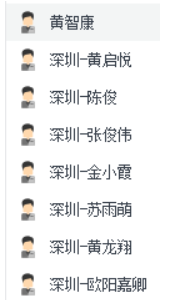

# 微信小程序学习第6天

## 每日反馈

1. 我陈俊伟还能学...感觉太简单了.都迫不及待想出去找工作了~奈何疫情影响~只能在家里接私单~
2. 每天反馈 很开心😀
3. 我以为我会了，其实啥都没会
4. 感谢老师的细心指导！


## 回顾

1. tabBar的配置
2. 课程页面
3. 登录页


## 作业检查

1. https://gitee.com/huanglongxixang/mushroom/tree/dev/code



## 总结

## 数据存储

[传送门](https://developers.weixin.qq.com/miniprogram/dev/api/storage/wx.setStorageSync.html)

1. 浏览器的本地存储

   1. localStorage（关闭浏览器后还存在）
   2. sessionStorage(关闭浏览器后不存在)
   3. 区别，使用，大小限制，存储类型？？？
      1. setItem(key,string),removeItem,getItem,clear
      2. 存储类型只能是字符串
      3. 5M

2. 小程序

   1. wx.setStorage,wx.getStorage....

   #### 01.存数据

   建议用setStorageSync

   本质是存数据是异步的，API上有同步和异步之分

   ```js
   // 异步存储
   wx.setStorage({
      key: 'name',
      data: 'Joven',
     success:function(){
       // 这里存储成功
     }
   })
   // 建议用同步存储
    wx.setStorageSync('age', 28)
   ```

> AJAX的A是Async
>
> fs.readFileSync


#### 02.取数据

建议用getStorageSync

```js
// 异步取数据
wx.getStorage({
  key: 'name',
  success: function(res) {
    console.log(res)
  }
})
// 建议用：同步取数据
console.log(wx.getStorageSync('age'))
```

> getStorageInfo是用来获取storage所有的信息的

#### 03.清除数据

1. clearStorageSync 清除所有数据

2. 删除指定项数据

   ```js
   // 异步删除指定key的数据
   wx.removeStorage({
     key: 'name',
     success: function(res) {
       console.log(res)
     },
   })
   // 同步删除指定key的数据
   wx.removeStorageSync('name')
   ```


#### 04.总结

1. 小程序的storage其实是对手机存储系统的文件读取，所以是异步的

2. 小程序的存储可以是复杂类型，JSON.parse能够解析的

3. 单个 key 允许存储的最大数据长度为 1MB，所有数据存储上限为 10MB 


## 登录页-存储token

1. 登录成功，存储token
2. 存储方法setStorageSync
3. key值 token
4. 并提示成功


## Tab栏切换

1. 只有配置在tabBar中的页面才有tab栏

2. 页面跳转

   1. 跳转到tab页面用`switchTab`

   2. 跳转到非tab页面用`navigateTo`

      

## 我的-页面分析 


## 我的-静态页面

## 我的-渲染页面

1. 没有登录时，跳转登陆页
2. 


## 手机号登录页-页面分析


1. 从登录页，点击`手机号码登录`跳转到当前页面
2. 用户输入手机号，点击`获取验证码`按钮，按钮倒计时从10开始，请求获取验证码后toast出来
3. 输入toast出来的验证码，点击立即验证，完成手机号码登录


## 组件Input

[传送门](https://developers.weixin.qq.com/miniprogram/dev/component/input.html)

基本概念：输入框

用法基本和html input标签一样

特点：

1. 默认没有边框
2. type键盘类型
   1. 默认类型是text
   2. number数字键盘
   3. idcard有一个X键
3. confirm-type 键盘右下角按钮的文案
   1. search 搜索

如何获取输入框中的内容

1. 添加input事件 bindinput
2. 事件处理方法里面，**event.detail.value**即是用户的输入
3. 小程序没有v-model

确认事件 bindconfirm


## 手机号登录页-获取验证码

1. 获取用户输入的手机号码
   1. data声明phoneNumber
   2. input框`bindinput`事件:getPhoneNumber
   3. 事件处理方法中event.detail.value, setData设置
2. 点击`获取验证码`按钮，并开始倒计时
   1. 按钮注册事件bindtap="getVcode"
   2. 正则表达式判断`/^1[3456789][0-9]{9}$/`,如果手机号不合法，toast提示，并返回
   3. 添加data属性isCountdown
      1. 开始倒计时，设置isCountdown:true
      2. 根据isCountdown设置按钮颜色和文案
   4. 开启倒计时，添加count属性
      1. 设置定时器count--, 并设置count
      2. count小于0
         1. 结束timer，定时器设置为全局变量
         2. count:10, isCountdown:false
   5. 倒计时中，返回
3. 点击`获取验证码`按钮，发请求，获取验证码,并toast
   1. 接口
      1. url:/user/vcode
      2. data:{phone}
   2. toast


## 手机号登录页-点立即验证完成登录

1. 获取用户输入的验证码
   1. data声明vcode
   2. input框`bindinput`事件:getInputVcode
   3. 事件处理方法中event.detail.value, setData设置
2. 击`立即验证`按钮，请求接口，完成登录
   1. 按钮注册事件bindtap="phoneLogin"
   2. 正则表达式检验手机号码
   3. 正则表达式检验vcode `/^[0-9]{4}$/`
   4. 请求接口
      1. url:/user/login
      2. method:post
      3. data:{phone,vcode}
   5. toast提示，存储token，跳转首页


## 作业
