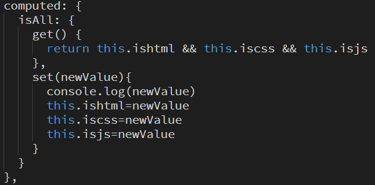
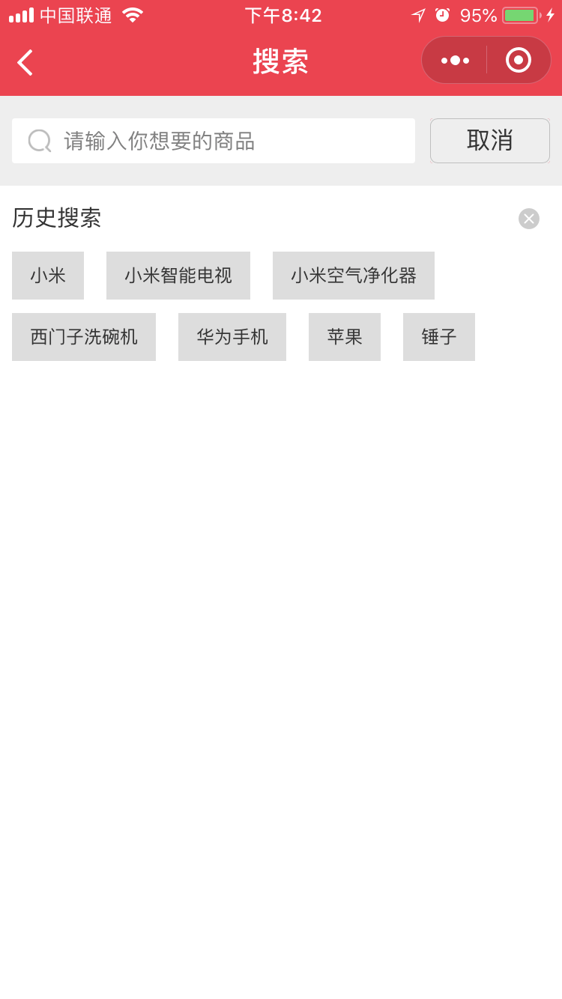

# 微信小程序学习第7天

## vue 的$attrs 和$listeners使用

[传送门](https://cn.vuejs.org/v2/api/#vm-attrs)

方便爷组件和孙组件通信

```html
<Son v-bind="$attrs" v-on="$listeners"/>
```


## 计算属性setter

[传送门](https://cn.vuejs.org/v2/guide/computed.html#%E8%AE%A1%E7%AE%97%E5%B1%9E%E6%80%A7%E7%9A%84-setter)

1. 计算属性默认的用法其实是计算属性的getter方法

2. 计算属性的setter方法里面可以获取到值变化

3. 如果不设置firstNamea或lastName，不会改变fullName的

4. 典型的应用场景是checkbox全选/全不选

   


#### 练习总结

1. 计算属性的set方法触发的条件是，计算属性的key有变化的时候
2. 了解一下Object.values, Array.prototype.every(some)


## 数据存储

[传送门](https://developers.weixin.qq.com/miniprogram/dev/api/storage/wx.setStorageSync.html)

1. 浏览器的本地存储

   1. localStorage（关闭浏览器后还存在）
   2. sessionStorage(关闭浏览器后不存在)
   3. 区别，使用，大小限制，存储类型？？？
      1. setItem(key,string),removeItem,getItem,clear
      2. 存储类型只能是字符串
      3. 5M

2. 小程序

   1. wx.setStorage,wx.getStorage....

   #### 01.存数据

   建议用setStorageSync

   同步和异步有啥区别

   ```js
   // 异步存储
   wx.setStorage({
      key: 'name',
      data: 'Joven',
     success:function(){
       // 这里存储成功
     }
   })
   // 建议用同步存储
    wx.setStorageSync('age', 28)
   ```

> AJAX的A是Async
>
> fs.readFileSync

#### 02.取数据

建议用getStorageSync

```js
// 异步取数据
wx.getStorage({
  key: 'name',
  success: function(res) {
    console.log(res)
  }
})
// 建议用：同步取数据
console.log(wx.getStorageSync('age'))
```

> getStorageInfo是用来获取storage所有的信息的

#### 03.清除数据

1. clearStorageSync 清除所有数据

2. 删除指定项数据

   ```js
   // 异步删除指定key的数据
   wx.removeStorage({
     key: 'name',
     success: function(res) {
       console.log(res)
     },
   })
   // 同步删除指定key的数据
   wx.removeStorageSync('name')
   ```


#### 04.总结

1. 小程序的storage其实是对手机存储系统的文件读取，所以是异步的

2. 小程序的存储可以是复杂类型，JSON.parse能够解析的

3. 单个 key 允许存储的最大数据长度为 1MB，所有数据存储上限为 10MB 

   >内存，速度快，断电会丢失存储，价格贵，容量偏小
   >
   >硬盘，速度偏慢，断电不会丢失，价格相对便宜，容量大。
   >
   >

#### 05.存一个复杂类型数据，然后取出来

1. setStorageSync只是写法上同步，本质存储依然是异步的。（fs.readFileSync）


## Vue组件通信

#### 01.父传子

 1. 父组件使用子组件标签中添加属性并赋值

    ```html
    <child message="父传给子的值"></child>
    ```

 2. 子组件中props声明对应属性

    ```js
    Vue.component('child',{
        template:'#chlidTpl',
        props:['message']
    })
    ```

注意点：

1. 在HTML 中的模板时，驼峰命名prop名需要转换成等价的`-`分隔命名（.vue文件中没有这个限制）

   ```html
   <child parent-msg="父传给子的值"></child>
   ```

2. 不应该在一个子组件内部改变 prop ，最好 定义一个data 属性并将这个 prop 用作其初始值 

   ```js
   props:['message'],
       data(){
       return{
           info:this.message
       }
   }
   ```

> vue serve需要安装`npm install -g @vue/cli-service-global`，才可以使用
>
> html里面的id是js来使用的，class由css来使用。id是驼峰，css用‘-’
>
> js里面字符串用单引号，html里面用双引号
>
> 如果父传子是对象的话，初始化data属性需要clone object

#### 02.父传子动态

```js
watch:{
    message(newValue){
        this.info = newValue
    }
}
```

#### 03.练习-父传子，动态传递对象

	1.  基于vue-cli脚手架
 	2.  验证传属性时，能不能用驼峰，能够

#### 04.子传父

1. 子组件中 $emit来触发一个自定义事件，并传递一个参数 

   ```js
   this.$emit('child-event','子传给父的消息')
   ```

2. 父组件里的子标签中监听该自定义事件并添加一个响应该事件的处理方法 

   ```html
   <child @child-event="showChildMsg"></child>
   ```

注意点：

[事件名](https://cn.vuejs.org/v2/guide/components-custom-events.html#%E4%BA%8B%E4%BB%B6%E5%90%8D)

1. 推荐总是使用`-`分隔的方式命名事件名（.vue文件中没这种限制）

#### 05.子传父与v-model

1. 将其 `value` 特性绑定到一个名叫 `value` 的 prop 上 

   ```html
   <input type="text" :value="msg" @input="sendMsg2Parent">
   ```

2. 在其 `input` 事件被触发时，将新的值通过自定义的 `input` 事件抛出 

#### 06.兄弟

 eventBus我们只创建了一个新的Vue实例，以后它就承担起了组件之间通信的桥梁了，也就是中央事件总线。 

1. 组件1通过eventBus.$emit来触发一个自定义事件，并传递参数

   ```js
   eventBus.$emit('toChild2','组件1传给组件2的值')
   ```

   

2. 组件2通过尽早通过eventBus.$emit监听该自定义事件，并添加事件处理方法

   ```js
   create() {
       eventBus.$on('toChild2',function(data){
           console.log(data)
       })
   }
   ```


## 优购案例-搜索结果

#### 抽取头部输入框为单独的组件

1. search_list页面引入SearchBar.vue组件

2. SearchBar.vue组件中，输入框有内容就展示x按钮，没内容就不展示x按钮

   1. 获取输入内容v-model.trim:keyword
   2. 是否展示x按钮 v-show="keyword"

3. 点击x按钮清空输入框内容

   1. 事件@click:keyword=''

4. 设置输入框confirm-type="search"

5. 输入框回车，触发搜索商品

   1. SearchBar组件keyword不为空时，$emit一个confirm事件
   2. search_list页面注册一个@confirm事件，在事件里面触发搜索

6. 设置搜索列表的初始值

   1. SearchBar标签，绑定:query=“query”
   2. SearchBar组件，props接受query, data里面初始化keyword,**并watch**

   

## 优购案例-搜索页面



#### 01.案例分析

1. 首页和分类页搜索热区，点击跳转到搜索页面
2. 输入框输入，点键盘右下搜索，去到搜索列表页
3. 点历史搜索关键字，去到搜索列表页
4. 搜索历史记录存储到storage
5. 输入框中有内容就展示x，点击x清除内容

#### 02.静态页面

1. 新建搜索页search
2. 搜索顶部
3. 历史搜索

#### 03.基本逻辑

1. 首页和分类页搜索热区，点击跳转到搜索页面
2. 输入框回车，跳转到搜索列表页
   1. 搜索页面注册事件@confirm:toSearchList
   2. 跳转到搜索列表页 /pages/search_list/main?query=${data}
3. 展示历史搜索列表，存储在storage中
   1. data里面从storage中取数据`keywordList`
   2. 渲染列表
4. 点击回车，历史搜索列表头部添加关键字，并保存
   1. 事件@confirm:toSearchList处理
   2. unshift给数组头部插入关键字，不能重复使用filter
   3. 存储到stroage wx.setStorageSync
5. 页面返回时才显示添加的关键字
   1. 页面onShow时才改变keywordList
6. 点击历史搜索列表元素，输入框显示点击的关键字，跳转到搜索列表页, 同时元素添加到头部
   1. 元素点击事件@click:toSearchList(item)
   2. data属性query设置到SearchBar中
   3. 跳转wx.navigateTo
   4. 数组删掉元素，数组头部插入元素
   5. 删除的数组=splice(从哪一项开始删除，删除多少项)
7. 点击x的时候，清除搜索历史
   1. 事件@click：clearKeywordList
   2. 清除keywordList和storage
   3. 确认弹框wx.showModal
8. 返回页面清空输入框


## 优购案例-购物车


#### 01.页面分析

1. 商品详情点购物车，或者tabBar点购物车去到购物车页面
2. 去掉收货地址选择，一般收货地址放在支付页面
3. 页面显示用户添加进购物车的商品列表，用户可选择商品，修改商品数量
   1. 实际项目一般购物车数据增删改查直接发请求
   2. 购物车数据存在storage要存
4. 点结算去到支付页面
5. 购物车里面并不是所有商品都会结算，可以选择是否进行结算
6. 生成订单，不管有没有支付成功，参加结算的商品应该从购物车去掉

#### 02.静态页面

1. 标题设置
2. 购物车信息头部
3. 购物车信息列表
4. 底部信息

#### 03.基本逻辑

1. 商品详情点购物车跳转到购物车页面

   1. 事件@click:toCart

   2. 切换到tab页wx.switchTab()

2. 商品详情页面，添加购物车，购物车数据存到storage,数据结构越简单越好，如下:

   1. 购物车的数据结构越简单越好，storage会比较小
   2. 购物车至少得有商品Id,商品的数量,商品有没有被选中
   3. 初次添加，商品数量为1,商品默认是勾选的
     4. 后续添加的，商品数量+1，也是勾选的
     5. 取storage购物车，改数据，再存回去
     6. 如果购物车里面用户勾选了商品，商品详情添加购物车，这个商品就是勾选的
     7. 如果购物车里面用户去勾选了商品，商品详情添加购物车，这个商品就是勾选的

   ```js
   //声明成obj,取数据就方便
   cart = {
     商品id: {
       num: 商品数量, 
       checked:true
     }
   }
   
   //另外一种数据结构
   cart=[
       {
           商品Id，
           商品数量，
           是否选中
       }
   ]
   ```

   1. 判断是否是第一次添加
      1. 如果是数组的话，需要遍历
      2. 如果是对象的话，只需要判断对象上对应的属性是否存在

#### 04.请求数据&渲染数据

1. checkbox iconfont引入

2. 获取购物车数据

   1. 在onShow

3. 根据商品ids请求商品详情，方法getGoodsList

   1. 商品ids来自于storage购物车数据
   2. 如果购物车数据为空，不必请求
   3. 接口 `/api/public/v1/goods/goodslist?goods_ids=${ids}`

4. 商品数量修改

   1. 商品数量来自storage购物车
   2. -按钮最小值为1，1时disabled
   3. +按钮
   4. **合并数据, cart和goodsList**

5. 商品的选中状态切换

   1. 商详添加购物车时，默认checked:true
   2. 购物车商品选中状态和商品列表数据合并
   3. checkbox的选中状态:class

6. 全选逻辑

   1. 所有商品选中时，触发全选选中状态;所有商品不选中时，去勾选全选
      1.  **every()是对数组中每一项运行给定函数，如果该函数对每一项返回true,则返回true。**
      2.  **some()是对数组中每一项运行给定函数，如果该函数对任一项返回true，则返回true。** 
      3.  flat
   2. 选中全选，所有商品选中;去勾选全选，所有商品不选中。

   >  // 如果所有商品都勾选的话，就true;详解：拿出goodsList.length==勾选商品的个数
   >
   >  // 默认true,遍历goodsList，如果有一项没勾选的话，就false
   >
   >  forEach不能够break; for of是可以break

7. 总数量显示

   1. reduce的用法

      ```js
      arr.reduce(function(上一次计算后的值，当前遍历中的元素)){
          return 上一次计算后的值与当前遍历中的元素的运算
      }，初始值)
      ```

8. 总价显示

   1. 注意只有选中的商品才参与计算

9. 页面隐藏时onHide，保存cart状态到storage