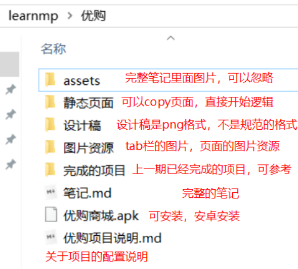
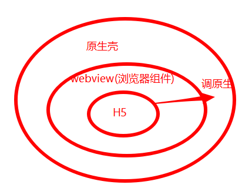
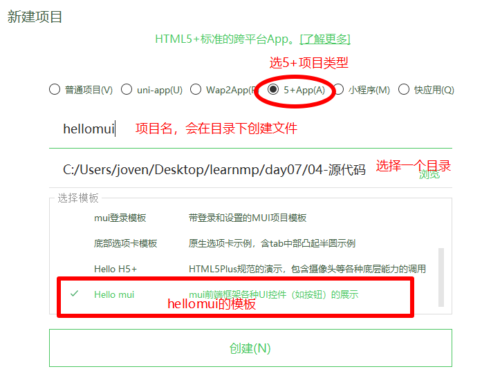
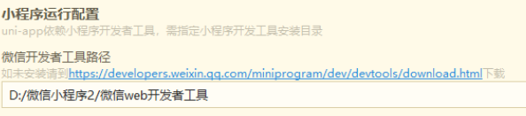
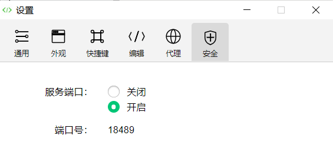
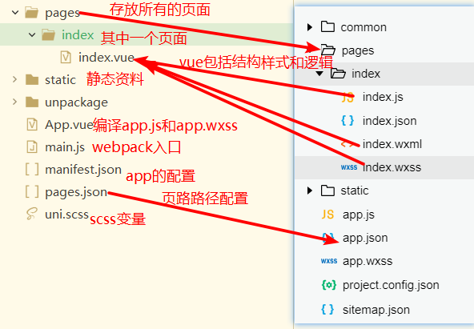

# 微信小程序学习第7天

## 每日反馈

1. 园园我还能学~写完了好有成就感呀~期待下个项目的开始~奥力给
2. 现在面试改成了网上面试，面试官如果要自己曾经做过的产品链接？该怎么回答，可以说和公司签过保密协议，不方便透露吗？
   1. 问叔叔
   2. 一般来说，不存在产品保密。只有代码保密
   3. 简历怎么项目？
3. 什么时候涛哥能分享一下自己的笔记


## 回顾

1. 数据缓存

   1. 存储，相当于浏览器里面的localStorage, 而且API也很像localStorage

   2. 推荐使用带sync的api, 本质也是读文件，所以也是异步

      ```js
      wx.setStorageSync(key，Object) 存储某一个key
      wx.getStorageSync(key) 获取某一个key的数据缓存
      wx.removeStorageSync(key) 清除某一个key的数据缓存
      wx.clearStorageSync() 清空所有
      ```

2. 组件Input

   1. 没有边框
   2. type表示键盘的类型
   3. confirm-type 键盘右下角按钮的文案
   4. bindconfirm 键盘右下解铵钮的点击事件
   5. bindinput 可以在用户输入的时候，获取输入的值 event.detail.value

3. 手机号码登陆页的倒计时功能

   1. 获取验证码的文案会变，两种状态，isCountDown
   2. 开启倒计时，定时器，每一秒减1。需要另外一个data属性countNum--
   3. countNum不希望它为0以下
      1. 如果大于等0, 直接设置data.countNum--
      2. 如果小于0，按钮的文案变成获取验证码，isCountDown=false. countNum重置，清除定时器
         1. let timer = setInterVal , clearInterVal(timer)
      3. 如果在倒计时中，这个点击要忽略掉
         1. 判断isCountDown===true, return


## 作业检查

1. https://gitee.com/xueBingChuan/mogu/tree/home_3.16
   1. 确定能获取到验证码？
   2. 请求方法命名叫video? http,request。要注意命名
   3. phone我们给了初始值，方便我们调试，最终我们需要置为""
2.  https://gitee.com/chen_yi12345/mushroom46.git
   1. 代码太像
3. https://gitee.com/mydell/mushroom-online/tree/home_zhanghao_20200316/
   1. 赞
4. https://gitee.com/z1_j2_w3/mushrooom-mp-46/tree/Fea-molly/
   1. 赞
5.  https://gitee.com/nwy666/mushroom/tree/mushroom-dev1/
   1. 确定能获取到验证码？
   2. 挺好，有自己思考
   3. 如果用户需要登陆态，但是token没有，跳转登录
6.  https://gitee.com/huaixiyu/mushroom-mp-46/tree/Fea-joven_20190402/
   1. 单词拼写
   2. /
7. https://gitee.com/mozhaoyuan/mushroom
   1. 在onShow里面取token，然后判断
8. https://gitee.com/zheshiyigejimodetian/mushroom-mp.git
   1. 静态页面自己完成的
   2. 关于代码的路径或者文件名里面不要有中文
9. https://gitee.com/xiaomumu1002/mushroom-mp-46/tree/mumu_20200316
   1. countNum的类型，尽量不要改变变量的类型
   2. 前端校验做了


## 优购商城介绍

> 大家拉取一下learnmp

1. 小程序里面最多的业务就商城。学生工作做的最多也是商城
2. 商城逻辑，小米Lite或者京东app的逻辑
3. 基本逻辑, 搜索->找到商品->去商品详情->加入购物车->结算->微信支付
4. 用uniapp完成微信小程序，h5，而且可以支持app(安卓和ios)
   1. 但是打包只能打安卓
5. 不用在本地部署服务器，直接调线上接口就行

#### **优购文件夹目录说明：**




## 移动开发

| 开发方式         | 平台                                                         | 逻辑       | 视图              | 用户体验   | 开发周期     |
| ---------------- | :----------------------------------------------------------- | ---------- | ----------------- | ---------- | ------------ |
| 原生(Raw)        | iOS: Object C、Swift<br />Android: Java、Kotlin              | 原生       | 原生              | 好         | 长，审核太慢 |
| 移动Web(h5)      | 浏览器                                                       | js         | HTML、css         | 无原生能力 | 短           |
| H5混合（hybrid） | 移动web+原生壳，原生提供浏览器webview，可以加载网页，**还有访问原生的能力** | js         | HTML、css         | 一般       | 短           |
| 原生混合         | React Native与Weex(把js、html、css转成原生代码)              | js         | 原生              | 稍好       | 较短         |
| 小程序           |                                                              | JavaScript | 小程序组件、css等 | 好         |              |

1. 原生App开发，用户体验好，审核慢
   1. 对动画支持好，数据处理快
   2. 用在直播，或者App入口及的页面
   3. 随着手机性能越来越好，用户体验好优点变得没那么重要
   4. 审核慢
      1. ios的Appstore审核严，而且也比较慢2周
      2. 安卓，需要应用宝，小米应用商城，3~4天审核时间

2. 移动端H5
   1. 我们做的黑马头条就是典型的h5
   2. 写这个页面所用到的技术和黑马面面没有区别，都是用html,css,js
   3. 没有原生能力，无法调摄像头
   4. 应用场景：h5的应用，微信公众账号就是网页
3. H5混合是用来做App
   1. 原生提供一个webview组件（可以理解成浏览器），webview组件运行h5，同时h5也拥到调原生的能力
   2. 95%的时间，还是在写h5, 也就是绝大部分时候还是在写html,css,js(vue.js)
   3. 另外5%, 就是需要写访问原生
   4. 性能还行，但是动画还是卡
   5. 一套代码可以支持h5和app
   6. 发布App时，不用审核
   7. 现在市场上，流行做APP的技术就是H5混合



4. 原生混合
   1. 原理，把html,css,js转到原生的配置，可以令到调原生的组件。
   2. 基本的动画是流畅的
   3. 一套代码只支持安卓或者ios,不支持H5
   4. 开发的话，上手比较难一些
   5. 发布App时，不用审核
5. 小程序
   1. 原理上基本和h5混合一致
   2. 性能比较好
   3. 一般来说app阉割版本，用来引流


## 原生小程序与第三方小程序框架们

原生小程序即微信小程序官方提供的语法。

#### **原生小程序的痛点：**

1. 类vue语法怪异
2. 微信开发者工具比较坑，没有vscode好用
   1. 微信开发者工具预览，很像vscode
3. 第三方框架支持得不好
4. npm支持不好，less的支持需要配置比较麻烦

#### **几个常见的第三方小程序框架对比**

 	1. wepy
      	1. 类vue语法，坑比较，腾讯在维护
 	2. mpvue
      	1. 是wepy之上的男人，更优秀一点. 正宗的vue
      	2. 美团公司
      	3. mpvue只支持各种小程序，不支持h5
      	4. 坑还是很多
 	3. uniapp
      	1. mpvue之上的，也是正宗vue
      	2. uniapp支持各种小程序，支持app，同时支持h5
      	3. 坑比较少
 	4. taro
      	1. react语法
      	2. 支持各种小程序
      	3. 出自京东

#### **为什么要使用第三方小程序框架**

	1. 可以用熟悉vue语法
 	2. 一套代码多端运行

#### **扩展：**

1. 很多地方都说"原生xx", 这里原生可以理解成官方提供的语法
   1. 原生app，就是指ios用object-c，安卓用Java来开发
   2. 原生小程序，微信小程序官方提供的语法
2. 跨端开发框架：一套代码，支持多端（app，h5, 各种小程序）
3. 框架对比：
   1. [传送门](https://juejin.im/post/5ca1736af265da30ae314248)


## Dcould(数字天堂)的产品

1. **HBuilder** X，就是开发工具
   1. 也不是国产。底部是IBM eclipse装了一些插件
   2. 快捷键可以设置成vscode
2. **uni-app**
   1. 用vue语法来写小程序，app，h5
3. **H5+** 
   1. h5+调原生的能力
4. MUI
   1. h5+之上一套ui框架
   2. 类似于html,css,js=>bootstrap的关系

#### 提示：

1. 文档写得很详细，flex学习链接，怎么联手机。。。
2. 还是适合学习和小公司产品


## 开发工具HBuilder和HBuilderX

[传送门](https://www.dcloud.io/hbuilderx.html)

hbuilder就是一个开发者工具，快捷键可以设置为vscode，上手比较简单

#### 安装：

1. 下载App版本
2. 最好在C盘建一个文件，hbuilder.zip拖进去，解压它。
   1. 解压时耐心一点，让它解压完整

3. 找到hbuilderx目录，找到hbuilder.exe文件，双击打开，最好注册账号

#### 特点：

1. 设置快捷为vscode的，工具->预设快捷键方案切换->vs code
2. 可以切换主题, 支持绿柔，酷黑
3. 支持vue
4. 支持打包h5为apk
5. 支持真机调试

#### 练习说明

1. 新建项目
   1. 新建项目入口有很多，一般文件->新建->新建项目
2. 视图-
   1. 项目管理器
      1. 在打开的文件tab上双击，可以打开项目管理器
      2. 或者视图->项目管理器勾选
   2. 在hbuilder里面可以放多个项目，但是为了避免改到其他项目
      1. 可以右键关闭项目
      2. 已经关闭的项目，在项目管理器下边显示
3. 工具
   1. 设置 会打设置。建议设置制表符长度为2个空格


## *HBuilder基本使用

创建一个h5+类型的项目，同时选择hellomui模板



1. 浏览器运行
   1. 选择一个index.html打开，运行->运行到浏览器或者内置浏览器
2. 真机调试
   1. 首先需要手机联上hbuilder，运行->运行到手机或者模拟器
3. 打包apk(只支持安卓)
   1. 发行，原生App-云打包
   2. 在弹框里面，去勾选ios，因为没有证书，选公共测试证书，打包即可
      1. 需要等待
      2. 也可以发行->查看云打包的状态，如果打包完成，会在控制台给下载链接
   3. 定制app的名称和图标，在项目目录下manifest.json打开
      1. 基础配置->应用名称，填一个名字即可
      2. 图标配置->浏览打开一个png图片，自动生成所有
4. 底部的控制台会显示`项目名-平台`
   1. 可以找到这个tab，右侧有重启和停止的按钮
5. 在项目结构里面可以直接粘贴


#### hbuilder连结手机：

1. 安卓找到你的系统版本，点击7次，打开开发者选项，然后进入开发者选项目，打开usb调试及usb安装。
   1. 根据你自己的安卓手机类型，百度一下，如何打开开发者选项
   2. 数据线连结电脑时，手机上会弹出连结类型，选‘传输文件“
   3. 可能需要单独安android_base.apk, 会在控制台提示下载andorid_base.apk.安装，再重新真机调试
2. ios连结hbuilder
   1. 下载安装itunes
   2. itunes可以联结你的手机
   3. 重启hbuilder，hbuilder就可以联结你的手机
   4. 真机调试会安装一个基座，信任证书。设置->通用-> 信任数字天堂
3. 再不行，参考https://ask.dcloud.net.cn/article/97

#### 注意点：

1. 打包apk只支持安卓
2. 真机调试支持ios和安卓，ios比较稳定些，安卓可能会因为线松不稳定
3. 真机调试如果搞不定的话，不阻塞后面的学习


#### 练习：

1. 创建hellomui项目
2. 浏览器运行
3. 手机连结hbuilder
4. 真机调试
5. 打包apk


## *H5+基本使用

[传送门](http://www.html5plus.org/doc/h5p.html)

h5+是html5和调用原生的能力组合

调用原生的能力全部是js plus对象，所以只h5混合才有这种能力

作用：用来开发h5混合的app的

原理：是把一些常见js调原生的能力内置了，以plus对象提供

```js
// 拨打电话API
plus.device.dial(18372713320)
//设备发出蜂鸣声
plus.device.beep(10)
// 振动
plus.device.vibrate(1000)
let chenCar = plus.camera.getCamera()
// 会打开手机摄像头拍照
chenCar.captureImage()
// 录视频
chenCar.startVideoCapture()
```

#### 注意点：

1. 学习h5+api，有助于我们更加了解h5+混合

2. 一般大公司不会使用h5+来写app
   1. plus调原生的能力不够，扩展性不够好
   2. 代码公开


## uni-app介绍

[传送门](https://uniapp.dcloud.io/)

**是什么？** 使用vue.js开发所有前端应用的框架

**如何使用？**

1. 新建uniapp项目，可以选择一些模板，我选择mix-mall
   1. 来自于插件市场，选一个导入Hbuilderx
      1. 需要登陆hbuilder账号
2. 运行到内置浏览器
3. 运行真机调试
4. 运行微信开发者工具

#### 提示：

1. 插件市场里面项目，大家参考用来作简历上的项目

2. 在uniapp装插件，需要在工具->插件安装，找到对应插件安装

3. 需要配置微信开发者工具的路径

   

4. 在微信开发者工具里面，打开工具 -> 设置 -> 安全设置，将服务端口开启



5. 开发时，我们用hbuilder来写代码，微信开发者工具来看效果

   

## uni-app文档简介

[传送门](https://uniapp.dcloud.io/)

1. 介绍，可以理解成入门教程
2. 框架：uniapp原理
3. 组件：在结构里面使用的标签
4. API：方法和对象可以。uni.xxx
5. 插件市场：有一些项目模板

文档通俗通读


## Vue脚手架的方式创建uniapp(了解)

[传送门](https://uniapp.dcloud.io/quickstart?id=_2-%e9%80%9a%e8%bf%87vue-cli%e5%91%bd%e4%bb%a4%e8%a1%8c)

1. 确认已经安装vue脚手架3.x,或者4.x

2. 找一个目录，打开命令行工具，执行这个命令

   ```bash
   vue create -p dcloudio/uni-preset-vue 项目名
   ```

   

3. 根据命令行提示，选择一个模板

4. 进入目录，运行npm run serve,打开h5

   1. 运行npm run dev:mp-weixin就会生成dist目录

总结：

通过vue脚手架的方式创建uniapp，我们可以了解到uniapp本质上也是nodejs工程和webpack


## uni-app的工程结构

[传送门](https://uniapp.dcloud.io/frame?id=%e7%9b%ae%e5%bd%95%e7%bb%93%e6%9e%84

```
┌─components       组件的目录     
│  └─comp.vue         	其中的一个组件
├─pages                所有页面的目录
│  ├─index				其中一个页面
│  │  └─index.vue       页面主组件，页面结构样式和逻辑
│  └─list              list页面
│     └─list.vue        
├─static              静态资料，图片，fonts文件  
├─main.js             webpack入口
├─App.vue               会编译成全局逻辑和全局样式
├─manifest.json         app打包相关配置
├─pages.json            可以理解成app.json，包括页面路径配置，还有tabbar
└─uni.scss            scss变量，可以忽略掉
```




1. pages.json里面
   1. pages属性
      1.  页面的路径
      2. 页面配置在style里面
   2. globalStyle相当于app.json里面window属性，里面属性名和微信小程序完全一致
2. pages/页面/xx.vue这里包括页面的结构样式和逻辑


## uni-app框架简介

**完全可以使用vue语法，小程序的组件和小程序的api可以使用，rpx单位也可以使用**

[传送门](https://uniapp.dcloud.io/frame)

1. 标签的更改，uniapp提供的组件，都可以当标签进行使用
   1. view,text,navigator,input ,image,picker
2. vue语法
   1. 双向数据绑定
   2. 方法中this
      1. 改data属性this.isRed=值
      2. 取data的属性this.isRed
   3. v-bind:class
   4. 事件注册也是vue语法
3. 样式方面rpx可以使用
4. 建议使用uni.代替wx.


#### 注意点：

1. 因为我们的uniapp可以支持多个平台，所以一定要考虑兼容性问题。非uniapp组件不要使用，img,ul,li标签不要使用


## 优购案例-准备

1. 在hbuilder创建一个uniapp工程

   1. 选择uniapp类型，选择默认模板
   2. 选择一下非git项目目录存放

2. git管理推送到码云

   1. 首先在码云创建仓库

      1. 仓库的名称+简介，其他不需要

   2. 切到ssh协议，根据它的提示推送工程

      ```bash
      #去到你的uni-yougou46工程下，然后git bash打开
      #初始化本地工程
      git init
      #把所有文件添加到暂存区里面
      git add
      #提交
      git commit -m '第一次提交'
      # 添加远端git服务器，从码云copy
      git remote add origin 你创建的码云仓库路径
      #在远端创建master分支，并把本地的master推送到远端的master分支
      git push -u origin master
      #本地创建开发分支,并切换
      git checkout -b Fea_joven_20200402
      #在远端创建Fea_joven_20200402分支，并把本地的Fea_joven_20200402推送到远端的Fea_joven_20200402分支
      git push -u origin Fea_joven_20200402
      ```

      

## 总结


## 作业

1. 明晚之前，各组长把组员的码云的git地址收集给班长
2. uniapp的语法
3. 连结手机