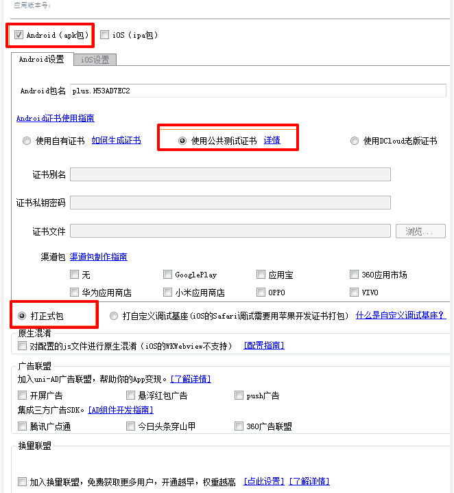

# 微信小程序学习第7天

## 每日反馈

1. 园园我还能学~写完了好有成就感呀~期待下个项目的开始~奥力给
2. 现在面试改成了网上面试，面试官如果要自己曾经做过的产品链接？该怎么回答，可以说和公司签过保密协议，不方便透露吗？
3. 什么时候涛哥能分享一下自己的笔记


## 回顾

1. 数据缓存
2. 组件Input
3. 手机号码登陆页的倒计时功能


## 作业检查

1. 薛冰川 https://gitee.com/xueBingChuan/mogu/tree/home_3.16
   1. 确定能获取到验证码？
   2. 请求方法命名叫video?
2. 陈海波 https://gitee.com/chen_yi12345/mushroom46.git
   1. 代码太像
3. 李健 https://gitee.com/mydell/mushroom-online/tree/home_zhanghao_20200316/
   1. 赞
4. 金小霞 https://gitee.com/z1_j2_w3/mushrooom-mp-46/tree/Fea-molly/
   1. 赞
5. 聂万玉 https://gitee.com/nwy666/mushroom/tree/mushroom-dev1/
   1. 确定能获取到验证码？
6. 李建鹏 https://gitee.com/huaixiyu/mushroom-mp-46/tree/Fea-joven_20190402/
   1. 单词拼写
   2. /


## 优购商城介绍

1. 演示app，h5及微信小程序
2. 优购小程序是商城，购物的逻辑可以参考京东App和小米lite小程序
3. 基本流程是这样的，点商品去到商品详情，添加购物车，结算付款，查看订单

**优购文件夹目录说明：**


## 移动开发

| 开发方式         | 平台                                                         | 逻辑       | 视图              | 用户体验   | 开发周期     |
| ---------------- | :----------------------------------------------------------- | ---------- | ----------------- | ---------- | ------------ |
| 原生(Raw)        | iOS: Object C、Swift<br />Android: Java、Kotlin              | 原生       | 原生              | 好         | 长，审核太慢 |
| 移动Web(h5)      | 浏览器                                                       | js         | HTML、css         | 无原生能力 | 短           |
| H5混合（hybrid） | 移动web+原生壳，原生提供浏览器webview，可以加载网页，**还有访问原生的能力** | js         | HTML、css         | 一般       | 短           |
| 原生混合         | React Native与Weex(把js、html、css转成原生代码)              | js         | 原生              | 稍好       | 较短         |
| 小程序           |                                                              | JavaScript | 小程序组件、css等 | 好         |              |


1. 原生

   3. 主要是因为开发周期长，**审核时间长**
   4. 苹果一般两周，安卓需要小米商店，华为应用，应用宝
      1. 审核比较严
         1. 要求你的APP必须有注册功能
         2. 不能金融功能
         3. 所以需要弄个配文件，关闭和开启金融和注册功能
   5. 很少有纯原生的写的应用
   6. 除非对性能要求极高的。直播

2. 移动Web

   1. **没有原生能力**
   2. 开发微信公众账号
   3. 大多数都作为一个引流的入口

3. H5混合（黑马头条的h5打包成App）

   1. 把移动网页打包到一个壳子中，安装到手机上去使用
   2. 性能和开发效率都不错，市场大部分用这种模式
   3. 95%以上的代码还是h5，另外小于5%是Js调用原生
   4. **一套代码安卓、ios和h5，但是复杂的动画是不是行**
   5. 无须审核
      1. 只要不更新原生代码，无须审核
   6. js和原生通信，js访问原生的能力到底是怎么获取的？
      1. 当我们用window.alert，原生java有方法可以获取到字符串的传参
      2. window.alert('leka://com.package.user/getCamcra'),window.confirm,window.prompt
   
7. 原生混合

   1. 语法稍有学习成本，只能兼容iOS和安卓
   2. 对性能要求稍好的项目会用
   3. 性能：原生>原生混合>h5混合

8. 小程序

   1. 开发成本低，体验好
   2. 一般是App版的阉割版本，作为引流


## 原生小程序与第三方小程序框架们

原生小程序即微信小程序官方提供的语法。

**原生小程序的痛点：**

1. 开发工具：微信开发者工具，没有vscode好用
2. 对前端工程化支持不好。比如npm安装, 引入框架
3. 似曾相识的小程序语法
4. 不能使用 less、scss 等预编译器

**几个常见的第三方小程序框架对比**

1. wepy只支持微信小程序，类vue语法
2. mpvue支持各种小程序
   1. vue的语法
   2. 优化了一些wepy的特性，创建的框架
   3. 不支持H5
3. uniapp支持各种小程序、h5、App, 用Vue语法
4. Taro支持各种小程序，React语法

**为什么要使用第三方小程序框架**

1. 只要熟悉vue或react即可快速上手,学习成本低
   1. 熟悉的前端工程化，css预编译，npm包都支持
2. 一套代码可在多端编译运行(微信,支付宝,h5) 

**扩展：**

1. 很多地方都说"原生xx", 这里原生可以理解成官方提供的语法
   1. 比如`原生App`，那么就是java开发的安卓或者object-c开发的苹果App
2. 跨端开发框架：一套代码支持多个平台的框架
3. 跨端开发框架对比，uniapp算是优秀
   1. [传送门](https://juejin.im/post/5ca1736af265da30ae314248)


## Dcould(数字天堂)的产品

1. **HBuilder** X开发工具，类似于vscode
2. **uni-app**一套代码支持多端的框架
3. **H5+** 混合模式的App
4. MUI基于H5+的UI库

特点：

1. DCould公司的文档写得挺详细的，多看看可以更快点满前端技能点
2. 各个产品适合学习，做小型公司的产品

> dcould公司的文档不错，不用再抱怨文档不好了


## 开发工具HBuilder和HBuilderX

[传送门](https://www.dcloud.io/hbuilderx.html)

也是一款强大的前端IDE（绿色版），最好注册账号登录，**建议下载App开发版本**（支持打包apk）

1. 可以使用vscode的快捷键方案
2. 支持vue语法
3. 支持打包apk
4. 支持真机调试
   1. h5页面开发时希望在手机上，边改边看到效果
5. 支持暗黑主题

**注意解压文件时，文件比较多，耐心等。**

> 国产IDE？不存的，底层是eclipse. 可以理解成MIUI和安卓的关系
>
> 建议在C盘建一个myApp的文件夹，把zip包放进去，解压


## *HBuilder基本使用

新建`5+App`,选择Hello mui模板

1. 浏览器运行
   1. 选中index.html，运行->选择浏览器
2. 真机调试
   1. 选择项目运行->选择手机
   3. 如果基座安装不成功的话，下载android_base.apk进行安装。再做第1步
3. 打包apk

   1. 发行->云打包
   2. 勾选安卓，选择使用公有证书 
      1. **去勾选ios**
   3. 等待生成apk，下载安装即可
   4. 发行->查看打包状态，也可以实时地看打包的情况
4. 底部的控制台会显示`项目名-平台`
   1. 右侧可以重启，停止项目
5. 在项目结构里面可以直接粘贴


#### hbuilder连结手机：

1. 打开手机开发者选项->打开USB调试,连接后确认
2. 安卓：可能驱动不完善，先试着连结应用宝或者360手机助手。再做第一步
3. windows连结iphone需要安装itunes
   1. 安装完itunes提示重启电脑，连接itunes信任设备，运行项目安装基座，信任证书就ok了
   2. 一定要选中项目，然后运行-运行到手机
      1. 不能选项目里面的某个文件
4. [查看连结帮助](https://ask.dcloud.net.cn/article/97)

#### 注意点：

1. 建议调试用iphone
2. 发行只支持apk，只能安装在安卓上
3. 保证解压的hbuilder完整的
4. iphone真机调试
   1. 安装完itunes提示重启电脑，连接itunes信任设备，运行项目安装基座，信任证书就ok了
5. 点击打包的链接，会下载apk，发给安卓手机，安装即可

> ios企业开发者账号，可以不通过AppStore审核使用。



#### 练习：

1. 下载安装hbuilder
2. 新建`5+App`,选择Hello mui模板, 完成真机运行
3. 发行->云打包
4. 安装apk到手机上
5. 再体验一下hellomui App


## *H5+基本使用

[传送门](http://www.html5plus.org/doc/h5p.html)

开发H5混合模式的App，把一些常见的原生能力内置，令到JavaScript能调原生，全部通过`plus`对象来提供的

创建H5+，默认模板

1. 拨打电话

   ```js
   plus.device.dial(15361819220) 
   ```

2. 拍照

   ```js
   let camera = plus.camera.getCamera()
   camera.captureImage()
   ```

#### 注意点：

1. 学习h5+ API, 让我们更加理解h5混合

2. 没连上手机，放忽略掉吧。是安卓的话，装apk体验一下。


## uni-app介绍

[传送门](https://uniapp.dcloud.io/)

**是什么？**uni-app是一个使用vue.js开发“所有”前端应用的框架

**如何使用？**

1. 支持vue.js语法
   1. 小程序的语法就个假生饭
2. iOS、Android、H5、以及各种小程序（微信/支付宝/百度/头条/QQ/钉钉）等多个平台 
3. 适合开发小公司的项目, 特别适合于学习。
   1. 企业需要定制自己原生API，uni-app支持得不好
   2. 核心代码闭源
   3. 打包App，需要云打包，代码泄露
4. uni-app同样支持浏览器运行, app运行及打包成apk，微信开发者工具


## uni-app文档简介

[传送门](https://uniapp.dcloud.io/)

1. 介绍：入门教程
2. 框架：框架原理方面
3. 组件
4. API
5. 插件市场：有很多成熟的项目可参考(抄袭)
   1. 简历上项目经验可以参考


## HBuilder创建uniapp

[传送门](https://uniapp.dcloud.io/quickstart?id=_1-%e9%80%9a%e8%bf%87-hbuilderx-%e5%8f%af%e8%a7%86%e5%8c%96%e7%95%8c%e9%9d%a2)

新建项目，选择uniapp，选择一下你喜欢模板
2. 项目依赖的插件需要安装插件 工具->插件安装（less、sass）
2. 浏览器运行
3. 真机运行及打包成apk
4. 微信开发者工具运行
   1. 选择微信开发者工具的位
   2. 工具->安全->开启服务端口

#### 提示：

1. uni-app有很多好的模板可以使用和参考(fuzhi)


## Vue脚手架的方式创建uniapp(了解)

[传送门](https://uniapp.dcloud.io/quickstart?id=_2-%e9%80%9a%e8%bf%87vue-cli%e5%91%bd%e4%bb%a4%e8%a1%8c)

**推荐用这个方式创建uniapp**

1. 可以体验完整的vue脚手架项目
   1. hbuilder创建的项目，藏了一些目录
2. 可以用我们熟悉的vscode
   1. 不用打开hbuilder

**如何创建呢？**

1. 存放项目的目录下执行命令

   1. 根据提示选择对应的模板

      

   ```bash
   vue create -p dcloudio/uni-preset-vue 项目名
   ```

2. 微信开发者查看效果

   1. 在项目目录下执行命令

      ```
      npm run dev:mp-weixin
      ```

      1. `dist/dev/mp-weixin`目录下即是生成的微信小程序源码

   2. 工具导入`dist/dev/mp-wexin`目录

3. h5运行

   1. 在项目目录下执行命令，npm run serve

4. 真机运行或者打包apk

   1. 把整个工程拖到hbuilder中

#### 注意点：

1. 运行npm命令，如果有"watching"，就表示正在监听改动
2. vscode打开根目录。微信开发者工具打开dist/dev/mp-weixin
3. serve命令是生成h5页面并监听。webpack配置环境有两种
   1. 开发时
      1. h5启动本地server
      2. 监听文件的改动
   2. 上线时
      1. 直接打包成压缩js,css,html
4. 命令行工具有很多，推荐用git bash


## uni-app的工程结构

[传送门](https://uniapp.dcloud.io/frame?id=%e7%9b%ae%e5%bd%95%e7%bb%93%e6%9e%84)

原汁原味的Vue脚手架4.x的项目结构，

重点看src目录

```
┌─components            uni-app组件目录
│  └─comp.vue         	可复用的comp组件
├─pages                 所有的页面
│  ├─index				index页面
│  │  └─index.vue       页面的逻辑结构与样式
│  └─list               list页面
│     └─list.vue        
├─static                存放静态资源（图片）
├─main.js               Vue初始化入口文件
├─App.vue               应用配置和App全局样式(编译成小程序的app.js和app.wxss)
├─manifest.json         打包App相关的图标、app名字，小程序的appid等
├─pages.json            配置页面路由、导航条、选项卡等页面类信息(可理解成小程序的app.json)
└─uni.scss              预置scss变量
```

1. 页面直接是.vue文件，页面路径的配置在pages.json里面
2. pages.json配置路由，导航条和Tab栏等，同小程序app.json的页面管理部分
   1. path是页面路径
   2. style是页面的配置
   3. globalStyle是设置应用的状态栏、导航条、标题、窗口背景色
   4. tabBar配置和小程序一样
3. manifest.json包括app.json的非页面管理部分，还有App相关配置


#### 理解技巧：

如果用hbuilder创建项目的话，总的来说vue脚手架生成的工程结构非常像，其实它也是nodejs+webpack的工程，只不过隐藏一些文件。


## uni-app框架简介

[传送门](https://uniapp.dcloud.io/frame)

**uni-app 使用vue的语法+小程序的标签和API。**

1. 组件view,text,navigator,image,input,button,swiper...
   1. 基本组件和微信小程序一至
2. 正宗的Vue语法
3. wx对象换成uni对象，但是wx依然能用，但是不建议
4. css的变化
   1. 使用rpx和px单位
   2. flex布局

#### 注意点：

1. 大部分html标签能识别，但是不同平台上兼容性很差，**不要使用非uni-app组件外的标签！！！**
2. 如果按规范来写的话，兼容是最好的

**练习：**

1. 试一下swiper
2. 有一个div块，背景是红色的，点击显示/不显示红色


## 优购案例-准备

1. 以命令行的方式选择默认模板，创建项目`uni-yougou46`
2. 微信开发者工具查看运行效果
3. 码云仓库管理
   1. 新建仓库名`uni-yougou46`, 按提示把本地文件夹推送到远端
   2. 新建开发分支`Fea_joven_20200402`

4. 可以尝试写首页的静态页面


## 总结


## 作业
