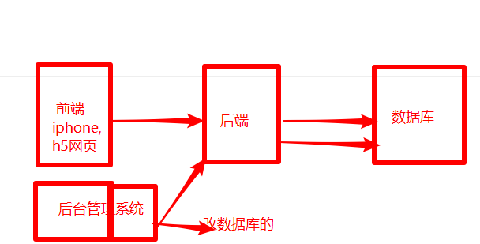
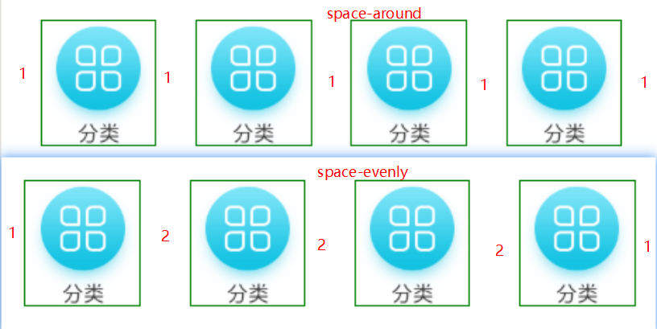

# 微信小程序学习第8天

## 每日反馈

1. 聊天软件会把我们聊天的内容存进数据库吗？不然聊天软件是怎么监控有没有违法的行为。

   1. 界面输入回车，发送到后端，后端再存数据库。

   2. 查数据库一般来说都有后台管理系统

   3. 如果你删除聊天记录，数据库里面会不会删除？会1，不会2

      1. 不会的。
      2. 只需要增加一字段，标识这条记录是删除

      


## 回顾

1. h5+

   1. html5+js调原生App的能力
   2. 通过plus对象来调用

2. mui

   1. h5+的手机端的ui

3. uni-app

   1. 用vue来写一套代码，兼容所有的前端应用
   2. 语法：
      1. 使用vue的语法
         1. 事件注册
         2. for循环
         3. this访问属性和设置属性
         4. v-bind:class
      2. 使用uni-app组件
         1. 和微信小程序组件基本一致
      3. uniapp的api
         1. 基本上和微信小程序的API一致
         2. 不同点：wx.改成uni
   3. 样式一致，可以使用rpx

4. 项目准备

   1. 今晚同学们都提交码云地址

   2. 步骤

      1. 用hbuilder创建项目，命名 uni-yougou46

         1. 选择uniapp+默认模板

      2. 用vscode打开项目目录

         1. 切到源代码管理里面，初始化仓库
         2. 点左上的对号，弹出提交注释框，输入注释，回车就会提交

      3. 在码云上创建仓库

         1. 仓库名 uni-yougou46
         2. 仓库介绍
         3. 是否开源：公开
         4. 其他不用管

      4. 推送本地的代码到远端

         1. 码云上，协议设置为ssh

         2. 不用设置

         3. 在本地仓库的目录下执行, 添加远端的仓库地址

            ```bash
            git remote add origin git@gitee.com:jovenwang/uni-yougou46.git
            ```

         4. 推送一次提交到远端

            1. 在vscod状态栏的左侧，有一个推送到云的按钮，点击就行

      5. 新建分支Fea_joven_20200402

         1. vscode状态栏的左侧，点击master，弹框选择"正在创建新分支"
         2. 回车，输入框输入Fea_joven_20200402
         3. 在vscod状态栏的左侧，有一个推送到云的按钮，点击就行

#### 注意点：

1. uniapp运行到浏览器的话，需要打开某一个页面.vue，才会显示对应的页面
   1. 可以理解成微信开发者工具里面添加编译模式，或者设置默认首页
2. 在hbuilder里面，运行到内置浏览器，它会处理跨域问题


## 优购案例-tarBar设置

uniapp里面tabBar的配置是放在pages.json里面，具体的属性名和微信小程序完全一致


1. 新建四个页面home,categroy,cart,me
2. 在pages.json添加对应在的页面路径
3. copy图片资源里面的tabs的图标
4. copy uniapp文档里面的tabbar配置到pages.json里面，修改对应的页面路径和图片即可

#### 练习说明：

1. tabbar图片路径配置相对路径和绝对路径，都可以。
2. 绝对路径/，代表当前的项目目录
3. 静态资料放在static目录，不要写assets目录
4. 内置浏览器没有缩写，可以运到微信开发者工具


## 优购案例-首页


#### 01.页面分析

1. 优购商城的app首页，tabbar里面点击首页也显示首页
2. 首页内容包括：搜索热区，轮播图，导航和楼层
3. 搜索热区不能搜索，点击跳转
4. 轮播图，导航和楼层基本上都是图片构成
5. 图片点击跳转不做

#### 02.静态页面

1. 安装less

   1. 工具->插件安装-找到less,安装，重启项目

2. 设置标题

   1. 配置属性和微信小程序完全一致

   ```js
   "navigationBarTitleText": "优购",
   "navigationBarTextStyle": "white",
   "navigationBarBackgroundColor": "#eb4450"
   ```

3. 头部搜索

   1. icon组件的使用和微信小程序是一致

      ```html
      <icon type="类型" color="" size="大小"/>
      ```

4. 轮播图

5. 分类导航区域

   

6. 楼层区域

#### 注意点

1. 内置浏览器不怎么好调样式，**所以建议开发时，还是运行到微信开发者工具**

2. 开发时不用关注H5页面的样式，先保证微信开发者工具运行良好

3. 在hbuilder里面u组件名可以快速代码片段

4. 在vscode是没有uniapp插件

5. vue vfor可以给值范围，也就是说如要给一个数字

6. uniapp的组件使用基本和微信小程序一致

   

#### 03.请求数据&渲染数据

1. 渲染轮播图部分
   1. url https://www.uinav.com/api/public/v1/home/swiperdata
   2. uni.request
   3. 尽早发请求 onLoad
2. 渲染分类导航部分
   1. url  https://www.uinav.com/api/public/v1/home/catitems
3. 渲染楼层部分
   1. url https://www.uinav.com/api/public/v1/home/floordata

#### 注意点

1. 数据驱动视图这类框架里面for里面key值，如果列表对应的数组每一项索引不会变的话，给不给都没有影响，给的话，只是因为eslint检查或者IDE检查
2. css里面>代表子元素
3. 改了文件时，需要终端的重新运行
4. 避免v-for和v-if放在同一标签上面，使用block
5. 在uniapp里面的写的v-for转成小程序代码会变成wx:for

#### 04.uni.request封装

1. 使用解构的语法，解析返回的数据
2. 在utils目录新建一个文件request.js，request.js文件export default request方法
   1. 方法里面异步请求逻辑，获取轮播图数据的请求
   2. new Promise实例返回，异步请求的成功回调里面resolve数据
3. home.js引入request.js
4. 使用request方法，在.then里面取数据

#### 05.进一步优化

1. 传参url

2. 抽取基地扯

3. 把request方法设置到Vue原型

   ```js
   // 把request方法设置到Vue原型
   Vue.prototype.$request = request 
   ```

4. async和await的使用

   1. await返回promise.then里面的数据
   2. 有await的代码它的方法必须有async修饰

#### 注意点：

1. 注意需要resolve(res.data.message)


## 优购案例-分类


#### 01.页面分析

	1. 点tab栏的分类，显示的分类页面
 	2. 分类页面内容：头部搜索热区，左右两侧
 	3. 头部搜索热区和首页是一样的
 	4. 左侧展示一级分类
 	5. 右侧展示2级和3级分类

#### 02.静态页面

1. 将头部搜索区域封装为组件

   1. 在components/SearchLink.vue组件
   2. 从home.vue里面把关于搜索热区的结构和样式剪切到SearchLink.vue
   3. 在home.vue文件引入组件，注册组件，把组件名当标签使用
   4. 添加分类页面的编译模式
   5. 在category.vue文件，引入组件，注册组件，把组件名当标签使用

2. 主体部分，左侧和右侧分别滚动

   1. 如果想左侧单独滚动怎么做？

      1. 内容的高度大于需要滚动的区域的高度

         1. 需要滚动的区域的高度得是一个固定的！！！

            1. **让.content占满屏幕剩下的高度**

               ```css
               position: absolute;
               left:0;
               right: 0;
               top:100rpx;
               bottom:0;
               ```

      2. overflow:auto或者scroll

3. 左侧的结构

   1. 基本结构
   2. 选中的样式
      1. 左侧的红色块，我们可以用伪元素来解决
   3. 点击切换选中元素
      1. 哪一个一级分类被选中，那么它就应该添加active样式
         1. active样式是否添加决定于当前元素index===activeIndex
      2. 点击哪一个元素，哪个元素就被选中
         1. @click: activeIndex=index

#### 注意点

1. 当父亲的高度是确定的话，百分比才有用
2. 尽量不要使用css的计算，性能不好
3. **uniapp第一个bug，注册事件，不要在行内写逻辑。都应该用一个事件处理方法** 


## 总结

## 作业：

1. 所有同学的码云地址，麻烦班长和各位组长
2. 优购商城首页
3. uni.request封装
4. searchLink.vue组件
5. 分类左侧
6. 分类全部完成(可选)

