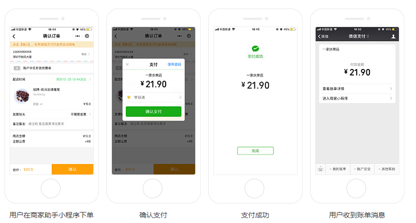
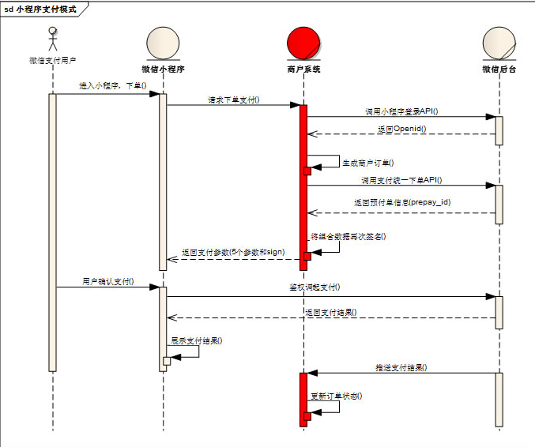

# 微信小程序学习第8天

## 每日反馈

## Vue组件的单元测试

提问：写好一个组件，如何保证组件功能是OK的？让使用者点点？？

​	1. 把组件的功能包含在单元测试里面，别人一运行就知道了。

是什么？Vue组件检查和验证

有什么用？保证自己写的组件功能是完整的，特别是提供组件给别人使用

怎么用？vue-cli有[Jest](https://github.com/facebook/jest) 或 [Mocha](https://mochajs.org/) 进行单元测试的内置选项

1. vue create时，选择定制，选择单元测试的解决方案
2. 在已有的vue cli项目里面添加单元测试功能。 `vue add @vue/unit-jest`
3. npm run test:unit会运行test/unit目录下所有*.spec.js测试用例

#### Vue Test Unit的使用

[传送门](https://vue-test-utils.vuejs.org/zh/guides/#%E8%B5%B7%E6%AD%A5)

1. 计数器
2. 计数器测试用例


## 事件循环(Event Loop)

#### 01.Vue异步更新队列

[传送门](https://cn.vuejs.org/v2/guide/reactivity.html#%E5%BC%82%E6%AD%A5%E6%9B%B4%E6%96%B0%E9%98%9F%E5%88%97)

1. vue在更新DOM时是异步的
   1. 批量处理数据的变更到DOM更新
2. 内部实现尝试用`Promise.then`, 如果没有用 `setTimeout(fn,0)`
3. Promise是微任务，setTimeout是宏任务
4. this.$nextTick或者Vue.nextTick

#### 02.js的事件循环(Event Loop)


>```
>var b =0;
>var a=11
>var obj = new Object()
>```
>
>对于复杂类型，栈上面存放引用，object本身是放在堆里面

1. 所有同步任务都在主线程上执行，形成一个执行栈
2. 主线程之外，还存在一个任务队列。**只要异步操作执行完成**，就到任务队列中排队
3. 一旦执行栈中的所有同步任务执行完毕，系统就会依次读取任务队列的异步任务，**挑选最前面的一个宏任务先执行**，于是被读取的异步任务结束等待状态，进入执行栈，开始执行
4. 主线程不断重复上面的的第三步
5. 宏任务与微任务
   1. 优先执行完所有的微任务
   2. 再执行一条宏任务

#### 03.面试题解答

1. new Promise(fn)中的fn是同步执行；

```js
console.log('a')

setTimeout(() => {
  console.log('2');
  setTimeout(() => {
    console.log('100');
  });
}, 0);

var promise = new Promise(resolve => {
  setTimeout(() => {
    console.log('3');
  }, 0);
  console.log('4');
  resolve()
})

promise.then(() => {
  console.log('5');
  setTimeout(() => {
    console.log('6');
    setTimeout(() => {
      console.log('200');
    }, 0);
  }, 0);
})

setTimeout(() => {
  console.log('7');
}, 0);

console.log('8');
```

##### 思路:

1. 同步任务打印a, 添加宏任务s-2, 添加宏任务s-3,打印4, 添加微任务p-5，添加宏任务s-7,打印8
2. 第1轮事件循环,先执行所有微任务，打印5, 并添加宏任务s-6; 再执行宏任务s-2，打印2,并添加宏任务s-100
3. 第2轮事件循环，执行宏任务s-3, 打印3
4. 第3轮事件循环，执行宏任务s-7, 打印7
5. 第4轮事件循环，执行宏任务s-6, 打印6，添加宏任务s-200
6. 第5轮事件循环，执行宏任务s-100, 打印100
7. 第6轮事件循环，执行宏任务s-200, 打印200
8. 最终顺序是 a,4,8,5,2,3,7,6,100,200


## 小程序授权

[授权](https://developers.weixin.qq.com/miniprogram/dev/framework/open-ability/authorize.html)

部分接口需要经过用户授权才能调用，比如说获取用户信息、通讯地址、微信运动步数等等

#### 授权行为：

1. 第一次发起授权某权限，会弹窗请求权限，用户同意后会调用接口
2. 如果用户已经授权，直接调用
3. 如果用户已经拒绝，直接进入失败。

#### 基本使用:

1. 先用getSetting获取用户授权的状态，如果拒绝的话，提示打开设置允许
2. 否则的话，使用`wx.authorize`发起授权，再调相应接口获取信息

#### 注意点：

1. 用户信息的授权用`<button open-type="getUserInfo">用户信息</button>`, 即使用户拒绝也会弹出授权。

2. ```js
   <button open-type="getUserInfo" bindgetuserinfo="getuf">用户信息</button>
   ```

3. openSetting可以查看到各个授权的状态

4. getSetting也可以得到各个授权状态的数据

5. 在手机微信里面，...点击去到设置里面，可以看到授权状态


## 小程序登录

[传送门](https://developers.weixin.qq.com/miniprogram/dev/framework/open-ability/login.html)

第三方登录：第三方网站授权登录

步骤：

1. 获取用户信息, 如果没有授权过，会在底部弹出授权窗口的

   ```html
   <button open-type="getUserInfo"
               bindgetuserinfo="getuserinfo">点我登录</button>
   ```

2. wx.login()获取到code

3. 调后端接口获取token


## 优购案例-登录

#### 01.页面分析

1. 购物车页面点结算，如果未登录，跳转登录，否则跳转支付页面
2. 登录页上，点立即登录，登录成功，存token, 并goBack

#### 02.基本逻辑

| getUserInfo | 获取用户信息，可以从bindgetuserinfo回调中获取到用户信息 |
| ----------- | ------------------------------------------------------- |
|             |                                                         |

1. 购物车点结算，当然如果没有选择商品就提示;未登录跳转登录; 否则跳转支付页面，
   1. 是否登录判断token
2. 登录页，立即登录
   1. getUserInfo+code，调登录接口
   2. 存储token并back

> 练习注意：
>
> 1. baseURL要更新了https://www.uinav.com
> 2. 微信开发者账号，切换用户，截图让我扫码
> 3. 微信开发者工具appid换掉：wx38d8faffac4d34d2


## 小程序微信支付

[传送门](https://pay.weixin.qq.com/static/product/product_intro.shtml?name=miniapp)

用户在微信小程序内唤起微信支付，完成支付返回微信小程序

使用示例



#### 申请流程

1. 申请小程序开发者账号

2. 微信认证

   1.  个人号无法认证

3. 小程序开通微信支付

4. 点击开通按钮后，选择新申请微信支付商户号或绑定一个已有的微信支付商户号，

5. 申请微信支付商户号

   1. [传送门](https://pay.weixin.qq.com/index.php/apply/applyment_home/guide_normal)
   2. 需要营业执照和银行卡号

6. 业务流程

   1. 

7. 

8. 小程序调用wx.requestPayment，唤起微信支付

   

## 优购案例-支付

#### 01.页面分析

1. 购物车点结算，或者商品详情点立即购买去到支付页面
2. 支付页面展示收货地址选择以及需要确定购买的商品列表（**不能去选中及修改数量, 没有勾选**）
3. 点击微信支付，生成订单，再微信支付
4. 支付成功或者失败进入订单结果页

#### 02.静态页面

1. 新建支付页面pay
2. 收货地址和选择收货地址
3. 收货地址边框
4. 商品列表copy，修改部分
5. 微信支付按钮，及订单信息也 

#### 03.基本逻辑

1. 购物车点结算跳转支付页面

   1. 商品数量不能为0
   2. 必须有token
   3. 满足条件才跳转支付页面

2. 点击请选择地址，选择微信地址，选择地址确定，获取地址，显示地址

   1. 微信，我->头像->我的地址，里面有微信的收货地址，这里同步微信的收货地址
   2. 点击请求选择地址@click="getAddress"
   3. 获取微信收货地址 wx.chooseAddress成功回调里获取

3. 获取到收货地址后，缓存到本地; 页面初始化时从缓存中读取

   

#### 04.请求数据&渲染数

1. 根据商品ids请求商品详情,**渲染购物车选中的商品**，方法getGoodsList

   1. 接口 `/api/public/v1/goods/goodslist?goods_ids=${ids}`

2. 点击微信支付先生成订单

   1. 判断是否有商品，是否选择了地址

   2. 接口/api/public/v1/my/orders/create

      1. method:POST

      2. 请求头 "Authorization" : token

      3. data:{

         order_price 订单价格

         consignee_addr 订单地址

         goods 商品列表内部存放商品对象（goods_id，goods_number和goods_price）}

      4. 不论支付成功或者失败，都从购物车里面清掉checked商品
      
         1. Object.delete

3. 生成订单成功后，生成预支付交易单

   1. 接口/api/public/v1/my/orders/req_unifiedorder
      1. method:POST
      2. 请求头 "Authorization" : token
      3. 请求体:
         order_number : 订单号

4. 生成订单后，调用wx.requestPayment


## 优购案例-优化

#### 02.商品详情-立即购买跳转支付页面

1. 传递goodsId
2. 展示立即购买的那个商品，数量为1
3. 无需存储到购物车
4. 注意购物车页面onShow里面需要对goodsList重置

#### 03.设置购物车的商品个数

1. 购物车的onShow方法里面设置(无论商品是否选中，都算)
2. wx.setTabBarBadge
   1. index
   2. 显示文本，字符串类型
      1. 数量为选中**商品个数**

#### 04.request中设置token

1. isAuth为true是添加token

#### 05.request中status不为200时，错误提示