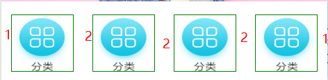
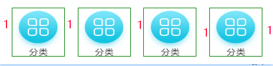

# 微信小程序学习第8天

## 每日反馈


## 回顾

1. h5+

2. miui

3. uni-app


## 优购案例-tarBar设置


#### 

#### 练习说明：


## 优购案例-首页


#### 01.页面分析

#### 02.静态页面

1. 安装less,工具->插件安装

2. 设置标题

```json
{
  "navigationBarTitleText": "优购",
  "navigationBarBackgroundColor": "#eb4450",
  "navigationBarTextStyle": "white"
}
```

2. 头部搜索

   ​	1. icon

3. 轮播图

   1. swiper组件
   2. circular="true"无限轮播

4. 分类导航区域

   1. display:flex展示四张图片

5. 楼层区域

   #### 注意点 

   1. pages.json注意格式

   2. 预览效果可以用内置浏览器，看个人喜好

   3. justify-content的属性

      1. space-between，最左边和最右边是没有空白的

      2. space-around

         

      3. space-evenly

         

#### 03.请求数据&渲染数据

1. 渲染轮播图部分

   1. 接口：/api/public/v1/home/swiperdata

2. 渲染分类导航部分

   1. 接口：/api/public/v1/home/catitems

3. 渲染楼层部分

   1. 接口：/api/public/v1/home/floordata

   > content-type: application/json这种设置和后端有关
   >
   > 返回数据解析用解构语法

#### 04.uni.request封装

1. request.js封装uni.request

2. request设置到Vue原型上，Vue实例上都可以访问到$request

   1. 在main.js里设置

      ```js
      import request from '@/utils/request'
      Vue.prototype.$request = request
      ```

 3. 提取BASE_URL

#### 05.进一步优化

1. async和await优化

1. await作用是返回promise对象then里面的数据
2. async作用有await的代码的function必须用async修饰
2. 封装uni.request部分，添加loading

1. 默认不传参且有loading，showLoading默认为true
2. loading mask设置为true
3. 导航栏背景色和颜色的全局设置

#### 注意点：

1. 后端返回的数据res.data.message，promise resolve 不要resolve(res)


## 优购案例-分类


#### 01.页面分析

1. 点击分类Tab显示这个分类页面

 2. 点击搜索去到搜索页面
  3. 选中左侧其中一个一级分类，右侧显示对应的二级和三级分类

#### 02.静态页面

1. 将头部搜索区域封装为组件

   1. 组件的style需要加scoped，否则会影响到引入组件的页面

2. 主体部分需要占满剩下屏幕

   >内容滚动的条件是
   >
   >1. 父元素高度小于内容高度
   >   1. 父元素高度确定
   >2. 父元素overflow:auto或者scroll

   ```css
     position: absolute;
     top: 100rpx;
     left: 0;
     right: 0;
     bottom: 0;
   ```

3. 左侧的结构

   1. 基本结构
   2. 选中的样式
   3. 点击切换选中元素

4. 右侧的结构

   1. 顶部图片展示

   2. 二级分类和三级分类结构

#### uniapp第一个bug

1. 不能把逻辑写在行内

   

#### 03.获取数据&渲染数据

接口：/api/public/v1/categories

1. 获取数据
2. 渲染左侧
3. 渲染右侧二级
4. 渲染右侧三级

> 1. v-if用在请求没回来之前，不渲染数据的逻辑，这里不能用v-show来替代
> 2. **右侧二级三级分类的渲染categories[activeIndex]**


#### 注意点

1. 拉远端的分支，不用本地新建分支，直接vscode切换


## 总结

## 作业：

