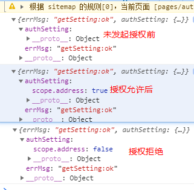

# 微信小程序学习第9天

## 每日反馈&作业

1. [戴宇峰的购物车](https://github.com/FrankDYF/mpvue-yougou/blob/dev_dyf_20200217/src/pages/cart/index.vue)
   
   1. :class的正确使用
   
      ```html
      <div class="box" :class="isRed?'red':'green'">
      ```
   
   2. 有ids才发请求
   
   3. num++有效果吗？
   
   4. 有没有必要每次对于cart的操作都存storage
   
      1.  onHide
   
   5. 添加完购物车提示
2. [辛洋洋的购物车](https://gitee.com/xin_yang_yang/mpvue-yougou43/blob/master/src/pages/cart/index.vue)
   
   1. wx.getStorageSync('cart')||{}  一定要给默认值
   2. ids是数组，转字符串时，会默认调用toString，按数组元素以,分隔转字符串
   3. 如何合并数据
   4. 需要用到计算属性？


## 事件循环(Event Loop)

#### 01.Vue异步更新队列

[传送门](https://cn.vuejs.org/v2/guide/reactivity.html#%E5%BC%82%E6%AD%A5%E6%9B%B4%E6%96%B0%E9%98%9F%E5%88%97)

1. vue在更新DOM时是异步的
   1. 批量处理数据的变更到DOM更新
2. 内部实现尝试用`Promise.then`, 如果没有用 `setTimeout(fn,0)`
3. Promise是微任务，setTimeout是宏任务
4. this.$nextTick或者Vue.nextTick, 不要使用updated

#### 02.js的事件循环(Event Loop)


>```
>var b =0;
>var a=11
>var obj = new Object()
>obj.name='joven'
>let c=1
>```
>
>对于复杂类型，栈上面存放引用，object本身是放在堆里面
>
>stack先进后出，大小固定
>
>堆无序的，但是分配大小可以调整，整个堆空间也比较大

1. 所有同步任务都在主线程上执行，形成一个执行栈
2. 主线程之外，还存在一个任务队列。**只要异步操作执行完成**，就到任务队列中排队
3. 一旦执行栈中的所有同步任务执行完毕，系统就会依次读取任务队列的异步任务，**挑选最前面的一个宏任务先执行**，于是被读取的异步任务结束等待状态，进入执行栈，开始执行
4. 主线程不断重复上面的的第三步
5. 宏任务与微任务
   1. 优先执行完所有的微任务
   2. 再执行一条宏任务


#### 03.面试题解答

1. new Promise(fn)中的fn是同步执行；

```js
console.log('a')

setTimeout(() => {
  console.log('2');
  setTimeout(() => {
    console.log('100');
  });
}, 0);

var promise = new Promise(resolve => {
  setTimeout(() => {
    console.log('3');
  }, 0);
  console.log('4');
  resolve()
})

promise.then(() => {
  console.log('5');
  setTimeout(() => {
    console.log('6');
    setTimeout(() => {
      console.log('200');
    }, 0);
  }, 0);
})

setTimeout(() => {
  console.log('7');
}, 0);

console.log('8');
```

##### 思路:

1. 同步任务打印a, 添加宏任务s-2, 添加宏任务s-3,打印4, 添加微任务p-5，添加宏任务s-7,打印8
2. 第1轮事件循环, 先执行所有微任务，打印5, 并添加宏任务s-6; 再执行宏任务s-2，打印2,并添加宏任务s-100
3. 第2轮事件循环，执行宏任务s-3, 打印3
4. 第3轮事件循环，执行宏任务s-7, 打印7
5. 第4轮事件循环，执行宏任务s-6, 打印6，添加宏任务s-200
6. 第5轮事件循环，执行宏任务s-100, 打印100
7. 第6轮事件循环，执行宏任务s-200, 打印200
8. 最终顺序是 a,4,8,5,2,3,7,6,100,200


## 优购案例-购物车

#### 注意点：

mpvue对data里面obj.prop1.prop2，数据响应有bug

如何确认有bug?

1. obj.num可以
2. obj['123'].num, 不响应，而在vue中是响应的


#### 04.请求数据&渲染数据

4. 商品数量修改

   1. 商品数量来自storage购物车
   2. -按钮最小值为1，1时disabled
   3. +按钮
   4. **合并数据, cart和goodsList**
      1. 和计算属性对比，代码量更少，少定义一下属性

5. 商品的选中状态切换

   1. 商详添加购物车时，默认checked:true
   2. 购物车商品选中状态和商品列表数据合并
   3. checkbox的选中状态:class

6. 全选逻辑

   1. 所有商品选中时，触发全选选中状态;有一个商品不选中时，去勾选全选
      1.  **every()是对数组中每一项运行给定函数，如果该函数对每一项返回true,则返回true。**
      2.  **some()是对数组中每一项运行给定函数，如果该函数有一项返回true，则返回true。** 
   2. 选中全选，所有商品选中;去勾选全选，所有商品不选中。
      1. 如果想真正改变计算属性，需要改变计算属性的依赖

   >  // 如果所有商品都勾选的话，就true;详解：拿出goodsList.length==勾选商品的个数
   >
   >  // 默认true,遍历goodsList，如果有一项没勾选的话，就false
   >
   >  forEach不能够break; for of是可以break

7. 总数量显示

   1. reduce的用法

      ```js
      arr.reduce(function(上一次计算后的值，当前遍历中的元素)){
          return 上一次计算后的值与当前遍历中的元素的运算
      }，初始值)
      ```

8. 总价显示

   1. 注意只有选中的商品才参与计算

9. 页面隐藏时onHide，保存cart状态到storage

   

## 小程序授权

[授权](https://developers.weixin.qq.com/miniprogram/dev/framework/open-ability/authorize.html)

部分接口需要经过用户授权才能调用，比如说获取用户信息、通讯地址、微信运动步数等等

#### 授权行为：

1. 第一次发起授权某权限，会弹窗请求权限，用户同意后会调用接口
2. 如果用户已经授权，直接调用
3. 如果用户已经拒绝，直接进入失败。


#### 基本使用（基本上对于每个授权使用都一样）

1. 先用getSetting获取用户授权的状态，如果拒绝的话，提示打开设置允许

2. 否则的话，使用`wx.authorize`发起授权，就会授权弹窗，再调相应接口获取信息

   

#### 注意点：

1. 用户信息的授权用`<button open-type="getUserInfo">用户信息</button>`, 即使用户拒绝也会弹出授权。

2. ```js
   <button open-type="getUserInfo" bindgetuserinfo="getuf">用户信息</button>
   ```

3. openSetting打开界面查看到各个授权的状态

4. getSetting也可以得到各个授权状态的数据，程序员使用

5. 在手机微信里面，...点击去到设置里面，可以看到授权状态

6. 学会了基本的授权使用，其他接口随用随查，不需要立马掌握