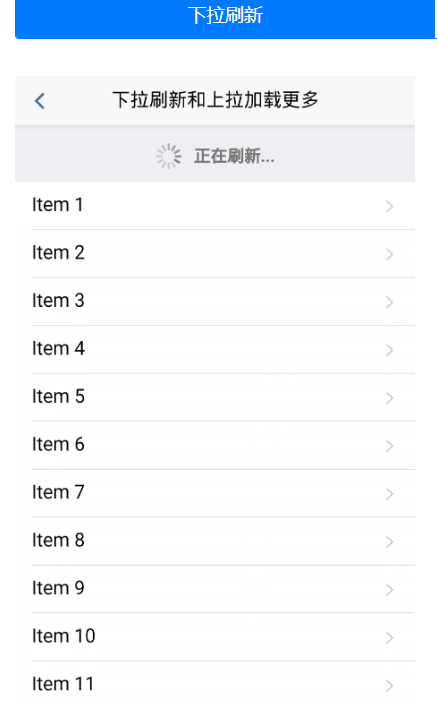

# 微信小程序学习第9天

## 每日反馈

1. 手机可以中木马病毒吗？为什么这几年都没有出现熊猫烧香这类的病毒，是因为现在安全软件越来越高级了吗？制造病毒的电脑也会中自己制造的病毒吗？
   1. 手机可以中呀。
   2. 是的。最近安全软件越来越高级
   3. 存疑

## 回顾

1. 首页静态页面+渲染

   1. 静态页面基本上就是flex
   2. uni.request渲染

2. uni.request的封装

   1. 新建request.js，对外暴露一个方法request, 方法返回一个promise对象
   2. 找一个的请求逻辑放到new Promise里面，在请求成功的回调里面，先resolve(res.data.message)
   3. 在home.vue使用，先引入，后调用
   4. request.js并不通用。请求的参数不能写死。需要传参
   5. 抽取基地址
   6. 每个页面都需要引入，麻烦。$request注册为Vue原型，每个页面可以通过this.$request访问到
   7. async和await让代码更加简洁

3. 分类页面的静态页面

   1. 抽取组件

      1. 原来home.vue里面搜索热区的结构和样式，放到components/SearchLink.vue

   2. 左右两侧分别滚动

      1. 滚动条出现的条件

         1. 内容高度大于需要滚动区域的高度

            1. 需要滚动区域的高度得是固定的

            2. .content占满剩下的屏幕

               ```
               position:absolute;
               top:100rpx;
               width:100;
               bottom:0;
               ```

         2. 需要滚动区域设置overflow:scroll或者是auto

   3. 一级分类左侧的竖线，可以用伪元素

      1. 父亲position:relative
      2. 自己postiton:absolute. content:''

#### 注意点

1. 如果hbuilder+微信开发者工具运行情况不符合预期，可能要考虑在hbuilder终端重新运行微信开发者工具
2. axios本身就会返回promise对象，黑马头条里面对axios的封装相当于我们现在request.js


## 作业检查

1. https://gitee.com/xiaomumu1002/yougou-mall/tree/mumu_20200322
   1. 完成分类页渲染
   2. 何不直接resolve(res.data.message)
   3. 可以尝试用解构来解析请求返回的数据
2. https://gitee.com/ntdntl/yougou2020
   1.  优秀
3. https://gitee.com/z1_j2_w3/my-yougou/tree/Fea-molly/
4. https://gitee.com/huang_tao971481145/uni_yougou_ht/tree/HT_yougou_one/
   1. 忘记push了？
   2. css层级不要超过4层

#### 建议：

1. 心态上不要浪费别人的时间
2. 表达方面：以邮件形式的表述


## style要不要加scoped

scoped可以把样式限定在组件内，如何做到的？

在结构和样式里面都添加唯一的属性

```html
<view class="nav data-v-ca791f8e">
```

```css
.nav.data-v-ca791f8e {
  height: 194rpx;
  display: -webkit-box;
}
```

1. 微信小程序原生语法，各个页面的的样式就是独立
2. 不建议在uniapp页面里面style上加scoped
3. 组件的style需要加scoped


## 分类页面

#### 02.静态页面

1. 导航栏文字的前景色和背景色提取公共的窗口样式
1. 在pages.json调整
2. 右侧的结构
   1. 顶部图片展示
   1. 接口返回数据没有，写死
   2. 二级分类和三级分类结构
      1. flex布局

#### 03.获取数据&渲染数据

接口：/api/public/v1/categories

1. 获取数据
2. 渲染左侧
   1. 直接拿categories展开就是一级分类
3. 渲染右侧二级
   1. 如何渲染？
   2. **当我点击一级分类下标activeIndex，右侧展示categories[activeIndex].children**
4. 渲染右侧三级

#### 04.当请求的数据没有回来之前，不渲染页面

如果请求回来前，就渲染页面

1. 页面抖动，有些元素先显示

2. 返回的数据，初始化的值，取值时可能会undefined

   1. 并不是说obj.children是undefined，而是说obj是undefined

   

#### 解决方案：

1. v-show只是把页面隐藏，上面的现象1，2依然存在

2. v-if数据回前不渲染

   

#### 提示：

1. 在uniapp的项目里面可以配置appid，在manifest.json
2. 微信开发者工具可以有三种appid
   1. 我们自己的appid，所有的功能都可以用
   2. 测试号，不能上传
   3. touristid 游客id，预览，真机调试，上传都是灰色
3. **uniapp不要v-show有坑不要使用**
4. 如果面试问：什么时候只能用v-if不能用v-show?
   1. 当请求数据没有回来之前，不渲染页面
5. 每次点击一级分类，右侧数据更新，但是滚动条可能并不顶部。修复的话，用scroll-view


## 下拉刷新

[传送门](https://developers.weixin.qq.com/miniprogram/dev/reference/configuration/page.html)

概念：在分页的场景里面，用户下拉会触发一个动画，触发一个方法，在方法里面重新加载第一页的数据

使用：页面配置就行

1. 页面的配置文件里面，开启下拉的动画

   ```json
     "enablePullDownRefresh":true, //开启动画
     "backgroundColor":"#009900", //窗口的颜色
     "backgroundTextStyle":"light" //loading的样式，默认是dark，值为dark/light
   ```

2. 下拉会触发方法 onPullDownRefresh

   1. 一般来说在这里处理加载第一页数据的逻辑


## 上拉加载更多

[传送门](https://developers.weixin.qq.com/miniprogram/dev/reference/configuration/page.html)

概念：在分页的场景，用户上拉会触发一下方法，在方法里面加载下一页的数据

使用：页面配置即可

1. 页面的配置文件里面，开启上拉

   ```json
   "onReachBottomDistance":50
   ```

2. 上拉会触发方法onReachBottom

   1. 一般来说在这里处理加载下一页数据逻辑


## 练习-下拉上拉-综合案例

参考<https://dev.dcloud.net.cn/mui/>



案例要求：一页展示十条，上拉加载十条数据，下拉加载第一页数据

步骤：

1. 新建页面

2. 开启上拉和下拉配置

3. 上拉加载下一页

4. 下拉刷新，需要主动停止动画

   ```js
   // 主动停止动画
   wx.stopPullDownRefresh()
   ```

#### 注意点：

1. 在uniapp里面使用下拉刷新和上拉加载更多，配置名和方法名完全一致。在pages.json里面配置


## 优购案例-搜索列表


#### 01.页面分析

1. 入口：在分类页面，点击三级分类，去到搜索列表页
2. 搜索列表页有输入框，输入关键字，按关键字进行搜索
3. 综合，销量和价格，没有接口支持不做了？
   1. 有个问题，点击销量，是否需要发请求？
      1. 会发请求。因为是分页的，销量的第一页数据肯定和综合的第一页数据不一样的
      2. 发请求回来的时间，不超过100ms
4. 下边展示搜索列表，分页，下拉刷新，上拉加载
5. 输入框和过滤栏滚动时固定

#### 02.静态页面

	1. 复制 `learnmp\优购\静态页面\uni-yougou\pages\search_list`
 	2. 修改文件名，pages.json添加路径和标题 
 	3. App.vue把css文字两行的样式也需要copy过来

#### 04.请求数据&渲染数据

 	1. 过滤栏点击切换选中状态
      	1. menulist数组，渲染过滤栏
      	2. activeIndex记录，哪一个被选中
      	3. 点击时候，activeIndex= index
 	2. query应该是从应该是从点击三级分类传过来的
      	1. 点击三级分类，跳转到搜索列表
           	1. uni.navigateTo
      	2. 同时传递cat_name
 	3. 搜索列表页获取传递的参数
      	1. onLoad
      	2. 关键字还需要设置到输入框v-model
 	4. 请求数据
      	1. 获取到关键字后，发请求queryGoodsList
      	2. 接口
           	1. url    /api/public/v1/goods/search
           	2. data
                	1. query 搜索关键字
                	2. pagenum 页码，从1开始
                	3. pagesize 每一页多少条，应该作为常量const
      	3. 确认一下request.js是否传递了data
           	1. 尝试获取形参时，使用解构
      	4. 请求时，开启Loading


#### 05.下拉刷新

 1. 开启下拉刷新

     	1. pages.json,pages属性对应这个页面的style

    ```
    "enablePullDownRefresh":true
    ```

 2. onPullDownRefresh方法处理加载第一页数据逻辑

    1. data添加pageNum属性
    2. pageNum:1
    3. queryGoodsList

	3. 需要对goodsList清空

#### 06.上拉加载更多

 1. 开启上拉

     	1. pages.json,pages属性对应这个页面的style

    ```
    "onReachBottomDistance":50
    ```

 2. onReachBottom方法里面加载下一页数据

     	1. pageNum++
     	2. 请求queryGoodsList

3. 第二页的数据应该追加在第一页数据上。
   1. goodsList不能直接覆盖，要追加
      1. [...this.goodsLIst,...data.goods]
         1. ...是拿出数组的每一项
         2. 注意顺序！！！

#### 07.输入框输入，然后点击键盘右下角按钮时，按输入的关键字进行搜索第一页

1. 键盘右下角文案，需要为搜索 type="search"
2. v-model获取用户的输入
3. 点击键盘右下角按钮时 @confirm
4. 搜索第一页
   1. 可以和下拉刷新对比 reload

#### 练习说明：

1. 微信开发者工具里面模拟器Input框，输入中文有时候无法输入，忽略掉
2. vfor的嵌套，如果索引别名相同，uniapp会混乱


#### 08.优化

1. 请求中，不再发请求
   1. 添加isRequesting属性
   2. 请求前，设置正在请求的状态
      1. isRequesting =true
   3. 请求后，设置请求结束的状态
      1. isRequesting =false
   4. 如果正在请求中,拒绝
2. 如果已经到最后一页，没必要再发请求
   1. 如何判断是否到最后一页了？
      1. 商品列表的长度和total一致时,就是最后一页
   2. 如果是最后一页，就不再发请求
3. 最后一页时，我们添加提示
   1. v-show


## 总结


## 作业

1. 分类页面
2. **搜索列表页面**

