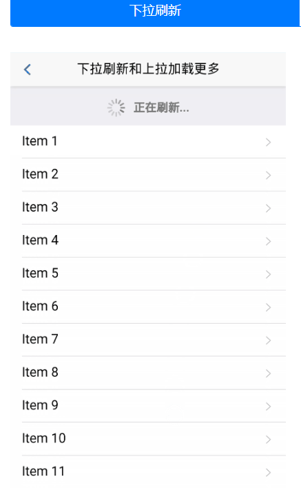
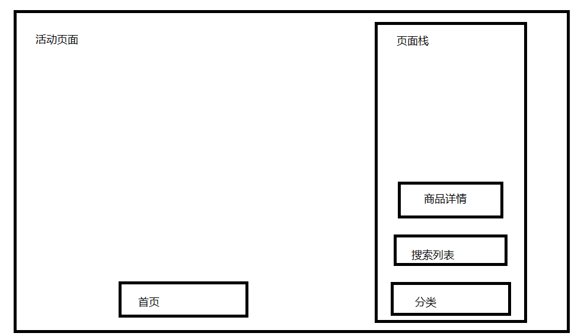

# 微信小程序学习第9天

## 每日反馈

1. 手机可以中木马病毒吗？为什么这几年都没有出现熊猫烧香这类的病毒，是因为现在安全软件越来越高级了吗？制造病毒的电脑也会中自己制造的病毒吗？
   1. 手机可以中呀。
   2. 是的。最近安全软件越来越高级
   3. 存疑

## 回顾

1. 首页静态页面+渲染

   1. 静态页面基本上就是flex
   2. uni.request渲染

2. uni.request的封装

   1. 新建request.js，对外暴露一个方法request, 方法返回一个promise对象
   2. 找一个的请求逻辑放到new Promise里面，在请求成功的回调里面，先resolve(res.data.message)
   3. 在home.vue使用，先引入，后调用
   4. request.js并不通用。请求的参数不能写死。需要传参
   5. 抽取基地址
   6. 每个页面都需要引入，麻烦。$request注册为Vue原型，每个页面可以通过this.$request访问到
   7. async和await让代码更加简洁

3. 分类页面的静态页面

   1. 抽取组件

      1. 原来home.vue里面搜索热区的结构和样式，放到components/SearchLink.vue

   2. 左右两侧分别滚动

      1. 滚动条出现的条件

         1. 内容高度大于需要滚动区域的高度

            1. 需要滚动区域的高度得是固定的

            2. .content占满剩下的屏幕

               ```
               position:absolute;
               top:100rpx;
               width:100;
               bottom:0;
               ```

         2. 需要滚动区域设置overflow:scroll或者是auto

   3. 一级分类左侧的竖线，可以用伪元素

      1. 父亲position:relative
      2. 自己postiton:absolute. content:''

#### 注意点

1. 如果hbuilder+微信开发者工具运行情况不符合预期，可能要考虑在hbuilder终端重新运行微信开发者工具
2. axios本身就会返回promise对象，黑马头条里面对axios的封装相当于我们现在request.js


## 作业检查

1. https://gitee.com/xiaomumu1002/yougou-mall/tree/mumu_20200322
   1. 完成分类页渲染
   2. 何不直接resolve(res.data.message)
   3. 可以尝试用解构来解析请求返回的数据
2. https://gitee.com/ntdntl/yougou2020
   1.  优秀
3. https://gitee.com/z1_j2_w3/my-yougou/tree/Fea-molly/
4. https://gitee.com/huang_tao971481145/uni_yougou_ht/tree/HT_yougou_one/
   1. 忘记push了？
   2. css层级不要超过4层

#### 建议：

1. 心态上不要浪费别人的时间
2. 表达方面：以邮件形式的表述


## style要不要加scoped

scoped可以把样式限定在组件内，如何做到的？

在结构和样式里面都添加唯一的属性

```html
<view class="nav data-v-ca791f8e">
```

```css
.nav.data-v-ca791f8e {
  height: 194rpx;
  display: -webkit-box;
}
```

1. 微信小程序原生语法，各个页面的的样式就是独立
2. 不建议在uniapp里面style上加scoped
3. 组件的style需要加scoped


## 分类页面

#### 02.静态页面

1. 右侧的结构

   1. 顶部图片展示

   2. 二级分类和三级分类结构


#### 03.获取数据&渲染数据

接口：/api/public/v1/categories

1. 获取数据
2. 渲染左侧
3. 渲染右侧二级
4. 渲染右侧三级

> 1. v-if用在请求没回来之前，不渲染数据的逻辑，这里不能用v-show来替代
> 2. **右侧二级三级分类的渲染categories[activeIndex]**


## 下拉刷新

[传送门](https://developers.weixin.qq.com/miniprogram/dev/reference/configuration/page.html)

小程序为页面增加下拉组件，**下拉时触发方法**，在方法里面我们可以自定义逻辑，通常用来重新加载第一页数据

1. 在页面设置index.json

```json
"enablePullDownRefresh":true,
"backgroundTextStyle": "dark"
"backgroundColor":"#ccc"
```

2. 下拉会触发onPullDownRefresh，一般在这个方法里面**处理加载第一页的逻辑**

3. backgroundColor 窗口的背景色

4. backgroundTextStyle 下拉 loading 的样式 `dark` / `light`，默认是light


## 上拉加载更多

[传送门](https://developers.weixin.qq.com/miniprogram/dev/reference/configuration/page.html)

小程序为页面增加上拉组件，**上拉到底前**触发方法，在方法里面我们可以自定义逻辑，通常应用在分页的场景中，加载下一页

1. 在页面设置index.json

```json
"onReachBottomDistance":50
```

2. 下拉到底前会触发[onReachBottom](https://developers.weixin.qq.com/miniprogram/dev/reference/api/Page.html#onreachbottom)

3. 注意点，只有有滚动条的时候，上拉才会被触发

4. 在onReachBottom方法里面，一般处理加载下一页的逻辑

   

## 练习-下拉上拉-综合案例

参考<https://dev.dcloud.net.cn/mui/>



1. 新建一个页面，展示列表。

2. index.json配置开启上拉加载和下拉刷新

3. 在上拉加载里面，添加数据。下拉刷新里面加载第一页。

   ```js
    setTimeout(() => {
        this.setData({
            list: numArr
        })
        //主动结束下拉刷新
        wx.stopPullDownRefresh();
    }, 500)
   ```


## 优购案例-搜索列表


#### 01.页面分析


1. 点击三级分类，去到搜索列表页面，传递cat_name
2. 获取列表数据的接口是查询关键字，支持分页
  3. 下拉刷新，上拉加载更多
  4. 输入框输入关键字，搜索
  5. 点击其中一个商品跳转商品详情

#### 02.静态页面

2. 新建页面search_list
3. 标题设置为`搜索结果`
4. 头部搜索功能
5. 过滤栏综合销量及价格展示
6. 过滤栏点击选中功能
7. 商品列表展示

#### 03.基本逻辑

1. 过滤栏点击某一项添加选中样式
   1. 声明一个过滤栏菜单数组
   2. 点击activeIndex=index
   3. 选中即添加active样式
2. 点击三级分类，去到搜索列表页面
   1. 点击跳转 @click="toSearchList"
      1. wx.navigatorTo()
      2. 传递cat_name
   2. 在搜索列表页面上获取参数
      1. 在onLoad方法里面 参数keyword=catName
      2. 把keyword与input双向绑定

#### 04.请求数据&渲染数据

1. onLoad设置keyword, 请求数据queryGoods
   2. 接口 /api/public/v1/goods/search
   3. 参数
      1. query关键字
      2. pagesize每页多少条
         1. 应该是一个常量const
      3. pagenum 页码(从1开始)
2. 渲染数据
3. 输入框输入关键字，确定的时候触发搜索商品
   1. 获取输入框的输入keyword
   2. 点击确定触发搜索@confirm:queryGoods

#### 练习说明：

1. 点击分类，传递的cat_name有误
   1. 原因，双层嵌套的v-for不能使用同样的索引别名

#### 05.下拉刷新

1. 配置开启下拉刷新, 并配置样式

   ```
     "enablePullDownRefresh": true
   ```
   
2. 触发下拉刷新事件重新请求数据

   1. onPullDownRefresh方法里
      1. 拿到第一页的数据
   2. 发请求

#### 06.上拉加载更多

1. 配置开启上拉 "onReachBottomDistance":50
2. 上拉触底后给当前页+1，再请求
   1. onReachBottom方法里页码+1, 再请求
   2. 商品列表应该是追加，而不是覆盖
      1. ES6: [...oldArr, ...newArr]

#### 07.优化

1. 输入框确定、下拉刷新，搜索结果为第一页
   1. 搜索结果为首页，单独抽取一个方法reload
   2. reload重置页码为1，重置goodsList

2. 当请求中，不再发请求
   1. 设置请求中状态isRequesting
   2. 请求前，为true
   3. 请求后为false
   4. 请求前先判断，如果为true时，return
3. 如果当前是最后一页，不再发请求
   1. 小于或等于6的时候不再发请求不行吗????不对
   2. 是否为最后一页的状态isLastPage
      1. 发完请求后，判断goodslist的长度和data.total
   3. 如果是最后一页，不再发请求
4. 添加一个有加载完成的提示
   1. isLastPage为true时显示


## 小程序生命周期钩子

#### 01.App生命周期

[传送门](https://developers.weixin.qq.com/miniprogram/dev/reference/api/App.html)

1. App在初始化，切前台后台时会以回调函数的形式通知我们

   | 钩子函数 | 说明                             |
   | -------- | -------------------------------- |
   | onLaunch | 小程序初始化时触发（只触发一次） |
   | onShow   | 从后台进入前台                   |
   | onHide   | 从前台进入后台                   |


#### 02.Page生命周期

[Page生命周期](https://developers.weixin.qq.com/miniprogram/dev/framework/app-service/page-life-cycle.html)

Page在加载、显示、渲染完成、隐藏和销毁时会以回调函数的形式通知我们

| 钩子函数 | 说明             | 备注 |
| -------- | ---------------- | ---- |
| onLoad   | 页面加载         |      |
| onShow   | 页面显示         |      |
| onReady  | 页面初次渲染完成 |      |
| onHide   | 页面隐藏         |      |
| onUnload | 页面销毁         |      |

1. ## Tabbar的特点

   

   tabbar的作用: 让App有多入口

   1. 没有配置在tabbar属性的里面的页面，不显示tabbar
   2. 跳转到tabbar页面，用switchTab
   3. 跳转到非tabbar页面，用navigateTo
   4. Tab栏只会初始化第一个页面，第一次切换到某tab时才会初始化该Tab的页面; 
   5. 后续切换tab只会显示/隐藏，tab栏只要初始化了并不会销毁

   

   ## 页面栈

   [传送门](https://developers.weixin.qq.com/miniprogram/dev/framework/app-service/route.html)

   在调试器的`AppData`查看当前活动页面，

   使用 `getCurrentPages()` 函数获取当前页面栈 

   思考：活动页面有两个，但是栈里面只有一个呢？

   | 路由方式   | 页面栈表现                      | 方法                        | 当前页面 | 后页面        |
   | ---------- | ------------------------------- | --------------------------- | -------- | ------------- |
   | 打开新页面 | 新页面入栈                      | wx.navigateTo               | onHide   | onLoad,onShow |
   | 页面返回   | 页面不断出栈，直到目标返回页    | 左上角返回，wx.navigateBack | onUnload | onShow        |
   | Tab切换    | 页面全部出栈，只留下新的Tab页面 | wx.switchTab                |          |               |

   

   ## 场景值

   [传送门](https://developers.weixin.qq.com/miniprogram/dev/reference/scene-list.html)

   概念：小程序的入口，不同入口都有的标识，这个就是场景值

   可以有哪一些方式进入小程序：群里面打小程序，朋友圈二维码，地铁广告二维码，微信搜索小程序。。。

   一般用作**事件上报**

   1. 页面被访问的次数PV
   2. 页面被不同用户访问的次数UV
   3. 事件上报针对某一按钮

   获取场景值：app.js onShow(){options. scene }


## 总结


## 作业

1. **搜索列表页面**
2. 理解小程序的生命周期
