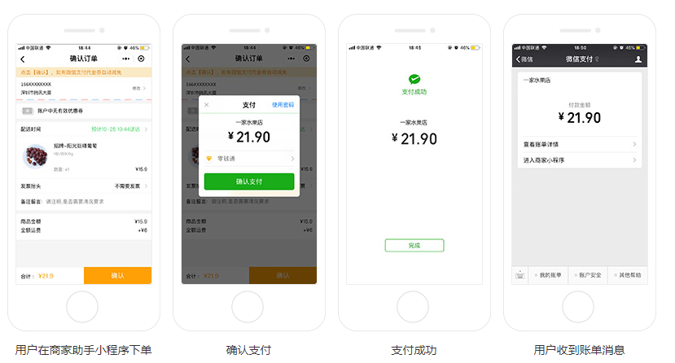
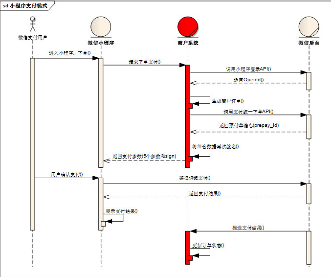

# 微信小程序学习第10天

## 每日反馈&作业完成情况

1. 老师讲讲mpvue的坑点呗
2. 部分同学用master分支开发，没有开启eslint


## mpvue坑点

1. 新增页面需要重新npm run start
2. 嵌套v-for索引别名不要相同，双层嵌套v-for需要取不同索引别名
3. v-html指令大部分HMTL不能解析，能解析img标签
4. 过滤器无法使用
5. 指令不支持方法，常见的{{}}里面不支持方法
6. 指令里面不支持字符串的模板语法
7. mpvue tabBar的配置，app.json最好用根路径，以`/`打头。不要用相对路径
8. v-model指令不支持<input type=checkbox/>
9. **页面销毁，对应的Vue实例还在，需要手动重置数据**
10. **父传子，子组件里面可以直接改props，不会报错**
11. **经常有源码目录和dist目录不同步的问题，需要手动删除wx/dist重启，更好的方式是在dev-server.js里面加上清空dist/wx目录的逻辑**
12. obj.prop1.prop2改变数据不响应


## 小程序登录

[传送门](https://developers.weixin.qq.com/miniprogram/dev/framework/open-ability/login.html)

第三方登录：第三方网站授权登录

步骤：

1. 获取用户信息, 如果没有授权过，会在底部弹出授权窗口的

   ```html
   <button open-type="getUserInfo"
               bindgetuserinfo="getuserinfo">点我登录</button>
   ```

2. wx.login()获取到code

3. 调后端接口获取token

   1. /api/public/v1/users/wxlogin


## 优购案例-登录

#### 01.页面分析

1. 购物车页面点结算，如果未登录，跳转登录，否则跳转支付页面
2. 登录页上，点立即登录，登录成功，存token, 并goBack

#### 02.基本逻辑

| getUserInfo | 获取用户信息，可以从bindgetuserinfo回调中获取到用户信息 |
| ----------- | ------------------------------------------------------- |
|             |                                                         |

1. 购物车点结算，当然如果没有选择商品就提示;未登录跳转登录; 否则跳转支付页面，
   1. 是否登录判断token
2. 登录页，立即登录
   1. getUserInfo+code，调登录接口
   2. 存储token并back

> 练习注意：
>
> 1. baseURL要更新了https://www.uinav.com
> 2. 微信开发者账号，切换用户，截图让我扫码
> 3. 微信开发者工具appid换掉：wx38d8faffac4d34d2


## 小程序微信支付

[传送门](https://pay.weixin.qq.com/static/product/product_intro.shtml?name=miniapp)

用户在微信小程序内唤起微信支付，完成支付返回微信小程序

使用示例



#### 申请流程

1. 申请小程序开发者账号

2. 微信认证

   1.  个人号无法认证

3. 小程序开通微信支付

4. 点击开通按钮后，选择新申请微信支付商户号或绑定一个已有的微信支付商户号，

5. 申请微信支付商户号

   1. [传送门](https://pay.weixin.qq.com/index.php/apply/applyment_home/guide_normal)
   2. 需要营业执照和银行卡号

6. 业务流程

   1. 

7. 后端调用`wxsdk.reqWXUnifiedorder`,传入appid，商户号，open_id等生成前端微信支付的参数。

8. 小程序调用wx.requestPayment，唤起微信支付

   

## 优购案例-支付

#### 01.页面分析

1. 购物车点结算，或者商品详情点立即购买去到支付页面
2. 支付页面展示收货地址选择以及需要确定购买的商品列表（**不能去选中及修改数量, 没有勾选**）
3. 点击微信支付，生成订单，再微信支付
4. 支付成功或者失败进入订单结果页

#### 02.静态页面

1. 新建支付页面pay
2. 收货地址和选择收货地址
3. 收货地址边框
4. 商品列表copy，修改部分
5. 微信支付按钮，及订单信息也 

#### 03.基本逻辑

1. 购物车点结算跳转支付页面

   1. 商品数量不能为0
   2. 必须有token
   3. 满足条件才跳转支付页面

2. 点击请选择地址，选择微信地址，选择地址确定，获取地址，显示地址

   1. 微信，我->头像->我的地址，里面有微信的收货地址，这里同步微信的收货地址
   2. 点击请求选择地址@click="getAddress"
   3. 获取微信收货地址 wx.chooseAddress成功回调里获取

3. 获取到收货地址后，缓存到本地; 页面初始化时从缓存中读取

   

#### 04.请求数据&渲染数

1. 根据商品ids请求商品详情,**渲染购物车选中的商品**，方法getGoodsList

   1. 接口 `/api/public/v1/goods/goodslist?goods_ids=${ids}`
   2. storage里面未选中的商品过滤掉
   3. 总价格的显示，计算属性

2. 点击微信支付先生成订单

   1. 判断是否有商品，是否选择了地址

   2. 接口/api/public/v1/my/orders/create

      1. method:POST

      2. 请求头 "Authorization" : token

      3. data:{

         order_price 订单价格

         consignee_addr 订单地址

         goods 商品列表内部存放商品对象（goods_id，goods_number和goods_price）}

      4. 不论支付成功或者失败，都从购物车里面清掉checked商品
      
         1. Object.delete

3. 生成订单成功后，生成预支付交易单

   1. 接口/api/public/v1/my/orders/req_unifiedorder
      1. method:POST
      2. 请求头 "Authorization" : token
      3. 请求体:
         order_number : 订单号

4. 生成订单后，调用wx.requestPayment


## 优购案例-优化

#### 02.商品详情-立即购买跳转支付页面

1. 传递goodsId
2. 展示立即购买的那个商品，数量为1
3. 无需存储到购物车
4. TODO 注意购物车页面onShow里面需要对goodsList重置

#### 03.设置购物车的商品个数

1. 购物车的onShow方法里面设置(无论商品是否选中，都算)
2. wx.setTabBarBadge
   1. index
   2. 显示文本，字符串类型
      1. 数量**商品类型个数**

#### 04.request中设置token

1. isAuth为true是添加token

#### 05.request中status不为200时，错误提示


## 前端性能优化

1. 适当减少HTTP请求
   1. css/js合并打包
   2. HTTP请求合并
   3. 小图标用iconfont或者base64
   4. 雪碧图可维护性不好
2. 减少静态资源的体积
   1. js,css,图片压缩，图片压缩用tinypng.com
   2. 先经过tinypng压缩
3. 服务器端开启gzip
   1. 后端或者运维做的
4. 预加载
   1. 利用浏览器空闲时间加载资源
5. 静态资源放CDN
6. 请求缓存，查询缓存
7. 设置合适的HTTP缓存
   1. 请求带宽
   2. 请求速度
   3. 运维或者后端
8. 其他
   1. 减少dom数量（小程序，weex, RN）
   2. css预处理器，减少层级,小于3~4层
   3. 图片懒加载，Vue-lazyload
   4. 图片设置宽高，
      1. 重排
   5. 默认图片设置
   6. 接口请求的容错

面试要举实际的例子

1. [路由懒加载](https://router.vuejs.org/zh/guide/advanced/lazy-loading.html#%E6%8A%8A%E7%BB%84%E4%BB%B6%E6%8C%89%E7%BB%84%E5%88%86%E5%9D%97)
   1. 首屏加载速度增快