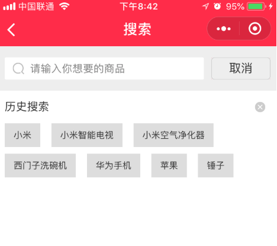
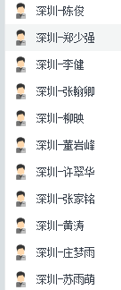

# 微信小程序学习第11天

## 每日反馈

1. 感觉学的勉勉强强.学了现在.忘了以前..担心面试找不到工作~~
   1. 总是会找工作
   2. 重新掌握Vue
   3. 小程序课程其实Vue的复习
   4. Vue本身的知识点就是挺复杂，需要结合业务，慢慢消磨
   5. 先掌握重点的知识点
2. 为阿豆而来，请老师评阅
   1. 写到登录页
   2. 提前预习了三天
3. rich-text的兼容性,ios兼容性不好。后端接口的锅
4. App.vue全局引入外部样式，[传送门](https://uniapp.dcloud.io/frame?id=%e5%85%a8%e5%b1%80%e6%a0%b7%e5%bc%8f%e4%b8%8e%e5%b1%80%e9%83%a8%e6%a0%b7%e5%bc%8f)
5. 微信开发者工具，支持三种账号
   1. 实际的appid 全部功能都支持
   2. 测试账号，没有上传功能
   3. touristid游客模式，预览，真机调试，上传的功能全部是灰的
   4. 怎么修改
      1. 在uniapp的项目里面，manifest.json->微信小程序配置->填写你的appid
6. 接口响应慢，后端的锅
   1. 实际工作中接口响应在100ms以内


## 回顾

1. 小程序app的生命周期app.js
   1. onLaunch初始化
   2. onShow 切前台
   3. onHide切后台
2. 小程序页面的生命周期
   1. onLoad 加载
   2. onShow显示
   3. onHide隐藏
   4. onReady初次渲染完成
   5. onUnload销毁
3. 小程序的页面栈
   1. 打开一个页面时，会初始化该页面，页面放到页面栈; 如果返回一个页面，销毁页面，同时从页面栈中移除
   2. 页面栈里面存的是有返回关系的这些页面
4. unipapp的生命周期
   1. App.vue声明uniapp的App的生命周期，和微信小程序一致
   2. 页面的生命周期和小程序一致
   3. 组件的生命周期和Vue组件一致，create...
5. 搜索列表页
   1. position: sticky
      1. 相对于第一个滚动的父盒子
      2. 定位用left,right,top,bottom
   2. 没有在结构中使用的变量，不要声明在data里面
      1. 添加为this的实例
   3. isLastPage需要重置
6. 商品详情
   1. 预览大图 wx.previewImage(urls,current)


## 作业检查

1. https://gitee.com/xiaoqiang_passing_by/uni-yougou/tree/new-20200322/

   1. 变量的类型，声明最好不要改
   2. toImg命名不好
   3. 没有在结构中使用的变量，不必写在data里面

2. https://gitee.com/tracy6891/uni-yougou46/tree/Fea_tracey_20200323/

   ​	1. 4天前？

3. https://gitee.com/doukou0303/yougoumarket

   1. reset用得不错
   2. 测试数据要删除
   3. 没有在结构中使用的变量，不必写在data里面
   4. prevImg没做?

4. https://gitee.com/wwinnie/uoogou/tree/branches/

   1. isLastPage的重置呢
   2. request.js能否resovle(res.data.message)
   3. $request注册为Vue原型?

5. https://gitee.com/zhu166/uni-yougou/tree/initial

   1. 赞

6. https://gitee.com/nwy666/yougou/tree/yougoudev1/

   1. 赞
   2. goods_id有必要作为data的属性吗

7. https://gitee.com/zhuang_guang_cheng/uni-yougou46/tree/Zhuang_gugu_20200322/

   1. 赞

8. https://gitee.com/manutreemin/ygshop.git

   1. OK


## 分享功能

[传送门](https://developers.weixin.qq.com/miniprogram/dev/framework/open-ability/share.html)

[onShareAppMessage](https://developers.weixin.qq.com/miniprogram/dev/reference/api/Page.html#onShareAppMessage-Object-object)

1. button设置open-type="share"
2. onShareAppMessage可以定制分享弹窗的内容
   1. title 弹窗的标题
   2. imgUrl 弹窗的图片路径
   3. path是分享出去的小程序的目标页面，默认是当前页面路径
3. 有声明onShareAppMessage定制分享弹窗，也可能过点击小程序右上角...，分享给朋友


## 商品详情

1. 分享功能
   1. 声明一个button open-type="share"
   2. onShareAppMessage定制分享弹窗的内容
   3. 样式方面，绝对定位，透明
2. 客服功能
   1. [传送门](https://developers.weixin.qq.com/miniprogram/dev/framework/open-ability/customer-message/customer-message.html)
   2. 声明一个button open-type="contact"
   3. 样式方面，绝对定位，透明

> 一般的企业都是需要客服系统，客服系统功能没太个性。所以腾讯云提供这个服务，微信小程序有给腾讯云引流的KPI，所以微信小程序里面后台可以接入客服系统。

3. 分享图片的经验分享
   1. 需求，在商详里面分享的图片是由商品图片，商品价格，优惠，商品名称，小程序二维码组成的
      1. 原生实现生成图片，需要发版本
      2. 在后台管理系统，添加商品时，生成分享的图片
         1. 添加商品时，分享图片所需要的信息全部都有
         2. canvas画出来，生成png, 生成图片链接Url, 添加商品详情的一个字段shareImgUrl
            1. canvas本质就是一个画板
         3. 优点：后端生成一次，前端直接使用


## Vue组件通信

#### 01.父传子

 1.  基本使用

     1. 父组件在使用子组件的标签上传递属性

        ```html
        <child message="不要早恋"></child>
        ```

     2. 子组件的props里面声明，然后子组件就可以把props当data属性一样使用

        ```js
        props:['message']
        ```

	2. htmlprop的大小写

        	1. 原因：在html里面，只认小写。如果属性名写驼峰，会被转成全小写 parentMsg=>parentmsg
            	2. 解决方案，Vue内部有转换，建议 parent-msg=>parentMsg

	3. prop的大小写在Vue脚手架里面有这个问题吗？

        	1. vue快速原型开发

               1. 概念 vue serve 运行.vue文件，无须初始Vue工程

                 	2. 需要安装npm包

            ```bash
            npm install -g @vue/cli-service-global
            ```

             		3. 使用方式vue serve 文件名
	
                  	1. 文件名可省略，默认为当前目录下的App.vue或者app.vue

             		4. 在.vue文件props可以驼峰，因为vue-loader处理这个问题

#### 02.父传子动态

1. **避免子组件直接改变props**，props不是对象会报错的。

   1. 从规范上来看的话，应该遵从单向数据流
      1. 单向数据流是指组件通信
      2. 双向数据绑定，data<=>结构
      3. Vue里面的这两种特性并不冲突

2. 如果子组件需要改变props，怎么办

   1. 尽量不要把prop改变对象来绕过

   2. props赋值给data的属性

      1. 如果是复杂类型，克隆一个对象赋值

      ```js
      data(){
          return{
              msg:this.message
          }
      }
      ```

3. 父传子动态，子里面如何感受到？

   1. 需要监听prop的变化watch

      ```js
       watch:{
           // message就是prop
           message(newValue){
               // 当message有变化时，会传给newValue
               // console.log(newValue)
               this.msg = newValue
           }
       }
      ```

      

#### 03.子传父

1. 子组件$emit事件，并传参

   ```js
   this.$emit('事件名','不要抽烟')
   ```

2. 父组件使用子组件标签上注册事件名，事件处理方法里面可以获取到事件传参

   ```html
   <!-- 父组件使用子组件 -->
   <child @事件名="事件处理方法"></child>
   ```

   ```js
   事件处理方法(事件传参){
       console.log(事件传参)
   }
   ```

#### 注意点：

1. 事件名推荐用中划线命名


## 搜索列表-抽取头部输入框为单独的组件

主要的思路：引入SearchBar组件，并保证之前的功能是OK的

1. 引入SearchBar.vue组件

   1. copy静态页面SearchBar.vue放到components
   2. 搜索列表import组件
   3. 注册
   4. 组件名当标签使用
   5. 修复：清空图标设置left:auto，覆盖掉父组件的样式

2. SearchBar组件，输入框里面有内容就显示x，没内容就不显示x

   1. 获取输入框的内容 v-model:inputVal
   2. 有内容展示x，没有内容不展示x; v-show="inputVal"

3. SearchBar组件，点击x，清空内容

   1. 点击x @click:clearInputVal
   2. 清空inputVal= ''

4. SeachBar组件，输入框的键盘类型

   1. confirm-type:search

5. SeachBar组件的输入框里面输入内容，点击键盘右下角按钮时，触发搜索列表页面的搜索

   1. 点击键盘右下角按钮 @confirm: confirmHandler
   2. SearchBar组件传事件给搜索列表页面
      1. SearchBar组件，$emit事件search，并传参inputVal
      2. 搜索列表使用SearchBar标签的位置注册@search:doSearch
      3. doSearch，获取inputVal，并搜索
   3. 输入框内容不空时，触发搜索

6. 搜索列表初始时，按关键字搜索，这个关键也得显示在输入框

   1. 搜索列表页面传递给SearchBar组件

      1. 搜索列表页面使用SearchBar标签设置属性:keyword="keyword"

      2. SearchBar组件里面props:['keyword']

      3. 避免子直接改prop,所以需要设置给data属性

         ```js
         data(){
         	return{
         		inputVal:this.keyword
         	}
         }
         ```

      4. 由于父组件的加载比子组件初始要慢，所以prop第一次传的是空的。所以父传子动态
         
         1. 监听keyword,有变化再赋值

#### 练习说明：

> 如果在实际工作中，你觉得设计不得，可以和设计师沟通。
>
> 在uniapp里面，运行微信开发者工具，调试器的AppData看不到组件的data属性


## 优购案例-搜索页面



#### 01.页面分析

1. 入口是首页或者分类头部搜索区域点击跳转搜索页面
2. 搜索页面包括输入框和历史搜索
3. 输入框输入，点击键盘右下角按钮时，跳转搜索列表，并且关键字会插入到历史搜索头部
4. 历史搜索点击也会跳转搜索列表，关键也会插入到历史搜索头部
5. 历史搜索需要保存，存在storage里面

#### 02.静态页面

1. copy优购文件夹里面search页面
2. pages.json配置页面路径

#### 03.基本逻辑

1. 首页或者分类搜索区域点击跳转搜索页面
   1. 直接在SearchLink组件中作跳转
      1. 点击事件@click:toSearch
      2. 跳转逻辑uni.navigateTo
2. SearchBar组件输入框输入，点击键盘右下角按钮时，跳转搜索列表，并传参keyword
   1. 搜索页面使用SearchBar标签注册@search事件:toSearchList
   2. 跳转搜索列表uni.navigateTo
   3. 传参?keyword=inputVal
3. 历史搜索列表的展示
   1. 先考虑data声明keywordList，初始时从storage取，并且给初始值
   2. 在结构里面，遍历展示
4. 第2步，需要同时把关键字插入到历史搜索列表的头部，去重, 并存储
   1. keywordList头部插入关键字，并去重
      1. 头部插入unshift，建议用...展开运算符
      2. new Set去重
      3. set转数组 [...new Set()]
   2. 存储setStorageSync
5. 需要先跳转到搜索列表页面，返回时，再更新历史搜索keywordList
   1. 跳转搜索列表前，先数据存储到storage
   2. 当页面返回时onShow，再把storage数据同步到data属性
      1. 页面初始化时也会执行onShow，那么storage数据同步到data属性的逻辑可以统一放到onShow
   3. 另外一种方案，onHide,不能统一逻辑。所以建议还是使用onShow
6. 历史搜索点击也会跳转搜索列表，关键字也会插入到历史搜索头部
   1. 初步想法的，大概这个逻辑和输入框点击键盘右下角按钮的逻辑一致
   2. 点击历史搜索@click:toSearchList(item)
   3. 对比发现逻辑是成立
   4. 测试是否OK
7. 点击历史搜索x，弹框确认并清空历史搜索
   1. 点击x @click: clearHistory
   2. 弹框 uni.showModal
   3. 确认后，清空历史搜索
      1. 界面清空keywordList=[]
      2. 清空存储，只是清空历史搜索的存储，并不是所有 removeStorageSync

#### 练习说明

1. wx.getStorageSync('不存在的key')返回是空的。在uniapp也是一样的。使用时，注意要给初始化
2. data属性keywordList是和界面关联着，storage就存储，并不会随着小程序启动关闭而销毁
3. TODO，为什么keywordList 遍历时，key值为item，会乱？？反而给:key=index是可以的

## 总结

## 作业

1. 商品详情
2. 搜索列表引入SearchBar组件
3. 搜索页面

