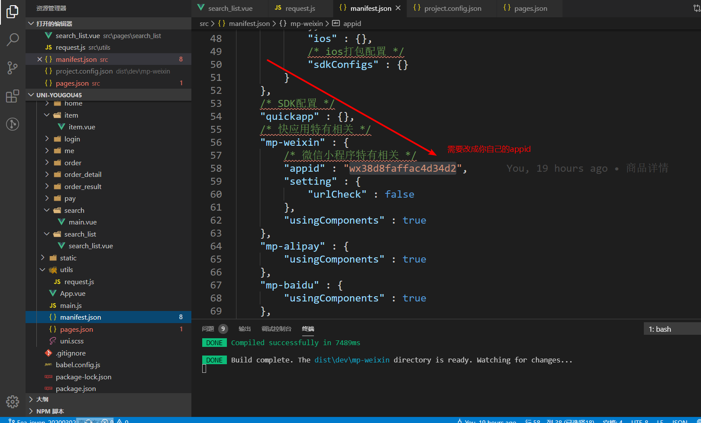
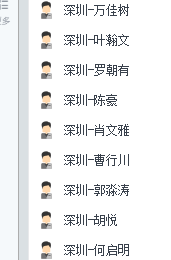

# 微信小程序学习第11天

## 每日反馈&&作业检查

1. https://gitee.com/cisiter/uni-yougou-45/blob/exploit/src/pages/searchList/searchList.vue

   1. 页面style无须加scoped

2. https://gitee.com/syrance/uni-yougou/blob/Fea-syrance-20200303/src/pages/item/item.vue
   1. goodsDetail是个对象，应该声明为对象
   2. iconfont样式不应该放在fonts里面

3. https://gitee.com/yueyue0422/yougou/blob/yueyue0303/pages/item/item.vue

   1. 数组map方法用得好
      1. 遍历数组，每一个元素根据给定的函数返回结果，push到新的数组中，返回这个新数组

4. https://gitee.com/xiaonan_404/uni_yougou/blob/tian_0303/src/pages/items/item.vue
   1. 自己写静态页面，赞
   2. request.js封装得不好

5. https://gitee.com/a623071187/my-yougou/blob/Fer_20200303/src/pages/item/index.vue
   1. 注意一下变量名命名
   2. request.js封装得不好

6. https://gitee.com/unrequited454/yougou/blob/master/src/pages
   1. request.js封装得不好
   2. 确定可以取到`goodDetail.goods_small_logo`?
   3. map用得好

7. https://github.com/Mr-chen465/uniapp/tree/home？？

8. 每日反馈填的人数太少，希望能反映真实情况，以后10点钟再催一下

9. manifest.json里面配置appid，否则默认的游客id，微信开发者工具会无法预览

   1. touristid是游客id,预览真机调试都打不开
   2. 测试号，不能上传
   3. 真实的appid才可以启动所有

   

## 回顾

1. unipapp的生命周期

   1. App和Page的生命周期和小程序一致
   2. 组件的生命周期和Vue一致,created....

2. 搜索列表页

3. 商品详情

   1. uni.previewImage({current序号，urls图片链接数组})
   2. button open-type="share"，定制弹窗 onShareAppMessage

4. 组件通信
   1. 父传子

      ```
      //父
      <Child msg="不要早恋"/>
      
      //子
      props:['msg'],
      data(){
      	return{
      		info:this.msg
      	}
      },
      watch:{
      msg(newValue){
      this.info = newValue
      }
      }
      ```

      

   2. 子传父

      ```
      //父
      <Child @child-event="eventHandler"/>
      function eventHandler(data){
      data就是`不要抽烟`
      }
      //子
      this.$emit('child-event','不要抽烟')
      ```

      


## 搜索列表-抽取头部输入框为单独的组件

1. search_list页面引入SearchBar.vue组件
2. 设置输入框confirm-type="search"
3. SearchBar.vue组件中，输入框有内容就展示x按钮，没内容就不展示x按钮
   1. 获取输入内容v-model.trim: inputVal
   2. 是否展示x按钮 v-show="inputVal"
4. 点击x按钮清空输入框内容

   1. 事件@click:clearInput''
   2. 在clearInput方法里面this.inputVal=''
5. 输入框回车，触发搜索商品

   1. SearchBar组件inputVal不为空时，$emit一个search事件
   2. search_list页面注册一个@search事件，在事件里面触发搜索
   3. 触发搜索需要先设置keyword，再reload, 和组件抽取前逻辑保证一致
6. 设置搜索列表输入框的初始值

   1. SearchBar标签，绑定:keyword=“keyword”
   2. SearchBar组件，props接受keyword, data里面初始化keyword? 无效！
      1. 父组件的onLoad比子组件初始化要慢
      2. 需要在子组件内watch keyword的变化，赋值给inputVal


#### 练习说明：

1. uniapp中路由是内置的，无法用$router.params来获取传参，通过onLoad获取传参
2. 父组件onLoad获取到传参时，子组件已经初始化了，那么子组件中需要watch父props的变化
3. 目前的方案里面并没有使用`组件v-model`
   1. [传送门](https://cn.vuejs.org/v2/guide/components-custom-events.html#%E8%87%AA%E5%AE%9A%E4%B9%89%E7%BB%84%E4%BB%B6%E7%9A%84-v-model)
   2. 在组件上使用v-model才有，$event可用
4. watch就是侦听器，监听data属性或者props的变化
5. 非页面的组件不要放在pages里面


## 优购案例-搜索页面


#### 01.页面分析

1. 首页和分类页搜索热区，点击跳转到搜索页面
2. 输入框输入，点键盘右下搜索，去到搜索列表页
3. 点历史字，去到搜索列表页
4. 搜索历史记录存储到storage
5. 输入框中有内容就展示x，点击x清除内容

#### 02.静态页面

1. 新建搜索页search
2. 搜索顶部
3. 历史搜索

#### 03.基本逻辑

1. 首页和分类页搜索热区，点击跳转到搜索页面
   1. 点击跳转@click
   2. uni.navigateTo(/pages/)
2. 输入框回车，跳转到搜索列表页
   1. 搜索页面注册事件@search:toSearchList
   2. 跳转到搜索列表页 /pages/search_list/search_list?catName=${inputVal}
3. 展示历史搜索列表，存储在storage中
   1. data里面从storage中取数据`keywordList`
   2. 渲染列表
4. 输入框，历史搜索列表头部添加关键字，并保存
   1. 事件@search:toSearchList处理
   2. unshift给数组头部插入关键字
   3. 数组不能重复使用filter过滤
      1. 更好的方法用Set
   4. 存储到storage wx.setStorageSync
5. 页面返回时才显示添加的关键字
   1. 页面onShow或者onHide时,keywordList从storage里面取
      1. onShow还是onHide更好？
         1. 都行
6. 点击历史搜索列表元素，跳转到搜索列表页, 同时元素添加到头部
   1. 也可以复用上面toSearchList(inputVal)
   2. 只不过InputVal需要换成点击的关键字
7. 点击x的时候，清除搜索历史
   1. 事件@click：clearKeywordList
   2. 清除keywordList和storage
   3. 确认弹框wx.showModal

#### 练习说明

1. 历史搜索的更新，无论用onHide或者onShow没有区别，不用纠结
   1. 模拟器比较卡，手机上试验没有明显的闪
2. 搜索列表页搜索，也应该加到历史搜索里面，大家有兴趣可以实现
3. 老师，为什么还要清除界面，当storage中数据被清空后，在data中不是就取空数组了吗


## 计算属性setter

[传送门](https://cn.vuejs.org/v2/guide/computed.html#%E8%AE%A1%E7%AE%97%E5%B1%9E%E6%80%A7%E7%9A%84-setter)

1. 计算属性默认的用法其实是计算属性的getter方法
2. 计算属性的setter方法里面可以获取到值变化
3. 如果不设置firstName或lastName，不会改变fullName的
4. 一般来说，我们需要在set方法里面改变计算属性的依赖
5. 典型的应用场景是checkbox全选/全不选


#### 练习总结

1. 计算属性的set方法触发的条件是，计算属性的key有变化的时候

   

## 优购案例-购物车


#### 01.页面分析

1. 商品详情点购物车，或者tabBar点购物车去到购物车页面
2. 去掉收货地址选择，一般收货地址放在支付页面
3. 页面显示用户添加进购物车的商品列表，用户可选择商品，修改商品数量
   1. 实际项目一般购物车数据增删改查直接发请求, 可参考小米商城
   2. 购物车数据存在storage
      1. 购物车数据没有对应接口
      2. 小程序里面购物车数据存storage,有一定理由
4. 点结算去到支付页面
5. 购物车里面并不是所有商品都会结算，可以选择是否进行结算
6. 生成订单，不管有没有支付成功，参加结算的商品应该从购物车去掉

#### 02.静态页面

1. 标题设置
2. 购物车信息头部
3. 购物车信息列表
4. 底部信息

#### 03.基本逻辑

1. 商品详情点购物车跳转到购物车页面

   1. 事件@click:toCart

   2. 切换到tab页uni.switchTab()

2. 商品详情页面，添加购物车，购物车数据存到storage, 数据结构越简单越好，如下:

   1. 购物车的数据结构越简单越好，storage会比较小
      1. 至少需要存什么呢？购物车至少得有商品Id,商品的数量,商品有没有被选中状态
   2. 添加商品的行为
      1. 如果购物车里面用户勾选了商品，商品详情添加购物车，这个商品就是勾选的
        2. 如果购物车里面用户去勾选了商品，商品详情添加购物车，这个商品就是勾选的
   3. 添加商品的思路
      1. 取storage购物车，改数据，再存回去
      2. 初次添加，商品数量为1,商品默认是勾选的
        3. 后续添加的，商品数量+1，也是勾选的

   ```js
   //声明成obj,取数据就方便
   cart = {
     商品id: {
       num: 商品数量, 
       checked:true
     }
   }
   
   //另外一种数据结构
   cart=[
       {
           商品Id，
           商品数量，
           是否选中
       }
   ]
   ```

   1. 判断是否是第一次添加
      1. 如果是数组的话，需要遍历
      2. 如果是对象的话，只需要判断对象上对应的属性是否存在

## 总结

## 作业

1. 搜索列表页
2. 搜索页
3. 购物车页面部分



黄滋源