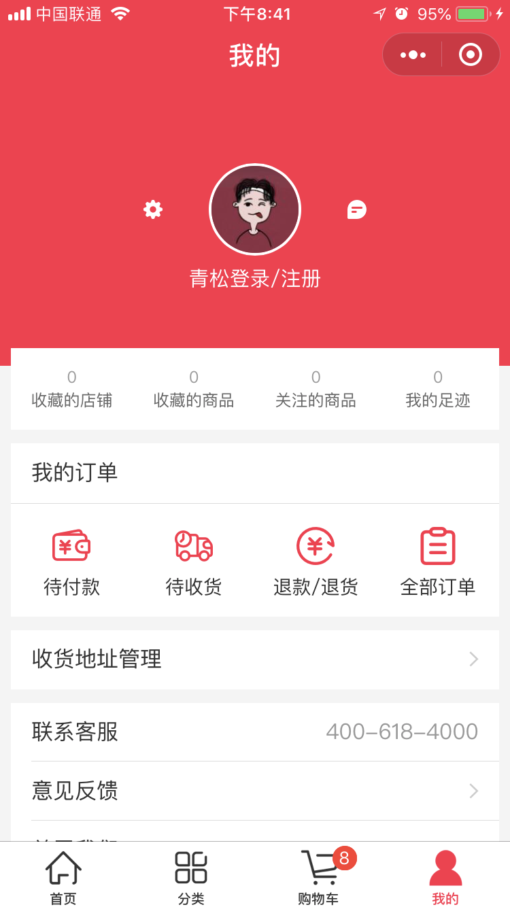

# 微信小程序学习第11天

## 每日反馈&&作业完成情况

1. 更改/新增地址的功能怎么实现呢
   1. 需要后端提供接口
2. 登录请求的token写死，不必每次都扫码，思路不错
   1. [传送门](https://gitee.com/xin_yang_yang/mpvue-yougou43/blob/mpyougou_xyy_20200217/src/pages/login/index.vue)
3. 删除已生成订单商品
   1. [传送门](https://gitee.com/xin_yang_yang/mpvue-yougou43/blob/mpyougou_xyy_20200217/src/pages/pay/index.vue)
4. 变量声明为vue实例的属性，也就是全局变量了
   1. [传送门](https://gitee.com/leishiming/mpvue-yougou/blob/leishiming_20200206/src/pages/pay/index.vue)
5. 手机端无法弹出支付框的bug
   1. 真机调试
   2. 开发版本小程序删除可以清缓存


## 优购案例-优化

#### 01.注意购物车页面onShow里面需要对goodsList重置

#### 02.设置购物车的商品个数

1. 购物车的onShow方法里面设置(无论商品是否选中，都算)
2. wx.setTabBarBadge
   1. index
   2. 显示文本，字符串类型
      1. 数量**商品类型个数**

#### 03.request中设置token

1. isAuth为true是添加token

#### 04.request错误提示

	1. status不为200时，提示错误
 	2. fail网络超时

05.立即购买无须清购物车

## 优购案例-订单结果页

#### 01.页面分析

1. 支付页面，支付取消或者支付成功，都会进入订单结果页

2. 订单结果页支付成功，展示成功状态和首页按钮，点首页按钮去到首页
3. 订单结果页支付失败，展示失败状态和首页按钮与订单详情按钮，点首页按钮去到首页，点订单详情去到订单详情

#### 02.静态页面

1. 文案及两个按钮

#### 03.基本逻辑

1. 支付页面上，支付成功和失败跳转订单结果页
   1. 失败时候传递orderNumber
2. 支付成功显示`首页`,并设置标题
3. 支付失败显示`首页`和`查询订单详情`，也设置标题


## 优购案例-订单详情

#### 01.页面分析

1. 订单结果点订单详情去到订单详情
2. 订单详情展示订单基本信息

#### 02.静态页面

1. 展示订单基本信息

#### 03.请求&渲染数据

1. 未登录跳转登录

2. 查询订单状态

   1. 接口 /api/public/v1/my/orders/chkOrder

      1. 请求方式POST

      2. 请求头:

         "Authorization" : token // 需要设置token带给后台

      3. 请求体:
         order_number : 订单号


## 优购案例-我的



#### 01.页面分析

1. 入口是tabBar
2. 展示登录状态收藏店铺、订单及其他信息
3. 已经登录展示用户头像和昵称，未登陆就显示登录，点登录跳转登录
4. 点订单跳转订单列表
5. 拨打电话的功能

#### 02.静态页面

#### 03.基本逻辑

1. 已经登录展示用户头像和昵称，未登陆就显示登录，点登录跳转登录
   1. login页userInfo添加到storage
   2. onShow里面获取到用户信息
   3. 点登录跳转登录
2. 拨打电话
   1. wx.makePhoneCall


## 优购案例-订单列表


#### 01.页面分析

1. 分别展示全部，待付款，已付款，退款/退货的订单列表
2. 在我的页面，点击订单去到订单列表
3. 点击订单列表其中一项，去到订单详情
4. 待支付的订单，点支付可以完成支付

#### 02.静态页面

1. 顶部tab栏
2. 订单列表展示

#### 03.基本逻辑

1. 我的页面点击不同菜单去到订单列表，选中对应的tab
   1. 两边菜单并不是一一对应的，设置数组序列标志
2. 点击tab展示对应的列表

#### 04.请求&渲染数据

2. 渲染订单列表

   1. 接口`/api/public/v1/my/orders/all?type=1`

      1. 请求方式GET

      2. 请求头:

         "Authorization" : token //需要设置token带给后台

2. 切换Tab发送请求

>在调试器的，AppData里面，红色是数字类型，绿色是字符串。
>
>计算属性方法一定要return


## mpvue与Vuex的结合

vuex就是一个**全局变量**，存储整个所有组件的状态。

> 由于全局变量太灵活，vuex定义了一个操作全局变量的规范

核心概念：

1. state 状态
2. Getter是state的计算属性
3. Mutation改变state的方法


## mpvue中使用Vuex

1. `vue init mpvue/mpvue-quickstart mpvue-demo-vuex`
2. 安装过程中选择使用vuex
3. pages/counter里面就是vuex的基本使用


## 优购商城集成Vuex

主要思路：

小程序启动时，Vuex中购物车数据从storage里面读取，小程序隐藏时把购物车数据存到storage里面，在这之间购物车的一系列操作，只更改Vuex中购物车数据

1. 在手机上退出小程序会触发onHide钩子函数

#### 准备工作

1. 安装vuex

   ```
   npm install vuex
   ```

2. 新建文件`src/store/index.js`,并创建一个store

3. main.js中$store设置到Vue的原型上

4. 添加Vuex logger插件，方便打印日志

> 内存读取速度比较快，价格贵，断电不会保存
>
> 硬盘容量大，价格便宜，断电后会保存
>
> 读内存不会异步，读硬盘会异步

#### 页面逻辑重构

1. store里面购物车初始化
   1. store里面声明cart，并初始化从storage里面读取
2. 购物车页面
   1. 添加购物车
      1. 添加一个mutations add2Cart
      2. item页面commit
   2. 购物车商品列表展示
      1. store getters获取cart数据
   3. 购物车onHide时需要更新state.cart
      1. store中声明 updateCart
      2. 使用commit
3. App切后台，购物车数据存储到storage
   1. App.vue onHide方法触发
   2. commit storeCart方法
   3. storeCart方法里面存储state.cart到storage
4. 支付页面
   1. 展示商品列表
      1. getters.getCart
   2. 生成支付单后，删除购物车中勾选状态的商品
      1. mutations.arrangeCart


## 抽取api层

 统一管理项目所有api请求

```js
import request from '@/utils/request'
export function getSwiperdata () {
  return request({
    url: '/api/public/v1/home/swiperdata'
  })
}
```


## 移动开发

| 开发方式          | 平台                                                         | 逻辑                 | 视图              | 用户体验   | 开发周期     |
| ----------------- | ------------------------------------------------------------ | -------------------- | ----------------- | ---------- | ------------ |
| 原生              | iOS: Object C、Swift<br />Android: Java、Kotlin              | 原生                 | 原生              | 好         | 长，审核太慢 |
| 移动Web(h5)       | 浏览器                                                       | js                   | HTML、css         | 无原生能力 | 短           |
| H5混合（hybrid）  | 移动web+原生壳，原生提供浏览器webview，可以加载网页，还有访问原生的能力 | js                   | HTML、css         | 一般       | 短           |
| 原生混合          | React Native与Weex(把js、html、css转成原生代码)              | js                   | 原生              | 稍好       | 较短         |
| Flutter(可能会火) | 原生                                                         | Dart（类js或者java） |                   |            |              |
| 小程序            |                                                              | JavaScript           | 小程序组件、css等 | 好         |              |


1. 原生
   1. 很少有纯原生的写的应用
   2. 除非对性能要求极高的。直播
   3. 主要是因为开发周期长，审核时间长
   4. 苹果一般两周，安卓需要小米商店，华为应用，应用宝
      1. 审核比较严
         1. 要求你的APP必须有注册功能
         2. 不能金融功能
         3. 所以需要弄个配文件，关闭和开启金融和注册功能
2. 移动Web
   1. 没有原生能力
   2. 大多数都作为一个引流的入口
3. H5混合（黑马头条App）
   1. 把移动网页打包到一个壳子中，安装到手机上去使用
   
   2. 性能和开发效率都不错，市场大部分用这种模式
   
   3. 95%以上的代码还是h5，另外小于5%是Js调用生
   
   4. **一套代码安卓、ios和h5，但是复杂的动画是不是行**
   
   5. 无须审核
   
      > window.alert('leka://com.package.user/getCamcra'),window.confirm,window.prompt
4. 原生混合
   1. 语法稍有学习成本，只能兼容iOS和安卓
   2. 对性能要求稍好的项目会用
5. Flutter
   1. 内置渲染引擎
   2. 一次开发，多平台运行
6. 小程序
   1. 开发成本低，体验好
   2. 一般是App版的阉割版本，作为引流


### 面试问到怎么兼容安卓和ios，老师可以说下大概怎么处理？

1. 自适应，flexible.js+rem适应了iphone6，其他非平板设备都自适应了
   1. 小程序用rpx
   2. 最好font-size也随设备自适应
2. 在webpack的工程里，css属性的前缀默认添加
   1. transform
   2. -webkit-transform
3. 在webpack工程里，添加babel-ployfill。比如一些低端手机不支持promise，写promise语法也会转成es5
4. 如果想使用一些新的CSS属性或者js-api的话，先去caniuse上查一下兼容性。比如flexbox在手机端兼容性不错，但是grid就比较差了。
   1. display:flexbox配合自适应布局非常好
5. 日期格式的解析'2019-12-16', 这种日期格式在安卓上能Data.parse，但是iOS不行。需要统一转成'2019/12/16'
6. api使用遵从规范，有一些不符合规范的api使用了，可能部分手机上可以，其他设备就不一定了。
   1. 比如小程序里面没有span标签，强行使用的话，可能不同设备解析不一样。
   2. 请求后端数据，如果是对象，是无序的。即使有些设备上有序，其他设备也无序
   3. uniapp <view> ul>li
7. 测试一些基本设备
   1. 安卓普通的，全面屏
   2. iOS，iphone4s,iphoneX
   3. iOS系统版本，10.2，12.。。
   4. 如果需要兼容h5，那么微信浏览器