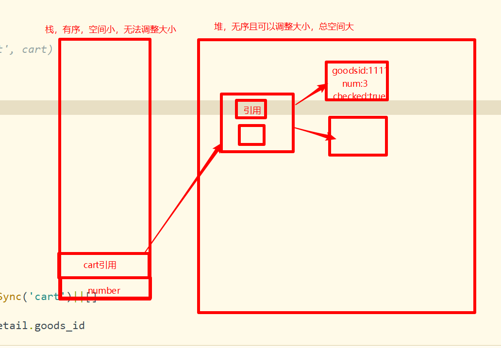

# 微信小程序学习第12天

## 每日反馈

1. 扶我起来,我还能学
2. 到此一游
3. 感觉还没养成程序员思维，面对需求，不能转化为代码，需要更多磨练
   1. 前端做界面。各种界面，app,h5,小程序
   2. 静态页面+请求接口+渲染数据
   3. 如果渲染数据需要传参，传参从哪里来
   4. 想好基本的思路，就开始写，思路更加清晰
   5. 代码写多，经验更多。
4. 搜索页面，历史搜索点击逻辑，key值给item会点击混乱
   1. vfor遍历数组，key值为item。 数组重新生成一个数组
      1. vue是ok的
      2. 微信小程序也是ok的
   2. 内置浏览器OK的。
   3. 原因在于uniapp源码转微信小程序出错
   4. 类似的问题可以参考[传送门](https://ask.dcloud.net.cn/question/70397)
5. 商品详情页面，rich-text在ios上不显示图片的问题，是webp图片格式不支持
   1. webp图片，图片质量/图片大小值大于jpg和png
   2. android和ios原生引入Lib支持


## 回顾

1. 搜索列表引入SearchBar组件
   1. 引入SearchBar组件
   2. 有内容就展示x, 没内容不展x
   3. 点击x的清空
   4. 输入内容，点击键盘右下角按钮时，触发搜索
      1. 子传父
         1. 点击键盘右下角按钮，$emit('search', this.inputVal)
         2. 父组件使用子组件<SearchBar @search="doSearch">
   5. 初始值设置给子组件
      1. 父传子
         1. 父使用子传属性
         2. 子prop['']
      2. 子里面需要watch prop
2. 搜索页面
   1. 引入SearchBar组件
   2. 输入内容，点击键盘右下角按钮时，跳转搜索列表，并且传参
      1. 子传父
   3. 第2步，关键字应该插入到历史搜索的头部，并且去重
      1. [inputVal, ...keywordList]
      2. [...new Set(arr)] 去重
   4. 点击搜索列表的某一项时，跳转搜索列表，并且传参，关键字应该插入到历史搜索的头部，并且去重


## 作业

1. https://gitee.com/manutreemin/ygshop/tree/develop/
   1. 没推送
2. https://gitee.com/xiaoqiang_passing_by/uni-yougou/tree/new-20200322/
   1. 没毛病
   2. 建议总是设置默认值 historyList
      1. wx.getStorageSync(‘不存在的key’)，返回空字符串
3. https://gitee.com/zheshiyigejimodetian/uni-yougou.git
   1. 私有
4. https://gitee.com/WSXGP/uni_yougou46/tree/WS_xgp_0322/
   1. 5天前？
5. https://gitee.com/tracy6891/uni-yougou46.git
   1. 赞
   2. 长按删除
   3. 可以查一下长按删除，有一个对应的组件
6. https://gitee.com/huang_tao971481145/uni_yougou_ht/tree/master/
   1. 没问题
7. https://gitee.com/zhuang_meng_yu/uni-app46
   1. ？？？
8. https://gitee.com/evin_d/my-uni-yougou
   1. vue-cli初始化uniapp项目
   2. scss
   3. key值为item
   4. 搜索页面给SearchBar设置初始值？
9. https://gitee.com/xiaomumu1002/yougou-mall/tree/mumu_20200322
   1. ok


## 计算属性setter

[传送门](https://cn.vuejs.org/v2/guide/computed.html#%E8%AE%A1%E7%AE%97%E5%B1%9E%E6%80%A7%E7%9A%84-setter)

1. 原来我们使用的计算属性本质上是计算属性getter的简写
   1. computed里面声明一个方法 ，在结构里面使用时，直接使用方法名
   2. 结构里面使用方法名对应的值就是computed里面声明一个方法的返回值
2. 计算属性还有set方法，在set方法形参里面可以获到计算属性改变的值
   1. 这个时候并没有改变在结构里面使用fullName, 在结构里面使用fullName本质上是计算属性的get
3. 如果想改变在结构里面使用fullName，需要改变计算属性get里面依赖的属性
4. 通常计算属性set方法里面，通过改变的值，改变依赖
5. 计算属性get：改变依赖，可以改变计算属性get
6. 计算属性set：改变属性，也可以改变依赖

**应用场景：全选逻辑**

如何更容易理解：可以理解watch计算属性的变化

```js
fullName: {
    // 读计算属性
    get () {
        return this.firstName + ' ' + this.lastName
    },
        set (newVal) {
            // 当fullName改变时，改变值会设置到set
            // console.log(newVal)
            let arr = newVal.split(' ')
            this.firstName = arr[0]
            this.lastName = arr[1]
        }
}
```

#### 练习总结

1. computed里面可以有多个计算属性，每个计算属性都有自己的set和get方法
2. 计算属性如果想写set，必须是对象，无法用简写


## 优购案例-购物车


#### 01.页面分析

1. 入口：点击tab栏购物车显示购物车页面。它是一个tab页面; 商品详情，点击加入购物车添加数据
   1. 跳转时用switchTab
   2. 不会销毁
2. 购物页面砍掉收货地址，包括加入购物车商品的列表，全选，总价，总数据
3. 商品列表的每一个商品包括是否勾选，商品图片，商品名称，商品价格，商品数量
   1. 商品数量可以改
4. 如果商品列表每个商品都选中，全选勾选; 全选勾选/不勾选会改变商品列表
5. 总价：已经勾选的商品价格之和
6. 总数量：已经勾选的商品数量之和
7. 没有购物车的请求接口，只能存在storage里面

#### 补充

1. 购物车的数据的改变是发请求还是存本地，还是存vuex?
   1. 现象
      1. 未登录时，添加购物车后. 再登录，未登录时添加购物车的数量会同步的
      2. 手机端添加购物车，PC端打开时可能看到手机端添加购物车的数据
   2. 参考xiaomi商城
      1. 大家可能觉得发请求是很耗时间或者性能
         1. 请求时间大概100ms, 很快的

#### 02.静态页面

1. 标题设置
2. 购物车信息头部
3. 购物车信息列表
4. 底部信息
5. **图标显示，iconfont引入**

> 实际开发中，静态资源都在放在自己的服务器。一般也会购买CDN服务器存放静态资源

#### 03.请求数据&&渲染数据

1. 那么商品勾选状态和数量存在哪是呢?? 接口需要传递的id从哪里来呢？

   1. 解决方案就是：**商品勾选状态和数量和id都存在storage**

2. **storage里面存的购物车的数据结构**

   1. 选择用数组，原因需要保证购物车商品列表的顺序

   ```js
   // 数组结构比较自然能理解，有顺序的。缺点：找数据需要遍历
   cart=[
   	{
   	 checked //商品勾选的状态
   	 num //商品数量
   	 goodsId //商品id
   	}
   ]
   ```

   1. 对象

      ```js
      //优点，和八戒叔叔一样找对象比较容易，对象是无序
      cart={
      	商品id:{
      	 商品勾选的状态
      	 商品数量
      	}
      }
      ```

3. 给购物车加数据

   1. 商品详情点击购物车跳转购物车页面
      1. 点击@click: toCart
      2. 跳转uni.switchTab
   2. 商品详情点击加入购物车，添加数据
      1. 第一次添加，数量为1; 后续添加数量+1
      2. 第一次添加商品，勾选; 如果在购物车页面去勾选了商品，再次添加也是勾选的;结论：只要添加商品都是勾选的
      3. 问题：如何区分是第一添加还是后续添加呢？
      4. 步骤：
         1. 点击加入购物车 @click:add2Cart
         2. 取storage，改，存回去
            1. 判断是否是第一次
               1. 从数组找一个goodsId为当前商品goodsId这个商品
            2. 如果是第一次添加
               1. 构建一个对象，num:1, checked:true,goodsId
               2. 插入cart数组头部
            3. 如果非首次添加
               1. 更新找到的那个对象num++,checked:true
            4. 成功添加，提示

4. 请求数据

   1. 接口 
      1. url /api/public/v1/goods/goodslist?goods_ids=140,395
      2. 需要传递加入购物车中所有商品的id
      3. 返回商品的名称，价格和图片
   2. 在哪里发，onShow发请求，更新数据
   3. goods_ids从storage购物车数组
      1. 数组的map返回goodsId的数组，然后用join拼接

5. 渲染页面

   1. 由两部分数据渲染:storage里面的购物车+请求回来的数据
   2. 提示：**请求返回的数组不是正确的顺序**
      1. 所以应该vfor遍历以cart为主
   3. 得在goodsList里面找一项goodsId为xxx的，进行渲染？？？
      1. 解决方案，**合并goodslist和cart,以cart为主**
         1. 依次遍历cart的每一项item，然后在goodslist数组里面找一个对象targetGoods的goods_id==item.goodsId
         2. 如果找到了，item和targetGoods两个对象合并
         3. 用了map,find,对象的展示运算符
   4. 最终我们可以拿到合并后的数组goodsList, 进行渲染
      1. 复选框用v-bind:clas

6. 数量+，点击数量++;数量-, 点击数量--,减到1停止

   1. 点击+,@click :add
   2. 点击- @click:sub
   3. 减到1停止
      1. :disabled="item.num===1"

7. 商品列表复选框勾选/勾选逻辑

   1. 点击某个商品时，让checked取反
   2. 点击@click="toggleCheck"

8. 全选 逻辑

   1. 所有商品选中，全选就选中
      1. 计算属性isAll依赖每个商品的选中状态
      2. 方案
         1. 所有选中的商品的个数是否和goodsList相等
         2. 只要有一个商品不选中的话，全选就不选中,find方法
         3. 用every
   2. 全选勾选，所有商品勾选; 全选不勾选，所有商品不勾选
      1. 计算属性的set, 把全选的状态设置给所有商品
      2. 全选的点击

9. 总数量=所有勾选的商品数量之和

   1. 遍历所有的商品，把勾选的商品数量相加
   2. reduce更简洁

10. 总价格=所有勾选的商品数量*商品价格之和

    1. reduce

#### 注意点

1. 浏览器在解析对象时，是无法保证顺序。Object.keys(obj)

2. cart里面如果是数组的话，那么数组里面每一项都是一个对象，改变对象的时，就是改变对象

   1. 建议大家看一下马士后的java课程里面的对内存分析

   

3. html里面，disabled属性，如果给了属性，不管属性值为什么，都是disabled
4. 在vue里面v-bind:disabled有一个语法增加 :disabled="true/false，是否添加disabled属性"

## Array的方法总结

1. 数组的**find** 是返回第一个符合的。会对数组进行遍历,数组中每一项都执行指定的函数，如果函数返回true,find会返回这一项，并中断遍历;如果没有找到，就是undefined

2. 数组的**map**会返回一个新数组，遍历原数组的每一项，每一项执行一个指定的函数，函数的返回值作为新数组的元素

3. forEach不能中断遍历，不能改变元素

4. **every**，数组的每一项执行一个指定函数，如果返回值都为true的话，最终返回true;否则为false

5. **some**，数组的每一项执行一个指定函数，如果有一个返回值都为true的话，最终返回true;否则为false

6. **reduce** 用法

   1. 每一次遍历前，会把上一次计算后的值赋值给中间值
   2. 应用场景：累加，阶乘

   ```js
   arr.reduce((中间值,数组的每一项){
     return 计算后的值
   },中间值的初始值)
   ```


## 总结

## 作业

1. 完成购物车
2. 购物车的更新应该存到storage???

