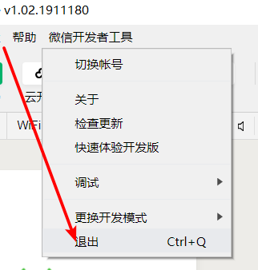
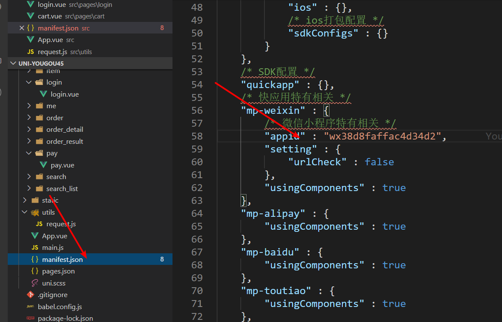

# 微信小程序学习第12天

## 每日反馈

1. 今天是来黑马学习的第100天，收获颇多。 越来越临近离开黑马找工作的时间，心中不免有些许忐忑。感觉前面学的知识忘掉一些，最近学的知识只吸收了一些，也不知道后面的课程是不是更难一些。 希望老师能多讲讲刚到公司的经历，消除我们的恐惧。
   1. 小程序的课程其实就是小程序原生语法+复习vue
   2. 后面的React比Vue更难点
   3. 不用恐惧，公司既然招你，就不会随意辞退你。一般会给一周或更长时间让你熟悉项目。
   4. 可以写一些线上已经有的，而且是核心页面的
2. 如何锻炼写代码的思路
   1. 不知道思路，是因分析思路还不够细。
   2. 列出主要功能，然后细分
   3. 分析大致的思路，开始动手写，只有动手，新的思路才会出来。
3. 有什么学习方法(建议)
   1. 抓住重点项目，比如黑马面面，黑马头条，优购商城
   2. 参考笔记思路写一遍，拖开老师的思路写一遍
   3. 搞弄项目每一个文件是干什么的，不懂就查


## 作业

1. https://github.com/q190776912/yougou/blob/master/src/pages/search/search.vue
   1. 搜索关键字添加到历史搜索列表的逻辑统一到SearchBar组件里
   2. 并且灵活使用了展开运算符
2. https://gitee.com/white_luo/yougou/blob/study/src/pages/search_page/search_page.vue
   1. 基本没问题
3. https://github.com/Mr-chen465/uni-app
   1. 没push?
4. https://gitee.com/guo_miao_tao/uni-yougou45
   1. 访问受限
5. https://gitee.com/yueyue0422/yougou/blob/yueyue0303/pages/search/search.vue
   1. 没啥问题，有详细注释
6. https://gitee.com/hqmin/uni-yougou/blob/dev/src/components/SearchBar.vue
   1. 搜索关键字添加到历史搜索列表的逻辑统一到SearchBar组件里，赞
7. https://gitee.com/blurboy/uni-yougou/blob/Fea_joven_20200302/src/pages/search/search.vue
   1. 有调试痕迹，建议使用debugger

## 回顾

1. 搜索列表
   1. 抽取searchBar组件
   2. searchBar组件独有的功能
   3. confirm事件处理，子传父
   4. 分类页面跳转过来，把keyword设置给子组件，父传子
2. 搜索页面
   1. 输入框confirm，跳转
   2. 跳转的同时，把keyword放到历史搜索列表
   3. 点击历史搜索列表时，跳转
   4. 清除


## 优购案例-购物车


#### 02.静态页面

1. 标题设置
2. 购物车信息头部
3. 购物车信息列表
4. 底部信息
5. **图标显示，iconfont引入**

#### 03.基本功能

1. 商品详情点购物车跳转到购物车页面

   1. 商品详情点击购物车 @click:toCart
   2. 跳转到购物车页面，uni.switchTab

2. 展示购物车商品列表

   1. 数据从哪来？从接口分析，接口只会返回部分数据，另一部分需要storage; 而且接口依赖storage存的购物车

      1. storage购物车的数据结构

         1. 购物车至少得有商品Id,商品的数量,商品有没有被选中的状态
         2. 用对象的形式还是数组的形式呢？
            1. 数组好，因为数组是有序的

         ```js
         //声明成obj,商品id为key，值里面包含num和选中状态两个属性
         //好处是取数据方便，但是Object.keys(cart)返回的是无序的
         cart = {
           商品id: {
             num: 商品数量, 
             checked:true
           }
         }
         
         //数组里面存对象，对象里面包含三个属性
         cart=[
             {
                 goodsId，
                 num，
                 checked
             }
         ]
         ```
      
      
      
   2. storage购物车数据添加. 商品详情页面，点击添加购物车，把当前商品存储到storage购物车
      
         1. 可能我们存之前就有数据。所以思路：取storage购物车(空的给默认值)，改数据，再存回去
         2. 怎么改数据？无非改商品id，商品数量以及是否选中
            1. 存goodsId没问题
            2. 商品数量
               1. 第一次添加，数量为1
               2. 非首次添加数量++
               3. 如何判断是否是第一次添加呢?
                  1. 数组的find
            3. 选中状态
               1. 如果购物车里面用户勾选了商品，商品详情添加购物车，这个商品就是勾选的
               2. 如果购物车里面用户去勾选了商品，商品详情添加购物车，这个商品就是勾选的
               3. 总之，添加商品，总是选中的。
      4. 如果第一次添加，插入到数组最前面; 否则直接更改
      
   3. 购物车页面根据storage购物车数据发请求 
      
         1. 尽早地发请求onShow
            
            1. onLoad只会执行一次
         2. 取storage购物车数组每个对象的goodsId，拼成字符串
            
            1. map方法返回数组，然后join成字符串
   2. 调接口发请求，拿数据
      
      3. 如果购物车数据为空，不必请求
         
      4. 渲染页面
      
         1. 如何取storage购物车数组的商品数量或者选中状态？
            1. 太南了
            2. 解决方案：合并数据
               1. forEach结合展开运算符？forEach不能改变元素别名的值
               
               2. map结合展开运算符，find
               
                  ```js
                  // goodsList和cart数据合并
                  this.goodsList = cart.map(item => {
                      // 从goodlist找到goods_id为item.goodsId的对象
                      let goods = _goodsList.find(v => {
                          return v.goods_id = item.goodsId
                      })
                      return { ...item, ...goods }
                  })
                  ```
         2. 渲染商品名称，图片及价格
         3. 渲染复选框，点击的勾选/去勾选
            
            1. v-bind:class
         4. 商品数量修改
            1. -按钮最小值为1，1时disabled
               1. v-bind:disabled="true",添加disabled属性; 否则移除
            2. +按钮

3. 全选逻辑

   1. 所有商品选中时，触发全选选中状态;有一个商品不选中时，去勾选全选
      1. **every()是对数组中每一项运行给定函数，如果该函数对每一项返回true,则返回true。**
      2. **some()是对数组中每一项运行给定函数，如果该函数有一项返回true，则返回true。**
   2. 选中全选，所有商品选中;去勾选全选，所有商品不选中。
      1. 如果想真正改变计算属性getter，需要改变计算属性的依赖

   > // 如果所有商品都勾选的话，就true;详解：拿出goodsList.length==勾选商品的个数
   >
   > // 默认true,遍历goodsList，如果有一项没勾选的话，就false
   >
   > forEach不能够break; for of是可以break

4. 总数量和总价格

   1. 总数量显示

      1. reduce的用法

      ```js
      arr.reduce(function(上一次计算后的值，当前遍历中的元素)){
          return 上一次计算后的值与当前遍历中的元素的运算
      }，初始值)
      ```

   2. 总价显示

   3. 注意只有选中的商品才参与计算

5. 页面隐藏时onHide，保存cart状态到storage

#### 优化：

1. cart没有必要作为data属性，局部变量即可

#### 练习说明：

1. 有些时候，模拟是比较慢，switchTab，有抖动。如果手机上没有问题，忽略掉

#### 总结Array方法

1. arr.map()，返回一个新的数组，新数组中元素为原数组每一项执行指定函数返回的结果
2. arr.find()，数组中每一项执行指定函数，如果函数结果为true就返回这一项，中断循环; 一直没找到，返回null
3. every()是对数组中每一项运行给定函数，如果该函数对每一项返回true,则返回true。
4. some()是对数组中每一项运行给定函数，如果该函数有一项返回true，则返回true。
5. forEach不能中断
6. for of能中断


## 优购案例-登录

#### 01.页面分析

1. 购物车页面点结算，如果未登录，跳转登录，否则跳转支付页面
2. 登录页上，点立即登录，登录成功，存token, 并goBack

#### 02.基本逻辑

1. 购物车点结算，当然如果没有选择商品就提示;未登录跳转登录; 否则跳转支付页面
   1. 是否登录判断token
2. 登录页，点立即登录
   1. 声明式获取用户信息+code，调登录接口
   2. 存储token并back

# 请求登录接口注意！！！！！！！

1. 微信开发者账号，切换用户，截图让我扫码

   1. 先退出，再让我扫，确保真的可以切换用户

   

2. 微信开发者工具appid换掉：wx38d8faffac4d34d2

   1. 在src目录里面改appid的配置

   2. 不要在微信开发者工具的源码里面改，那个是src目录生成的文件，重新编译后dist目录内容会变

      

3. baseURL要更新了https://www.uinav.com

   1. 请求的基地址，在request.js文件里面改


#### 提示：

1. A跳转B页面，A页面并没有被销毁，所以逻辑还在执行。
2. 每个人获取的token不一样，如果获取到了，就不要干掉


## 总结

## 作业

1. 完成购物车
2. 登录页

