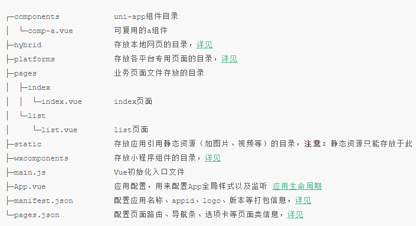

# 微信小程序学习第12天


## 移动开发

| 开发方式          | 平台                                                         | 逻辑                 | 视图              | 用户体验   | 开发周期     |
| ----------------- | ------------------------------------------------------------ | -------------------- | ----------------- | ---------- | ------------ |
| 原生(Raw)         | iOS: Object C、Swift<br />Android: Java、Kotlin              | 原生                 | 原生              | 好         | 长，审核太慢 |
| 移动Web(h5)       | 浏览器                                                       | js                   | HTML、css         | 无原生能力 | 短           |
| H5混合（hybrid）  | 移动web+原生壳，原生提供浏览器webview，可以加载网页，**还有访问原生的能力** | js                   | HTML、css         | 一般       | 短           |
| 原生混合          | React Native与Weex(把js、html、css转成原生代码)              | js                   | 原生              | 稍好       | 较短         |
| Flutter(可能会火) | 原生（openGL）                                               | Dart（类js或者java） |                   |            |              |
| 小程序            |                                                              | JavaScript           | 小程序组件、css等 | 好         |              |


1. 原生

   3. 主要是因为开发周期长，审核时间长
   4. 苹果一般两周，安卓需要小米商店，华为应用，应用宝
      1. 审核比较严
         1. 要求你的APP必须有注册功能
         2. 不能金融功能
         3. 所以需要弄个配文件，关闭和开启金融和注册功能
   3. 很少有纯原生的写的应用
   4. 除非对性能要求极高的。直播

2. 移动Web

   1. 没有原生能力
   2. 开发微信公众账号
   3. 大多数都作为一个引流的入口

3. H5混合（黑马头条的h5打包成App）

   1. 把移动网页打包到一个壳子中，安装到手机上去使用
2. 性能和开发效率都不错，市场大部分用这种模式
   3. 95%以上的代码还是h5，另外小于5%是Js调用生
4. **一套代码安卓、ios和h5，但是复杂的动画是不是行**
   5. 无须审核
6. js和原生通信
      1. 当我们用window.alert，原生java有方法可以获取到字符串的传参
   2. window.alert('leka://com.package.user/getCamcra'),window.confirm,window.prompt
   
4. 原生混合

   1. 语法稍有学习成本，只能兼容iOS和安卓
   2. 对性能要求稍好的项目会用
   3. 性能：原生>原生混合>h5混合

5. Flutter

   1. 内置渲染引擎(openGL)
   2. 一次开发，多平台运行

6. 小程序

   1. 开发成本低，体验好
   2. 一般是App版的阉割版本，作为引流
7. 除了flutter和小程序外，做一个app时，其他几种类型可以共存


## 优购页面逻辑重构

1. 购物车页面
   1. 购物车商品数量及选中状态直接更新state.cart
      1. +和-，勾选的点击事件, 更新store updateItem
      2. 全选set，更新 updateCartStatus
   2. 设置tab栏的徽标
      1. getters.getCart
2. 支付页面
   1. 展示商品列表
      1. getters.getCart
   2. 生成支付单后，删除购物车中勾选状态的商品
      1. mutations.arrangeCart


## 抽取api层

 统一管理项目所有api请求

注意，命名统一

```js
import request from '@/utils/request'
export function getSwiperdata () {
  return request({
    url: '/api/public/v1/home/swiperdata'
  })
}
```


## Dcould的产品

1. **HBuilder** X开发工具，类似于vscode
2. **uni-app**一套代码支持多端的框架
3. wap2app 手机网页转App
4. **H5+** 混合模式的App
5. MUI基于H5+的UI库

特点：

1. DCould公司的文档写得挺详细的，多看看可以更快点满前端技能点
2. 各个产品适合学习，做小型公司的产品


## 开发工具HBuilder和HBuilderX

[传送门](https://www.dcloud.io/hbuilderx.html)

也是一款强大的前端IDE（绿色版），最好注册账号登录，**建议下载App开发版本**（支持打包apk）

1. 可以使用vscode的快捷键方案
2. 支持vue语法
3. 支持打包apk
4. 支持真机调试
   1. h5页面开发时希望在手机上，边改边看到效果
5. 支持暗黑主题
6. 老王推荐
7. 。。。。

> 注意解压文件时，文件比较多，耐心等。
>
> 底层是eclipse


## *HBuilder基本使用

新建`5+App`,选择Hello mui模板

1. 浏览器运行
   1. 选中index.html，运行->选择浏览器

2. 真机调试
   1. 运行->选择手机
   2. 要选择项目
   3. 如果基座安装不成功的话，下载hbuildber_base.apk进行安装
3. 打包apk

   1. 发行->云打包
   2. 勾选安卓，选择使用公有证书 
   3. 等待生成apk，下载安装即可


#### hbuilder连结手机：

1. 打开手机开发者选项->打开USB调试,连接后确认
2. 安卓：可能驱动不完善，先试着连结应用宝或者360手机肋手
3. windows连结ios需要安装itunes
   1. 安装完itunes提示重启电脑，连接itunes信任设备，运行项目安装基座，添加证书就ok了
4. [查看连结帮助](https://ask.dcloud.net.cn/article/97)

#### 注意点：

1. 建议调试用iphone
2. 安装App用安卓
3. 保证解压的hbuilder完整的

> ios企业开发者账号，可以不通过AppStore审核使用。
>

#### 练习：

1. 下载安装hbuilder
3. 创建hellomui,完成真机运行
4. 发行->云打包
4. 安装apk到手机上
5. 再体验一下hellomui App
6. 或者打包黑马头条


## H5+基本使用

[传送门](https://ask.dcloud.net.cn/article/89)

开发H5混合模式的App，把一些常见的原生能力内置，令到JavaScript能调原生

1. 拨打电话

   ```js
   plus.device.dial(15361819220) 
   ```

   

2. 拍照

   ```js
   let camera = plus.camera.getCamera()
   camera.captureImage()
   ```

#### 注意点：

学习h5+ API, 让我们更加理解混合App


## uni-app介绍

[传送门](https://uniapp.dcloud.io/)

uni-app是一个使用vue.js开发“所有”前端应用的框架

1. 支持vue.js语法
2. iOS、Android、H5、以及各种小程序（微信/支付宝/百度/头条/QQ/钉钉）等多个平台 
3. 开发非企业级的应用没问题, 特别适合于学习。
   1. 企业需要定制自己原生API，uni-app支持得不好
   2. 然后打包App，需要云打包，代码泄露。

**uni-app同样支持浏览器运行, app运行及打包成apk，微信开发者工具**


支持微信开发者工具打开

1. 选择微信开发者工具的位置
2. 工具->安全->开启服务端口

#### 提示：

1. uni-app有很多好的模板可以使用和参考(fuzhi)
2. 项目依赖的插件需要安装插件 工具->插件安装（less、sass）


## uni-app的工程结构

极像mpvue生成的工程结构src目录



1. pages.json配置路由，导航条和Tab栏等，小程序app.json的页面管理部分
2. manifest.json包括app.json的非页面管理部分，还有App相关配置
3. 页面直接是.vue文件，页面路径的配置在pages.json里面

> 总的来说，工程结构和mpvue非常像，其实它也是nodejs+webpack的工程，只不过隐藏一些文件。
