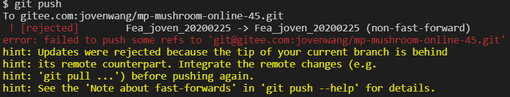

# 微信小程序学习第12天

## 每日反馈

1. 扶我起来,我还能学
2. 到此一游
3. 感觉还没养成程序员思维，面对需求，不能转化为代码，需要更多磨练
4. 搜索页面，历史搜索点击逻辑，key值给item会点击混乱
   1. h5是OK的。
   2. 纯Vue语法里面这样也是OK
   3. 原因在于uniapp源码转微信小程序出错
   4. [传送门](https://ask.dcloud.net.cn/question/70397)
5. 商品详情页面，rich-text在ios上不显示图片的问题，是webp图片格式不支持


## 回顾

1. 搜索列表引入SearchBar组件
2. 搜索页面
   1. 历史搜索点击跳转逻辑


## 作业

1. https://gitee.com/manutreemin/ygshop/tree/develop/
   1. 没推送
2. https://gitee.com/xiaoqiang_passing_by/uni-yougou/tree/new-20200322/
   1. 没毛病
3. https://gitee.com/zheshiyigejimodetian/uni-yougou.git
   1. 私有
4. https://gitee.com/WSXGP/uni_yougou46/tree/WS_xgp_0322/
   1. 5天前？
5. https://gitee.com/tracy6891/uni-yougou46.git
   1. 5天前？
6. https://gitee.com/huang_tao971481145/uni_yougou_ht/tree/master/
   1. 没问题
7. https://gitee.com/zhuang_meng_yu/uni-app46
   1. ？？
8. https://gitee.com/evin_d/my-uni-yougou
   1. vue-cli初始化uniapp项目
   2. scss
   3. key值为item
   4. 搜索页面给SearchBar设置初始值？
9. https://gitee.com/xiaomumu1002/yougou-mall/tree/mumu_20200322


## 计算属性setter

[传送门](https://cn.vuejs.org/v2/guide/computed.html#%E8%AE%A1%E7%AE%97%E5%B1%9E%E6%80%A7%E7%9A%84-setter)

1. 计算属性默认的用法其实是计算属性的getter方法
2. 计算属性的setter方法里面可以获取到值变化
3. 如果不设置firstName或lastName，不会改变fullName的
4. 一般来说，我们需要在set方法里面改变计算属性的依赖
5. 典型的应用场景是checkbox全选/全不选


#### 练习总结

1. 计算属性的set方法触发的条件是，计算属性的key有变化的时候


## 优购案例-购物车


#### 01.页面分析

1. 商品详情点购物车，或者tabBar点购物车去到购物车页面
2. 去掉收货地址选择，一般收货地址放在支付页面
3. 页面显示用户添加进购物车的商品列表，用户可选择商品，修改商品数量
   1. 实际项目一般购物车数据增删改查直接发请求, 可参考小米商城
   2. 购物车数据存在storage
      1. 购物车数据没有对应接口
      2. 小程序里面购物车数据存storage,有一定理由
4. 点结算去到支付页面
5. 购物车里面并不是所有商品都会结算，可以选择是否进行结算

#### 02.静态页面

1. 标题设置
2. 购物车信息头部
3. 购物车信息列表
4. 底部信息
5. **图标显示，iconfont引入**

#### 03.基本功能

1. 商品详情点购物车跳转到购物车页面

   1. 商品详情点击购物车 @click:toCart
   2. 跳转到购物车页面，uni.switchTab

2. 展示购物车商品列表

   1. 数据从哪来？从接口分析，接口只会返回部分数据，另一部分需要storage; 而且接口依赖storage存的购物车

      1. storage购物车的数据结构

         1. 购物车至少得有商品Id,商品的数量,商品有没有被选中的状态
         2. 用对象的形式还是数组的形式呢？
            1. 数组好，因为数组是有序的

         ```js
         //声明成obj,商品id为key，值里面包含num和选中状态两个属性
         //好处是取数据方便，但是Object.keys(cart)返回的是无序的
         cart = {
           商品id: {
             num: 商品数量, 
             checked:true
           }
         }
         
         //数组里面存对象，对象里面包含三个属性
         cart=[
             {
                 goodsId，
                 num，
                 checked
             }
         ]
         ```
      
      
      
   2. storage购物车数据添加. 商品详情页面，点击添加购物车，把当前商品存储到storage购物车
      
         1. 可能我们存之前就有数据。所以思路：取storage购物车(空的给默认值)，改数据，再存回去
         2. 怎么改数据？无非改商品id，商品数量以及是否选中
            1. 存goodsId没问题
            2. 商品数量
               1. 第一次添加，数量为1
               2. 非首次添加数量++
               3. 如何判断是否是第一次添加呢?
                  1. 数组的find
            3. 选中状态
               1. 如果购物车里面用户勾选了商品，商品详情添加购物车，这个商品就是勾选的
               2. 如果购物车里面用户去勾选了商品，商品详情添加购物车，这个商品就是勾选的
               3. 总之，添加商品，总是选中的。
      4. 如果第一次添加，插入到数组最前面; 否则直接更改
      
   3. 购物车页面根据storage购物车数据发请求 
      
         1. 尽早地发请求onShow
            
            1. onLoad只会执行一次
         2. 取storage购物车数组每个对象的goodsId，拼成字符串
            
            1. map方法返回数组，然后join成字符串
   2. 调接口发请求，拿数据
      
      3. 如果购物车数据为空，不必请求
         
      4. 渲染页面
      
         1. 如何取storage购物车数组的商品数量或者选中状态？
            1. 太南了
            2. 解决方案：合并数据
               1. forEach结合展开运算符？forEach不能改变元素别名的值
               
               2. map结合展开运算符，find
               
                  ```js
                  // goodsList和cart数据合并
                  this.goodsList = cart.map(item => {
                      // 从goodlist找到goods_id为item.goodsId的对象
                      let goods = _goodsList.find(v => {
                          return v.goods_id = item.goodsId
                      })
                      return { ...item, ...goods }
                  })
                  ```
         2. 渲染商品名称，图片及价格
         3. 渲染复选框，点击的勾选/去勾选
            
            1. v-bind:class
         4. 商品数量修改
            1. -按钮最小值为1，1时disabled
               1. v-bind:disabled="true",添加disabled属性; 否则移除
            2. +按钮

3. 全选逻辑

   1. 所有商品选中时，触发全选选中状态;有一个商品不选中时，去勾选全选
      1. **every()是对数组中每一项运行给定函数，如果该函数对每一项返回true,则返回true。**
      2. **some()是对数组中每一项运行给定函数，如果该函数有一项返回true，则返回true。**
   2. 选中全选，所有商品选中;去勾选全选，所有商品不选中。
      1. 如果想真正改变计算属性getter，需要改变计算属性的依赖

   > // 如果所有商品都勾选的话，就true;详解：拿出goodsList.length==勾选商品的个数
   >
   > // 默认true,遍历goodsList，如果有一项没勾选的话，就false
   >
   > forEach不能够break; for of是可以break

4. 总数量和总价格

   1. 总数量显示

      1. reduce的用法

      ```js
      arr.reduce(function(上一次计算后的值，当前遍历中的元素)){
          return 上一次计算后的值与当前遍历中的元素的运算
      }，初始值)
      ```

   2. 总价显示

   3. 注意只有选中的商品才参与计算

5. 页面隐藏时onHide，保存cart状态到storage

#### 优化：

1. cart没有必要作为data属性，局部变量即可

#### 练习说明：

1. 有些时候，模拟是比较慢，switchTab，有抖动。如果手机上没有问题，忽略掉

#### 总结Array方法

1. arr.map()，返回一个新的数组，新数组中元素为原数组每一项执行指定函数返回的结果
2. arr.find()，数组中每一项执行指定函数，如果函数结果为true就返回这一项，中断循环; 一直没找到，返回null
3. every()是对数组中每一项运行给定函数，如果该函数对每一项返回true,则返回true。
4. some()是对数组中每一项运行给定函数，如果该函数有一项返回true，则返回true。
5. forEach不能中断
6. for of能中断


## 优购案例-登录

#### 01.页面分析

1. 购物车页面点结算，如果未登录，跳转登录，否则跳转支付页面
2. 登录页上，点立即登录，登录成功，存token, 并goBack

#### 02.基本逻辑

1. 购物车点结算，当然如果没有选择商品就提示;未登录跳转登录; 否则跳转支付页面
   1. 是否登录判断token
2. 登录页，点立即登录
   1. 声明式获取用户信息+code，调登录接口
   2. 存储token并back

# 请求登录接口注意！！！！！！！

1. 微信开发者账号，切换用户，截图让我扫码

   1. 先退出，再让我扫，确保真的可以切换用户

   

2. 微信开发者工具appid换掉：wx38d8faffac4d34d2

   1. 在src目录里面改appid的配置

   2. 不要在微信开发者工具的源码里面改，那个是src目录生成的文件，重新编译后dist目录内容会变

      

3. baseURL要更新了https://www.uinav.com

   1. 请求的基地址，在request.js文件里面改


#### 提示：

1. A跳转B页面，A页面并没有被销毁，所以逻辑还在执行。
2. 每个人获取的token不一样，如果获取到了，就不要干掉


## Git使用复习

[传送门](https://www.liaoxuefeng.com/discuss/969956160874304)

#### 基本使用

1. git克隆

   1. 配合ssh key效果更好

   ```
   git clone git远端仓库地址
   ```

2. git初始化远程仓库

   1. 新建远程仓库
   2. 参考提示推送到远端
      1. git add . 添加所有改动到本地暂存区
      2. git commit -m 'xx' 提交到本地仓库
      3. git remote... 添加远程仓库Url
      4. git push -u origin master 在远程仓库master分支，并推送本地仓库master到远程master分支
         1. 如果不记得这个，直接敲git push，它会提示你

3. 日常开发，一般一个需求拉一个分支。没有冲突时的操作一般是：

   1. git check -b 分支名
   2. git add .
   3. git commit -m 'xx'
   4. git push

4. 可以单独拉一个分支，随便push，不会冲突。做完功能后，merge分支

   1. 冲突无法避免，解决冲突就行
   2. 每做一个小功能，都最后提交

#### git冲突的解决

当两个开发者基于同一次提交去开发，有新的改动时，后者推送时，git会提示冲突



解决方案：

1. git pull

2. 把所有冲突的文件，解决冲突

   1. 保留自己的还是远端的
   2. 还是两者都保留
   3. 实际开发中，需要徇问对方，这个代码是否有用

3. git add，git commit , git push1

   ```
   git merge 分支A，分支A的代码合并到当前分支
   ```

   

#### git的后悔药(了解)

1. 工作区撤销(本地改动，就是工作区)
   1. git restore .
   2. git checkout -- .
   3. vscode放弃所有更改
2. 暂存区撤销（git add .）
   1. git restore --staged .
   2. git reset HEAD .
   3. vscode先撤销到工作区，然后再放弃所有更改
3. 本地仓库撤销 (git commit)
   1. git  reset --hard  commit_id
4. 远程仓库撤销 (git push)
   1. 本地仓库撤销
   2. git push -f
      1. 如果分支有保护的话，无权限

## vscode与git

1. vscode里面最左侧，右键，打开源代码管理
2. 加到暂存区
3. 提交
4. 推送
5. 撤消
6. 文件修改对比
   1. 提交之前都应该检查一下，所有文件的修改是否是有必要的
7. 好用的插件
   1. gitLens 查看某一行代码是谁写的
   2. git history，查看分支或者某个文件的历史改动


## 总结

## 作业

1. 完成购物车
2. 登录页

