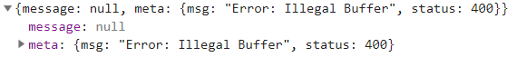
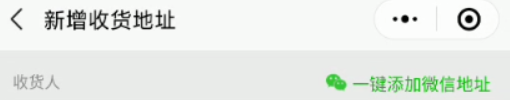
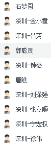

# 微信小程序学习第13天

## 每日反馈


## 回顾

1. 购物车

   1. 加入购物车

      1. 判断是否是第一次添加
         1. 如果是第一次，构造一个新的对象，插入cart的头部
         2. 如果不是第一次，更新这个对象的num和checked

   2. 请求接口和渲染数据

      1. 取storage购物车里面id以,连结到一起
      2. 由于最终接口返回的数据并不能保证顺序，页面由两个数组去渲染
      3. 数据融合：以cart为主，goodsList
         1. 遍历cart，拿出里面的每一项item，去goodsList找和item.goodsId相等那一项targetGoods，然后把targetGoods和item合成一个新的对象

   3. 全选，总价，总数量的计算

      1. 全选，计算属性的get和set

         1. get所有的商品选中，全选才选中 every
            1. every 所有的元素都满足条件，返回true
            2. some 只要有一个元素满足条件就返回true
         2. set当isAll有变化时，把状态设置给所有的商品

      2. 总数量：所有勾选的商品的数量之和

         ```js
         arr.reduce((sum,item)=>{
         	return sum+item.num
         },0)
         ```

         

## 作业检查

1. https://gitee.com/lszyzs1234/yougou/tree/Fea_joven_20200322/
   1. 有尝试storage里面的购物车数据结构用{}
   2. 全选get用every
   3. 购物车界面的改动更新到storage，有借鉴意义
   
2. https://gitee.com/z1_j2_w3/my-yougou/tree/Fea-molly/
   
   1. some?
   
3. https://gitee.com/doukou0303/yougoumarket
   1. 如果为空，给默认值  `someVar||默认值`
   
   2. 如果用户在购物车去勾选商品，然后去到商品详情，再加入购物车，是勾选的
   
   3. 独特风格
   
      1. find就是找对象，不要改对象逻辑放在里面
   
   4. some应该是对的
   
   5. set里面用map?不应该
   
      ```js
      if(isExsit === undefined){   => if(!isExsit){
          
      this.cartList = uni.getStorageSync('cart')?uni.getStorageSync('cart'):[]
          =>this.cartList=uni.getStorageSync('cart')||[]
         
      ```
   
      
   
4. https://gitee.com/nwy666/yougou/blob/yougoudev1/pages/cart/main.vue
   1. totalNum的意思理解错了？
   2. 删除功能？
   
5. https://gitee.com/szj111/uni-yougou/tree/szj-20200402/
   
   1. ok
   
6. https://gitee.com/huaixiyu/UooGou/tree/Fea_joven_20200402/
   
   1. OK
   
7. https://gitee.com/gddx778/shopping_mall/tree/master/
   
   1. OK
   
8. https://gitee.com/huang_tao971481145/uni_yougou_ht/tree/HT_yougou_one/
   
   1. 没push?	
   
9. https://gitee.com/xiaomumu1002/yougou-mall/tree/mumu_20200322

   1. 购物车界面的改动更新到storage，有借鉴意义


## 购物车-剩余功能

1. 购物车数据更改更新到storage
   1. 小程序重启后，购物车页面的改动应该保存。所以这个改动，应该同步给storage cart
   2. 方案
      1. 第一种方案：商品勾选，全选，+,-时，更新storage cart
      2. 第二种方案：**深度监听goodsList**，更新storage
         1. 商品勾选，全选，+,-的改动，就是改动goodsList
         2. goodsList已经有更新storage cart所有的数据
            1. 不用取storage cart, 直接构造cart, 覆盖存储
2. 跳转商品详情
   1. 点击每个商品时@click:toItem, 传参goodsId
   2. 跳转uni.navigateTo
   3. 处理事件冒泡 .stop
3. 优化
   1. 获取storage cart要给默认值
   2. 获取storage cart, 作为全局变量，没必要声明在data里面。


## 优购案例-登录


#### 01.页面分析

1. 点击登录，或者需要登录态时就会跳转登录页;
2. 购物车结算跳转支付页
   1. 用户有选择商品，而且有登录态，再跳转支付页
      1. 如果没有选择商品就提示
      2. 如果没有登录态，我们就跳转登录页
3. 页面是没有设计，就一个button。登录的逻辑：微信授权登录

#### 02.基本逻辑

 	1. 购物车结算跳转支付页
      	1. 如果没有选择商品就提示
     	2. 如果没有登录态，我们就跳转登录页
     	3. 以上两个条件都满足，就跳转支付页

#### 03.微信授权登录

1. 先授权获取用户信息

   ```js
   <button open-type="getUserInfo" @getuserinfo=""/>
   ```

2. uni.login获取微信账号的唯一标识

   1. uni.login

3. 调接口

   1. 确认request有传method

4. 登录成功，存token，提示成功登录，并返回

   1. uni.setStorageSync(‘token')
   2. toast提示
   3. navigateBack返回上一页


# 微信授权登录需要配置！！！

背景：

1. 因为我们没有营业执照，也就没有企业appid，支付需要微信小程序关联一个商品号，没有商户号
2. www.uinav.com这个接口登录逻辑，必须是appid的开发者
3. 我的微信账号是uinav.com服务器对应的appid开发者
4. 自己部署也不行，涉及到支付

#### 配置

1. appid需要配置成 `wx38d8faffac4d34d2`
2. baseURL换成https://www.uinav.com
3. 微信开发者工具需要我扫码
   1. 同一时间只能由一个人来登录

#### 步骤（登录前一定要做的）：

1. request.js修改baseURL  https://www.uinav.com
2. 微信开发者工具，菜单 微信开发者工具->切换账号，注意不是点退出
3. hbuilder里面，manifest.json, 微信小程序配置，修改appid为`wx38d8faffac4d34d2`
4. hbuilder重启运行微信小程序，让我扫码，微信开发者工具，确认修改appid
   1. 同一时间只能由一个人来登录
   2. 而且需要我在电脑面前才行
   3. **这里是需要排队的，所以找我扫码前，先确认好: 发请求的url，方法，传参是对的**


#### 注意点

1. 登录过程中，登录接口不是特别稳定，一般需要点击两次才可以, 第一次点击可能会报以下错误，忽略

   

2. 那普通开发者怎么做支付功能呀
   1. 淘宝买营业执照，才能完成申请企业微信小程序开发者账号，和申请商户号
3. 工作中，一般由公司来申请微信小程序开发者账号，和申请商户号
   1. 程序员作为开发者
   2. 如果微信小程序是给客户的，那么客户来申请


## 小程序授权拒绝处理

[授权](https://developers.weixin.qq.com/miniprogram/dev/framework/open-ability/authorize.html)

授权：微信小程序是运行在微信里面，微信有一些信息可以给到小程序，给到需要小程序申请，这个动作叫做授权。比如说：用户地址，用户信息，微信运动步数

**基本授权的使用:**

1. wx.authirze弹出授权请求弹窗  `scope.werun`
2. 调用对应的接口 wx.getWeRunData

**授权行为**

	1. 如果是第一次发起授权，会有授权弹窗; 调对应的接口来获取数据
 	2. 如果授权已经允许了，不会有授权弹窗的，调对应的接口获取数据
 	3. 如果授权被拒绝了，没有反应; 再点击也没用

**如果小程序授权被拒绝了，如何处理？**

1. 用户第一次拒绝，或者拒绝后再点击都会进入fail
2. 方案
   1. **在发起授权fail回调函数，提示用户，打开设置允许**
      1. wx.showModal
   2. 打开设置
      1. wx.openSetting会打设置
         1. 这个设置可以看到各个授权权限的状态

#### 提示：

1. 授权scope.address获取到的通讯地址，在微信 ->我的 ->头像->我的地址


## 小程序微信支付（了解）

[传送门](https://pay.weixin.qq.com/static/product/product_intro.shtml?name=miniapp)

用户在微信小程序内唤起微信支付，完成支付返回微信小程序

使用示例


#### 申请流程

1. 申请小程序开发者账号，而且必须是小程序企业开发者工具
2. 微信认证

   1.  个人号无法认证
3. 小程序开通微信支付
4. 点击开通按钮后，选择新申请微信支付商户号或绑定一个已有的微信支付商户号，
5. 申请微信支付商户号

   1. [传送门](https://pay.weixin.qq.com/index.php/apply/applyment_home/guide_normal)
   2. 需要营业执照和银行卡号
6. 业务流程

   1. 
7. 前端只调接口，拿到支付参数，然后调用wx.requestPayment，唤起微信支付
8. 后端调用`wxsdk.reqWXUnifiedorder`,传入appid，商户号，open_id等生成前端微信支付的参数。


## 优购案例-支付


#### 01.页面分析

	1. 入口：购物车，点击结算，跳转支付; 商品详情页立即购买也会跳转支付页
 	2. 这个页面没有对应的设计稿，包括收货地址，商品列表，底部微信支付
 	3. 收货地址
      	1. 一般来说app，h5以及小程序收货地址都有自己的后端接口，新增，删除，修改
      	2. 很多的小程序的收货地址不仅有自己的接口，而且有同步微信通讯地址的功能
           	1. 
     	3. 优购支付页面收货地址，没有收货地址，只能同步微信的通讯址址
	4. 商品列表是购物车中已经勾选的商品。无法勾选/去勾选商品，而且也不能调整数量
	5. 微信支付这里展示商品的总价
	6. 微信支付，可以支付，也可以不支付
    	1. 点击微信支付调接口会生成订单，然后再拿订单生成支付单
    	2. 不支付时，订单也生成
    	3. 无论是否支付，**只要生成订单，购物车对应的商品就会去掉**
	7. 收货地址也需要storage存储


#### 02.静态页面

1. **支付页面没有对应的设计稿**
2. 新建支付页面pay
3. 收货地址和选择收货地址
4. 收货地址边框
5. 商品列表copy，修改部分
6. 微信支付按
7. 钮，及订单信息

#### 03.同步微信通讯地址

 	1. 点击请选择地址，发起授权，调接口获取微信的通讯地址，拿到地址数据，展示
      	1. 点击@click:getAddr
      	2. 发起授权 uni.authirze
           	1. success是成功
           	2. fail提示打开设置允许
      	3. 调接口，拿到数据，设置为data属性address
      	4. 拿data.address渲染收货地址
           	1. 收货地址的显示和请选择地址是互斥，用v-if=“address.userName”
      	5. 用户获取微信通讯地址后需要存储，页面初始时获取存储的收货地址同步到address
      	6. 如果已经显示收货地址，用户想更新？
           	1. 获取微信通讯地址事件应该注册在父dom


#### 04.请求数据&渲染数

1. 商品列表展示购物车**已选中**商品列表
   1. 逻辑大致和购物车类似，copy购物车请求商品列表的逻辑
      1. 什么时候发请求，onLoad
   2. 渲染列表
   3. 过滤掉没有勾选的商品
      1. 先过滤掉this.cart未勾选的商品
         1. 因为下边数据融合，也需要this.cart是过滤的
      2.  再返回goodsId的数组
2. 总价格的显示
   1. copy
3. 点击微信支付，创建订单
   1. 点击@click:pay
   2. 如果未选择收货地址，提示
   3. 如果未登录，跳转登录
   4. 接口
      1. url /api/public/v1/my/orders/create
      2. method:post
      3. header Authorization
      4. data
4. 获取支付参数，调用wx.requestPayment唤起微信支付
   1. 获取支付参数
      1. 接口
         1. url /api/public/v1/my/orders/req_unifiedorder
         2. method:post
         3. header Authorization
         4. data:{order_number} order_number就是刚刚创建的
      2. 调用uni.requestPayment唤起支付


#### 注意点

1. 创建订单请求，data的参数，需要处理，我们用的方法返回，而不是用计算属性
   1. 计算属性需要在结构中使用时，才用
   2. 计算属性在它依赖有变化时会重新执行
2. 创建订单请求，需要确认request.js有传header参数
3. **微信开发者工具，微信支付是弹二维码;** 微信里面运行小程序时，是会唤起微信支付，不是二维码
4. 扫码支付只能由当前微信的用户支付，大家完成页面时，弹出这个支付二维码，就可以。


## 总结


#### 作业

1. 购物车剩余功能
2. 登录页
3. 完成支付页面



庄光城