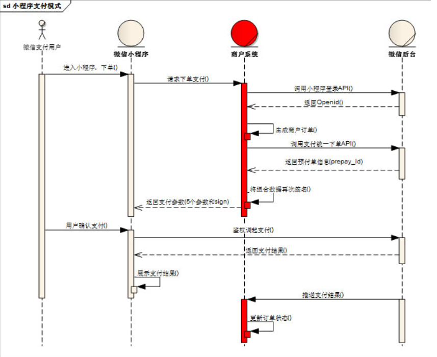
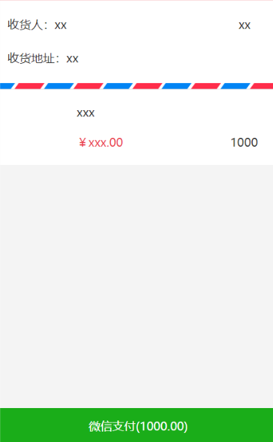

# 微信小程序学习第13天

## 每日反馈


## 回顾

1. 购物车

   1. 加入购物车

      1. 判断是否是第一次添加
         1. 如果是第一次，构造一个新的对象，插入cart的头部
         2. 如果不是第一次，更新这个对象的num和checked

   2. 请求接口和渲染数据

      1. 取storage购物车里面id以,连结到一起
      2. 由于最终接口返回的数据并不能保证顺序，页面由两个数组去渲染
      3. 数据融合：以cart为主，goodsList
         1. 遍历cart，拿出里面的每一项item，去goodsList找和item.goodsId相等那一项targetGoods，然后把targetGoods和item合成一个新的对象

   3. 全选，总价，总数量的计算

      1. 全选，计算属性的get和set

         1. get所有的商品选中，全选才选中 every
            1. every 所有的元素都满足条件，返回true
            2. some 只要有一个元素满足条件就返回true
         2. set当isAll有变化时，把状态设置给所有的商品

      2. 总数量：所有勾选的商品的数量之和

         ```js
         arr.reduce((sum,item)=>{
         	return sum+item.num
         },0)
         ```

         

## 作业检查

1. https://gitee.com/lszyzs1234/yougou/tree/Fea_joven_20200322/
   1. 有尝试storage里面的购物车数据结构用{}
   2. 全选get用every
   3. 购物车界面的改动更新到storage，有借鉴意义
   
2. https://gitee.com/z1_j2_w3/my-yougou/tree/Fea-molly/
   
   1. some?
   
3. https://gitee.com/doukou0303/yougoumarket
   1. 如果为空，给默认值  `someVar||默认值`
   
   2. 如果用户在购物车去勾选商品，然后去到商品详情，再加入购物车，是勾选的
   
   3. 独特风格
   
      1. find就是找对象，不要改对象逻辑放在里面
   
   4. some应该是对的
   
   5. set里面用map?不应该
   
      ```js
      if(isExsit === undefined){   => if(!isExsit){
          
      this.cartList = uni.getStorageSync('cart')?uni.getStorageSync('cart'):[]
          =>this.cartList=uni.getStorageSync('cart')||[]
         
      ```
   
      
   
4. https://gitee.com/nwy666/yougou/blob/yougoudev1/pages/cart/main.vue
   1. totalNum的意思理解错了？
   2. 删除功能？
   
5. https://gitee.com/szj111/uni-yougou/tree/szj-20200402/
   
   1. ok
   
6. https://gitee.com/huaixiyu/UooGou/tree/Fea_joven_20200402/
   
   1. OK
   
7. https://gitee.com/gddx778/shopping_mall/tree/master/
   
   1. OK
   
8. https://gitee.com/huang_tao971481145/uni_yougou_ht/tree/HT_yougou_one/
   
   1. 没push?	
   
9. https://gitee.com/xiaomumu1002/yougou-mall/tree/mumu_20200322

   1. 购物车界面的改动更新到storage，有借鉴意义


## 购物车-剩余功能

1. 购物车数据更改更新到storage
   1. 小程序重启后，购物车页面的改动应该保存。所以这个改动，应该同步给storage cart
   2. 方案
      1. 第一种方案：商品勾选，全选，+,-时，更新storage cart
      2. 第二种方案：深度监听goodsList，更新storage
         1. 商品勾选，全选，+,-的改动，就是改动goodsList
         2. goodsList已经有更新storage cart所有的数据
            1. 不用取storage cart, 直接构造cart, 存
2. 跳转商品详情
   1. 点击每个商品时@click:toItem, 传参goodsId
   2. 跳转uni.navigateTo
   3. 处理事件冒泡 .stop
3. 优化
   1. 获取storage cart要给默认值
   2. 获取storage cart, 作为全局变量，没必要声明在data里面。


## 优购案例-登录


## 小程序授权拒绝处理

[授权](https://developers.weixin.qq.com/miniprogram/dev/framework/open-ability/authorize.html)


## 小程序微信支付（了解）

[传送门](https://pay.weixin.qq.com/static/product/product_intro.shtml?name=miniapp)

用户在微信小程序内唤起微信支付，完成支付返回微信小程序

使用示例


#### 申请流程

1. 申请小程序开发者账号

2. 微信认证

   1.  个人号无法认证

3. 小程序开通微信支付

4. 点击开通按钮后，选择新申请微信支付商户号或绑定一个已有的微信支付商户号，

5. 申请微信支付商户号

   1. [传送门](https://pay.weixin.qq.com/index.php/apply/applyment_home/guide_normal)
   2. 需要营业执照和银行卡号

6. 业务流程

   1. 

7. 后端调用`wxsdk.reqWXUnifiedorder`,传入appid，商户号，open_id等生成前端微信支付的参数。

8. 小程序调用wx.requestPayment，唤起微信支付


## 优购案例-支付



#### 01.页面分析

#### 02.静态页面

1. **支付页面没有对应的设计稿**
2. 新建支付页面pay
3. 收货地址和选择收货地址
4. 收货地址边框
5. 商品列表copy，修改部分
6. 微信支付按钮，及订单信息

#### 03.基本逻辑


#### 04.请求数据&渲染数


## 优购案例-优化

#### 01.商品详情-立即购买跳转支付页面

1. 传递goodsId
2. 展示立即购买的那个商品，数量为1
3. 无需存储到购物车storage

#### 02.设置购物车的商品个数

1. 购物车的onShow方法里面设置(无论商品是否选中，都算)
2. wx.setTabBarBadge
   1. index
   2. 显示文本，字符串类型
      1. 数量**商品类型个数**

## 03.request中设置token

1. isAuth为true是添加token

#### 练习注意点


## 优购案例-订单结果页(了解)

#### 01.页面分析

1. 支付页面，支付取消或者支付成功，都会进入订单结果页

2. 订单结果页支付成功，展示成功状态和首页按钮，点首页按钮去到首页
3. 订单结果页支付失败，展示失败状态和首页按钮与订单详情按钮，点首页按钮去到首页，点订单详情去到订单详情

#### 02.静态页面

1. 文案及两个按钮

#### 03.基本逻辑

1. 支付页面上，支付成功和失败跳转订单结果页
   1. 失败时候传递orderNumber
2. 支付成功显示`首页`,并设置标题
3. 支付失败显示`首页`和`查询订单详情`，也设置标题


## 优购案例-订单详情(了解)

#### 01.页面分析

1. 订单结果点订单详情去到订单详情
2. 订单详情展示订单基本信息

#### 02.静态页面

1. 展示订单基本信息

#### 03.请求&渲染数据

1. 未登录跳转登录

2. 查询订单状态

   1. 接口 /api/public/v1/my/orders/chkOrder

      1. 请求方式POST

      2. 请求头:

         "Authorization" : token // 需要设置token带给后台

      3. 请求体:
         order_number : 订单号


## 优购案例-我的(了解)

#### 01.页面分析

1. 入口是tabBar
2. 展示登录状态收藏店铺、订单及其他信息
3. 已经登录展示用户头像和昵称，未登陆就显示登录，点登录跳转登录
4. 点订单跳转订单列表
5. 拨打电话的功能

#### 02.静态页面

#### 03.基本逻辑

1. 已经登录展示用户头像和昵称，未登陆就显示登录，点登录跳转登录
   1. login页userInfo添加到storage
   2. onShow里面获取到用户信息
   3. 点登录跳转登录
2. 拨打电话
   1. wx.makePhoneCall


## 优购案例-订单列表(了解)


#### 01.页面分析

1. 分别展示全部，待付款，已付款，退款/退货的订单列表
2. 在我的页面，点击订单去到订单列表

#### 02.静态页面

1. 顶部tab栏
2. 订单列表展示

#### 03.基本逻辑

1. 我的页面点击不同菜单去到订单列表，选中对应的tab
   1. 两边菜单并不是一一对应的，设置数组序列标志
2. 点击tab展示对应的列表

#### 04.请求&渲染数据

2. 渲染订单列表

   1. 接口`/api/public/v1/my/orders/all?type=1`

      1. 请求方式GET

      2. 请求头:

         "Authorization" : token //需要设置token带给后台

2. 切换Tab发送请求


## 总结


#### 作业

1. 完成支付页面

