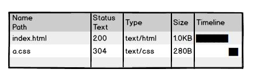
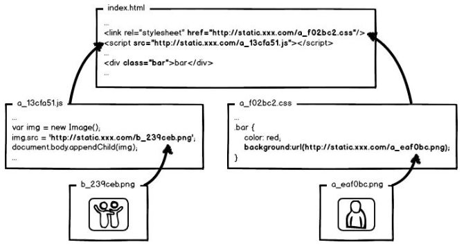
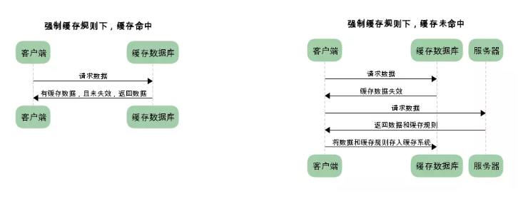
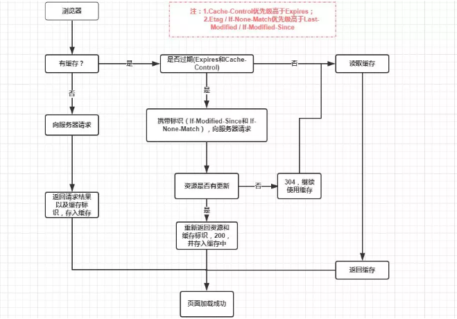
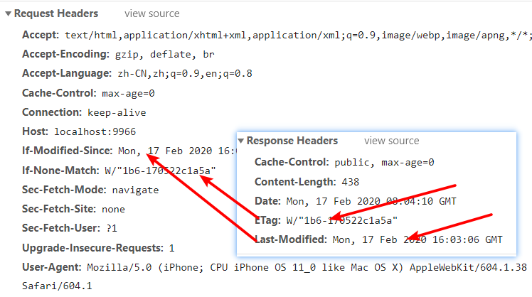
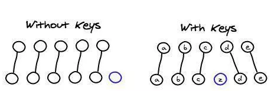

# 微信小程序学习第13天

### 面试问到怎么兼容安卓和ios，老师可以说下大概怎么处理？

1. 自适应，flexible.js+rem适应了iphone6，其他非平板设备都自适应了

   1. 小程序用rpx
   2. 最好font-size也随设备自适应

2. 在webpack的工程里，css属性的前缀默认添加

   1. transform
   2. -webkit-transform

3. 在webpack工程里，添加babel-ployfill。比如一些低端手机不支持promise，写promise语法也会转成es5

4. 如果想使用一些新的CSS属性或者js-api的话，先去caniuse上查一下兼容性。比如flexbox在手机端兼容性不错，但是grid就比较差了。

   1. display:flexbox配合自适应布局非常好

5. 日期格式的解析'2019-12-16', 这种日期格式在安卓上能Data.parse，但是iOS不行。需要统一转成'2019/12/16'

6. api使用遵从规范，有一些不符合规范的api使用了，可能部分手机上可以，其他设备就不一定了。

   1. 比如小程序里面没有span标签，强行使用的话，可能不同设备解析不一样。
   2. 请求后端数据返回列表，如果是对象，是无序的。即使有些设备上有序，其他设备也无序。应该返回**数组**
   3. uniapp <view> ul>li

7. 测试一些基本设备

   1. 安卓普通的，全面屏

   2. iOS，iphone4s,iphoneX

   3. iOS系统版本，10.2，12.。。

   4. 如果需要兼容h5，那么微信浏览器

      

## uni-app和mpvue对比

[组件](https://uniapp.dcloud.io/component/README)

语法和mpvue非常类似

1. 组件和标签的变化
   1. div改成view
   2. span改成text
   3. a改成navigator
   4. img改成image
   5. select改成picker
   6. ul和li用view替代
   7. input,button能用
   8. 其他组件基本和小程序的一致
2. 正宗的Vue语法
3. wx对象换成uni对象，但是wx依然能用
4. css的变化
   1. 使用rpx和px单位
   2. flex布局
5. 生命周期钩子函数一样
   1. [传送门](https://uniapp.dcloud.io/frame?id=%e7%94%9f%e5%91%bd%e5%91%a8%e6%9c%9f)

#### 注意点：

1. uni-app可以使用自己的组件（组件和小程序组件很像），uni对象，可以用vue自身的语法
2. 如果按规范来写的话，兼容是最好的


练习：

1. 试一下swiper
2. 有一个div块，背景是红色的，点击显示/不显示红色。


## mpvue-yougou迁移到uni-app

[mpvue迁移uniapp](https://ask.dcloud.net.cn/article/34945)

#### 01.初步工作

1.  HBuilderX里新建**默认模板的uni-app**项目 `uni-yougou`
2.  src目录下的文件全部copy覆盖uni-yougou根目录
3.  在pages.json里面设置home页面的路径
    1. 工具-插件 安装less支持
4.  在pages.json里面设置home的标题，清除home路径下的main.json和main.js
5.  pages.json设置全局样式
6.  一些文件引入路径需要调整


注意点：

1. 建议用微信开发者工具调试

   1. 设置-安全设置-开启

2. 外部浏览器打开的url是本地server，跨域

3. 真机报错信息不充分

   

#### 02.显示四个tab页面

1. copy覆盖static目录到uni-yougou的根目录下

2. 在pages.json里面设置tabBar
3. 修改pages里面的页面路径，删除无用main.json和main.js

> '/'表示当前项目的根目录
>
> @也表示当项目的根目录
>
> H5有兼容性问题

 

#### 03.剩余工作

1. 建议pages/**/文件名，改成main.vue，否则js里面跳转路径得改。
   1. 为了只改配置不改代码里面具体路径
2. pages.json里面配置页面路径，修改对应页面index.vue为main.vue，删除main.json和main.js

注意：

1. 搜索列表页面配置上拉加载和下拉刷新


#### 04.bug修复

1. @click="不能在行内写逻辑"
   1. 分类，搜索列表，购物车+-和checkbox
4. ul和li转view

> 微信开发者工具appid换掉：wx38d8faffac4d34d2


#### 05.发布

1. 真机运行，并打包apk，安装
   1. img换成image
   2. ul和li替换成view
   3. 需要注意一下css
2. 发布微信小程序
   1. 生成文件的路径 unpackage/dist/build/mp-weixin
3. 发行H5，并运行
   1. unpackage/dist/build/h5


## uniapp优购商城仓库

码云地址： https://gitee.com/jovenwang/uni-yougou43

分支：master


## 大公司里怎样开发和部署前端代码？

[传送门]( https://www.zhihu.com/question/20790576/answer/32602154 )

1. 页面index.html包含a.css，无缓存
   1. 每次用户访问页面都要从服务器加载


2. a.css使用缓存器缓存，协商缓存，询问服务器缓存有没有过期

   1. 还是需要请求服务器一次

   

3. 静态资源内容变更都更新hash,从浏览器取缓存;入口文件协商缓存

   

4. 静态资源只要更新就会生成新带hash文件,index.html更新文件路径里面文件名的hash

5. 只要保证index.html是新的就可以了


## HTTP缓存

概念： 浏览器请求某资源（html,js,css,图片等）时，如果浏览器有资源副本，就可以直接从浏览器缓存中获取，不用从服务器获取。
作用：节省流量，提高用户体验, 减少服务器的压力

返回200


#### 强制缓存

即浏览器直接使用缓存



1. 一般设置 cache-control里面的max-age为一个长时间，单位为秒
2. 一般静态资源都用强缓存


#### 协商缓存

浏览器缓存数据和数据的标识，下一次请求发送缓存标识给服务器，确定缓存数据有没有改动。如果没有改动，返回304，取缓存数据; 如果有改动，服务器发送请求的数据和新的标识。

服务器到底有没有更新文件，需要找服务器确认


1. 数据的标识有两种

   1. 修改时间 If-Modified-Since和Last-Modified

   2. Etag 根据文件内容或者摘要生成 If-None-Match和etag

      

#### 总结

1. 入口文件设置协商缓存，每次都去询问一下服务器
2. 静态资源设置强缓存，cache-control里面的max-age设置时间长一些。
3. 一般对HTTP缓存的设置是由运维或者后端来设置的，但是前端需要了解这些边界问题
   1. https
   2. http2
   3. webpack配置
   4. nginx







## Vue v-for为什么要加key?

[传送门](https://cn.vuejs.org/v2/guide/list.html#%E7%BB%B4%E6%8A%A4%E7%8A%B6%E6%80%81)

vfor渲染列表时，默认使用“就地更新”

1. dom不移动，只是更新dom元素的textContent
2. 就地复用的效率在一些情况下是高的。

原因：

1. 数组元素的索引有变化时，如果希望DOM一起移动
2. 数组元素的索引有变化时，变更效率高。
   1. 
3. 列表动画必须加key
4. **为了让我们代码可预测，总是加唯一标识的key最好**


总结：在数组元素的索引有变化时，添加唯一标识的key，能效率更高。如果数组元素的索引无变化，避免eslint检查，添加:key="index"也可。


## 小程序组件基本使用

[传送门](https://developers.weixin.qq.com/miniprogram/dev/framework/custom-component/)

声明组件，基本和页面没啥区别

1. 结构
2. 样式
3. 逻辑
   1. **方法写在methods里面**

使用组件

1. 引入

   1. // 组件名:组件路径

      ```json
      {
        "usingComponents": {
          "counter":"/components/counter"
        }
      }
      ```

2. 使用

   1. 当标签使用即可。

   

## 小程序组件父子组件通信

1. 父传子

   1. 在父组件中的子组件标签添加属性，给子组件传递数据 

      ```
       <submit-bar totalMoney="{{totalMoney}}" ></submit-bar>
      ```

   2. 子组件在js中通过properties接收，可以指定接收数据类型

      ```js
       properties: {
           totalMoney: Number
       }
      ```

2. 子传父

   1. 在父组件的子组件标签自定义事件，传给子组件

      ```html
       <submit-bar  bind:submit="submit" ></submit-bar>
      ```

   2. 子组件用`this.triggerEvent('父组件自定义事件', '要传递的参数')`，触发父组件传过来的自定义事件 

      ```
       this.triggerEvent("submit", 'Hello Grayly')
      ```

   3. 第二步执行后，父组件自定义事件绑定的函数就会执行，同时接受子组件传过来的数据
      （在event.detail中可得到子组件传过来的参数） 

      ```
      submit(event) {
      	console.log(event);
      },
      ```


##  权限管理

1. 用户看不到
   1. 展示允许用户看到的菜单
   2. 页面级别
   3. 页面元素级别的
2. 用户用不到
   1. 后端必须做权限验证
3. 用户是不变的，变的是角色
   1. 角色是多个权限的组合


## Vue-element-admin权限管理解析

[项目官方文档](https://panjiachen.github.io/vue-element-admin-site/zh/)

#### 项目安装

1. 安装python 2.7.x
   1. sass
2. 执行npm rebuild node-sass 重构一下
3. 以管理员身份npm install
4. 注释掉main.js 31、34行
5. 
6. npm run dev

[权限管理详细说明](https://juejin.im/post/591aa14f570c35006961acac) 

1.  创建vue实例的时候将vue-router挂载，但这个时候vue-router挂载一些登录或者不用权限的公用的页面。 
    1. router/index.js中声明了无须权限路由，并初始化了路由
2.  当用户登录后，获取用role，将role和路由表每个页面的需要的权限作比较，生成最终用户可访问的路由表。 
    1. /permission.js
3.  调用router.addRoutes(store.getters.addRouters)添加用户可访问的路由。 
    1. /permission.js
4.  使用vuex管理路由表，根据vuex中可访问的路由渲染侧边栏组件。 
    1. layout/components/Sidebar/index.vue

#### 面试回答：

权限控制的主体思路，前端会有一份路由表，它表示了每一个路由可访问的权限。当用户登录之后，通过 **token** 获取用户的 **role** ，动态根据用户的 **role** 算出其对应有权限的路由，再通过`router.addRoutes`动态挂载路由。但这些控制都只是页面级的，说白了前端再怎么做权限控制都不是绝对安全的，后端的权限验证是逃不掉的。

> 项目npm install node-sass的问题，[参考传送门](https://blog.csdn.net/xdongll/article/details/75040808)

