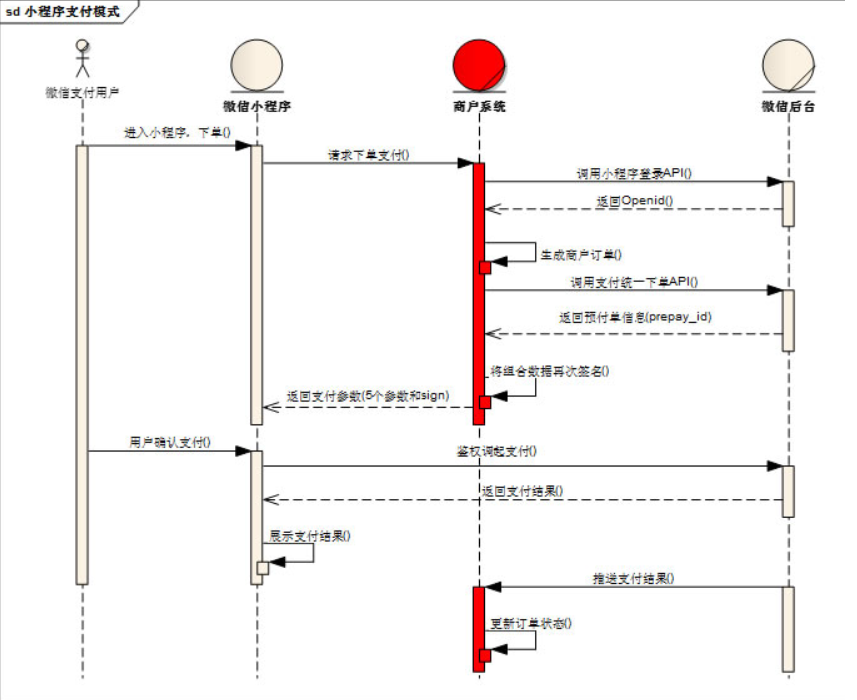
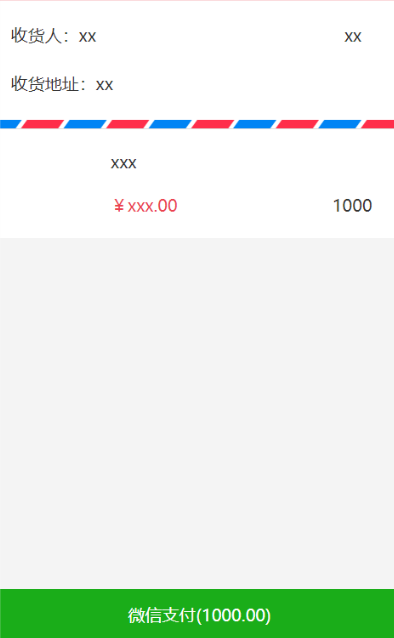
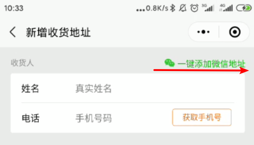

# 微信小程序学习第13天

## 每日反馈

## 回顾

1. 购物车

## 作业检查

1. https://gitee.com/lszyzs1234/yougou/tree/Fea_joven_20200322/
   1. 有尝试storage里面的购物车数据结构用{}
   2. 全选get用every
   3. 购物车界面的改动更新到storage，有借鉴意义
2. https://gitee.com/z1_j2_w3/my-yougou/tree/Fea-molly/
   1. some?
3. https://gitee.com/doukou0303/yougoumarket
   1. 独特风格
   2. some?
   3. set里面用map?
4. https://gitee.com/nwy666/yougou/blob/yougoudev1/pages/cart/main.vue
   1. totalNum的意思理解错了？
   2. 删除功能？
5. https://gitee.com/szj111/uni-yougou/tree/szj-20200402/
   1. ok
6. https://gitee.com/huaixiyu/UooGou/tree/Fea_joven_20200402/
   1. OK
7. https://gitee.com/gddx778/shopping_mall/tree/master/
   1. OK
8. https://gitee.com/huang_tao971481145/uni_yougou_ht/tree/HT_yougou_one/
   1. 没push?

## 购物车

1. 购物车数据更改更新到storage
2. 跳转商品详情

## 优购案例-登录

## 小程序授权拒绝处理

[授权](https://developers.weixin.qq.com/miniprogram/dev/framework/open-ability/authorize.html)

## 小程序微信支付（了解）

[传送门](https://pay.weixin.qq.com/static/product/product_intro.shtml?name=miniapp)

用户在微信小程序内唤起微信支付，完成支付返回微信小程序

使用示例

#### 申请流程

1. 申请小程序开发者账号

2. 微信认证

   1.  个人号无法认证

3. 小程序开通微信支付

4. 点击开通按钮后，选择新申请微信支付商户号或绑定一个已有的微信支付商户号，

5. 申请微信支付商户号

   1. [传送门](https://pay.weixin.qq.com/index.php/apply/applyment_home/guide_normal)
   2. 需要营业执照和银行卡号

6. 业务流程

   1. 

7. 后端调用`wxsdk.reqWXUnifiedorder`,传入appid，商户号，open_id等生成前端微信支付的参数。

8. 小程序调用wx.requestPayment，唤起微信支付

## 优购案例-支付

#### 01.页面分析

1. 购物车点结算，或者商品详情点立即购买去到支付页面
2. 支付页面展示收货地址选择以及需要确定购买的商品列表（**不能去选中及修改数量, 没有勾选**）
   1. 如果在H5页面的话，收货地址的新增，删除，修改都会调接口的
   
   2. 这里收货地址其实是同步微信的收货地址
   
      
3. 点击微信支付，生成订单，再微信支付
4. 支付成功或者失败进入订单结果页

#### 02.静态页面

1. **支付页面没有对应的设计稿**
2. 新建支付页面pay
3. 收货地址和选择收货地址
4. 收货地址边框
5. 商品列表copy，修改部分
6. 微信支付按钮，及订单信息也 

#### 03.基本逻辑

1. 购物车点结算跳转支付页面

   1. 商品数量不能为0
   2. 必须有token
   3. 满足条件才跳转支付页面
2. 点击请选择地址，选择微信地址，选择地址确定，获取地址，显示地址
2. 点击请求选择地址@click="getAddress"
   3. 获取微信收货地址 wx.chooseAddress成功回调里获取
   4. 请选择地址显示为选择后的地址
3. 获取到收货地址后，缓存到本地; 页面初始化时从缓存中读取

> 没有登录的同学，可以直接进入pay页面，完成获取同步收货地址的功能

#### 04.请求数据&渲染数

1. 根据商品ids请求商品详情,**渲染购物车选中的商品**，方法queryGoodsList

   1. 接口 `/api/public/v1/goods/goodslist?goods_ids=${ids}`
      1. 过滤掉未选中的商品
   2. 总价格的显示，计算属性
      1. 不用判断是否选中，都是选中

2. 点击微信支付先生成订单

   1. 判断是否有商品，是否选择了地址

   2. 接口/api/public/v1/my/orders/create

      1. method:POST

      2. 请求头 "Authorization" : token

      3. data:{

         order_price 订单价格

         consignee_addr 订单地址

         goods 商品列表内部存放商品对象（goods_id，goods_number和goods_price）}

      4. --不论支付成功或者失败，都从购物车里面清掉选中的商品

         1. Array filter

3. 生成订单成功后，生成预支付交易单

   1. 接口/api/public/v1/my/orders/req_unifiedorder
      1. method:POST
      2. 请求头 "Authorization" : token
      3. 请求体:
         order_number : 订单号

4. 生成订单后，调用uni.requestPayment

## 优购案例-优化

#### 01.商品详情-立即购买跳转支付页面

1. 传递goodsId
2. 展示立即购买的那个商品，数量为1
3. 无需存储到购物车storage

#### 02.设置购物车的商品个数

1. 购物车的onShow方法里面设置(无论商品是否选中，都算)
2. wx.setTabBarBadge
   1. index
   2. 显示文本，字符串类型
      1. 数量**商品类型个数**

## **03.request中设置token

1. isAuth为true是添加token

#### 04.request错误提示

1. status不为200时，提示错误

2. fail网络超时

#### 练习注意点

1. 优购商城支付必须由登录用户支付

> 在微信开发者工具里面，调试器AppData里面，字符串是绿色的，数字是红色的
>
> navigateTo跳转页面并传参的话，onLoad里面获取的参数是字符串类型的

## 优购案例-订单结果页(了解)

#### 01.页面分析

1. 支付页面，支付取消或者支付成功，都会进入订单结果页

2. 订单结果页支付成功，展示成功状态和首页按钮，点首页按钮去到首页
3. 订单结果页支付失败，展示失败状态和首页按钮与订单详情按钮，点首页按钮去到首页，点订单详情去到订单详情

#### 02.静态页面

1. 文案及两个按钮

#### 03.基本逻辑

1. 支付页面上，支付成功和失败跳转订单结果页
   1. 失败时候传递orderNumber
2. 支付成功显示`首页`,并设置标题
3. 支付失败显示`首页`和`查询订单详情`，也设置标题

## 优购案例-订单详情(了解)

#### 01.页面分析

1. 订单结果点订单详情去到订单详情
2. 订单详情展示订单基本信息

#### 02.静态页面

1. 展示订单基本信息

#### 03.请求&渲染数据

1. 未登录跳转登录

2. 查询订单状态

   1. 接口 /api/public/v1/my/orders/chkOrder

      1. 请求方式POST

      2. 请求头:

         "Authorization" : token // 需要设置token带给后台

      3. 请求体:
         order_number : 订单号

## 优购案例-我的(了解)

#### 01.页面分析

1. 入口是tabBar
2. 展示登录状态收藏店铺、订单及其他信息
3. 已经登录展示用户头像和昵称，未登陆就显示登录，点登录跳转登录
4. 点订单跳转订单列表
5. 拨打电话的功能

#### 02.静态页面

#### 03.基本逻辑

1. 已经登录展示用户头像和昵称，未登陆就显示登录，点登录跳转登录
   1. login页userInfo添加到storage
   2. onShow里面获取到用户信息
   3. 点登录跳转登录
2. 拨打电话
   1. wx.makePhoneCall

## 优购案例-订单列表(了解)

#### 01.页面分析

1. 分别展示全部，待付款，已付款，退款/退货的订单列表
2. 在我的页面，点击订单去到订单列表

#### 02.静态页面

1. 顶部tab栏
2. 订单列表展示

#### 03.基本逻辑

1. 我的页面点击不同菜单去到订单列表，选中对应的tab
   1. 两边菜单并不是一一对应的，设置数组序列标志
2. 点击tab展示对应的列表

#### 04.请求&渲染数据

2. 渲染订单列表

   1. 接口`/api/public/v1/my/orders/all?type=1`

      1. 请求方式GET

      2. 请求头:

         "Authorization" : token //需要设置token带给后台

2. 切换Tab发送请求

## 总结

#### 作业

1. 完成支付页面

