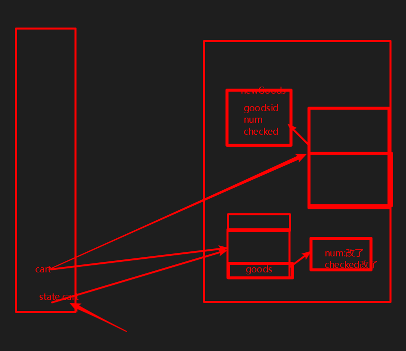
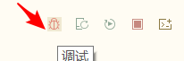
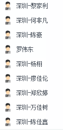

# 微信小程序学习第14天

## 每日反馈

1. https://gitee.com/sunhongligitee/uni-yougou45/tree/sun-20200303
   1. 私有
2. https://gitee.com/mr_pull_wind/uni-app1/tree/cart/
   1. 跳转登录时，loading还在？
3. https://gitee.com/cisiter/uni-yougou-45/blob/exploit/src/pages/item/item.vue
   1. 购物车cart用[]
4. https://gitee.com/white_luo/yougou/blob/study/src/pages/cart/cart.vue
   1. 购物车+-,勾选都有更新到storage里面
5. https://github.com/mygoes/yougoushangcheng/blob/master/pages/pay/pay.vue


## 回顾

1. 授权
   1. 发起授权，wx.authorize()
      1. 如果成功就调接口,success
      2. 如果失败就弹窗提示，然后打开设置fail( wx.openSetting)
   2. 对于用户信息获取 <button open-type="getUserInfo">
2. 支付页面
   1. 获取收货地址
   2. 创建订单 orderNumber
   3. 创建预支付单，拿到支付相关的5个参数，然后调用wx.requestPayment()


## uniapp与Vuex的结合

vuex就是一个**全局变量**，存储整个所有组件的共享状态。

> 由于全局变量太灵活，vuex定义了一个操作全局变量的规范


核心概念：

1. state 状态
2. Getter是state的计算属性
3. Mutation改变state的方法
   1. 这里就操作全局变量的规范


## uniapp中使用Vuex

1. Hbuilder新建uniapp
   1. 新建store
   2. 在main.js中引入，store注册到new Vue中

2. 如果是用命令行创建uniapp
   1. 安装vuex
   2. 其他步骤同上


## 优购商城整合Vuex

主要思路：

小程序启动时，Vuex中购物车数据从storage里面读取，小程序关闭时把购物车数据存到storage里面，在这之间购物车的一系列操作，只更改Vuex中购物车数据

1. 在手机上退出小程序会触发onHide钩子函数

#### 准备工作

1. 安装vuex

   ```
   npm install vuex
   ```

2. 新建文件`src/store/index.js`,并创建一个store

3. 在main.js中引入，store注册到new Vue中

4. 添加Vuex logger插件，方便打印日志

> 如果需要装less的话， npm install --save-dev less less-loader

#### 页面逻辑重构

1. store里面购物车初始化
   1. store里面声明cart，并初始化从storage里面读取
2. App切后台，购物车数据存储到storage
   1. App.vue onHide方法触发
   2. store中添加getters.getCart方法
   3. 存储到storage
3. 购物车页面
   1. 添加购物车
      1. 在mutations中添加一个add2Cart
      2. item页面commit
   2. 购物车商品列表展示
      1. store getters获取cart数据

4. 购物车页面
   1. 购物车商品数量及选中状态直接更新state.cart
      1. 深度监听goodsList的变化，更新到state.cart
   2. 设置tab栏的徽标
      1. getters.cartCount

5. 支付页面
   1. 展示商品列表
      1. getters.getCart
   2. 生成订单单后，删除购物车中勾选状态的商品
      1. mutations.arrangeCart



#### 注意点

1. main.js无须把stor注入到Vue原型
2. 工作中如果是pc端，很大可能会用vuex。简单来说，如果项目只涉及到父子传参的话，可以不需要vuex。否则都会用


## 优购商城整合vuex

1. 为什么适合用vuex
   1. 目前购物车数据是放在数据缓存里面，页面对数据缓存的增删改查，都是对文件系统的操作，所以比vuex慢
   2. 购物车数据是多个页面共享的。
2. 思路：
   1. 如果把购物车数据放在vuex里面，那么下一次打开小程序还是希望数据还存在。
   2. 小程序启动时，把数据缓存-->vuex; 小程序关闭时，把vuex-->数据缓存
      1. 小程序关闭会触发onHide钩子函数
   3. **那么小程序运行中，我们可以直接和vuex的购物车数据进行通信，对购物车数据的增删改查不能再操作数据缓存的购物车了**
      1. 只关心state.cart
3. vuex，其实就是一个“全局变量“
4. 使用
   1. vuex的安装 `npm install vuex`
   2. 创建一个store/index.js 初始化store,初始化state.cart,同步数据缓存的cart
   3. main.js里面，new Vue注册store
   4. 在app隐藏时，把vuex数据->数据缓存里面
   5. **页面就可以直接使用this.$store.state.cart, 来代替数据缓存里面的cart**
      1. 用this.$store.state.cart代替所有的uni.getStorageSync(cart),setstorageSync
5. 改变state时，规范是上提交事件
   1. 在store/index.js的mutations:{事件名（state，形参）}
   2. 页面里面 this.$store.commit('事件名'，实参)
6. 购物车页面
   1. 添加购物车的逻辑需要集中到store/index.js
      1. add2Cart
   2. 购物车页面+-勾选逻辑都会改变state.cart
      1. 我们在购物车页面上所有操作，其实goodsList都会体现，为了避免我们在每一个事件里面都单独改变state.cart, 可以深度监听goodsLsit的改变
      2. 在handler里面提交updateCart事件,传参goodsList
      3. 在store/index.js的updateCart方法里面，把goodsList同步到state.cart
   3. 显示tab栏badge数字
      1. 需要state.cart的长度，我们可以使用vuex getters
         1. getters是state的计算属性
      2. 计算state.cart的长度逻辑放在vuex getters里面 getCartLen
7. 支付页面
   1. 查询商品列表，读取storage cart
      1. 换成this.$store.state.cart
   2. 订单生成成功后，去掉勾选的商品
      1. 应该把逻辑放到store/index 方法名arrangeCart
         1. filter,把已经勾选的商品过滤掉1
      2. 支付页面上 this.$store.commit(arrangeCart)


#### 注意点：

1. tab的切换会触发页面的onHide，小程序切后台的时候，会触发App.vue里面的onHide
2. vuex与storage区别是什么?如何选择使用呢?
   1. vuex关闭小程序就没有了
   2. storage关闭小程序还有，和localStorage相似
   3. 选择：
      1. 如何需要本地存储，必须需要storage
      2. 在我们的场景里面，小程序启和关闭有钩子，就可以做到小程序运行中，使用vuex
3. watch有两个属性
   1. handler，有变化在handler里面感知
   2. deep:true 尝试监听


## H5和App兼容性问题解决

uniapp如果想让同一份代码在兼容多端的话，一定要遵从uniapp的规范

1. img换成image
2. ul,li要换成view
3. @click="不要在行内写逻辑"
4. `wx.`尽量换成`uni.`
5. 在搜索列表页面，请求结束后,主动下拉动画 `uni.stopPullDownRefresh`
6. 搜索列表页面，头部需要提高z-index级别

#### 注意点

1. 登录以后的功能，只有能微信小程序有

2. 实际开发应该多找一些设备来测试

   1. iphonex，iphone5, ios10.2, ios13
   2. 安卓mix 2S,华为手机

3. 这个小虫子是方便nvue调试，可以理解成weex

   

4. App调试，需要打开`打开webview调试`

   1. [传送门](https://ask.dcloud.net.cn/article/69)


## 发布

1. 更新应用名称和图标，打包apk，安装
2. 发布微信小程序
   1. 生成文件的路径 dist/build/mp-weixin
3. 发行H5，并运行
   1. hbuilder创建的 ： unpackage/dist/build/h5
   2. 如果命令行创建的：dist/build/h5

#### 提示：

1. 可以用fiddler这种工具抓包看看app的看请求


## mpvue介绍

[传送门](http://mpvue.com/)

**用Vue的方式来写小程序，支持发布多个平台的小程序, 不支持H5**

mpvue美团公司的。

mp:mini program


#### 学习的目的：

1. 多掌握一个微信小程序框架
2. mpvue是基于vue-cli2.x的，有利于学习webpack配置
3. mpvue自带eslint配置，方便学习eslint


## mpvue快速上手

[传送门](http://mpvue.com/mpvue/quickstart.html)

#### 01.初始化mpvue项目

1. 设置npm淘宝源

2. **npm config list检查是否设置为淘宝源**

   ```bash
   npm set registry https://registry.npm.taobao.org/
   ```

3. 安装全局安装一个桥接工具(vue-cli@2.x版本)（让vue-cli 2.x和4.x版本同时存在）

   ```bash
   npm install -g @vue/cli-init
   ```

4. 创建项目

   1. 所有选项都yes，vuex选择No

   ```bash
   vue init mpvue/mpvue-quickstart 项目名
   ```

5. 运行项目

   1. 进入项目目录

      ```bash
      cd 项目名
      ```

   2. 安装npm包

      ```bash
      npm install
      ```

   3. 运行项目

      ```bash
      npm run start
      ```

> vue init是vue-cli@2.x的命令，vue create是vue-cli3.x和4.x的命令

#### 02.调试开发 mpvue

1. 微信开发者工具导入项目，导入目录选择`项目名`，而不是`项目名/dist/wx`

2. 建议用vscode来写代码，用微信开发者工具来查看效果。

   > project.config.json里面配置了微信miniprogramRoot是dist/wx


#### 03. npm安装的问题

1. npm set registry https://registry.npm.taobao.org/
2. 以管理员的身份打开cmd,git bash，npm install
   1. Mac里面 **sudo** npm install -g eslint
   2. 'oparation'的提示，基本上都是权限的问题
3. 有`.staging`error的，就运行`npm cache clean --force`
4. 网络的问题
5. 提示Yarn安装cli-init
   1. 不管装的是vue3.x或者vue4.x都需要桥接
6. npm install动不了，直接ctrl+c。删除掉node_module再进行npm install

## 总结


## 作业

1. 优购商城与vuex结合
2. mpvue安装（可选）

