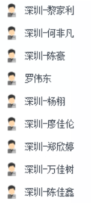
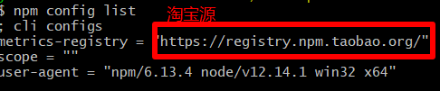
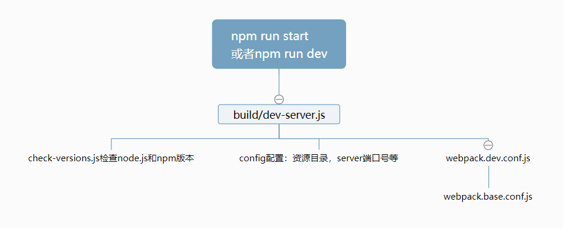
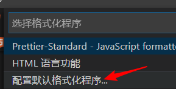

# 微信小程序学习第3天

## 每日反馈


## 回顾




## mpvue快速上手

[传送门](http://mpvue.com/mpvue/quickstart.html)

#### 01.初始化mpvue项目

1. 确认npm设置的是淘宝源

   1. **npm config list检查是否设置为淘宝源**，如果没有执行以下这句

      

   ```bash
   npm set registry https://registry.npm.taobao.org/
   ```

3. 安装全局安装一个桥接工具(vue-cli@2.x版本)（让vue-cli 2.x和4.x版本同时存在）

   ```bash
   npm install -g @vue/cli-init
   ```

4. 创建项目

   1. 所有选项都yes

   ```bash
   vue init mpvue/mpvue-quickstart 项目名
   ```

5. 运行项目（看提示）

   1. 进入项目目录

      ```bash
      cd 项目名
      ```

   2. 安装npm包

      ```bash
      npm install
      ```

   3. 运行项目

      ```bash
      npm run start
      ```

> vue init是vue-cli@2.x的命令，vue create是vue-cli3.x和4.x的命令

#### 02.调试开发 mpvue

1. 微信开发者工具导入项目，导入目录选择`项目名`，而不是`项目名/dist/wx`
2. 建议用vscode来写代码，用微信开发者工具来查看效果。
3. project.config.json里面配置了微信miniprogramRoot是dist/wx


#### 03. npm安装的问题

1. npm set registry https://registry.npm.taobao.org/
2. 以管理员的身份打开cmd,git bash，npm install
   1. Mac里面 **sudo** npm install -g eslint
   2. 'oparation'的提示，基本上都是权限的问题
3. 有`.staging`error的，就运行`npm cache clean --force`
4. 网络的问题
5. 提示Yarn安装cli-init
   1. 不管装的是vue3.x或者vue4.x都需要桥接
6. npm install动不了，直接ctrl+c。删除掉node_module再进行npm install


## mpvue项目结构

**项目结构和uniapp非常相似**

1. build和config目录是webpack打包相关
2. dist是打包后的文件
3. src源码目录
   1. components 组件目录
   2. pages页面，每个小程序页面一个单独目录
      1. **main.js里面初始化了index.vue**
      2. 页面配置文件的文件名必须为**main.json**
   3. utils工具（可选）
   4. main.js 入口文件，
   5. App.vue主组件，被解析成app.js和app.wxss
   6. app.json 小程序配置文件，管理了所有页面路径，跟微信小程序里面一致
4. static目录 静态资源文件
5. project.config.json微信开发者工具的配置文件


## mpvue webpack配置详解

思考一个问题：开发时，能运行`npm run serve`命令吗？为什么？

[Vue CLI 2.x搭建vue,目录最全分析](https://my.oschina.net/wangnian/blog/2050375?nocache=1536818711949)

典型的vue-cli2.x工程, 可以理解webpack就是把src目录编译成dist目录



webpack.base.config.js详解

1. app和页面都有main.js文件作为入口
2. 引入文件，.js,.vue,.json不用加后缀
3. @是src的别名
4. vue是mpvue
5. eslint-loader会对src目录下.vue和.js文件进行格式检查

#### 注意点

1. pages/目录/main.js文件一定要有，一般不需要改，那么直接copy脚手架生成的。
2. 如果想添加配置的话，文件名必须是main.json
3. npm run start清空`dist/wx`  build/dev_server.js
4. 添加新的页面需要重启webpack服务器

```js
var rm = require('rimraf')
var chalk = require('chalk')
rm(path.join(config.build.assetsRoot, '*'), err => {
  if (err) throw err
})
```


## 创建自己的页面

**mpvue使用Vue语法，也可以使用小程序组件和wx对象**

1. app.json

   1. pages中添加路径 pages/demo/main

2. pages目录
   1. 在pages中添加文件夹demo
   2. 在demo中添加文件
      1. main.js
      2. index.vue

3. 中断，再执行npm run start

> 不用小程序的标签属性，wx:if, wx:for, bindtap, 事件处理传参，this.data.attr


## ESLint说明-练习

 [传送门](https://eslint.bootcss.com/)

1. 是什么？ESLint是JavaScript的检查工具
2. 有什么用？ 一般用于代码规范。
3. 为什么要使用代码规范
4. 如何使用？一般和webpack配合，执行npm命令，eslint会读到工程下的` .eslintrc `文件里面的规则
   1. 检查代码，如果不符合规范的话，就报错。

#### mpvue项目里面的eslint

1. build/webpackpack.base.conf.js里面配置了eslint-loader，会检查.js和.vue文件的代码格式
2. `.eslintrc`里面`extends`声明了代码规范，代码规范是规则集合

3. [JavaScript标准代码规范](https://github.com/standard/standard/blob/master/docs/RULES-zhcn.md)

#### 自动格式化代码

1. vscode安装插件`Prettier-Standard - JavaScript formatter`

   1. 插件默认按这个规范进行格式化[prettier-standard](https://github.com/sheerun/prettier-standard)
   2. 可以添加`.prettierrc`, 自定义格式化

2. 在vscode设置里面添加保存文件时自动格式化

   ```
   "editor.formatOnSave":true
   ```

3. js,css,vue,html文件配置prettier为默认格式化程序

   

#### 注意点

1. 自动化格式化工具不一定很完美，建议在理解规则的基础上手动改

2. 如果影响写代码，学习阶段还是可以关掉文件的eslint检查，或者全局去掉eslint-loader

   ```js
   /* eslint-disable */
   ```


## uniapp优购商城迁移到mpvue

#### 01.准备

1. 初始化mpvue-yougou工程
2. 装包及安装less包
3. 运行项目，微信开发者工具导入项目
4. git管理

#### 02.完成首页

1. 复制uniapp项目src目录下的components,css,pages,store,utils,App.vue文件，覆盖mpvue项目的src目录
2. 在home目录下添加main.js文件，并修改home.vue为index.vue
3. 在app.json改动
   1. 下添加home路径，删除其他
   2. 修改窗口样式
   3. 删除tabBar的配置
4. 格式化部分代码以符合eslint规范
5. 修改`uni.`为`wx.`
   1. 统一把src目录下的文件修正
6. main.js文件里面注册$request为Vue的原型属性

#### 03.完成四个tab栏

1. uniapp项目的static替换掉mpvue static目录
2. 另外三个tab页，添加main.js文件，并修改主组件名为index.vue
3. app.json
   1. 添加三个tab页路径
   2. 复制粘贴tabBar的配置
      1. 修改路径
      2. 图片路径统一配置绝对路径
4. 格式化部分代码以符合eslint规范
5. main.js文件里面注册$store为Vue的原型

##### 注意点

1. tabbar图片路径统一配置绝对路径, 相对路径报错
   1. 相对路径需要按照生成文件的相对路径来理解
2. mpvue实例化不接受传入store, 只能注册$store为Vue的原型


#### 04.完成剩余页面

1. 删除多余的页面，组件和utils文件
2. 其他页面添加main.js文件，并修改主组件名为index.vue
3. 在app.json添加页面路径
4. 搜索src文件的navigateTo和switchTab，修改路径
5. 格式化部分代码以符合eslint规范


#### 05.检查

1. project.config.json修改appid `wx38d8faffac4d34d2`

2. 各页面添加main.json，配置标题，以及下拉上拉如果需要

3. login页面，获取用户信息需要

   ```
   userInfoRes.mp.detail
   ```

4. **页面销毁，对应的Vue实例还在，需要手动重置数据**


## 事件循环(Event Loop)

#### 01.Vue异步更新队列

[传送门](https://cn.vuejs.org/v2/guide/reactivity.html#%E5%BC%82%E6%AD%A5%E6%9B%B4%E6%96%B0%E9%98%9F%E5%88%97)

1. vue在更新DOM时是异步的
   1. 批量处理数据的变更到DOM更新
2. 内部实现尝试用`Promise.then`, 如果没有用 `setTimeout(fn,0)`
3. Promise是微任务，setTimeout是宏任务
4. this.$nextTick或者Vue.nextTick, 不要使用updated

#### 02.js的事件循环(Event Loop)


>```
>var b =0;
>var a=11
>var obj = new Object()
>obj.name='joven'
>let c=1
>```
>
>对于复杂类型，栈上面存放引用，object本身是放在堆里面
>
>stack先进后出，大小固定
>
>堆无序的，但是分配大小可以调整，整个堆空间也比较大

1. 所有同步任务都在主线程上执行，形成一个执行栈
2. 主线程之外，还存在一个任务队列。**只要异步操作执行完成**，就到任务队列中排队
3. 一旦执行栈中的所有同步任务执行完毕，系统就会依次读取任务队列的异步任务，**挑选最前面的一个宏任务先执行**，于是被读取的异步任务结束等待状态，进入执行栈，开始执行
4. 主线程不断重复上面的的第三步
5. 宏任务与微任务
   1. 优先执行完所有的微任务
   2. 再执行一条宏任务


## Vue.use的使用

[传送门](https://cn.vuejs.org/v2/api/#Vue-use)

用于写Vue.js的插件

使用方法：Vue.use(对象)

原理：Vue.use会调用对象的install方法

很多UI库会使用这个功能，比如[饿了么UI](https://gitee.com/mirrors/element-ui/blob/master/src/index.js)


## Fiddler使用


1. 基本使用，选择请求，查看请求详细信息（抓包）

2. fiddler配置抓包chrome(包括http和https请求)

   1. 官网下载fiddler

   2. fiddlercertmaker.exe用来生成证书

   3. fiddler https和connections配置

      

      

   4. 导出证书到桌面

   5. chrome导入证书

3. fiddler抓包手机端

   1. 安卓  https://www.jianshu.com/p/724097741bdf 
   2. ios  https://www.jianshu.com/p/724097741bdf 
   3. 大致的步骤
      1. filddler所在的电脑和手机在同一个局域网内
      2. 在手机上访问 `电脑ip:8888`可以下载证书
      3. 手机上安装证书
      4. 手机wifi设置代理为电脑ip：8888

## mpvue坑点

1. 新增页面需要重新npm run start
2. 嵌套v-for索引别名不要相同，双层嵌套v-for需要取不同索引别名
   1. v-for会转成wx:for，后者有默认的索引别名index
3. v-html指令大部分HMTL不能解析，能解析img标签
4. 过滤器无法使用
5. 指令不支持方法，常见的{{}}里面不支持方法
6. 指令里面不支持字符串的模板语法
   1. 但是data里面属性声明是可以用字符串模板语法
7. mpvue tabBar的配置，app.json最好用根路径，以`/`打头。不要用相对路径
8. v-model指令不支持<input type=checkbox/>
9. **页面销毁，对应的Vue实例还在，需要手动重置数据**
10. **父传子，子组件里面可以直接改props，不会报错**
    1. 我们依然需要遵从vue组件单向数据流规则
11. **经常有源码目录和dist目录不同步的问题，需要手动删除wx/dist重启，更好的方式是在dev-server.js里面加上清空dist/wx目录的逻辑**
12. **obj.prop1.prop2改变数据不响应**


## 总结