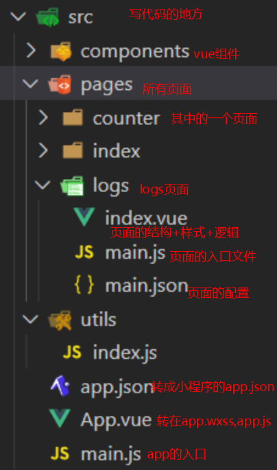

# 微信小程序学习第15天

## 每日反馈

1. 谢谢老师这段时间的教导
   1. 也谢谢大家
2. 最后一次填反馈了，以后还有许多工作问题不知道还可以问谁，怀念有老师可以解答的日子，感谢黑马所有的老师，都很负责，教的很有水平，班主任也很认真。感恩
   1. 先找小黑，也可以问我
   2. 问问题
      1. 以节省别人时间心态
      2. 表达的时候，以邮件话术
   3. 向领导汇报时，模拟场景


## 回顾

1. 优购商城整合vuex
   1. vuex的理解，所有的组件公共状态，改变状态必须用mutations. (全局变量，但是改变变量是规范)
   2. 思路：小程序启动时storage=>vuex, 小程序关闭时vuex=>storage，那么小程序运行中就可以直接用vuex通信
      1. 小程序关闭时一定会执行onHide
   3. 注意点
      1. 改变state时，必须用mutations
         1. 提交方法名
         2. mutations:{方法名}


## H5和App兼容性问题解决

> 我自己的经验,在做一套代码兼容混合模式App和h5，处理兼容性就很花时间

uniapp如果是让一份代码兼容多端，一定要遵从uniapp的规范

1. img换成image
2. ul,li要换view
3. @click="不能在行内写逻辑"
4. `wx.`要换成`uni.`
5. 搜索列表页面，下拉刷新动画不会停止，而且商品列表会覆盖header
   1. 主动停止下拉刷新的动画 uni.stopPullDownRefresh()
   2. 商品列表会比header高, 给header:z-index
6. 可以使用条件编译来解决兼容问题

#### 注意点 

1. 登录以后的功能，只有微信小程序有
2. 实际工作中，需要测试以下几种类型的手机
   1. 安卓:mix2s,vivo
   2. ios: iphonex,iphone4s, ios10.2, ios14


## 发布

1. 微信小程序
   1. 发行-->小程序微信
   2. 导出的路径 unpackage/dist/build/mp-weixin
   3. 会打开微信开发者工具，上传，后面的步骤都是一样的
   4. 发布上线审核一般不会通的，商城类的小程序，微信要求是企业
2. app
   1. 定制app的名字和图标
      1. manifest.json
   2. 发行-原生app云打包
      1. 只能发行apk, 安卓的
3. h5
   1. 发行->网站H5
   2. 导出的路径 uni-yougou46/unpackage/dist/build/h5


## mpvue介绍

[传送门](http://mpvue.com/)

#### 基本介绍

是什么? 使用 [Vue.js](https://vuejs.org/) 开发小程序的前端框架, **不支持h5**

名字解析：mp： mini program vue

> 已经2，3没的维护，但是很可能企业也会


#### 学习的目的：

1. 掌握一个新的小程序的框架
2. 熟悉vue-cli2.x项目结构
3. 熟悉eslint格式


## mpvue快速上手

[传送门](http://mpvue.com/mpvue/quickstart.html)

#### 01.初始化mpvue项目

```bash
# 1.先确认你的npm源为taobao源
npm config list
# 2.如果不是taobao源，需要切换源为taobao源。
npm set registry https://registry.npm.taobao.org/
#3. 需要让vue-cli2.x和3.x及4.x共存
npm install -g @vue/cli-init
#4. 选择一个目录，这个命令会在当前目录下以项目名为文件夹创建一个mpvue模板的项目
vue init mpvue/mpvue-quickstart 项目名
#5.进入项目目录下，装包，运行
cd 项目名
npm install
npm run dev
```

**说明**：

1. 第1步这里，如果有以下显示，就说明是淘宝源

   

2. 第2步，设置taobao源是npm装包终极解决方案，不要使用cnpm

   1. cnpm解压包的方式和npm是冲突，可能导致项目莫名错误

3. 第3步，vue-cli2.x是使用vue init，vue-cli3.x和4.x用的vue create, 如果想共存需要桥接

   1. 一定不要按mpvue文档来，直接安装vue@2.9会覆盖vue-cli3.x或者4.x

4. 第4步, **一路回车**

#### 02.调试开发 mpvue

1. 微信开发者工具导入**项目名**，无须导入`项目名/dist/wx`
   1. 因业project.config.js文件指名了微信小程序目录
2. 用vscode写代码，用微信开发者工具看效果
   1. 微信开发者工具无法打开.vue
   2. vscode写代码更好


## 一次性搞定npm安装的问题！！！

1. 确认设置了淘宝源

2. 错误提示有"permission"的是权限问题

   1. windows以管理员的身份打开命令行，找到指定的位置，再执行命令
   2. Mac 在原命令前加`sudo`再执行
      1. 也有可能是文件夹权限不足，chmod改变文件夹权限

   

3. 项目目录不要带中文

4. 错误提示有'staging error', 就运行 `npm cache clean --force`，清缓存再执行原来的命令就可以

5. 网络问题

6. npm install动不了，直接ctrl+c，删除node_modules, 再npm install

#### 注意点

1. 先执行npm run dev，再导入项目名


## mpvue项目结构

**基本上src目录和uniapp项目结构是一致的**

页面的入口文件main.js，就是初始化页面.vue文件




## vue-cli2.x项目结构

> 很可能企业用到的vue脚手架就是2.x

vue-cli2.x项目结构主要特点是：webpack配置就在项目里面


#### 具体解析：

1. 运行npm run dev/npm run start本质上生成dist/wx目录
2. config里面包括开发和生产环境对应的配置，开发时服务器的端口、上线图片的路径。。。
3. 开发时执行：npm run dev->build/dev-server.js->webpack.dev.conf->webpack.base.conf.js
4. 上线打包： npm run build-> build/build.js->webpack.prod.conf->webpack.base.conf.js
5. webpack.base.conf.js
   1. src/main.js和pages目录下所有的main.js文件都是入口
   2. resolve配置是webpack如何解析包引入
   3. loader就是把某一个类的文件转成js

#### 使用场景：

1. 可以拿vue-cli生成的webpack配置读懂，改改。

#### 注意点

1. 大家下去找博客去研究下vue-cli2.x项目结构分析
   1. [传送门](https://my.oschina.net/wangnian/blog/2050375?nocache=1536818711949)
2. webpack loader和plugin区别
   1. 某一个类的文件转成js
   2. plugin可以在webpack执行不同时机去加载初始化loader


## mpvue创建自己的页面

**mpvue使用Vue语法，也可以使用小程序组件和wx对象，可以使用html标签**

**css可以使用rpx和px**


1. 新建一个页面demo

   1. copy其他页面
   2. 在app.json添加路径

   

#### 注意点

1. 新增页面需要重新执行npm run dev
   1. 之前大家学习的vue-cli生成的项目，是单入口的，SAP项目. src/main.js把所有的文件拎起来，所有新增文件无须重新执行npm run serve
   2. mpvue每个页面都是一个入口，新增页面也就是新增入口
2. 页面的main.js名字不可改，app.json路径main不可改，页面配置必须叫main.json
3. 新增页面时main.js必须要有，所以一般copy别的页面的

#### vscode微信小程序的插件


## ESLint说明-练习

 [传送门](https://eslint.bootcss.com/)

#### eslint介绍

**是什么？js代码检测工具**

**有什么用?**

	1. 让团队的js代码更规范
 	2. 有一些公司会在git commit的前置钩子里面开启eslint检查，如果不通过，无法提交
 	3. 相信大家去公司里面，eslint肯定是开启的。让大家代码风格一致
 	4. eslint可以检查出错误的

**怎么使用呢？**

```bash
#eslint根据当前目前下的.eslintrc的规则去检查yourfile.js的内容
eslint yourfile.js
```

1. 更多时候，eslint是结合webpack来使用

#### mpvue项目里面的eslint

	1. webpack.base.conf.js配置了eslint-loader，会对src目录下所有.js和.vue文件进行检查
 	2. eslint规范在.eslintrc.js
 	3. .eslintrc.js里面extends字段声明规则的集合
 	4. 流行js规范至少有三种
      	1. [standard](https://github.com/standard/standard/blob/master/docs/RULES-zhcn.md)
      	2. google
      	3. 爱彼迎
 	5. 总结在mpvue默认eslint检查的规范就是standard

#### 自动格式化代码

1. 安装vscode插件prettier-standard

   

2. 这个工具就是按照js标准规范来格式化

   1. 如果想定制的话`.prettierrc`

   2. 可以配置保存时自动格式化，在vscode settings(可选)

      ```json
       "editor.formatOnSave":true
      ```

3. 在vscode分别打开html,js,vue,css，然后右键设置默认格式工具为prettier-standard

   

#### 注意点

1.  可以使用eslint-disable忽略掉eslint检查

   1. 场景：比如引入第三方代码，无须改动它，就可以让eslint检查忽略

   ```js
   /* eslint-disable */
   ```

2. 如果想全局关掉, 不建议

   1. 注释掉eslint-loader

3. eslint 自动fix并不好使

   ```bash
   npm run lint --fix
   ```

   

## uniapp优购商城迁移到mpvue

#### 01.准备

 1. mpvue初始化工程`mpvue-yougou46`

    ```bash
    vue init mpvue/mpvue-quickstart mpvue-yougou46
    ```

 2. 用微信开发者工具导入

 3. git管理

     	1. 在码云上创建一个mpvue-yougou46
     	2. 按它的提示推送

 4. 安装less

    ```bash
    npm install --save-dev less-loader less
    ```

5. 去掉工程没必要的文件
   1. App.vue新增vue结构，去掉template
   2. pages目录下copy新建一个home目录，pages去掉其他页面
   3. app.json去年tabbar配置，pages路径，添加home,去掉其他页面路径
   4. components和utils里面文件删除

#### 02.完成首页

思路：在uniapp结构和样式完成可以在mpvue中使用

1. 把uni-youou46目录下的components, pages,utils,css,store全部copy  mpvue-youou46的src目录
2. pages/home/home.vue改成index.vue
3. 在main.js把$request注册为Vue原型
4. 对应的文件格式化
5. src目录下所有的文件uni.换成wx.
6. app.json窗口配置

#### 03.完成四个tab栏

1. 在category,cart,me页面添加main.js，同时调整引入文件名
2. app.json添加路径
3. copy uni-youou46目录static目录，替换掉mpvue-youou46下static目录
4. copy tabBar配置放到app.json,更新tabbar配置的页面路径
5. 格式化相关的代码

##### 注意点

1. mpvue当我们运行npm run dev时并不会先清空dist/wx目录再添加文件，会src目录和dist目录不同步
   1. 可能需要手动清空
   2. 大家可以试着添加webpack配置，每次运行npm run dev时清空dist/wx目录
2. tabbar配置iconPath的路径，尽量用绝对路径
3. eslint不允许代码里面有注释的代码

#### 04.完成剩余页面

1. 在其他页面添加main.js，同时调整引入文件名
2. app.json添加剩余页面路径
3. 格式化对应的文件
4. 所有的navigateTo路径和switchTab路径要改
5. App.vue复制并替换，调整样式引入的路径
6. 把$store注册为Vue原型上的属性
7. 获取用户信息，userInfoRes.detail=> userInfoRes.mp.detail
8. 在project.config.json更新appid wx38d8faffac4d34d2


**项目代码： https://gitee.com/jovenwang/mpvue-yougou46**


## git命令的基本使用

 1. 克隆项目

     	1. git clone
     	2. 切换分支 git checkout 
     	3. git pull拉取代码

 2. 有新的需求时

     1. 新建分支 git checkout -b Fea_joven_xxx

     2. 写完某个功能，提交，推送 git add ., git commit -m xxx ,推送 git push

     3. 需求完成git merge 

        ```BASH
        # 把分支A合并到当前分支
        git merge 分支A
        ```

## git冲突解决


什么时候会有git冲突：最典型的场景，两个人同时开始改一个文件，一前一后推送，后者需要解决冲突

需要注意点：如果没有合理解解决冲突的话，很有可能干掉别人的代码

**解决冲突配合vscode:**

1. 先执行git pull
2. 在vscode源代码管理，合并更改里面包括需要解决冲突的文件
   1. 千万需要解决完冲突，再提交,不能在你的代码里面有====
3. 点击需要改动的文件，配合插件，选择自己的，还是对方的，还是双方都保留
   1. 需要找对方确认
   2. 谨慎使用git push -f
4. 解决完冲突后，正常的git操作git add,git commit  git push


## git的后悔药(了解)

## git与vscode

1. 日常操作

   1. 提交前，切换源代码视图，查看一下每个文件的改动是否OK

   2. 放弃更改

      

   3. 定位哪一行代码是谁写的

      


4. 在项目下右键可以打开项目的历史
   1. 在历史里面可以点hard让本地回滚
   2. 可以查看某个提交的改动
5. 选中某个文件，git history，查看某个文件的提交历史

**推荐两个插件：**


## mpvue坑点(了解)

1. 新增页面需要重新npm run start
2. 嵌套v-for索引别名不要相同，双层嵌套v-for需要取不同索引别名
   1. v-for会转成wx:for，后者有默认的索引别名index
3. v-html指令大部分HMTL不能解析，能解析img标签
4. 过滤器无法使用
5. 指令不支持方法，常见的{{}}里面不支持方法
6. 指令里面不支持字符串的模板语法
   1. 但是data里面属性声明是可以用字符串模板语法
7. mpvue tabBar的配置，app.json最好用根路径，以`/`打头。不要用相对路径
8. v-model指令不支持<input type=checkbox/>
9. **页面销毁，对应的Vue实例还在，需要手动重置数据**
10. **父传子，子组件里面可以直接改props，不会报错**
    1. 我们依然需要遵从vue组件单向数据流规则
11. **经常有源码目录和dist目录不同步的问题，需要手动删除wx/dist重启，更好的方式是在dev-server.js里面加上清空dist/wx目录的逻辑**
12. **obj.prop1.prop2改变数据不响应**


## 总结

1. git使用够OK
2. 请求如果出错的，看一下network你的请求，查看里面几个关键的url,method,data,header
3. uniapp让大家理解混合app的概念，uniapp兼容8端，理解移动端兼容问题，uniapp优秀

## 作业


