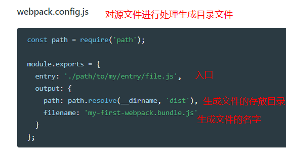
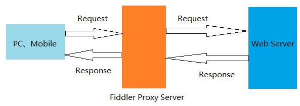

# 微信小程序学习第15天

## 每日反馈

1. https://gitee.com/a623071187/my-yougou/blob/Fer_20200303/src/pages/cart/cart.vue

   1. 计算属性的set(改变后的值)
   2. 购物车计算属性isAll，get可以尝试使用every

2. https://gitee.com/mr_pull_wind/uni-app1/tree/cart/

   1. 完成

3. https://gitee.com/syrance/uni-yougou/blob/Fea-syrance-20200303/src/pages/cart/cart.vue

   1. 注释不错，看得出来对于数组的方法有认真研究

4. https://gitee.com/liaojolun/my-uni-yougou/blob/Fea_jolun_20200302/src/pages/cart/cart.vue

   1. onHide的确可以注释掉了，很好
   
   2. 有调试痕迹

   3. 支付页面，先创建订单，再支付。
   
      ```
      // 第一种方法
      function createOrder(){
      	await this.$request
      	this.doPay()
      }
      
      //第二种方法，可以理解同时执行
      this.createOrder()
      this.doPay()
      ```
   
      
   

## 回顾

1. 优购商城整合vuex
   1. 小程序启动时,本地购物车=>vuex; 小程序关闭时，vuex=>本地购物车
   2. 小程序运行中，可以直接使用vuex
      1. 用this.$store.state.cart代替之前的uni.getStorageSync(cart)
   3. 对state.cart的改变，规范上要用mutations
      1. 在mutations声明名一个方法 fun(state,形参)
      2. 在页面需要改变state状态时，调用fun: this.$store.commit(fun,实参)
   4. 如果我们取state.cart需要复杂的计算的话，那么就需要state的计算属性，也就是getters
      1. getters里面声明一个方法 getCartLen
      2. 使用时就是 this.$store.getters.getCarLen
2. mpvue
   1. mp意思是mini program小程序。用vue方式来写小程序
   2. 这种想法最先是wepy, 但是这个框缺点很多，基本不用考虑
   3. 支持编译各种小程序，但是不支持h5


## mpvue快速上手

[传送门](http://mpvue.com/mpvue/quickstart.html)

#### 01.初始化mpvue项目

1. 确认npm设置的是淘宝源

   1. **npm config list检查是否设置为淘宝源**，如果没有执行以下这句

      

   ```bash
   npm set registry https://registry.npm.taobao.org/
   ```

2. 为了可以使用`vue init`命令，全局安装一个桥接工具(vue-cli@2.x版本)（让vue-cli 2.x和4.x版本同时存在）

   1. 如果需要权限`oparation`
      1. windows，就以管理员身份打开，然后再执行
      2. 如果Macos, sudo 命令

   ```bash
   npm install -g @vue/cli-init
   ```

3. 创建项目

   1. 所有选项都yes

   ```bash
   vue init mpvue/mpvue-quickstart 项目名
   ```

4. 运行项目（看提示）

   

   1. 进入项目目录

      ```bash
      cd 项目名
      ```

   2. 安装npm包

      ```bash
      npm install
      ```

   3. 运行项目

      1. npm run dev或者是npm run start都行
      
      ```bash
      npm run start
      ```

> vue init是vue-cli@2.x的命令，vue create是vue-cli3.x和4.x的命令

#### 02.调试开发 mpvue

1. 微信开发者工具导入项目，导入目录选择`项目名`，而不是`项目名/dist/wx`
2. 建议用vscode来写代码，用微信开发者工具来查看效果。
3. project.config.json里面配置了微信miniprogramRoot是dist/wx
   1. 微信开发者工具能识别到小程序源码在dist/wx目录里面


#### 03. npm安装的问题

1. 项目目录不要带中文
2. npm set registry https://registry.npm.taobao.org/
3. 以管理员的身份打开cmd,git bash，npm install
   1. Mac里面 **sudo** npm install -g eslint
   2. 'oparation'的提示，基本上都是权限的问题
4. 有`.staging`error的，就运行`npm cache clean --force`
5. 网络的问题
6. 提示Yarn安装cli-init
   1. 不管装的是vue3.x或者vue4.x都需要桥接
7. npm install动不了，直接ctrl+c。删除掉node_module再进行npm install

#### 注意点

1. 执行完vue脚手架桥接后，vue版本还是4.x，但是`vue init`这个命令可以使用了。
2. vue create mpvue/mpvue-quickstart 项目名 这样也可以吗
   1. 不行的。
   2. 只支持vue int


## mpvue项目结构


**项目结构和uniapp非常相似**

1. build和config目录是webpack打包相关
2. dist是打包后的文件
3. src源码目录
   1. components 组件目录
   
   2. pages页面，每个小程序页面一个单独目录
      
      
      
      1. **main.js里面初始化了index.vue**
         1. 页面的结构样式和逻辑都在index.vue
         2. 无须手动创建，copy就可以
      2. 页面配置文件的文件名必须为**main.json**
      
   3. utils工具（可选）
   
   4. main.js 入口文件，
   
   5. App.vue主组件，被解析成app.js和app.wxss
   
   6. app.json 小程序配置文件，管理了所有页面路径，跟微信小程序里面一致
4. static目录 静态资源文件
5. project.config.json微信开发者工具的配置文件


## mpvue webpack配置详解

思考一个问题：开发时，能运行`npm run serve`命令吗？为什么？

1. 不能

webpack本质上，就是对一堆源文件进行处理生成目标文件

在我们mpvue生成的项目里面，处理src目录生成dist目录，根据build目录下的webpack配置



[Vue CLI 2.x搭建vue,目录最全分析](https://my.oschina.net/wangnian/blog/2050375?nocache=1536818711949)

典型的vue-cli2.x工程, 可以理解webpack就是把src目录编译成dist目录


webpack.base.config.js详解

1. app和页面都有main.js文件作为入口
   1. 在mpvue里面，app.json里面配置的页面路径都得是`main`结尾的
2. 引入文件，.js,.vue,.json不用加后缀
3. @是src的别名
4. vue是mpvue
5. eslint-loader会对src目录下.vue和.js文件进行格式检查
   1. 如果想关掉eslint检查，注释掉这个loader就可以

#### 注意点

1. pages/目录/main.js文件一定要有，一般不需要改，那么直接copy脚手架生成的。
2. 如果想添加页面配置的话，文件名必须是main.json
3. npm run start清空`dist/wx`  build/dev_server.js
4. 添加新的页面需要重启webpack服务器
   1. 因为增加一个新的页面就是就增加一个新的入口
   2. 工作上，不是每个项目都是单页面应用
5. loader和plugin的区别
   1. loader是对某一种类型的文件打包成js
   2. plugin就是有多个loader，分别在webpack不同生命周期去响应


## 创建自己的页面

**mpvue使用Vue语法，也可以使用小程序组件和wx对象，可以使用html标签**

1. app.json

   1. pages中添加路径 pages/demo/main

2. pages目录
   1. 在pages中添加文件夹demo
   2. **在demo中添加文件**
      1. main.js
      2. index.vue

3. 中断，再执行npm run start

> 不用小程序的标签属性，wx:if, wx:for, bindtap, 事件处理传参，this.data.attr


## ESLint说明-练习

 [传送门](https://eslint.bootcss.com/)

1. 是什么？ESLint是JavaScript的检查工具

2. 有什么用？ 一般用于代码规范。

3. 为什么要使用代码规范

   1. 有企业在git提交的时候，强制esLint检查，如果不通过，是无法提交。实际工作中一定会开启
   2. 如果没有eslint，提交代码的改动，就是格式的改动
   3. eslint可以检查出错误

4. 如何使用？一般和webpack配合，执行npm命令，eslint会读到工程下的` .eslintrc `文件里面的规则

   1. 检查代码，如果不符合规范的话，就报错。

      

#### mpvue项目里面的eslint

1. build/webpackpack.base.conf.js里面配置了eslint-loader，会检查src目录下.js和.vue文件的代码格式
2. `.eslintrc`里面`extends`声明了代码规范，代码规范是规则集合

3. [JavaScript标准代码规范](https://github.com/standard/standard/blob/master/docs/RULES-zhcn.md)

#### 自动格式化代码

1. vscode安装插件`Prettier-Standard - JavaScript formatter`

   1. 插件默认按这个规范进行格式化[prettier-standard](https://github.com/sheerun/prettier-standard)，可以理解成JavaScript标准代码规范
   2. 可以添加`.prettierrc`, 自定义格式化

2. 在vscode设置里面添加保存文件时自动格式化（可选）

   ```
   "editor.formatOnSave":true
   ```

3. js,css,vue,html文件配置prettier为默认格式化程序

   

#### 注意点

1. 自动化格式化工具不一定很完美，建议在理解规则的基础上手动改

2. 实际工作中，的确是有些文件不需要eslint检查

   ```js
   /* eslint-disable */
   ```

3. 全局去掉eslint-loader(不建议)


## uniapp优购商城迁移到mpvue

#### 01.准备

1. 初始化mpvue-yougou45工程

2. 装包及安装less包

   ```bash
   npm install --save-dev less less-loader
   ```

3. 运行项目，微信开发者工具导入项目

4. git管理

#### 02.完成首页

1. 复制uniapp项目src目录下的components,css,pages,store,utils,App.vue文件，覆盖mpvue项目的src目录
   1. uniapp的这些目录和mpvue是一致的
2. 在home目录下添加main.js文件，并修改home.vue为index.vue
3. 在app.json改动
   1. 下添加home路径，删除其他
   2. 修改窗口样式
   3. 删除tabBar的配置
4. 格式化部分代码以符合eslint规范
5. 修改`uni.`为`wx.`
   1. 统一把src目录下的文件修正
6. main.js文件里面注册$request为Vue的原型属性

#### 03.完成四个tab栏

1. uniapp项目的static替换掉mpvue static目录
2. 另外三个tab页，添加main.js文件，并修改主组件名为index.vue
3. app.json
   1. 添加三个tab页路径
   2. 复制粘贴tabBar的配置
      1. 修改路径
      2. 图片路径统一配置绝对路径
4. 格式化部分代码以符合eslint规范
5. main.js文件里面注册$store为Vue的原型

##### 注意点

1. tabbar图片路径统一配置绝对路径, 相对路径报错
   1. 相对路径需要按照生成文件的相对路径来理解
2. mpvue实例化不接受传入store, 只能注册$store为Vue的原型
3. mpvue，app是Vue实例; 而且我们每一个Page都是一个Vue实例
4. `/`代表项目的根目录


#### 04.完成剩余页面

1. 删除多余的页面，组件和utils文件
2. 其他页面添加main.js文件，并修改主组件名为index.vue
3. 在app.json添加页面路径
4. 搜索src文件的navigateTo和switchTab，修改路径
5. 格式化部分代码以符合eslint规范

> prettier-standard这个格式化工具，不会格式注释的规范，注释必须“//空格+注释”
>
> 如果遇到标签没有闭合的话，会提示，然后格式化中止。得手动把标签的闭合解决了。

#### 05.检查

1. project.config.json修改appid `wx38d8faffac4d34d2`

2. 各页面添加main.json，配置标题，以及下拉上拉如果需要

3. login页面，获取用户信息需要

   ```
   userInfoRes.mp.detail
   ```

4. **页面销毁，对应的Vue实例还在，需要手动重置数据**

   1. 小程序页面销毁时，对应的Vue实例并没有销毁，所以goodsList的数据还在
      1. 如果再次进入页面的，就会追加goodsList，会导致之前数据还在
   2. 小程序时，会跟着触发所有页面的created方法


## 事件循环(Event Loop)

#### 01.Vue异步更新队列

[传送门](https://cn.vuejs.org/v2/guide/reactivity.html#%E5%BC%82%E6%AD%A5%E6%9B%B4%E6%96%B0%E9%98%9F%E5%88%97)

1. vue在更新DOM时是异步的
   
   1. 批量处理数据的变更到DOM更新
   
2. 内部实现尝试用`Promise.then`, 如果没有用 `setTimeout(fn,0)`

3. Promise是微任务，setTimeout是宏任务

4. **this.$nextTick或者Vue.nextTick, 不要使用updated**

   1. 如果修改数据，希望获取到对应的dom更新的话，那么需要在Vue.nextTick里面获取
   2. this.$nextTick

   ```
   // 修改数据
   vm.msg = 'Hello'
   // DOM 还没有更新
   Vue.nextTick(function () {
     // DOM 更新了
   })
   ```

   

#### 02.js的事件循环(Event Loop)


>```
>var b =0;
>var a=11
>var obj = new Object()
>obj.name='joven'
>let c=1
>```
>
>对于复杂类型，栈上面存放引用，object本身是放在堆里面
>
>stack先进后出，大小固定
>
>堆无序的，但是分配大小可以调整，整个堆空间也比较大

1. 所有同步任务都在主线程上执行，形成一个执行栈
2. 主线程之外，还存在一个任务队列。**只要异步操作执行完成**，就到任务队列中排队
   1. 异步任务window.onload, ajax, setTimeout(function,1000)
   2. 只有当任务结束时，才会放到任务队列上，比如setTimeout(function,1000), 1000ms后把function放到任务列表
3. 一旦执行栈中的所有同步任务执行完毕，系统就会依次读取任务队列的异步任务，**挑选最前面的一个宏任务先执行**，于是被读取的异步任务结束等待状态，进入执行栈，开始执行
4. 主线程不断重复上面的的第三步
5. 宏任务与微任务(了解)
   1. 优先执行完所有的微任务（promise.then）
   2. 再执行一条宏任务(setTimeout,setInterval...)


## Vue.use的使用

[传送门](https://cn.vuejs.org/v2/api/#Vue-use)

用于写Vue.js的插件

使用方法：Vue.use(对象)

原理：Vue.use会调用对象的install方法

很多UI库会使用这个功能，比如[饿了么UI](https://gitee.com/mirrors/element-ui/blob/master/src/index.js)


## Fiddler使用



1. 基本使用，选择请求，查看请求详细信息（抓包）

2. fidddler是一个sever，监听在127.0.0.1:8888

3. fiddler配置抓包chrome(包括http和https请求)

   1. 官网下载fiddler,并打开

   2. fiddlercertmaker.exe用来生成证书，安装执行完即可

   3. fidddler上，Tools-> options, 打开https和connections，进行如何配置

      

      

   4. 在https选项卡导出证书到桌面

      

   5. 打开设置-> 隐私设置和安全性->打开管理证书，导放桌面上那个证书。

4. fiddler抓包手机端

   1. 安卓  https://www.jianshu.com/p/724097741bdf 
   2. ios  https://www.jianshu.com/p/724097741bdf 
   3. 大致的步骤
      1. filddler所在的电脑和手机在同一个局域网内
      
      2. 在手机上访问 `电脑ip:8888`可以下载证书
      
      3. 手机上安装证书
      
      4. 手机wifi设置代理为电脑ip：8888
      
         

#### 注意点：

1. 更推荐使用[whistle](https://www.cnblogs.com/Joe-and-Joan/p/11121415.html)


## mpvue坑点(了解)

1. 新增页面需要重新npm run start
2. 嵌套v-for索引别名不要相同，双层嵌套v-for需要取不同索引别名
   1. v-for会转成wx:for，后者有默认的索引别名index
3. v-html指令大部分HMTL不能解析，能解析img标签
4. 过滤器无法使用
5. 指令不支持方法，常见的{{}}里面不支持方法
6. 指令里面不支持字符串的模板语法
   1. 但是data里面属性声明是可以用字符串模板语法
7. mpvue tabBar的配置，app.json最好用根路径，以`/`打头。不要用相对路径
8. v-model指令不支持<input type=checkbox/>
9. **页面销毁，对应的Vue实例还在，需要手动重置数据**
10. **父传子，子组件里面可以直接改props，不会报错**
    1. 我们依然需要遵从vue组件单向数据流规则
11. **经常有源码目录和dist目录不同步的问题，需要手动删除wx/dist重启，更好的方式是在dev-server.js里面加上清空dist/wx目录的逻辑**
12. **obj.prop1.prop2改变数据不响应**


## 总结

1. 不仅学会小程序原生语法，uniapp, mpvue没有uniap优秀
2. git使用
3. 主动解决，沟通能力。
   1. 心态：不要浪费对方时间
   2. 陈述多做总结式，即使是微信发过去，也应该是邮件形式的内容。


## 作业

1. 完成mpvue优购商城


