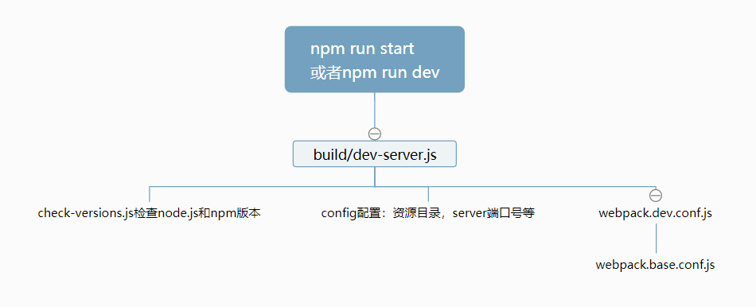
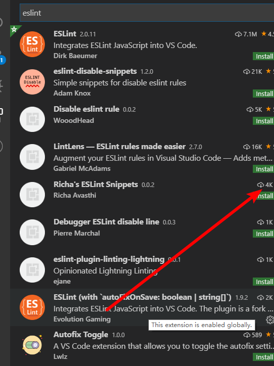

## mpvue介绍

[传送门](http://mpvue.com/)

**用Vue的方式来写小程序，支持发布多个平台的小程序, 不支持H5**

mpvue美团公司的。

mp:mini program


#### 学习的目的：

1. 多掌握一个微信小程序框
2. mpvue是基于vue-cli2.x的，有利于学习webpack配置
3. mpvue自带eslint配置，方便学习eslint


## mpvue快速上手

[传送门](http://mpvue.com/mpvue/quickstart.html)

#### 01.初始化mpvue项目

1. 设置npm淘宝源

2. **npm config list检查是否设置为淘宝源**

   ```bash
   npm set registry https://registry.npm.taobao.org/
   ```

3. 安装全局安装一个桥接工具(vue-cli@2.x版本)（让vue-cli 2.x和4.x版本同时存在）

   ```bash
   npm install -g @vue/cli-init
   ```

4. 创建项目

   1. 所有选项都yes，vuex选择No

   ```bash
   vue init mpvue/mpvue-quickstart 项目名
   ```

5. 运行项目

   1. 进入项目目录

      ```bash
      cd 项目名
      ```

   2. 安装npm包

      ```bash
      npm install
      ```

   3. 运行项目

      ```bash
      npm run start
      ```

> vue init是vue-cli@2.x的命令，vue create是vue-cli3.x和4.x的命令

#### 02.调试开发 mpvue

1. 微信开发者工具导入项目，导入目录选择`项目名`，而不是`项目名/dist/wx`

2. 建议用vscode来写代码，用微信开发者工具来查看效果。

   > project.config.json里面配置了微信miniprogramRoot是dist/wx


#### 03. npm安装的问题

1. npm set registry https://registry.npm.taobao.org/
2. 以管理员的身份打开cmd,git bash，npm install
   1. Mac里面 **sudo** npm install -g eslint
   2. 'oparation'的提示，基本上都是权限的问题
3. 有`.staging`error的，就运行`npm cache clean --force`
4. 网络的问题
5. 提示Yarn安装cli-init
   1. 不管装的是vue3.x或者vue4.x都需要桥接
6. npm install动不了，直接ctrl+c。删除掉node_module再进行npm install


## mpvue项目结构

**项目结构和uniapp非常相似**

1. build和config目录是webpack打包相关
2. dist是打包后的文件
3. src源码目录
   1. components 组件目录
   2. pages页面，每个小程序页面一个单独目录
      2. main.js里面初始化了index.vue
   3. utils工具（可选）
   4. main.js 入口文件，
   5. App.vue主组件，被解析成app.js和app.wxss
   6. app.json 小程序配置文件，管理了所有页面路径，跟微信小程序里面一致
4. static目录 静态资源文件
5. project.config.json微信开发者工具的配置文件

> 1. 在app.json里面添加文件，并不会在src下自动生成目录
>
> 2. vue是mpvue


## mpvue webpack配置详解

[Vue CLI 2.x搭建vue,目录最全分析](https://my.oschina.net/wangnian/blog/2050375?nocache=1536818711949)

典型的vue-cli2.x工程, 可以理解webpack就是把src目录编译成dist目录



webpack.base.config.js详解

1. app和页面都有main.js文件作为入口
2. 引入文件，.js,.vue,.json不用加后缀
3. @是src的别名
4. vue是mpvue
5. eslint-loader会对src目录下.vue和.js文件进行格式检查

#### 注意点

1. pages/目录/main.js文件一定要有，一般不需要改，那么直接copy脚手架生成的。
2. 如果想添加配置的话，文件名必须是main.json
3. npm run start清空`dist/wx`  build/dev_server.js

```js
var rm = require('rimraf')
var chalk = require('chalk')
rm(path.join(config.build.assetsRoot, '*'), err => {
  if (err) throw err
})
```


## 创建自己的页面

**mpvue使用Vue语法，也可以使用小程序组件和wx对象**

1. app.json

   1. pages中添加路径 pages/demo/main

2. pages目录
   1. 在pages中添加文件夹demo
   2. 在demo中添加文件
      1. main.js
      2. index.vue

3. 中断，再执行npm run start

> 不用小程序的标签属性，wx:if, wx:for, bindtap, 事件处理传参，this.data.attr


#### 如何全局关掉eslint

1. 修改webpack配置 webpack.base.conf.js


## ESLint说明-练习

 [传送门](https://eslint.bootcss.com/)

1. 是什么？ESLint是JavaScript的检查工具
2. 有什么用？ 一般用于代码规范。
3. 为什么要使用代码规范
4. 如何使用？一般和webpack配合，执行npm命令，eslint会读到工程下的` .eslintrc `文件里面的规则
   1. 检查代码，如果不符合规范的话，就报错。

#### mpvue项目里面的eslint

1. build/webpackpack.base.conf.js里面配置了eslint-loader，会检查.js和.vue文件的代码格式
2. `.eslintrc`里面`extends`声明了代码规范，代码规范是规则集合

3. [JavaScript标准代码规范](https://github.com/standard/standard/blob/master/docs/RULES-zhcn.md)

#### vscode自动格式化代码

1. vscode安装插件`prettier`、 Beautify和`eslint`，安装下边这个vscode eslint插件

   

2. 全局安装eslint

   1. **sudo** npm install  -g eslint

3. 文件-首选项-设置-打开json，**追加**

   1. **最好先备份一下setting.json**

   ```json
     "editor.tabSize": 2, //制表符符号eslint
     "editor.formatOnSave": false, //每次保存自动格式化
     "eslint.autoFixOnSave": true, // 每次保存的时候将代码按eslint格式进行修复
     "prettier.eslintIntegration": true, //让prettier使用eslint的代码格式进行校验
     "prettier.semi": false, //去掉代码结尾的分号
     "prettier.singleQuote": true, //使用带引号替代双引号
     "javascript.format.insertSpaceBeforeFunctionParenthesis": true, //让函数(名)和后面的括号之间加个空格
     "vetur.format.defaultFormatter.html": "js-beautify-html", //格式化.vue中html
     "vetur.format.defaultFormatter.js": "vscode-typescript", //让vue中的js按编辑器自带的ts格式进行格式化
     "vetur.format.defaultFormatterOptions": {
       "js-beautify-html": {
         "wrap_attributes": "force-aligned" //属性强制折行对齐
       }
     },
     "eslint.validate": [
       //开启对.vue文件中错误的检查
       "javascript",
       "javascriptreact",
       {
         "language": "html",
         "autoFix": true
       },
       {
         "language": "vue",
         "autoFix": true
       }
     ]
   ```

#### 注意点

1. 自动化格式化工具不一定很完美，建议在理解规则的基础上手动改

2. 如果影响写代码，学习阶段还是可以关掉文件的eslint检查，或者全局去掉eslint-loader

   ```js
   /* eslint-disable */
   ```

> .editorconfig也是声明代码规范的文件，需要安装对应的插件生效。没有eslint那么强大，忽略。


## uniapp优购商城迁移到mpvue

1. 初始化mpvue-yougou工程
2. 装包及安装less包
3. 运行项目，微信开发者工具打开工程
4. copy前者src目录下除static目录外所有文件夹到后者src目录下，App.vue也复制粘贴
   1. 前端static目录copy到后者外层的static，覆盖
   2. 每个页面文件夹下添加man.js，修改vue文件为index.vue
5. main.js
   1. 引入request.js
   2. store也声明为Vue的原型
6. app.json
   1. 复制粘贴前端pages.json里面的窗口样式及tabBar代码
   2. 添加4个tab页面的路径
   3. 修改对应路径
7. 把所有的`uni.`换成`wx.`
8. 修改页面中的路径
   1. navigateTo
   2. switchTab
9. 获取用户信息 userInfoRes.mp.detail


## mpvue坑点

1. 新增页面需要重新npm run start
2. 嵌套v-for索引别名不要相同，双层嵌套v-for需要取不同索引别名
   1. v-for会转成wx:for，后者有默认的索引别名index
3. v-html指令大部分HMTL不能解析，能解析img标签
4. 过滤器无法使用
5. 指令不支持方法，常见的{{}}里面不支持方法
6. 指令里面不支持字符串的模板语法
   1. 但是data里面属性声明是可以用字符串模板语法
7. mpvue tabBar的配置，app.json最好用根路径，以`/`打头。不要用相对路径
8. v-model指令不支持<input type=checkbox/>
9. **页面销毁，对应的Vue实例还在，需要手动重置数据**
10. **父传子，子组件里面可以直接改props，不会报错**
    1. 我们依然需要遵从vue组件单向数据流规则
11. **经常有源码目录和dist目录不同步的问题，需要手动删除wx/dist重启，更好的方式是在dev-server.js里面加上清空dist/wx目录的逻辑**
12. **obj.prop1.prop2改变数据不响应**

