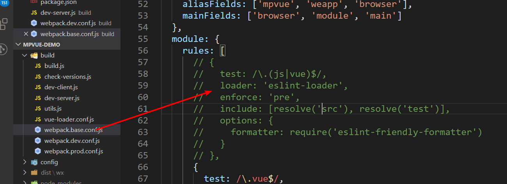
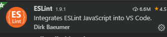
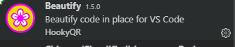
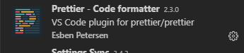
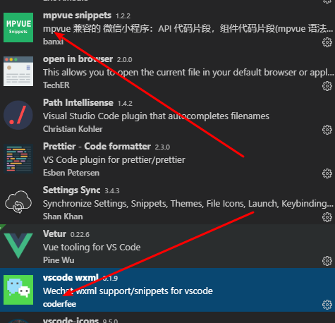

# 微信小程序复习02


## mpvue创建自己的页面

**mpvue使用Vue语法，也可以使用小程序组件和wx对象, 还可以使用HTML标签**

1. app.json

   1. pages中添加路径 pages/demo/main

2. pages目录
   1. 在pages中添加文件夹demo
   2. 在demo中添加文件
      1. main.js
      2. index.vue

3. 中断，再执行npm run start

> 不用小程序的标签属性，wx:if, wx:for, bindtap, 事件处理传参，this.data.attr


#### 如何全局关掉eslint

1. 修改webpack配置 webpack.base.conf.js




## ESLint说明-练习

 [传送门](https://eslint.bootcss.com/)

1. 是什么？ESLint是JavaScript的检查工具
2. 有什么用？ 一般用于代码规范。
3. 为什么要使用代码规范
   1. 统一代码格式
   2. 检查代码错误
4. 如何使用？eslint会读到工程下的` .eslintrc `文件里面的规则
   1. 检查代码，如果不符合规范的话，就报错。

#### mpvue项目里面的eslint

1. build/webpackpack.base.conf.js里面配置了eslint-loader，会检查.js和.vue文件的代码格式
2. `.eslintrc`里面`extends`声明了代码规范，代码规范是规则集合

3. [JavaScript标准代码规范](https://github.com/standard/standard/blob/master/docs/RULES-zhcn.md)

#### vscode保存文件自动格式化代码

1. vscode安装插件`prettier`、 Beautify和`eslint`（1.9.2版本），安装下边这个vscode eslint插件

   

   

   

   

2. 全局安装eslint

   1. npm install  -g eslint

3. 文件-首选项-设置-打开json，**追加**

   1. **最好先备份一下setting.json**

   ```json
     "editor.tabSize": 2, //制表符符号eslint
     "editor.formatOnSave": false, //每次保存自动格式化
     "eslint.autoFixOnSave": true, // 每次保存的时候将代码按eslint格式进行修复
     "prettier.eslintIntegration": true, //让prettier使用eslint的代码格式进行校验
     "prettier.semi": false, //去掉代码结尾的分号
     "prettier.singleQuote": true, //使用带引号替代双引号
     "javascript.format.insertSpaceBeforeFunctionParenthesis": true, //让函数(名)和后面的括号之间加个空格
     "vetur.format.defaultFormatter.html": "js-beautify-html", //格式化.vue中html
     "vetur.format.defaultFormatter.js": "vscode-typescript", //让vue中的js按编辑器自带的ts格式进行格式化
     "vetur.format.defaultFormatterOptions": {
       "js-beautify-html": {
         "wrap_attributes": "force-aligned" //属性强制折行对齐
       }
     },
     "eslint.validate": [
       //开启对.vue文件中错误的检查
       "javascript",
       "javascriptreact",
       {
         "language": "html",
         "autoFix": true
       },
       {
         "language": "vue",
         "autoFix": true
       }
     ]
   ```

#### 注意点

1. 自动化格式化工具不一定很完美，建议在理解规则的基础上手动改

2. 如果影响写代码，学习阶段还是可以关掉文件的eslint检查

   ```js
   /* eslint-disable */
   ```

> .editorconfig也是声明代码规范的文件，需要安装对应的插件生效。没有eslint那么强大，忽略。


## 自适应单位rpx 

responible

[传送门](https://developers.weixin.qq.com/miniprogram/dev/framework/view/wxss.html#%E5%B0%BA%E5%AF%B8%E5%8D%95%E4%BD%8D)

1. 所有设备的宽度都是750rpx。相当于所有设备的宽度750等分，每一份是1rpx

2. 开发微信小程序时设计师用 iPhone6 作为视觉稿的标准，宽度是750px

   1. **代码里面的元素rpx值=设计稿对应元素的像素值**
   2. 设计的宽度就是750px,iphone6的2倍图

3. 需要随屏幕尺寸变化的元素用rpx, 否则用px

   1. 实际项目里面，哪些元素是固定尺寸的，看实际情况

4. 实际开发中，一般只需要用rpx适配好iphone6就行。

5. 哪些css属性需要自适应

   1. margin
   2. padding
   3. border
   4. font-size
   5. width,height


## 异步请求wx.request

[传送门](https://developers.weixin.qq.com/miniprogram/dev/api/network/request/wx.request.html)

基本XMLHttpRequest封装的

> 豆瓣API :   https://api.douban.com/v2/movie/in_theaters?apikey=0df993c66c0c636e29ecbb5344252a4a

使用方法基本和$.ajax一样

```js
wx.request({
    url: 'https://api.douban.com/v2/movie/in_theaters',
    method: 'GET',
    data: {
        apikey: '0df993c66c0c636e29ecbb5344252a4a'
    },
    // 看实际情况是否需要写content-type
    header: {
        'Content-Type': 'application/x-www-form-urlencoded'
    },
    dataType: 'json',
    success: res => {
        console.log(res)
    }
})
```


看实际情况是否需要写content-type

```js
header: {
  'Content-Type': 'application/x-www-form-urlencoded' // 默认值
}
```


#### promise封装wx.request

1. 回顾promise的学习

   1. 是什么？ 

      1. 表示一个异步操作，一个数组存了一些异步操作

   2. 有什么用

      1. 管理异步操作
      2. 解决回调地狱问题，让代码更优雅。不用写回调函数，.then

   3. 如何使用

      1. 创建对象

         ```js
         var p = new Promise((resolve,reject)=>{
           // 逻辑代码
           if(){
              resolve(data)
           }else{
             reject(err)
           }
         })
         ```

      2. 使用promise对象

         ```js
         p.then(res=>{
           console.log(res)
         }).catch(res=>{
           console.log(res)
         })
         ```

2. 开始封装

3. 使用封装后的promise方法

   1. 引入request.js

4. 重构之前的请求逻辑

5. 再次优化

   1. baseUrl
   2. request设置header
   3. Vue原型上设置$request

>1. wx.request的dataType默认值是json，不是JSON


####  Promise主要用管理异步对象的

1. Promise.all 所有的异步操作都完成，才成功
2. Promise.race 和第一个完成的异步操作状态一样

```js
let isA = false
let isB = false

a({
  success(){
    isA = true;
    if(isA &&isB){
      doC()
    }
  }
})

b({
  success(){
    isB = true;
    if(isA &&isB){
      doC()
    }
  }
})
```


## 设置合法域名

[传送门](https://developers.weixin.qq.com/miniprogram/dev/framework/ability/network.html)

小程序里面请求的后端服务器，需要在小程序后台注册域名

服务器域名请在 「小程序后台-开发-开发设置-服务器域名」 中进行配置

预览手机扫码默认也会检查安全域名，...->开发调试->打开调试，就不会检查安全域名了

#### 注意点

1. 微信小程序在开发的时候，可以通过勾选不检验合法域名来解决域名安全的问题，但是上线前一定需要配置合法域名。
2. 建议开发时就添加服务器域名


## vscode小程序插件




## Tab栏配置

[传送门](https://developers.weixin.qq.com/miniprogram/dev/reference/configuration/app.html#tabBar)

app.json的tabBar属性配置Tab栏，点击不同tab显示对应的页面

使用方法：在app.json里面配置

```js
 "tabBar": {
     // tab未选中时的文字颜色
     "color": "#0000ff",
      // tab选中时的文字颜色
      "selectedColor":"#eb4450",
      "list": [
        {
          // tab选中时显示的页面路径
          "pagePath": "pages/index/index",
          // tab的文案
          "text": "首页"，
            iconPath  ，
            selectedIconPath
            
        }
     }
}
```


## 优购Tab栏-练习


1. 新建四个页面home,category,cart,me
2. copy文档tabBar配置，修改四个tab的文案
3. 设置selectedColor:  tab 上的文字选中时的颜色 
4. 设置iconPath  没选中时图片路径 
5. 设置selectedIconPath 选中时图片路径


## Tab栏切换

1. 只有配置在tabBar中的页面才有tab栏
2. 页面跳转
   1. 跳转到tab页面用`switchTab`
   2. 跳转到非tab页面用`navigateTo`

​	

## 组件Input

[传送门](https://developers.weixin.qq.com/miniprogram/dev/component/input.html)

基本概念：输入框

用法基本和html input标签一样

特点：

1. 默认没有边框
2. type键盘类型
   1. 默认类型是text
   2. number数字键盘
   3. idcard有一个X键
3. confirm-type 键盘右下角按钮的文案
   1. search 搜索

如何获取输入框中的内容

1. 添加input事件 bindinput
2. 事件处理方法里面，**event.detail.value**即是用户的输入
3. 小程序没有v-model

确认事件 bindconfirm

> 微信开发者工具不稳定，无法触发bindinput，只是调试基础库2.9.3


## 优购案例

#### 01-案例分析&项目资料

1. 案例分析
   1. 优购小程序是商城，购物的逻辑可以参考京东App和小米lite小程序
   2. 基本流程是这样的，点商品去到商品详情，添加购物车，结算付款，查看订单
2. 项目资料
   1. 设计稿
   2. 图标文件
   3. 接口文档

#### 02-准备mpvue项目

1. 创建mpvue项目`mpvue-yougou43`，运行项目

2. 微信开发者工具导入项目

3. 安装less

   ```bash
   npm install --save-dev less less-loader
   ```


#### 03-提交码云

1. 码云上新建仓库

2. git add，git commit

3. git remote add, git push

   > 前提是已经添加了ssh key

#### 04-项目结构改造

1. App.vue保留基本结构，并去掉<template>
2. pages文件夹copy一份命令为home,修改index.vue为基本结构
3. app.json删掉tabBar的配置，pages属性添加home页面路径，删掉其它
4. static目录下清空
5. 清空dist/wx目录逻辑

#### 05- tarBar设置

1. 创建四个页面home,cart,category,me
2. copy tabBar配置

#### 注意点

tabbar里面iconpath和selectedIconPath图片建议写绝对路径 ，如果是相对的路径的，按源码目录来，图片会显示错误，只能按dist/wx目录来写，但是对阅读者来说难以理解。所以建议写绝对路径


## 优购案例-首页


#### 01.页面分析

1. 入口页面，默认显示首页
2. 展示轮播图，分类及楼层。功能上简化了，点击图片均不会有跳转。
3. 点击搜索去到搜索页面

#### 02.静态页面

1. 设置标题

```json
{
  "navigationBarTitleText": "优购",
  "navigationBarBackgroundColor": "#eb4450",
  "navigationBarTextStyle": "white"
}
```

2. 头部搜索

   ​	1. icon

3. 轮播图

   1. swiper组件
   2. circular="true"无限轮播

4. 分类导航区域

5. display:flex展示四张图片

6. 楼层区域


## 优购商城码云代码

项目：https://gitee.com/jovenwang/mpvue-yougou43

分支：Fea_joven_20200217


## VsCode的Setting Sync插件的使用

回想一下，新iphone从备份中恢复的功能。

同步vscode配置，包括主题、插件、自定义代码片段等

1. 方便换电脑时同步vscode配置
2. 上班第一天装环境就需要配置vscode

#### 使用步骤:

[传送门](https://www.cnblogs.com/WattWang/archive/2019/08/25/11382022.html)

1.  在VS Code中安装Settings sync插件 
2.  新建github token
    1. 点击自己github的头像，选择Settings 
    2. 进入Develper Setting的 Personal access tokens ，生成一个新的token 
    3. 勾选gists 
3.  在VS Code中进行设置 
    1.  同时按下shift+alt+u，显示设置界面
    2.  点击LOGIN WITH GITHUB，授权登录github,并关闭页面
    3.  选择已经存在的gist，下载配置或者创建一个新的gist上传
4.  在其他电脑上同步这个配置
    1. 从自己的github上同步配置
    2. 按下Ctrl+Shift+P，输入sync，选择下载配置
    3. 登录后，然后选择自己github中已经存在的配置。

#### 注意点：

1. 上传的位置是，github, your gists, 找到其中一条cloudSettings，url就是gist id


## git撤销

1. 工作区撤销(本地改动，就是工作区)
   1. git restore .
   2. git checkout -- .
   3. vscode 放弃所有更改
2. 暂存区撤销（git add .）
   1. git restore --staged .
   2. git reset HEAD .
   3. vscode取消暂存所有更改，或者暂存-
3. 本地仓库撤销 (git commit)
   1. git  reset --hard  commit_id
4. 远程仓库撤销 (git push)
   1. 本地仓库撤销
   2. git push -f


## 移动端自适应方案-rem+flexible.js

[flexible.js](https://github.com/amfe/lib-flexible)

同一个页面在不同尺寸的设备上，能显示正确，适配。有时候也说响应式布局。

#### rem的概念

1. 当使用 rem 单位，他们转化为像素大小取决于页根元素（html标签）的字体大小，即 html 元素的字体大小。 根元素字体大小乘以你 rem 值
2. 根元素的字体大小 16px，10rem 将等同于 160px，即 10 x 16 = 160

#### 原理

1. flexible.js根据不同屏幕宽度和dpr给html标签设置一个合适的font-size
2. 样式里面我们使用rem，就可以根据不同的font-size得到对应高度,,宽度,margin,padding的值，于是就自适应了。

#### 计算过程

iphone6，font-size:37.5px, 1rem=37.5px, 100px=100/37.5=2.67rem

建议用css预处理器

1. 200/2/37.5rem=200*@p, @p=1/75rem

   ```less
   @p:1/75rem;
   img{
    width:200*@p;
    height:284*@p;
   }
   ```


flexible.js和media query的对比

1. flexible.js是连续的

> html里面默认字体大小是16px,小程序里面也是16px;

