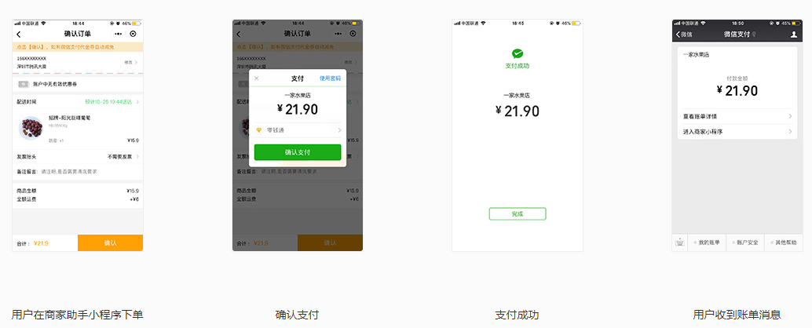
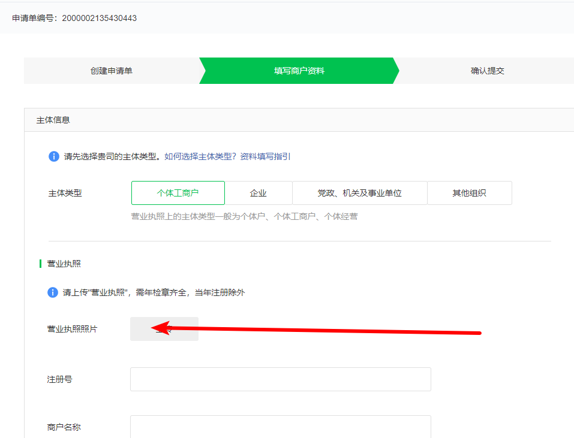

## 小程序接入微信支付

[传送门](https://pay.weixin.qq.com/static/applyment_guide/applyment_detail_miniapp.shtml)

#### 01.支付产品介绍

用户在小程序里面点击，唤起微信支付，完成支付返回小程序界面

#### 02.申请流程

1. 先有完成注册的小程序
2. 提交资料
   1. 扫码微信号商户号的超级管理员
   2. 创建申请单
   3. 填写商户资料
      1. 营业执照
      2. 提供银行卡号
      3. 
3. 签署协议
4. 绑定场景