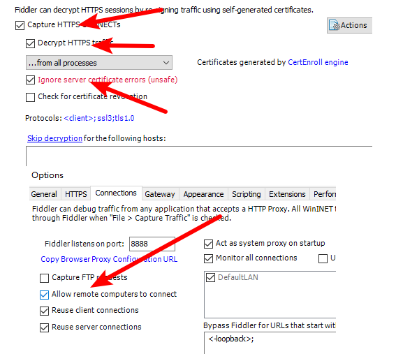

## Fiddler的使用

#### Chrome配置步骤：

1. 官网下载fiddler

2. fiddlercertmaker.exe用来生成证书

3. fiddler https和connections配置

   

4. 导出证书到桌面

5. chrome导入证书

6. chrome关闭google助手等代理软件

#### webpack proxy配置跨域


1. 希望老师复习下面试常问到的,闭包,递归,原型,这些问题几乎必问的了,还有那个vue的生命周期勾子

1. 闭包就函数里面包含函数，内部函数可以访问到外部函数的变量。

   1. 一般用法是在函数里面返回函数，令到外层函数外部可以访问到函数内部的变量

   ```js
   // 创建闭包最常见的方式函数作为返回值
   function foo() {
     var name = "kebi";
     return function() {
       console.log(name);
     };
   }
   var bar = foo();
   bar(); //打印kebi    --外部函数访问内部变量
   ```

2. 原型与原型链

   1. 访问一个对象的属性，如果对象上没有，就会从对象的原型上找，如果找不到，就会去到对象的原型的原型上找，一直找到Object的原型。
   2. 我们项目里面用原型的知识，把axios设置给Vue.prototype，这样不用在每个页面去导入axios

3. Vue生命周期钩子有10个。比较常用的是created和mounted, created最早获取data属性，一般在这里发请求，初始化页面。mounted最早获取到渲染后的dom，一般第三方插件如iscroll初始化放在mounted

   - beforeCreate
   - created
   - beforeMount
   - mounted
   - beforeUpdate
   - updated
   - activated
   - deactivated
   - beforeDestroy
   - destroyed
     -  用于组件销毁时清除定时器等


1. 如何解决跨域? 

2. ```
   src :http://vip.m.fenqile.com?callback=func
   function func(data){
   	console.log(data)
   }
   后端:func(JSON.stringify({name:'joven'}))
   ```

   

   1.   JSONP
        1.   GET
        2.   不安全
        3.   现在已经不用了，但是它的原理需要掌握
   2.   服务器代理
        1.   A访问C代理服务器，C代代替A访问B
        2.   webpack proxy
        3.   后端服务器nginx 
        4.   一般用来解决开发时的跨域问题
        5.   用fildder
        6.   用来开发的方案
   3.   CORS
        1.   后端请求头
        2.   注意带cookie需要配配置信任
        3.   一般线上方案
        4.   后端配置

## 前端性能优化

1. 减少HTTP请求
   1. css/jsr合并打包
   2. 小图标用iconfont或者base64

2. 减少静态资源的体积
   1. js,css,图片压缩，图片压缩用tinypng.com
3. 服务器端开启gzip
4. 预加载
   1. 利用浏览器空闲时间加载资源
5. 静态资料放CDN
6. 请求缓存
7. 设置合适的缓存
8. 其他
   1. 减少dom数量
   2. css预处理器，减少层级

> 1. 减少HTTP请求，也不是HTTP请求越少越好。比如有的页面是一个就是由一个请求数据渲染的，至少可以拆成两个请求，先让页面出来一部分，另一部分异步加载。
> 2. weppack url-loader设置limit参数，可以自动将较小的图片生成base64图片
> 3. 雪碧图：把小图标合并成一个大的图片，然后用背景定位。由于维护起来很麻烦，不建议使用。
> 4. tinypng的压缩效率比webpack的插件高，建议总是把图片放在tinypng上压缩。


## 面向对象，封装继承多态

1. 面向对象是封装函数更高维高的封装，把方法和属性封装到一起。可以理解成二维和三维不一样。
2. 多态是同一行为对于不同对象不一样。Player1坦克和敌人坦克的move方法不一样。
3. 继承比如敌我坦克都有发射功能，可以封装一个坦克基类，那么敌我坦克就是继承自基类


1. webpack怎么优化压缩代码呢. 你打包后的代码最大多大,我回答4/5m 面试官反应 这么大吗

   1. 读文件，输入文件，理了一下文件依赖顺序，中间有压缩代码。
   2. 尽量小于200kb
   3. webpack分包策略（chunk）
   4. mpvue的学习中会涉及部分webpack配置

2. websoket git

3. 闭包的应用场景 webpack搭建流程重点 简单说下

   1. 变量的私有作用域

      ```js
      function Counter(){
          var num = 0
          this.add = function(){
              num++
          }
          this.getNum = function(){
              return num
          }
      }
      
      let counter = new Counter()
      
      counter.add()
      counter.add()
      console.log(counter.getNum())
      ```

   2. webpack搭建流程

      1. 单入口SPA还是多入口MPA
         1. entry
      2. 网上搜索一下对应的配置，根据业务场景定制
         1. output path,publicPath

## 响应式布局

 https://juejin.im/post/5caaa230e51d452b672f9703 


说说你的对HTTP的理解吧

1. http是客户端和服务器端通信的功议
2. http方法
   1. get查询
   2. post更新
   3. put新增
   4. delete删除
3. http状态码
   1. 2xx成功
   2. 3xx重定向
      1. 301 永久重定向
      2. 302 临时重定向
4. 304 命中协商缓存
   3. 4xx客户端错误
      1. 400 bad request
      2. 403
      3. 401
      4. 404 not found
   4. 5xx服务端错误
      1. 502 bad gateway
      2. 503 forbidden