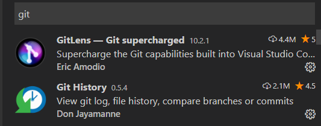

## 蘑菇在线项目演示

#### **有哪些功能**？

1. 首页展示一些轮播图，推荐课程和热门视频
2. 课程：展示所有课程
3. 我的：我的信息
4. 登录页：微信授权登录
5. 手机号登录

#### **项目目的**

1. 设计不错，可以体验企业静态页面开发
   1. 有部分企业后台管理系统没有设计稿，产品直接用画板
2. 复习一下原生小程序的语法


## 项目说明

1. 服务器代码：项目需要自己部署后台
2. 设计稿地址 https://lanhuapp.com/url/8NzGu-jnAKr
3. 接口API 
4. 静态页面可参考这个`静态页面`目录
5. 完整项目参考


## 自适应单位rpx 

[传送门](https://developers.weixin.qq.com/miniprogram/dev/framework/view/wxss.html#%E5%B0%BA%E5%AF%B8%E5%8D%95%E4%BD%8D)

黑马头条的页面在不同设备上是否展示良好？不能

黑马头条是基于vant, vant是可以自适应的。只不过没有用好，所以适配不怎么样


自适应，也可以称为响应式布局，就是我们页面需要在不同设备上显示OK

rpx:规定屏幕宽为750rpx, 所有的设备都是750rpx, 相当于是把所有设备宽度750等分。

1. boostrap是把屏幕12等分

#### **实际开发中使用：**

1. 设计稿是以iphone6，前端程序员写静态页面只要适应的iphone6，基本上其他设备的适配就微调
2. iphone6尺寸
   1. 物理 分辨率为750*1334像素
   2. css像素  375*667 DPR:2
   3. 问题：在iphone6，如果写css单位，375px能占满整个宽度吗？还是说是750px？375px
3. 设计师提供的设计稿一般是iphone6为标准，而且是2倍图的。所以宽度750
4. 所以结论是：750宽度的设计稿，在写静态页面时，**量的px值===代码里面写的rpx值**

#### 适应场景

1. rpx能随设备宽度自适应
2. px是固定的单位
3. 对于字体大小，是px还是rpx是有争论，我们倾向于rpx。因为我们自适应大部分时候还是指手机，稍大一点的设备，用户还是希望这个字体更大一些
4. 结论：基本上所有的width,height,padding,margin,border都应该使用rpx单位


## 项目准备

1. 打开蓝湖链接，注册账号。确定可以使用设计稿
2. 新建微信小程序项目
   1. 微信开发者工具新建项目"mushroom-mp-46"
   2. 新建一个home页面，删除无用的代码
      1. 删除index和log
      2. utils里面删除
      3. app.wxss，清空
      4. app.js清空，然后敲App，自动生成基本的结构


## 项目git管理

希望大家都用码云，因为github慢，而且github没有英文，会阻塞你的学习。

1. 在码云创建仓库

   1. 是否开源这个选**公开**，不然老师看不到
   2. 其他什么都不要做

   

2. 如何初始化仓库？

   1. HTTPS和SSH的协议，强烈建议使用SSH

   2. Git 全局设置, 如果经常使用git, 那么你很有可能已经设置。如果提示没设置，按提示设置就行

   3. 命令行初始化仓库（了解）

      ```bash
      cd mushroom-mp-46  //去到mushroom-mp-46文件夹
      git init            //初始化本地仓库
      git add .           //把目录下所有的文件都加到暂存区里面
      git commit -m "first commit"  //提交
      git remote add origin git@gitee.com:jovenwang/mushroom-mp-46.git  //添加远端仓库地址
      git push -u origin master //在远端创建master分支，并推送
      ```

   4. 建议使用vscode初始化仓库并推送

      1. 切到源代码管理，初始化存储库

      2. 点击对号图标，提示给提交的描述，输入相关信息，回车提交成功

      3. 打开vscode的终端，执行添加远端仓库地址，成功了，也没啥提示

         ```bash
         git remote add origin 你自己仓库的git仓库地址
         ```

      4. 点'...'，在下拉菜单里面点击推送，会提示远端没有master，确定，推送成功

   5. 再回到我们的码云这个网页，刷新就可以看到推送的代码

   6. 新建分支

      1. master分支的代码一般来和线上运行的页面背后的源码是一致。

      2. 如果做新的需求，一般拉一个开发分支

         1. 开发分支命令规则`Fea_joven_201200402`
         2. 开发完，而且测试完成后。上线前的那一刻把开发分支合并到主分支上

      3. 具体的操作

         1. 命令行（了解）

            ```bash
            git checkout -b dev316 #基于当前分支创建dev316,并切换到dev316分支
            ```

         2. 点击状态的master分支，然后下拉菜单里面"正在创建新分支"，输入框内填写新分支的名字‘`Fea_joven_201200402`

            1. 正在创建新分支，是基于当前master分支创建新分支

               

         3. 在vscode里面切到源代码管理，...推送

         

#### 注意点：

1. 在微信开发者工具里面也有一个版本管理，是图形化工具。没啥用，忽略。
2. 希望大家以后提交作业的时候，给开发分支的链接


## 服务器启动

1. 数据库初始化

   1. 打开并启动phpStudy，找到`MySQL-Front`,打开

      1. 无论你的phpstudy是什么版本的，都可以找到

   2. 在打开的mysql-front里面，切到sql编辑器，**清空里面内容**

   3. 复制全部数据库文件里面内容，粘贴到sql编辑器中，点上边绿色启动键执行

   4. 出现如何界面，表示数据库初始化正确了

      

2. server启动

   1. learnmp项目重新拉取
   2. 去到`learnmp\蘑菇在线\服务器代码\mushroom-online-server`目录下执行**npm install**
   3. 再启动server，执行**npm run start,** 成功的话，会提示服务器在3000端口运行着
   4. 测试后端接口能否调用 http://localhost:3000/api/user/vcode?phone=15361819220
      1. 如果获取验证码成功就行了


## 首页-页面分析


1. 启动小程序展示的第一个页面; 点击底下Tab栏首页，显示首页

2. 首页包括搜索区域，轮播图，推荐课程及热门视频

3. 搜索区域并不是触发搜索，是点击跳转搜索页面

   

## 首页-静态页面

#### 提示：

1. 在蓝湖设计稿里面找到首页，自定宽度750px，那么量的是多少，代码里面就写多少rpx值
2. 微信开发者工具里面模拟器要选择iphone6
3. 在蓝湖里面有部分代码我们是可以参考的

#### 步骤：

1. 搜索区域
   1. 下载切图
2. 轮播图
   1. 重置swiper和image的样式
3. 推荐课程
   1. scroll-view横向滚动使用flex，需要添加enable-flex属性
      1. 还需要限定父元素的高度
4. 热门视频

#### 注意点：

1. 不能给page设置padding，会让页面超出屏幕外


## 异步请求wx.request

[传送门](https://developers.weixin.qq.com/miniprogram/dev/api/network/request/wx.request.html)

基本XMLHttpRequest封装的

> 豆瓣API :   https://api.douban.com/v2/movie/in_theaters?apikey=0df993c66c0c636e29ecbb5344252a4a

使用方法基本和$.ajax一样

```js
wx.request({
    url: 'https://api.douban.com/v2/movie/in_theaters',
    method: 'GET',
    data: {
        apikey: '0df993c66c0c636e29ecbb5344252a4a'
    },
    // 看实际情况是否需要写content-type
    header: {
        'Content-Type': 'application/x-www-form-urlencoded'
    },
    dataType: 'json',
    success: res => {
        console.log(res)
    }
})
```


看实际情况是否需要写content-type

```js
header: {
  'Content-Type': 'application/x-www-form-urlencoded' // 默认值
}
```


## 设置合法域名

[传送门](https://developers.weixin.qq.com/miniprogram/dev/framework/ability/network.html)

小程序里面请求的后端服务器，需要在小程序后台注册域名

服务器域名请在 「小程序后台-开发-开发设置-服务器域名」 中进行配置

手机扫码默认也会检查安全域名，...->开发调试->打开调试，就不会检查安全域名了

#### 注意点

1. 微信小程序在开发的时候，可以通过勾选不检验合法域名来解决域名安全的问题，但是上线前一定需要配置合法域名。


## 首页-渲染页面

1. 轮播图数据请求，渲染轮播图
   1. 尽早发请求
      1. onLoad生命周期中发请求，请求方法getSwiperData
   2. 接口
      1. url: home/swipers
   3. localhost是无法设置合法域名的，故在微信开发者工具中设置不检查安全域名
   4. 解析后端返回的数据，合理使用解构会使代码更简洁
   5. 声明data属性swiperList
   6. 页面上渲染swiperList

2. 推荐课程和热门视频请求与渲染

#### 注意点

1. 注意wx.request 回调函数this被改变，建议使用箭头函数


## 复习Promise

1. 回顾promise的学习

   1. 是什么？ 

      1. 表示一个异步操作，可以管理异步操作

   2. 有什么用

      1. 管理异步操作
      2. 解决回调地狱问题，让代码更优雅。不用写回调函数，.then

   3. 如何使用

      1. 创建对象

         ```js
         var p = new Promise((resolve,reject)=>{
           // 逻辑代码
           if(){
              resolve(data)
           }else{
             reject(err)
           }
         })
         ```

      2. 使用promise对象

         ```js
         p.then(res=>{
           console.log(res)
         }).catch(res=>{
           console.log(res)
         })
         ```


####  Promise主要用管理异步对象的

1. Promise.all 所有的异步操作都完成，才成功
2. Promise.race 和第一个完成的异步操作状态一样

```js
let isA = false
let isB = false

a({
  success(){
    isA = true;
    if(isA &&isB){
      doC()
    }
  }
})

b({
  success(){
    isB = true;
    if(isA &&isB){
      doC()
    }
  }
})
```


## Loading效果

[showLoading](https://developers.weixin.qq.com/miniprogram/dev/api/ui/interaction/wx.showLoading.html)

1. wx.showLoading与wx.hideLoading是显示与隐藏loading提示框

   1. title提示的内容
   2. mask loading中是否能操作mask以下

2. wx.showNavigationBarLoading与wx.hideNavigationBarLoading  在当前页面显示导航条加载动画 

   

## 首页-wx.request的封装

1. 初步封装
   1. 新建utils/request.js文件
   2. request.js中声明并exports request方法
   3. request方法逻辑和登录页wx.reqest逻辑一致
   4. home/home.js中引入request.js并使用
2. 提取基地址
3. 请求前开启loading，请求后关闭loading
4. 成功返回的数据，判断status===0, 再resolve数据
5. 使用async和await

   1. await作用是返回promise对象then里面的数据
   2. async作用有await的代码的function必须用async修饰
   3. **需要`增强编译`**

6. 首页其他两个请求也修改


## Tab栏配置

[传送门](https://developers.weixin.qq.com/miniprogram/dev/reference/configuration/app.html#tabBar)

app.json的tabBar属性配置Tab栏，点击不同tab显示对应的页面

使用方法：在app.json里面配置

```js
 "tabBar": {
     // tab未选中时的文字颜色
     "color": "#0000ff",
      // tab选中时的文字颜色
      "selectedColor":"#eb4450",
      "list": [
        {
          // tab选中时显示的页面路径
          "pagePath": "pages/index/index",
          // tab的文案
          "text": "首页"，
            iconPath  ，
            selectedIconPath
            
        }
     }
}
```


## 首页-Tabbar栏配置

1. 新建三个页面course,study,my
2. copy文档tabBar配置，修改四个tab的文案
3. 设置selectedColor:  tab 上的文字选中时的颜色 
4. 设置iconPath  没选中时图片路径 
5. 设置selectedIconPath 选中时图片路径


## Tab栏切换

1. 只有配置在tabBar中的页面才有tab栏
2. 页面跳转
   1. 跳转到tab页面用`switchTab`
   2. 跳转到非tab页面用`navigateTo`


## 课程-页面分析


## 课程-渲染页面


## 我的-页面分析 


## 我的-渲染页面


## 登录页-页面分析


1. 小程序的入口
2. 微信授权登录
3. 手机号码登录跳转到手机登录页面


## 登录页-静态页面

1. logo展示
2. 文案展示
3. 微信授权按钮展示
4. 手机号码登录和商标展示
5. 点手机号码登录，跳转到手机登录页面
   1. 声明式navigator组件


## 用户信息授权

获取微信账号的用户信息

获取方法：

```html
<button open-type="getUserInfo" bindgetuserinfo="getuf">用户信息</button>
```


## 登录页-用户信息授权

1. 点击`微信授权登录`按钮，弹出授权窗口，获取授权信息
   1. 获取用户信息必须用声明式，不破坏之前的样式
      1. 样式绝对定位
      2. 透明
   2. 设置button属性
      1. open-type="getUserInfo"
      2. bindgetuserinfo="wxLogin"
      3. wxLogin里面获取到用户信息
   3. 弹窗用户拒绝处理，提示`登录失败，请授权`


## 小程序登录

[传送门](https://developers.weixin.qq.com/miniprogram/dev/framework/open-ability/login.html)

第三方登录：第三方网站授权登录

其实就是用微信账号登陆小程序

步骤：

1. 获取用户信息, 如果没有授权过，会在底部弹出授权窗口的

   ```html
   <button open-type="getUserInfo"
               bindgetuserinfo="getuserinfo">点我登录</button>
   ```

2. wx.login()获取到code

3. 调后端接口获取token

   1. /user/wxlogin


## 登录页-用户登录

1. 点击`微信授权登录`按钮，弹出授权窗口，用户点确定，登录后提示`登录成功`
   1. wxLogin获取用户信息，再获取用户登录凭证，调接口登录
      1. 用户登录凭证 wx.login()
      2. 登录接口
         1. url :/user/wxlogin
         2. 方法 POST
         3. data:{code,nickname,avatar}
      3. 登录成功
         1. 提示微信登录成功
         2. 跳转到首页


## 数据存储

[传送门](https://developers.weixin.qq.com/miniprogram/dev/api/storage/wx.setStorageSync.html)

1. 浏览器的本地存储

   1. localStorage（关闭浏览器后还存在）
   2. sessionStorage(关闭浏览器后不存在)
   3. 区别，使用，大小限制，存储类型？？？
      1. setItem(key,string),removeItem,getItem,clear
      2. 存储类型只能是字符串
      3. 5M

2. 小程序

   1. wx.setStorage,wx.getStorage....

   #### 01.存数据

   建议用setStorageSync

   本质是存数据是异步的，API上有同步和异步之分

   ```js
   // 异步存储
   wx.setStorage({
      key: 'name',
      data: 'Joven',
     success:function(){
       // 这里存储成功
     }
   })
   // 建议用同步存储
    wx.setStorageSync('age', 28)
   ```

> AJAX的A是Async
>
> fs.readFileSync


#### 02.取数据

建议用getStorageSync

```js
// 异步取数据
wx.getStorage({
  key: 'name',
  success: function(res) {
    console.log(res)
  }
})
// 建议用：同步取数据
console.log(wx.getStorageSync('age'))
```

> getStorageInfo是用来获取storage所有的信息的

#### 03.清除数据

1. clearStorageSync 清除所有数据

2. 删除指定项数据

   ```js
   // 异步删除指定key的数据
   wx.removeStorage({
     key: 'name',
     success: function(res) {
       console.log(res)
     },
   })
   // 同步删除指定key的数据
   wx.removeStorageSync('name')
   ```


#### 04.总结

1. 小程序的storage其实是对手机存储系统的文件读取，所以是异步的

2. 小程序的存储可以是复杂类型，JSON.parse能够解析的

3. 单个 key 允许存储的最大数据长度为 1MB，所有数据存储上限为 10MB 


## 登录页-存储token

1. 登录成功，存储token

1. 存储方法setStorageSync
2. key值 token


## 手机号登录页-页面分析


1. 从登录页，点击`手机号码登录`跳转到当前页面
2. 用户输入手机号，点击`获取验证码`按钮，按钮倒计时从10开始，请求获取验证码后toast出来
3. 输入toast出来的验证码，点击立即验证，完成手机号码登录


## 组件Input

[传送门](https://developers.weixin.qq.com/miniprogram/dev/component/input.html)

基本概念：输入框

用法基本和html input标签一样

特点：

1. 默认没有边框
2. type键盘类型
   1. 默认类型是text
   2. number数字键盘
   3. idcard有一个X键
3. confirm-type 键盘右下角按钮的文案
   1. search 搜索

如何获取输入框中的内容

1. 添加input事件 bindinput
2. 事件处理方法里面，**event.detail.value**即是用户的输入
3. 小程序没有v-model

确认事件 bindconfirm

> 微信开发者工具不稳定，无法触发bindinput，只是调试基础库2.9.3


## 手机号登录页-获取验证码

1. 获取用户输入的手机号码
   1. data声明phoneNumber
   2. input框`bindinput`事件:getPhoneNumber
   3. 事件处理方法中event.detail.value, setData设置
2. 点击`获取验证码`按钮，并开始倒计时
   1. 按钮注册事件bindtap="getVcode"
   2. 正则表达式判断`/^1[3456789][0-9]{9}$/`,如果手机号不合法，toast提示，并返回
   3. 添加data属性isCountdown
      1. 开始倒计时，设置isCountdown:true
      2. 根据isCountdown设置按钮颜色和文案
   4. 开启倒计时，添加count属性
      1. 设置定时器count--, 并设置count
      2. count小于0
         1. 结束timer，定时器设置为全局变量
         2. count:10, isCountdown:false
   5. 倒计时中，返回
3. 点击`获取验证码`按钮，发请求，获取验证码,并toast
   1. 接口
      1. url:/user/vcode
      2. data:{phone}
   2. toast


## 手机号登录页-点立即验证完成登录

1. 获取用户输入的验证码
   1. data声明vcode
   2. input框`bindinput`事件:getInputVcode
   3. 事件处理方法中event.detail.value, setData设置
2. 击`立即验证`按钮，请求接口，完成登录
   1. 按钮注册事件bindtap="phoneLogin"
   2. 正则表达式检验手机号码
   3. 正则表达式检验vcode `/^[0-9]{4}$/`
   4. 请求接口
      1. url:/user/login
      2. method:post
      3. data:{phone,vcode}
   5. toast提示，存储token，跳转首页
   6. 清除定时器
      1. onUnload


## image组件的mode属性

 图片裁剪、缩放的模式 ,类似于background-size:cover

​	[传送门](https://developers.weixin.qq.com/miniprogram/dev/component/image.html)

1. 默认是scaleToFill:拉伸
2. aspectFit：保持宽高比，长边显示出来
3. aspectFill:保持宽高比，短边显示，长边截取
4. widthFix:保持宽高比，宽度不变，高度自动变化

如果需要显示的图片和image的宽度和高度比例是一致的话，无论什么模式效果是一样的。


## Git使用复习

[传送门](https://www.liaoxuefeng.com/discuss/969956160874304)

#### 基本使用

1. git克隆

   1. 配合ssh key效果更好

   ```
   git clone git远端仓库地址
   ```

2. git初始化远程仓库

   1. 新建远程仓库
   2. 参考提示推送到远端
      1. git add . 添加所有改动到本地暂存区
      2. git commit -m 'xx' 提交到本地仓库
      3. git remote... 添加远程仓库Url
      4. git push -u origin master 在远程仓库master分支，并推送本地仓库master到远程master分支
         1. 如果不记得这个，直接敲git push，它会提示你

3. 日常开发，一般一个需求拉一个分支。没有冲突时的操作一般是：

   1. git check -b 分支名
   2. git add .
   3. git commit -m 'xx'
   4. git push

4. 可以单独拉一个分支，随便push，不会冲突。做完功能后，merge分支

   1. 冲突无法避免，解决冲突就行
   2. 每做一个小功能，都最后提交

#### git储藏

相当于是游戏存档

注意：git当前分支有改动时，尽量不要切分支，可能会丢失代码

```
git stash -u
git stash pop
切换分支
git checkout 分支名
创建分支并切换过去
git checkout -b 新的分支名
```

#### git冲突的解决

当两个开发者基于同一次commit去开发，有新的改动时，后者推送时，git会提示冲突


解决方案：

1. git pull

2. 把所有冲突的文件，解决冲突

   1. 保留自己的还是远端的
   2. 还是两者都保留
   3. 实际开发中，需要徇问对方，这个代码是否有用

3. git add，git commit , git push1

   ```
   git merge 分支A，分支A的代码合并到当前分支
   ```

   

#### git的后悔药(了解)

1. 工作区撤销(本地改动，就是工作区)
   1. git restore .
   2. git checkout -- .
   3. vscode放弃所有更改
2. 暂存区撤销（git add .）
   1. git restore --staged .
   2. git reset HEAD .
   3. vscode先撤销到工作区，然后再放弃所有更改
3. 本地仓库撤销 (git commit)
   1. git  reset --hard  commit_id
4. 远程仓库撤销 (git push)
   1. 本地仓库撤销
   2. git push -f
      1. 如果分支有保护的话，无权限

## vscode与git

1. vscode里面最左侧，右键，打开源代码管理
2. 加到暂存区
3. 提交
4. 推送
5. 撤消
6. 文件修改对比
   1. 提交之前都应该检查一下，所有文件的修改是否是有必要的
7. 好用的插件
   1. gitLens 查看某一行代码是谁写的
   2. git history，查看分支或者某个文件的历史改动




#### 练习：

基于master创建一个分支，提交两次，merge master，然后merge我们的前天login页面的那个分支到master上，解决冲突，提交推送

